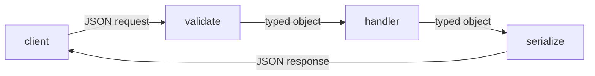

# Request와 response schema

이 글은 API Design 101 시리즈의 다섯 번째 글입니다. schema는 관습에 맡겨 둘수록 빠르게 흔들립니다. 필드 이름, content type, validation, 날짜와 숫자 표현을 명시적으로 정해야 API가 오래 버팁니다.

## 이 글에서 다룰 문제

- JSON과 content type은 어떤 식으로 계약에 들어갈까요?
- 필드 이름 규칙은 어떻게 정해야 할까요?
- validation은 어디에서, 어떤 방식으로 해야 할까요?
- 날짜, 시간대, 숫자, 금액은 어떤 형식으로 다뤄야 할까요?
- 응답 schema를 오래 안정적으로 유지하려면 무엇을 지켜야 할까요?

## 왜 중요한가

schema가 흔들리면 클라이언트도 함께 흔들립니다. 좋은 schema는 읽기 쉽고, 시간이 지나도 진화하기 쉽습니다. 경계에서 validation을 해 두면 내부 코드도 훨씬 깨끗하게 유지할 수 있습니다.

> schema는 데이터의 문법입니다.

## 한눈에 보는 개념



입구에서는 검증하고, 출구에서는 직렬화합니다.

## 핵심 용어

- **Schema**: 데이터의 형식과 의미입니다.
- **Content-Type**: 본문 표현 형식입니다. `application/json`이 대표적입니다.
- **Validation**: 들어오는 데이터가 schema를 만족하는지 확인하는 과정입니다.
- **Serialization**: 내부 객체를 외부 표현으로 바꾸는 과정입니다.
- **ISO 8601**: 날짜와 시간을 표현하는 표준 형식입니다.

## Before / After

**Before (자유 형식)**

```json
{"u": "Y", "ct": 1714800000, "act": "ok"}
```

**After (의미가 드러나는 schema)**

```json
{
  "username": "yeongseon",
  "created_at": "2026-05-04T12:00:00Z",
  "active": true
}
```

한 번 읽었을 때 의미가 드러나는 구조가 좋습니다.

## 실습: schema를 따라가는 다섯 단계

### Step 1 — JSON body and headers

```python
# 1_json.py
from flask import Flask, request, jsonify
app = Flask(__name__)

@app.post("/echo")
def echo():
    if request.headers.get("Content-Type") != "application/json":
        return jsonify(error="json required"), 415
    return jsonify(request.get_json())
```

서버는 content type을 직접 확인해야 합니다.

### Step 2 — Validation library

```python
# 2_validate.py
from pydantic import BaseModel, Field
class CreateUser(BaseModel):
    username: str = Field(min_length=3, max_length=32)
    email: str
```

Pydantic이나 marshmallow 같은 도구는 schema를 코드로 표현하게 해 줍니다.

### Step 3 — Separate response schema

```python
# 3_response.py
from pydantic import BaseModel
class UserOut(BaseModel):
    id: int
    username: str
    created_at: str   # ISO 8601 string
```

입력과 출력은 다른 schema입니다. `In`과 `Out`으로 분리하는 관례가 널리 쓰입니다.

### Step 4 — Dates and time zones

```python
# 4_time.py
from datetime import datetime, timezone
now = datetime.now(timezone.utc).isoformat()
print(now)   # "2026-05-04T12:00:00+00:00"
```

시간은 UTC와 ISO 8601로 저장하고 전송하는 편이 가장 안전합니다.

### Step 5 — Numbers and money

```python
# 5_money.py
# Money: integer minor units — 1.99 USD = 199 cents
amount = 199
currency = "USD"
```

금액에 float를 쓰면 반올림 오차가 생깁니다. 금액은 정수 minor unit으로 다루는 편이 좋습니다.

## 이 코드에서 봐야 할 점

- validation과 handler가 분리되어 있습니다.
- 입력 schema와 출력 schema가 다릅니다.
- 시간은 UTC, 금액은 정수입니다.

## 자주 하는 실수 다섯 가지

1. **validation을 handler 안에 넣습니다.** 코드가 지저분해지고 같은 검사가 반복됩니다.
2. **내부 모델을 그대로 응답으로 반환합니다.** 내부 변경이 외부 파괴로 이어집니다.
3. **시간대를 무시합니다.** 클라이언트마다 시간을 다르게 해석합니다.
4. **금액에 float를 씁니다.** 사소한 반올림 오차가 실제 금액 오류가 됩니다.
5. **필드 이름을 지나치게 줄입니다.** 몇 달 뒤에는 읽는 사람도 뜻을 모르게 됩니다.

## 실무에서는 이렇게 드러납니다

규모가 큰 API는 대체로 snake_case, ISO 8601, 정수 minor-unit currency로 수렴합니다. FastAPI나 NestJS 같은 프레임워크는 schema를 문서, validation, 타입 정의에 동시에 연결합니다. 결국 schema가 코드와 문서를 함께 지탱하는 중심이 됩니다.

## 시니어 엔지니어는 이렇게 생각합니다

- 경계의 첫 줄에 schema를 둡니다.
- 입력은 엄격하게, 출력은 진화 가능하게 설계합니다.
- 시간과 금액은 표준 형식만 사용합니다.
- 기존 필드의 의미를 바꾸지 않고 새 필드를 추가합니다.
- 클라이언트가 알 수 없는 필드를 무시할 수 있게 응답을 설계합니다.

## 체크리스트

- [ ] 모든 endpoint에 입력 schema가 있는가?
- [ ] 응답 schema가 입력 schema와 분리되어 있는가?
- [ ] timestamp가 UTC + ISO 8601인가?
- [ ] 금액을 정수 minor unit으로 표현하는가?
- [ ] 필드 이름이 읽어서 이해 가능한 수준인가?

## 연습 문제

1. 가장 자주 쓰는 응답 구조를 Pydantic 모델로 표현해 보세요.
2. 실수로 KST로 저장된 데이터를 UTC 기준으로 되돌리는 마이그레이션 전략을 적어 보세요.
3. 입력 schema에서 알 수 없는 필드를 거부할지 무시할지 정하고 그 trade-off를 써 보세요.

## 정리와 다음 글

schema는 데이터의 문법입니다. 다음 글에서는 거의 모든 목록 API가 마주치는 주제인 pagination과 filtering을 다룹니다.

<!-- toc:begin -->
- [API란 무엇인가?](./01-what-is-an-api.md)
- [REST 기본](./02-rest-basics.md)
- [리소스 설계](./03-resource-design.md)
- [HTTP method와 status code](./04-http-methods-and-status.md)
- **Request와 response schema (현재 글)**
- Pagination과 filtering (예정)
- Error response 설계 (예정)
- OpenAPI와 Swagger (예정)
- Versioning (예정)
- 좋은 API 문서 만들기 (예정)
<!-- toc:end -->

## 참고 자료

- [JSON Schema](https://json-schema.org/)
- [pydantic Documentation](https://docs.pydantic.dev/)
- [ISO 8601 Date and Time Format](https://en.wikipedia.org/wiki/ISO_8601)
- [Stripe API: Working with Money](https://stripe.com/docs/currencies)

Tags: Computer Science, APIDesign, JSON, Schema, Validation, Backend
