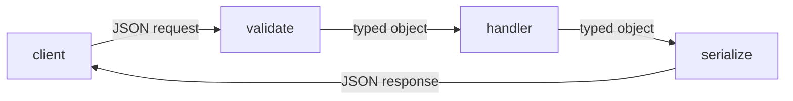

# Request와 response schema

> API Design 101 시리즈 (5/10)


## 이 글에서 다룰 문제

스키마가 흔들리면 클라이언트가 *전부* 흔들립니다. 좋은 스키마는 *읽기 쉽고, 진화 가능* 합니다. 검증을 경계에서 하면 안쪽 코드는 *깨끗* 해집니다.

> 스키마는 데이터의 *문법* 입니다.

## 개념 한눈에 보기



검증은 *입구* 에서, 직렬화는 *출구* 에서.

## Before/After

**Before (자유 형식)**

```json
{"u": "Y", "ct": 1714800000, "act": "ok"}
```

**After (의미 있는 스키마)**

```json
{
  "username": "yeongseon",
  "created_at": "2026-05-04T12:00:00Z",
  "active": true
}
```

읽는 순간 *무엇* 인지 알 수 있습니다.

## 실습: 스키마 5단계

### 1단계 — JSON 본문과 헤더

```python
# 1_json.py
from flask import Flask, request, jsonify
app = Flask(__name__)

@app.post("/echo")
def echo():
    if request.headers.get("Content-Type") != "application/json":
        return jsonify(error="json required"), 415
    return jsonify(request.get_json())
```

content-type은 *서버가* 확인합니다.

### 2단계 — 검증 라이브러리

```python
# 2_validate.py
from pydantic import BaseModel, Field
class CreateUser(BaseModel):
    username: str = Field(min_length=3, max_length=32)
    email: str
```

pydantic·marshmallow 등으로 스키마를 *코드* 로 표현합니다.

### 3단계 — 응답 스키마 분리

```python
# 3_response.py
from pydantic import BaseModel
class UserOut(BaseModel):
    id: int
    username: str
    created_at: str   # ISO 8601 문자열
```

입력과 출력은 *다른 스키마* — 보통 `In` / `Out` 네이밍.

### 4단계 — 날짜와 시간대

```python
# 4_time.py
from datetime import datetime, timezone
now = datetime.now(timezone.utc).isoformat()
print(now)   # "2026-05-04T12:00:00+00:00"
```

저장과 전송은 *UTC + ISO 8601*.

### 5단계 — 숫자와 통화

```python
# 5_money.py
# 통화는 정수 minor unit 으로 — 1.99 USD = 199 cents
amount = 199
currency = "USD"
```

부동소수는 금액에 *쓰지 않습니다*.

## 이 코드에서 주목할 점

- 검증과 핸들러가 *분리* 됩니다.
- 입력·출력 스키마가 따로 있습니다.
- 시간은 UTC, 금액은 정수.

## 자주 하는 실수 5가지

1. **검증을 핸들러 안에서.** 안쪽이 더러워지고, 같은 검사가 반복.
2. **응답에 내부 모델 그대로 노출.** 내부 변경이 곧 외부 깨짐.
3. **시간대 무시.** 클라이언트마다 *다른 시간* 으로 해석.
4. **금액에 float.** 반올림 오차로 1원이 사라짐.
5. **필드명을 줄임.** `u`, `ct`, `act` — 6개월 후 자기도 못 읽음.

## 실무에서는 이렇게 쓰입니다

대형 API들은 거의 *snake_case*, ISO 8601, 정수 minor unit 통화를 씁니다 (Stripe). 검증은 FastAPI·NestJS 같은 프레임워크가 *데코레이터* 로 자동화합니다 — 스키마가 곧 문서이자 검증이자 타입.

## 체크리스트

- [ ] 모든 endpoint에 입력 스키마가 있는가?
- [ ] 응답 스키마가 입력과 분리되어 있는가?
- [ ] 시간이 UTC + ISO 8601 인가?
- [ ] 통화가 정수 minor unit 인가?
- [ ] 필드명이 *읽힐 만큼* 풀려 있는가?

## 정리 및 다음 단계

스키마는 데이터의 문법입니다. 다음 글에서는 컬렉션 응답에서 빠질 수 없는 — pagination과 filtering — 를 봅니다.

<!-- toc:begin -->
- [API란 무엇인가?](./01-what-is-an-api.md)
- [REST 기본](./02-rest-basics.md)
- [리소스 설계](./03-resource-design.md)
- [HTTP method와 status code](./04-http-methods-and-status.md)
- **Request와 response schema (현재 글)**
- Pagination과 filtering (예정)
- Error response 설계 (예정)
- OpenAPI와 Swagger (예정)
- Versioning (예정)
- 좋은 API 문서 만들기 (예정)
<!-- toc:end -->

## 참고 자료

- [JSON Schema](https://json-schema.org/)
- [pydantic Documentation](https://docs.pydantic.dev/)
- [ISO 8601 Date and Time Format](https://en.wikipedia.org/wiki/ISO_8601)
- [Stripe API: Working with Money](https://stripe.com/docs/currencies)

Tags: Computer Science, APIDesign, JSON, Schema, Validation, Backend
