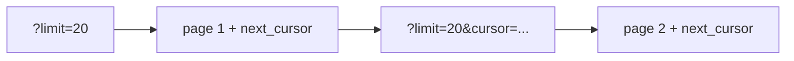

# Pagination과 filtering

> API Design 101 시리즈 (6/10)


## 이 글에서 다룰 문제

페이지네이션이 잘못되면 느린 쿼리와 중복, 누락이 동시에 생깁니다. 그리고 한 번 외부에 나가면 쉽게 못 바꾸므로 처음부터 의도를 담아 설계해야 합니다.

> 큰 컬렉션은 반드시 조각으로 나눠야 합니다.

## 전체 흐름


cursor는 다음 페이지의 시작점입니다.

## Before/After

**Before (정렬·필터·페이지가 뒤엉킴)**

```http
GET /orders?p=3&s=date&q=paid
```

**After (이름·표준·메타)**

```http
GET /orders?status=paid&sort=created_at:desc&limit=20&cursor=eyJpZCI6MTIzfQ
```

## Pagination 5단계

### 1단계 — offset/limit

```python
# 1_offset.py
from flask import Flask, request, jsonify
app = Flask(__name__)
ITEMS = list(range(1000))

@app.get("/items")
def items():
    offset = int(request.args.get("offset", 0))
    limit = min(int(request.args.get("limit", 20)), 100)
    return jsonify(items=ITEMS[offset:offset+limit], total=len(ITEMS))
```

`limit`에는 상한을 둡니다.

### 2단계 — cursor

```python
# 2_cursor.py
from flask import Flask, request, jsonify
app = Flask(__name__)
ITEMS = list(range(1000))

@app.get("/items")
def items():
    cursor = int(request.args.get("cursor", 0))
    limit = min(int(request.args.get("limit", 20)), 100)
    page = ITEMS[cursor:cursor+limit]
    nxt = cursor + len(page)
    return jsonify(items=page, next_cursor=(nxt if nxt < len(ITEMS) else None))
```

cursor는 불투명하게 유지합니다. 클라이언트가 해석하지 않게 해야 합니다.

### 3단계 — 정렬

```http
GET /items?sort=created_at:desc
GET /items?sort=name:asc,id:desc
```

여러 키 조합도 표준화합니다.

### 4단계 — 필터

```http
GET /orders?status=paid&tier=pro
GET /orders?created_at__gte=2026-01-01
```

연산자는 `__gte`, `__lt` 같은 명시적 접미사로.

### 5단계 — 검색

```http
GET /articles?q=python+logging
```

검색은 별도 파라미터 `q`로 분리합니다. 필터와 섞지 않습니다.

## 이 코드에서 주목할 점

- `limit`에는 상한이 있어야 합니다.
- cursor는 불투명한 토큰이어야 합니다.
- 정렬, 필터, 검색은 각각 다른 의미이므로 같은 파라미터에 섞지 않습니다.

## 자주 하는 실수 5가지

1. **`limit` 상한이 없습니다.** 클라이언트가 10만 개를 한 번에 요청할 수 있습니다.
2. **deep offset을 남용합니다.** `offset=100000`은 인덱스가 있어도 느립니다.
3. **total count를 항상 계산합니다.** 큰 테이블에서는 대표적인 병목이 됩니다.
4. **필터, 정렬, 검색을 한 파라미터에 몰아넣습니다.** 검증과 문서화가 모두 어려워집니다.
5. **cursor의 내용을 노출합니다.** 클라이언트가 위조해 데이터를 빼낼 수 있습니다.

## 실무에서는 이렇게 쓰입니다

GitHub은 `Link` 헤더로 next/prev URL을 돌려줍니다. Twitter·Slack처럼 빠르게 변하는 데이터는 cursor 기반이 표준입니다. Stripe는 `has_more`와 `data[].id`로 단순한 cursor를 노출합니다.

## 체크리스트

- [ ] `limit` 에 상한이 있는가?
- [ ] cursor가 불투명한가?
- [ ] 정렬·필터·검색이 각자 다른 파라미터인가?
- [ ] 응답에 다음 페이지 링크 또는 cursor가 있는가?
- [ ] total count가 비용을 고려해 결정되었는가?

## 정리 및 다음 단계

페이지네이션은 성능과 정확성이 만나는 지점입니다. 다음 글에서는 컬렉션이든 단일 자원이든 빠질 수 없는 error response 설계를 봅니다.

<!-- toc:begin -->
- [API란 무엇인가?](./01-what-is-an-api.md)
- [REST 기본](./02-rest-basics.md)
- [리소스 설계](./03-resource-design.md)
- [HTTP method와 status code](./04-http-methods-and-status.md)
- [Request와 response schema](./05-request-and-response-schema.md)
- **Pagination과 filtering (현재 글)**
- Error response 설계 (예정)
- OpenAPI와 Swagger (예정)
- Versioning (예정)
- 좋은 API 문서 만들기 (예정)
<!-- toc:end -->

## 참고 자료

- [Stripe API: Pagination](https://stripe.com/docs/api/pagination)
- [GitHub REST API: Using Pagination](https://docs.github.com/en/rest/guides/using-pagination-in-the-rest-api)
- [Slack API: Cursor-based Pagination](https://api.slack.com/docs/pagination)
- [RFC 5988 — Web Linking (Link header)](https://www.rfc-editor.org/rfc/rfc5988)

Tags: Computer Science, APIDesign, Pagination, Filtering, Performance, Backend
