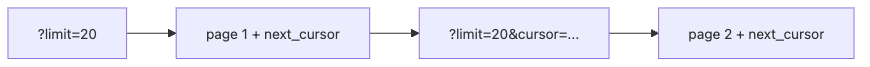

# Pagination과 filtering

목록 API는 처음에는 금방 만들 수 있어 보여도, 데이터가 쌓이는 순간 가장 먼저 흔들리는 지점이 됩니다. 느려진 쿼리, 중복 응답, 누락된 항목이 한꺼번에 나타나기 시작하면 파라미터 이름 하나도 쉽게 바꾸지 못합니다.

이 글은 API Design 101 시리즈의 여섯 번째 글입니다.

여기서는 pagination, sorting, filtering을 단순 옵션 모음이 아니라 성능과 정확성을 함께 지키는 계약으로 정리합니다. 특히 offset과 cursor의 선택이 어떤 운영 비용을 만드는지까지 같이 봅니다.

## 이 글에서 다룰 문제

- offset / limit 방식은 어디까지 단순하고 어디서부터 한계가 드러날까요?
- cursor 기반 pagination은 어떤 문제를 해결할까요?
- sorting, filtering, searching은 어떤 규칙으로 분리해야 할까요?
- 응답 메타데이터와 link header는 어떻게 설계하는 편이 좋을까요?
- 큰 결과 집합에서 자주 터지는 성능 함정은 무엇일까요?

## 왜 중요한가

나쁜 pagination은 느린 쿼리만 만드는 것이 아닙니다. 중복과 누락까지 동시에 만들 수 있습니다. 한 번 공개된 뒤에는 바꾸기 어렵기 때문에 처음부터 의도를 가지고 설계해야 합니다.

> 큰 컬렉션은 항상 작은 조각으로 나눠 이동해야 합니다.

## 한눈에 보는 개념


*cursor는 다음 페이지를 어디서 이어 읽어야 하는지 알려 주는 불투명 토큰입니다.*

중요한 점은 클라이언트가 cursor 내부를 이해하지 않아도 된다는 것입니다. 서버가 정렬 키와 경계 조건을 책임져야 중복과 누락 없이 큰 결과 집합을 안정적으로 넘길 수 있습니다.

## 핵심 용어

- **Offset / Limit**: `?offset=40&limit=20` 형태입니다. 단순하지만 offset이 커질수록 느려집니다.
- **Cursor**: 마지막 항목의 정렬 키를 바탕으로 만든 불투명 토큰입니다.
- **Total count**: 전체 행 수입니다. 큰 테이블에서는 계산 비용이 큽니다.
- **Sort**: `?sort=created_at:desc`처럼 정렬 기준을 전달합니다.
- **Filter**: `?status=active&tier=pro`처럼 조건을 전달합니다.

## Before / After

**Before (정렬, 필터, 페이지가 뒤섞임)**

```http
GET /orders?p=3&s=date&q=paid
```

**After (이름과 의미가 분명함)**

```http
GET /orders?status=paid&sort=created_at:desc&limit=20&cursor=eyJpZCI6MTIzfQ
```

파라미터는 짧은 것보다 의미가 분명한 편이 낫습니다.

## 실습: pagination을 설계하는 다섯 단계

### Step 1 — offset / limit

```python
# 1_offset.py
from flask import Flask, request, jsonify
app = Flask(__name__)
ITEMS = list(range(1000))

@app.get("/items")
def items():
    offset = int(request.args.get("offset", 0))
    limit = min(int(request.args.get("limit", 20)), 100)
    return jsonify(items=ITEMS[offset:offset+limit], total=len(ITEMS))
```

`limit`에는 항상 상한을 둬야 합니다.

### Step 2 — cursor

```python
# 2_cursor.py
from flask import Flask, request, jsonify
app = Flask(__name__)
ITEMS = list(range(1000))

@app.get("/items")
def items():
    cursor = int(request.args.get("cursor", 0))
    limit = min(int(request.args.get("limit", 20)), 100)
    page = ITEMS[cursor:cursor+limit]
    nxt = cursor + len(page)
    return jsonify(items=page, next_cursor=(nxt if nxt < len(ITEMS) else None))
```

실제 서비스에서는 cursor를 클라이언트가 해석하지 못하는 불투명 토큰으로 만드는 편이 안전합니다.

### Step 3 — sorting

```http
GET /items?sort=created_at:desc
GET /items?sort=name:asc,id:desc
```

다중 정렬도 같은 문법 안에서 일관되게 표현해야 합니다.

### Step 4 — filtering

```http
GET /orders?status=paid&tier=pro
GET /orders?created_at__gte=2026-01-01
```

`__gte`, `__lt` 같은 명시적 연산자 suffix를 두면 문서화와 검증이 쉬워집니다.

### Step 5 — search

```http
GET /articles?q=python+logging
```

검색은 `q`처럼 별도 parameter로 두고 filter와 섞지 않는 편이 좋습니다.

## 이 코드에서 봐야 할 점

- `limit`에는 상한이 있습니다.
- cursor는 불투명 토큰이어야 합니다.
- sort, filter, search는 각자 다른 의미를 가지므로 parameter도 분리해야 합니다.

## 자주 하는 실수 다섯 가지

1. **`limit` 상한이 없습니다.** 한 번에 수십만 건을 요청하게 됩니다.
2. **깊은 offset을 허용합니다.** `offset=100000`은 인덱스가 있어도 느릴 수 있습니다.
3. **항상 total을 계산합니다.** 큰 테이블에서는 치명적인 비용이 됩니다.
4. **filter, sort, search를 한 parameter에 몰아넣습니다.** 검증과 문서화가 어려워집니다.
5. **cursor 내부 구조를 노출합니다.** 클라이언트가 위조하거나 데이터 유출의 단서가 될 수 있습니다.

## 실무에서는 이렇게 드러납니다

GitHub는 `Link` header로 다음과 이전 페이지 URL을 전달합니다. 데이터가 빠르게 바뀌는 시스템인 Twitter나 Slack은 cursor 기반 방식을 기본으로 둡니다. Stripe도 `has_more`와 `data[].id`를 활용한 단순한 cursor 모델을 사용합니다.

## 시니어 엔지니어는 이렇게 생각합니다

- 새 컬렉션은 기본적으로 cursor를 먼저 고려합니다.
- 기본 `limit`와 최대 `limit`를 반드시 문서화합니다.
- total count는 비용이 크면 선택적으로 제공합니다.
- filter 값은 enum으로 문서화합니다.
- 검색은 별도 endpoint로 빼는 편이 나은지도 함께 검토합니다.

## 검증 포인트와 실패 신호

- **Expected output:** 같은 목록을 연속으로 넘길 때 페이지 경계에서 중복 항목과 누락 항목이 없어야 하고, `limit` 상한도 문서와 구현이 일치해야 합니다.
- **First check:** `offset=100000` 같은 깊은 페이지가 자주 호출되는데도 응답 시간이 비슷하다고 가정하고 있다면 성능 병목을 숨기고 있을 가능성이 큽니다.
- **Failure mode:** total count를 항상 계산하거나 cursor 구조를 그대로 노출하면, 성능과 보안 문제가 함께 터져 API를 뒤늦게 갈아엎게 됩니다.

## 체크리스트

- [ ] `limit`에 상한이 있는가?
- [ ] cursor가 불투명한가?
- [ ] sort, filter, search가 서로 다른 parameter를 쓰는가?
- [ ] 응답에 다음 페이지 cursor나 link가 포함되는가?
- [ ] total count를 비용을 고려해 선택했는가?

## 연습 문제

1. 현재 목록 endpoint 하나를 cursor 기반으로 다시 설계해 보세요.
2. Step 1 예제의 `limit`에 100 상한을 추가해 보세요.
3. 검색을 별도 endpoint로 둘지 `?q=`로 둘지 정하고 trade-off를 정리해 보세요.

## 정리와 다음 글

pagination은 성능과 정확성이 만나는 지점입니다. 다음 글에서는 모든 API가 결국 마주치는 또 하나의 주제, error response 설계를 다룹니다.

<!-- toc:begin -->
- [API란 무엇인가?](./01-what-is-an-api.md)
- [REST 기본](./02-rest-basics.md)
- [리소스 설계](./03-resource-design.md)
- [HTTP method와 status code](./04-http-methods-and-status.md)
- [Request와 response schema](./05-request-and-response-schema.md)
- **Pagination과 filtering (현재 글)**
- Error response 설계 (예정)
- OpenAPI와 Swagger (예정)
- Versioning (예정)
- 좋은 API 문서 만들기 (예정)
<!-- toc:end -->

## 참고 자료

- [Stripe API: Pagination](https://stripe.com/docs/api/pagination)
- [GitHub REST API: Using Pagination](https://docs.github.com/en/rest/guides/using-pagination-in-the-rest-api)
- [Slack API: Cursor-based Pagination](https://api.slack.com/docs/pagination)
- [RFC 5988 — Web Linking (Link header)](https://www.rfc-editor.org/rfc/rfc5988)

Tags: Computer Science, APIDesign, Pagination, Filtering, Performance, Backend
