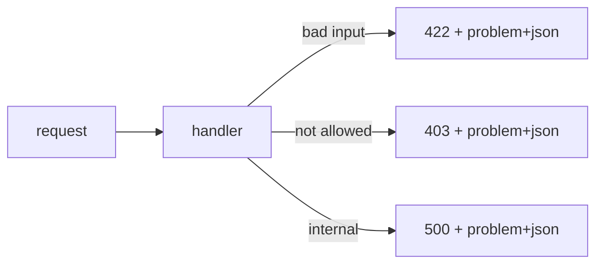

# Error response 설계

> API Design 101 시리즈 (7/10)


## 이 글에서 다룰 문제

성공 응답은 한 가지지만 에러는 수백 가지입니다. 형식이 들쭉날쭉하면 클라이언트는 모든 케이스를 따로 다뤄야 하고, 사용자에게는 알 수 없는 오류만 보입니다.

> 좋은 에러 응답은 디버깅 시간을 줄여 줍니다.

## 전체 흐름


## Before/After

**Before (자유 형식)**

```json
{"error": "something went wrong"}
```

**After (RFC 7807 + 코드)**

```json
{
  "type": "https://example.com/errors/user-not-found",
  "title": "User not found",
  "status": 404,
  "code": "user.not_found",
  "detail": "User 42 does not exist."
}
```

## 에러 응답 5단계

### 1단계 — 표준 envelope

```python
# 예제 1: 표준 envelope
from flask import Flask, jsonify
app = Flask(__name__)

def problem(status, code, title, detail):
    body = {"type": f"about:blank", "title": title,
            "status": status, "code": code, "detail": detail}
    return jsonify(body), status, {"Content-Type": "application/problem+json"}

@app.get("/users/<int:uid>")
def user(uid):
    return problem(404, "user.not_found", "User not found", f"User {uid} does not exist.")
```

### 2단계 — 검증 에러

```python
# 예제 2: 검증 에러
from flask import Flask, request, jsonify
app = Flask(__name__)

@app.post("/users")
def create():
    body = request.get_json() or {}
    errs = []
    if "name" not in body: errs.append({"field": "name", "code": "required"})
    if "email" not in body: errs.append({"field": "email", "code": "required"})
    if errs:
        return jsonify(title="Validation failed", status=422,
                       code="validation_error", errors=errs), 422
    return jsonify(ok=True), 201
```

`errors[]`로 필드별 실패를 묶습니다.

### 3단계 — 에러 코드 안정성

```
user.not_found          # 200, 의미 명확
order.payment_required
order.already_paid
```

코드는 문자열이며 상태 코드보다 안정적입니다.

### 4단계 — 보안 정보 누출 방지

```python
# 4_safe.py
# 나쁨: 사용자 존재 여부가 드러나는 상세 메시지
# 좋음: 인증 실패처럼 범용적인 상세 메시지
```

존재 여부 자체를 노출하지 않습니다.

### 5단계 — trace id

```python
# 5_trace.py
import uuid
from flask import Flask, jsonify, g, request
app = Flask(__name__)

@app.before_request
def set_trace():
    g.trace_id = request.headers.get("X-Trace-Id") or uuid.uuid4().hex

@app.errorhandler(500)
def server_error(e):
    return jsonify(title="Internal", status=500, trace_id=g.trace_id), 500
```

trace_id가 지원 요청 시간을 크게 줄여 줍니다.

## 이 코드에서 주목할 점

- 본문이 항상 같은 모양입니다.
- 사람용(`title`/`detail`) 과 기계용(`code`) 이 분리됩니다.
- trace_id 가 응답에 포함됩니다.

## 자주 하는 실수 5가지

1. **에러 본문이 문자열입니다.** 클라이언트가 파싱하지 못합니다.
2. **error code 없이 title만 둡니다.** 다국어 번역 후 분기가 깨집니다.
3. **검증 실패에 단일 메시지만 둡니다.** 어느 필드인지 알기 어렵습니다.
4. **스택 트레이스를 노출합니다.** 보안 사고로 이어질 수 있습니다.
5. **trace_id가 없습니다.** 사용자 문의가 수사극이 됩니다.

## 실무에서는 이렇게 쓰입니다

Stripe의 에러 객체(`type`, `code`, `param`, `message`)는 사실상 표준 사례가 되었습니다. 큰 사내 API들은 거의 RFC 7807 또는 그 변형을 씁니다. 핵심은 형식의 안정성입니다.

## 체크리스트

- [ ] 모든 에러가 동일한 envelope인가?
- [ ] error code가 안정적인 문자열인가?
- [ ] 검증 실패가 필드별로 나뉘는가?
- [ ] 보안 정보가 detail에 새지 않는가?
- [ ] trace_id 가 모든 응답에 있는가?

## 정리 및 다음 단계

에러 응답은 API의 두 번째 얼굴입니다. 다음 글에서는 이 모든 약속을 한곳에 모은 OpenAPI와 Swagger를 봅니다.

<!-- toc:begin -->
- [API란 무엇인가?](./01-what-is-an-api.md)
- [REST 기본](./02-rest-basics.md)
- [리소스 설계](./03-resource-design.md)
- [HTTP method와 status code](./04-http-methods-and-status.md)
- [Request와 response schema](./05-request-and-response-schema.md)
- [Pagination과 filtering](./06-pagination-and-filtering.md)
- **Error response 설계 (현재 글)**
- OpenAPI와 Swagger (예정)
- Versioning (예정)
- 좋은 API 문서 만들기 (예정)
<!-- toc:end -->

## 참고 자료

- [RFC 7807 — Problem Details for HTTP APIs](https://www.rfc-editor.org/rfc/rfc7807)
- [Stripe API: Errors](https://stripe.com/docs/api/errors)
- [GitHub REST API: Errors](https://docs.github.com/en/rest/overview/troubleshooting)
- [Microsoft REST API Guidelines: Errors](https://github.com/microsoft/api-guidelines/blob/vNext/Guidelines.md)

Tags: Computer Science, APIDesign, Errors, RFC7807, Validation, Backend
