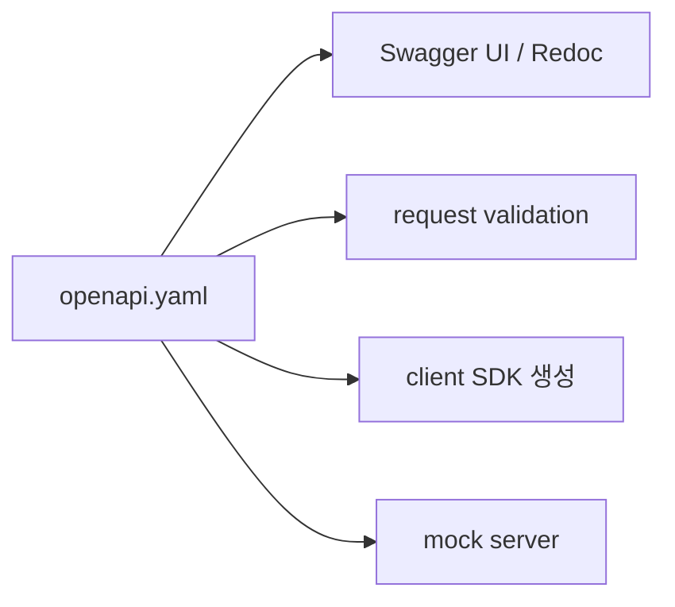

# OpenAPI와 Swagger

OpenAPI 3 스펙과 Swagger UI를 이해하면 문서, 검증, 코드 생성이 하나의 흐름으로 연결됩니다. code-first와 schema-first의 차이도 이 지점에서 함께 정리할 수 있습니다.

이 글은 API Design 101 시리즈의 8번째 글입니다.

## 이 글에서 다룰 문제

스펙 파일 하나가 문서, 검증, 코드 생성, 목 서버를 모두 만들어 줍니다. 손으로 쓴 문서는 항상 코드와 어긋나므로 자동화가 답입니다.

> 단일 진실 원본(single source of truth)을 가져야 합니다.

## 전체 흐름


## Before/After

**Before (수기 문서)**

```
README.md "GET /users/{id} returns user. id is integer."
```

**After (OpenAPI 일부)**

```yaml
paths:
  /users/{id}:
    get:
      parameters:
        - name: id
          in: path
          required: true
          schema: {type: integer}
      responses:
        '200':
          description: User
          content:
            application/json:
              schema: {$ref: '#/components/schemas/User'}
```

## OpenAPI 5단계

### 1단계 — 최소 spec

```yaml
# 최소 OpenAPI 명세
openapi: 3.0.0
info: {title: Demo API, version: '1.0'}
paths:
  /health:
    get:
      responses:
        '200': {description: OK}
```

브라우저에서 Swagger UI로 띄우면 호출 버튼까지 생깁니다.

### 2단계 — components/schemas

```yaml
components:
  schemas:
    User:
      type: object
      required: [id, name]
      properties:
        id: {type: integer}
        name: {type: string}
```

스키마는 재사용합니다. `$ref`로 참조합니다.

### 3단계 — code-first (FastAPI)

```python
# 예제 3: 코드 우선 방식
from fastapi import FastAPI
from pydantic import BaseModel

class User(BaseModel):
    id: int; name: str

app = FastAPI()
@app.get("/users/{uid}")
def user(uid: int) -> User: return User(id=uid, name="Y")
# 문서 엔드포인트가 자동 생성됩니다
```

### 4단계 — Swagger UI / Redoc

```http
GET /docs        # Swagger UI (시도해 보기)
GET /redoc       # Redoc (읽기 좋음)
GET /openapi.json
```

같은 spec을 두 가지 방식으로 보여 주는 셈입니다.

### 5단계 — 클라이언트 생성

```bash
# 5_gen.sh
openapi-generator-cli generate \
  -i openapi.json -g python -o ./client
```

수십 개 SDK를 명령 한 줄로 생성할 수 있습니다.

## 이 코드에서 주목할 점

- spec이 코드와 함께 자랍니다.
- 같은 스키마가 검증, 문서, SDK에 동시에 쓰입니다.
- 손으로 쓰는 문서가 사라집니다.

## 자주 하는 실수 5가지

1. **spec과 코드가 따로 놉니다.** 시간이 지나면 반드시 어긋납니다.
2. **examples가 없습니다.** 클라이언트 입장에서 호출 방법이 보이지 않습니다.
3. **에러 응답이 빠져 있습니다.** 200만 정의하고 4xx/5xx는 숨겨 둡니다.
4. **버전을 적지 않습니다.** spec 자체에 version이 없으면 변경 추적이 어렵습니다.
5. **public spec에 내부 정보를 넣습니다.** 내부 endpoint와 필드가 그대로 노출됩니다.

## 실무에서는 이렇게 쓰입니다

GitHub도 OpenAPI spec을 공개합니다(`api.github.com/openapi`). 사내에서도 PR마다 spec이 바뀌는지 CI가 검사하면 drift를 줄일 수 있습니다. FastAPI와 NestJS 같은 프레임워크는 기본으로 spec을 내보냅니다.

## 체크리스트

- [ ] spec 이 코드와 동기화되는가 (CI 가 검사)?
- [ ] 모든 endpoint에 examples 가 있는가?
- [ ] 4xx/5xx 가 spec 에 정의되어 있는가?
- [ ] components/schemas가 재사용되는가?
- [ ] public/internal spec 이 분리되어 있는가?

## 정리 및 다음 단계

OpenAPI는 API의 프로토콜이자 문서이자 코드입니다. 다음 글에서는 약속이 바뀔 때의 규율인 versioning을 봅니다.

<!-- toc:begin -->
- [API란 무엇인가?](./01-what-is-an-api.md)
- [REST 기본](./02-rest-basics.md)
- [리소스 설계](./03-resource-design.md)
- [HTTP method와 status code](./04-http-methods-and-status.md)
- [Request와 response schema](./05-request-and-response-schema.md)
- [Pagination과 filtering](./06-pagination-and-filtering.md)
- [Error response 설계](./07-error-response-design.md)
- **OpenAPI와 Swagger (현재 글)**
- Versioning (예정)
- 좋은 API 문서 만들기 (예정)
<!-- toc:end -->

## 참고 자료

- [OpenAPI Specification](https://spec.openapis.org/oas/latest.html)
- [Swagger UI](https://swagger.io/tools/swagger-ui/)
- [Redoc](https://redocly.com/redoc/)
- [FastAPI: Automatic docs](https://fastapi.tiangolo.com/features/)

Tags: Computer Science, APIDesign, OpenAPI, Swagger, Documentation, Backend
