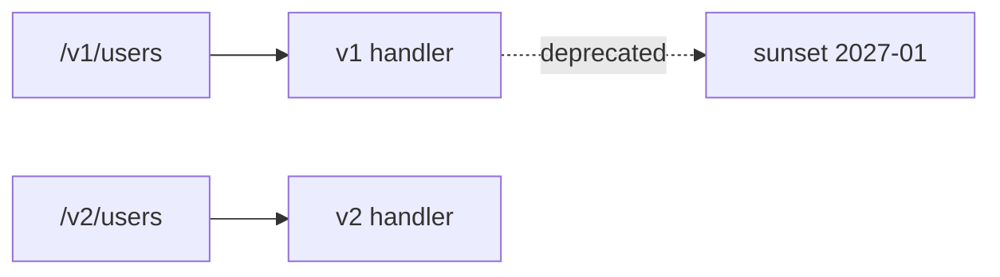

# API versioning

> API Design 101 시리즈 (9/10)


## 이 글에서 다룰 문제

API는 *외부* 가 의존합니다. 한 번 깨지면 *수십·수백 클라이언트* 가 동시에 멈춥니다. 좋은 versioning 은 *변화의 자유* 를 줍니다 — 단, 규율과 함께.

> 호환성은 *공짜* 가 아닙니다.

## 전체 흐름


## Before/After

**Before (조용히 깨뜨림)**

```text
PATCH /users/42  → 응답에 created_at 형식이 어느날 바뀜
```

**After (명시적 버전)**

```
PATCH /v2/users/42
Sunset: Wed, 31 Jan 2027 23:59:59 GMT  (v1 응답에 명시)
```

## Versioning 5단계

### 1단계 — URL versioning

```python
# 1_url.py
from flask import Flask, jsonify
app = Flask(__name__)

@app.get("/v1/users/<int:uid>")
def v1(uid): return jsonify(id=uid, name="Y")

@app.get("/v2/users/<int:uid>")
def v2(uid): return jsonify(id=uid, full_name="Y", username="y")
```

가장 *직관적* 인 방식 — 캐싱·로그·라우팅 모두 단순.

### 2단계 — Header versioning

```python
# 2_header.py
from flask import Flask, request, jsonify
app = Flask(__name__)

@app.get("/users/<int:uid>")
def user(uid):
    v = request.headers.get("X-API-Version", "1")
    return jsonify(id=uid, name="Y") if v == "1" else jsonify(id=uid, full_name="Y")
```

URL은 *깔끔* 하지만 디버깅·캐시는 *어려움*.

### 3단계 — non-breaking 추가

```text
응답에 새 필드 추가 → non-breaking (클라이언트가 무시할 수 있다면)
요청 본문에 *옵션* 필드 추가 → non-breaking
```

새 필드 추가는 *대부분* 호환적입니다.

### 4단계 — deprecation 통지

```python
# 4_deprecate.py
@app.get("/v1/users/<int:uid>")
def v1(uid):
    resp = jsonify(id=uid, name="Y")
    resp.headers["Deprecation"] = "true"
    resp.headers["Sunset"] = "Wed, 31 Jan 2027 23:59:59 GMT"
    resp.headers["Link"] = '</v2/users>; rel="successor-version"'
    return resp
```

표준 헤더로 *조용한 통지* — 그리고 release note.

### 5단계 — sunset 절차

```
1. 새 버전 출시 + deprecation 헤더 시작
2. 사용량 모니터링 (클라이언트 식별)
3. 6~12개월 후 sunset 공지 메일
4. sunset 30일 전부터 410 Gone 반환 시뮬레이션
5. sunset — 410 Gone 또는 308 Permanent Redirect
```

## 이 코드에서 주목할 점

- 두 버전이 *공존* 합니다.
- 통지는 *헤더 + 문서 + 메일* 의 조합.
- sunset에는 명확한 *날짜* 가 있습니다.

## 자주 하는 실수 5가지

1. **버전 없이 deploy.** 외부가 깨지면 *원인 추적* 불가.
2. **모든 변경을 breaking 으로.** 너무 자주 v3, v4 — 운영 부담 폭발.
3. **deprecation 통지 없이 종료.** 신뢰 상실.
4. **여러 버전을 *영원히* 유지.** 코드가 *지층* 처럼 쌓임.
5. **버전 차이를 코드 안에서 if 문으로.** 한 핸들러에 *모든 버전*.

## 실무에서는 이렇게 쓰입니다

Stripe 는 *날짜 기반 버전* (calver) 을 헤더로 받습니다 (`Stripe-Version: 2024-04-10`). GitHub은 URL 버전 + `X-GitHub-Api-Version` 헤더의 혼합. AWS는 거의 *모든 서비스가* 명시적 버전 — 하위 호환성을 *수년* 유지합니다.

## 체크리스트

- [ ] 호환성 정책이 문서화되어 있는가?
- [ ] 버전 채널 (URL or header) 이 *하나* 로 일관되는가?
- [ ] deprecation 헤더와 sunset 날짜가 있는가?
- [ ] 사용량 모니터링이 *클라이언트 단위* 로 되는가?
- [ ] 동시에 살아 있는 버전 수에 *상한* 이 있는가?

## 정리 및 다음 단계

versioning 은 약속과 *변화* 의 화해입니다. 마지막 글에서는 이 모든 약속을 *읽히게* 만드는 — 좋은 API 문서 — 를 봅니다.

<!-- toc:begin -->
- [API란 무엇인가?](./01-what-is-an-api.md)
- [REST 기본](./02-rest-basics.md)
- [리소스 설계](./03-resource-design.md)
- [HTTP method와 status code](./04-http-methods-and-status.md)
- [Request와 response schema](./05-request-and-response-schema.md)
- [Pagination과 filtering](./06-pagination-and-filtering.md)
- [Error response 설계](./07-error-response-design.md)
- [OpenAPI와 Swagger](./08-openapi-and-swagger.md)
- **API versioning (현재 글)**
- 좋은 API 문서 만들기 (예정)
<!-- toc:end -->

## 참고 자료

- [Stripe API Versioning](https://stripe.com/docs/upgrades)
- [GitHub REST API: API Versions](https://docs.github.com/en/rest/overview/api-versions)
- [Sunset HTTP Header (RFC 8594)](https://www.rfc-editor.org/rfc/rfc8594)
- [Deprecation HTTP Header](https://datatracker.ietf.org/doc/html/draft-ietf-httpapi-deprecation-header)

Tags: Computer Science, APIDesign, Versioning, Compatibility, Deprecation, Backend
