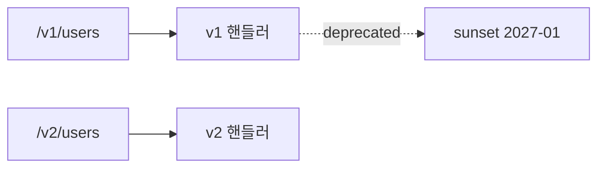

# API versioning

## 이 글에서 다룰 문제

- 어떤 변경이 호환성을 깨는 breaking change인지 어떻게 구분할까요?
- URL 버전과 헤더 버전은 각각 언제 더 잘 맞을까요?
- 새 버전을 내놓은 뒤 deprecation과 sunset은 어떤 순서로 진행해야 할까요?
- 동시에 여러 버전을 운영하면 팀 내부 비용은 어떻게 커질까요?

> API Design 101 시리즈 (9/10)

<!-- a-grade-intro:begin -->

핵심 질문은 단순합니다. API 계약을 바꿔야 할 때, 외부 클라이언트를 깨뜨리지 않고 어떻게 변경을 밀어 넣을 것인가입니다.

먼저 정해야 할 것은 버전 번호가 아니라 호환성 규칙입니다. 무엇을 breaking change로 볼지 정한 다음, URL이나 헤더 같은 버전 채널 뒤로 변화를 격리해야 합니다.

<!-- a-grade-intro:end -->

## 이 글에서 배울 것

- breaking change와 non-breaking change를 구분하는 기준
- URL versioning과 header versioning의 차이
- semver, calver 같은 호환성 정책을 정하는 방법
- deprecation 공지와 sunset 절차를 운영하는 방식
- 여러 버전을 동시에 유지할 때 생기는 비용

## 왜 중요한가

외부 클라이언트는 한 번 배포하고 끝나지 않습니다. 모바일 앱, 파트너 연동, 사내 다른 서비스처럼 여러분 API를 호출하는 쪽은 제각각 다른 일정과 릴리스 주기를 갖습니다. 서버에서 응답 필드 하나를 바꾸는 순간 그 모든 클라이언트가 동시에 영향을 받을 수 있습니다.

버전 관리는 변화를 막기 위한 장치가 아닙니다. 바꿔야 할 것을 바꾸되, 어디까지가 안전한 변경이고 어디서부터 별도 버전이 필요한지 팀이 같은 기준으로 판단하게 만드는 장치입니다. 이 기준이 없으면 사소한 수정도 겁나서 못 하거나, 반대로 아무 경고 없이 계약을 깨뜨리는 두 극단으로 흐르기 쉽습니다.

> 호환성은 공짜가 아닙니다.

## 한눈에 보는 개념



## 핵심 용어

- breaking change: 기존 클라이언트가 계속 동작하려면 수정이 필요한 변경입니다.
- non-breaking change: 새 필드 추가처럼 기존 클라이언트가 무시해도 되는 변경입니다.
- URL versioning: `/v1/...`, `/v2/...`처럼 경로에 버전을 드러내는 방식입니다.
- header versioning: `X-API-Version: 2026-05-01` 또는 `Accept: application/vnd.api+json;version=2`처럼 헤더로 버전을 구분하는 방식입니다.
- sunset: 특정 버전의 공식 종료 시점입니다.

## Before / After

버전 전략이 없을 때와 있을 때의 차이는 보통 사고가 난 뒤에 드러납니다.

**Before (silently broken)**

```text
PATCH /users/42  → response date format changes one day
```

위 상황에서는 서버가 조용히 계약을 바꿨고, 클라이언트는 어느 날 갑자기 실패를 만나게 됩니다.

**After (explicit version)**

```
PATCH /v2/users/42
Sunset: Wed, 31 Jan 2027 23:59:59 GMT  (set on v1 responses)
```

반대로 새 버전을 분리하고 기존 버전 응답에 sunset 일정을 명시하면, 클라이언트는 언제까지 무엇을 바꿔야 하는지 예측할 수 있습니다.

## 실습: 버전 관리 5단계

### 1단계 — URL versioning

```python
# 1_url.py
from flask import Flask, jsonify
app = Flask(__name__)

@app.get("/v1/users/<int:uid>")
def v1(uid): return jsonify(id=uid, name="Y")

@app.get("/v2/users/<int:uid>")
def v2(uid): return jsonify(id=uid, full_name="Y", username="y")
```

가장 직관적인 선택입니다. URL만 봐도 어떤 계약을 호출하는지 드러나므로 캐시, 로그, 라우팅 규칙을 단순하게 유지하기 좋습니다. 외부 파트너에게 문서로 설명하기도 쉽습니다.

### 2단계 — Header versioning

```python
# 2_header.py
from flask import Flask, request, jsonify
app = Flask(__name__)

@app.get("/users/<int:uid>")
def user(uid):
    v = request.headers.get("X-API-Version", "1")
    return jsonify(id=uid, name="Y") if v == "1" else jsonify(id=uid, full_name="Y")
```

URL을 깔끔하게 유지할 수 있다는 장점이 있지만, 운영 난이도는 올라갑니다. 같은 `/users/42` 요청이라도 헤더에 따라 전혀 다른 응답이 나가므로, 디버깅할 때 요청 헤더를 반드시 함께 봐야 하고 캐시 정책도 더 조심해야 합니다.

### 3단계 — non-breaking additions

```text
Add a new field to a response → non-breaking (if clients can ignore it)
Add an *optional* field to a request → non-breaking
```

새 필드를 추가하는 일은 대체로 안전합니다. 물론 클라이언트가 엄격한 스키마 검증을 하거나, 예기치 않은 필드를 오류로 처리한다면 이야기가 달라집니다. 그래서 팀 차원에서 무엇을 non-breaking으로 간주할지 명확히 적어 두어야 합니다.

### 4단계 — deprecation notice

```python
# 4_deprecate.py
@app.get("/v1/users/<int:uid>")
def v1(uid):
    resp = jsonify(id=uid, name="Y")
    resp.headers["Deprecation"] = "true"
    resp.headers["Sunset"] = "Wed, 31 Jan 2027 23:59:59 GMT"
    resp.headers["Link"] = '</v2/users>; rel="successor-version"'
    return resp
```

표준 헤더는 조용하지만 매우 중요합니다. 문서만 업데이트해 두면 실제 트래픽을 보내는 팀은 뒤늦게 알기 쉽습니다. 반면 응답 헤더에 deprecation과 sunset을 함께 담으면, 지금 낡은 버전을 쓰고 있는 클라이언트가 직접 신호를 받을 수 있습니다. 물론 헤더만으로 충분하지는 않고 릴리스 노트, 메일, 공지 문서가 함께 가야 합니다.

### 5단계 — sunset procedure

```
1. 새 버전 출시 + deprecation 헤더 시작
2. 사용량 모니터링 (클라이언트 식별)
3. 6~12개월 후 sunset 공지 메일
4. sunset 30일 전부터 410 Gone 반환 시뮬레이션
5. sunset — 410 Gone 또는 308 Permanent Redirect
```

sunset은 선언만 하고 끝나는 이벤트가 아닙니다. 실제 운영 절차가 있어야 합니다. 어느 클라이언트가 아직 v1을 쓰는지 추적하고, 충분한 유예 기간을 주고, 종료 직전에는 실제 장애와 비슷한 리허설까지 해 봐야 합니다.

## 이 코드에서 봐야 할 점

- 두 버전이 한동안 공존합니다.
- 통지는 헤더, 문서, 메일을 함께 써야 효과가 납니다.
- sunset에는 반드시 명확한 날짜가 있어야 합니다.

## 자주 하는 실수 5가지

1. **버전 없이 배포합니다.** 외부 클라이언트가 깨져도 어느 시점의 어떤 변경이 원인인지 추적하기 어렵습니다.
2. **모든 변경을 breaking change로 취급합니다.** v3, v4, v5가 너무 자주 생기면 운영 부담과 문서 부담이 급격히 커집니다.
3. **deprecation 공지 없이 종료합니다.** 기술 문제보다 신뢰 문제를 먼저 만들게 됩니다.
4. **모든 버전을 끝없이 유지합니다.** 테스트, 모니터링, 문서, 온콜 대응이 버전 수만큼 불어납니다.
5. **하나의 핸들러 안에서 `if version == ...`만 늘립니다.** 처음에는 빨라 보여도 시간이 갈수록 코드가 버전 분기문 덩어리가 됩니다.

## 프로덕션에서는 이렇게 나타납니다

Stripe는 날짜 기반 버전인 calver를 헤더로 받습니다. 예를 들어 `Stripe-Version: 2024-04-10` 같은 형태입니다. GitHub은 URL 버전과 `X-GitHub-Api-Version` 헤더를 함께 사용합니다. AWS는 대부분의 API에서 버전을 명시적으로 드러내고, 하위 호환성을 오랫동안 유지하는 편입니다. 중요한 점은 회사마다 표기법은 달라도, 호환성 규칙과 폐기 절차를 분명하게 운영한다는 사실입니다.

## 실무에서는 이렇게 판단합니다

- 먼저 호환성 정책을 문서화합니다. 무엇이 breaking change인지 합의가 없으면 버전 전략도 흔들립니다.
- 새 버전은 생각보다 드물게 만들어야 합니다. 대부분의 변경은 additive 방식으로 처리할 수 있습니다.
- deprecation은 표준 헤더와 명시적인 sunset 날짜를 함께 써야 합니다.
- 동시에 살아 있는 버전 수가 늘수록 코드, 테스트, 문서 비용이 함께 증가합니다.
- 실제 사용량이 충분히 줄어든 뒤에만 sunset을 집행해야 합니다. 감이 아니라 데이터로 결정해야 합니다.

## 체크리스트

- [ ] 호환성 정책이 문서화되어 있는가?
- [ ] 버전 채널(URL 또는 header)이 일관되는가?
- [ ] deprecation 헤더와 sunset 날짜가 있는가?
- [ ] 사용량 모니터링이 클라이언트 단위로 되는가?
- [ ] 동시에 유지할 버전 수에 상한이 있는가?

## 연습 문제

1. 최근 여러분 API에 들어간 변경 다섯 가지를 골라 각각 breaking인지 non-breaking인지 분류해 보세요.
2. 4단계 예제에 v1 사용 시 경고 로그를 남기는 코드를 추가해 보세요.
3. 여러분 상황에서는 URL versioning과 header versioning 중 어느 쪽이 더 맞는지, 그 이유와 trade-off를 적어 보세요.

## 정리 및 다음 글

버전 관리는 계약과 변화를 함께 다루는 기술입니다. 중요한 것은 버전 번호 자체보다, 어떤 변경이 안전하고 어떤 변경은 분리해야 하는지 팀이 같은 언어로 판단하는 일입니다. 마지막 글에서는 이렇게 쌓인 계약을 사람에게 읽히는 형태로 정리하는 주제, 즉 좋은 API 문서를 다룹니다.

<!-- toc:begin -->
- [API란 무엇인가?](./01-what-is-an-api.md)
- [REST 기본](./02-rest-basics.md)
- [리소스 설계](./03-resource-design.md)
- [HTTP method와 status code](./04-http-methods-and-status.md)
- [Request와 response schema](./05-request-and-response-schema.md)
- [Pagination과 filtering](./06-pagination-and-filtering.md)
- [Error response 설계](./07-error-response-design.md)
- [OpenAPI와 Swagger](./08-openapi-and-swagger.md)
- **API versioning (현재 글)**
- 좋은 API 문서 만들기 (예정)
<!-- toc:end -->

## 참고 자료

- [Stripe API Versioning](https://stripe.com/docs/upgrades)
- [GitHub REST API: API Versions](https://docs.github.com/en/rest/overview/api-versions)
- [Sunset HTTP Header (RFC 8594)](https://www.rfc-editor.org/rfc/rfc8594)
- [Deprecation HTTP Header](https://datatracker.ietf.org/doc/html/draft-ietf-httpapi-deprecation-header)

Tags: Computer Science, APIDesign, Versioning, Compatibility, Deprecation, Backend
