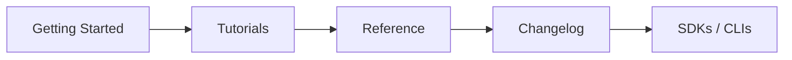

# 좋은 API 문서 만들기

이 글은 API Design 101 시리즈의 마지막 글입니다. 좋은 API 문서는 reference 페이지 몇 장으로 끝나지 않습니다. Getting Started, tutorial, reference, changelog, SDK 안내가 하나의 시스템으로 맞물려야 실제 채택으로 이어집니다.

## 이 글에서 다룰 문제

- API 문서는 어떤 다섯 축으로 구성하면 좋을까요?
- 사용자가 첫 호출까지 5분 안에 도달하게 하려면 무엇이 필요할까요?
- 예제는 왜 문서의 중심이어야 할까요?
- changelog와 SDK 문서는 어떤 역할을 할까요?
- 문서는 시간이 지나면서 어떤 방식으로 자라야 할까요?

## 왜 중요한가

문서는 API 자체만큼이나 채택률에 직접적인 영향을 줍니다. 같은 endpoint라도 문서가 좋으면 5분 만에 호출할 수 있고, 문서가 나쁘면 반나절이 걸릴 수 있습니다.

> 문서는 제품의 일부입니다.

## 한눈에 보는 개념



## 핵심 용어

- **Getting Started**: 아무것도 없는 상태에서 첫 호출까지 가는 안내입니다.
- **Tutorial**: 하나의 시나리오를 처음부터 끝까지 따라가는 문서입니다.
- **Reference**: endpoint와 필드의 사전입니다.
- **Changelog**: 버전별 변경 이력을 기록한 문서입니다.
- **SDK**: 언어별 client library입니다.

## Before / After

**Before (reference만 있음)**

```text
- /users (GET, POST, ...)
- /orders (GET, POST, ...)
```

이름만 나열해서는 사용자가 어디서 시작해야 할지 알기 어렵습니다.

**After (다섯 축이 모두 있음)**

```text
1. Getting Started — first call in five minutes
2. Tutorials — checkout flow, sign-up flow
3. Reference — every endpoint
4. Changelog — versioned changes
5. SDKs — Python, JS, Ruby
```

## 실습: 더 좋은 문서를 만드는 다섯 단계

### Step 1 — Getting Started

````markdown
# Getting Started

1. Sign up at https://example.com → get an API key
2. First call (curl):
   ```bash
   curl https://api.example.com/v1/health \
     -H "Authorization: Bearer <YOUR_KEY>"
   ```
3. Seeing `{"status": "ok"}` means success.
````

핵심은 5분 규칙입니다. 사용자가 5분 안에 무언가 동작하는 경험을 해야 합니다.

### Step 2 — Tutorial (scenario-driven)

````markdown
# Accept Your First Payment

1. Create a customer (POST /v1/customers)
2. Create a payment intent (POST /v1/payment_intents)
3. Confirm
4. Receive the webhook
````

tutorial은 기능 목록이 아니라 목표를 향해 끝까지 가는 흐름이어야 합니다.

### Step 3 — Reference + examples

````markdown
## POST /v1/customers
Input: {name, email}
Response (201):
```json
{"id": "cus_abc", "name": "Y", "email": "y@example.com"}
```

Errors:
| code | status | meaning |
|------|--------|---------|
| validation_error | 422 | name or email missing |
| email.duplicate | 409 | email already registered |
````

reference 페이지마다 예제와 에러 표가 있어야 실제 호출이 쉬워집니다.

### Step 4 — Changelog

````markdown
# Changelog

## 2026-05-01
- BREAKING: removed `name` from /v1/users. Use `full_name`.
- ADD: /v2/users gains `created_at`.

## 2026-04-15
- DEPRECATE: /v1 — sunset 2027-01-31.
````

변경에는 날짜와 분류가 함께 있어야 합니다.

### Step 5 — SDKs and a try-it environment

```python
# 5_sdk.py
from example_api import Client
c = Client(api_key="...")
print(c.users.get(42))
```

복사해서 바로 실행할 수 있는 코드와 클릭해서 시험해 볼 수 있는 인터페이스가 필요합니다.

## 이 코드에서 봐야 할 점

- 첫 화면은 Getting Started여야 합니다.
- 모든 reference 페이지에는 예제가 있어야 합니다.
- changelog는 최신 항목이 먼저 보이는 역순 구조가 좋습니다.

## 자주 하는 실수 다섯 가지

1. **reference만 둡니다.** 처음 쓰는 사용자는 어디서 시작해야 할지 모릅니다.
2. **예제가 없거나 틀립니다.** 복사해도 실행되지 않으면 문서 신뢰가 무너집니다.
3. **changelog가 없습니다.** 사용자가 무엇이 바뀌었는지 추적할 수 없습니다.
4. **에러가 문서화되지 않습니다.** 4xx 본문이 비밀이 됩니다.
5. **문서가 별도 저장소에 있습니다.** 코드와 동기화하기가 거의 불가능해집니다.

## 실무에서는 이렇게 드러납니다

Stripe와 Twilio는 이 영역의 골든 레퍼런스로 자주 언급됩니다. Getting Started부터 reference, changelog, SDK 문서까지 전체 경험이 일관됩니다. 내부 API도 공개 API처럼 문서화하면 도입 속도는 빨라지고 지원 요청은 줄어듭니다. 이것이 결국 DX입니다.

## 시니어 엔지니어는 이렇게 생각합니다

- 문서를 코드와 같은 저장소에 둡니다.
- 예제를 실제로 실행해 CI에서 검증합니다.
- changelog도 가능하면 자동 생성합니다.
- 5분 규칙을 실제 사용자로 측정합니다.
- 가장 많이 방문되는 페이지부터 개선합니다.

## 체크리스트

- [ ] Getting Started가 5분 안에 첫 호출까지 안내하는가?
- [ ] 모든 endpoint에 예제가 있는가?
- [ ] changelog가 최신 상태인가?
- [ ] reference에 에러 표가 포함되는가?
- [ ] SDK 또는 try-it 환경이 있는가?

## 연습 문제

1. 현재 API의 Getting Started를 5분 규칙 기준으로 다시 써 보세요.
2. 가장 많이 쓰는 endpoint에 시나리오 예제 세 개를 추가해 보세요.
3. PR마다 예제 코드를 실제 실행하는 CI 단계를 설계해 보세요.

## 정리와 시리즈 마무리

API는 계약, 동작, 문서가 합쳐진 전체 경험입니다. 이 시리즈는 첫 글에서 계약이라는 출발점을 잡고, REST, 리소스, method, schema, pagination, error, OpenAPI, versioning을 거쳐 마지막으로 문서까지 다뤘습니다. 이제 가장 좋은 복습은 작은 API 하나를 처음부터 끝까지 직접 만들어 보는 일입니다.

<!-- toc:begin -->
- [API란 무엇인가?](./01-what-is-an-api.md)
- [REST 기본](./02-rest-basics.md)
- [리소스 설계](./03-resource-design.md)
- [HTTP method와 status code](./04-http-methods-and-status.md)
- [Request와 response schema](./05-request-and-response-schema.md)
- [Pagination과 filtering](./06-pagination-and-filtering.md)
- [Error response 설계](./07-error-response-design.md)
- [OpenAPI와 Swagger](./08-openapi-and-swagger.md)
- [Versioning](./09-api-versioning.md)
- **좋은 API 문서 만들기 (현재 글)**
<!-- toc:end -->

## 참고 자료

- [Stripe Documentation](https://stripe.com/docs)
- [Twilio Documentation](https://www.twilio.com/docs)
- [Write the Docs — API documentation](https://www.writethedocs.org/topic-guides/api-documentation/)
- [Diataxis Framework (tutorials/how-to/reference/explanation)](https://diataxis.fr/)

Tags: Computer Science, APIDesign, Documentation, DeveloperExperience, Examples, Backend
