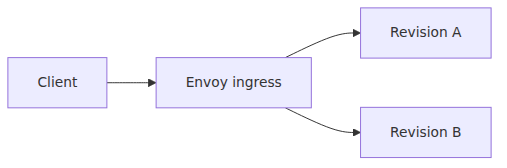

# Ingress and traffic splitting — revision-based deployment strategies

> Azure Container Apps 101 series (4/7)

This post connects ingress with revision-based rollout control. The goal is not proxy internals. The goal is to understand which ACA knobs change public exposure, which knobs keep old revisions alive, and how weighted traffic lets you turn revisions into a safe rollout tool.

---

## The request path

ACA's managed ingress layer acts as the public entry point and routes traffic to active revisions.


---

## What ingress owns

- TLS termination
- external or internal exposure
- traffic distribution across revisions

---

## Single and multiple mode

Single deactivates the previous revision after the new one is ready.
Multiple keeps more than one revision active.

---

## Traffic commands

```bash
az containerapp revision set-mode   --name $APP_NAME   --resource-group $RG   --mode multiple

az containerapp ingress traffic set   --name $APP_NAME   --resource-group $RG   --revision-weight myapp--rev-a=80 myapp--rev-b=20
```

---

## Canary and blue-green

- start with a small percentage
- compare logs and latency
- move traffic back if needed

---

## What matters operationally

- Single revision mode optimizes for simplicity.
- Multiple revision mode optimizes for controlled rollout and rollback.
- Traffic weights only help if you compare revisions with logs, latency, and error rate rather than moving percentages blindly.

---

<!-- toc:begin -->
## In this series

- [What is Azure Container Apps? — running containers without Kubernetes](./01-what-is-aca.md)
- [Environment, Container App, Revision — ACA in three words](./02-environment-app-revision.md)
- [Your first deploy — Python/FastAPI](./03-first-deploy.md)
- **Ingress and traffic splitting — revision-based deployment strategies (current)**
- Scaling — KEDA scalers and zero-to-N (upcoming)
- Dapr integration — what you get from a sidecar (upcoming)
- Monitoring and ops — Log Analytics and Application Insights (upcoming)

<!-- toc:end -->

---

## References

### Official Docs
- [Ingress in Azure Container Apps — Microsoft Learn](https://learn.microsoft.com/en-us/azure/container-apps/ingress-overview)
- [Configure ingress for your app in Azure Container Apps — Microsoft Learn](https://learn.microsoft.com/en-us/azure/container-apps/ingress-how-to)
- [Traffic splitting in Azure Container Apps — Microsoft Learn](https://learn.microsoft.com/en-us/azure/container-apps/traffic-splitting)
- [Update and deploy changes in Azure Container Apps — Microsoft Learn](https://learn.microsoft.com/en-us/azure/container-apps/revisions)

### Related Series
- [Azure App Service 101](../../azure-app-service-101/en/01-what-is-app-service.md)
- [Azure AKS 101](../../azure-aks-101/en/01-what-is-aks.md)
- [Azure Functions 101](../../azure-functions-101/en/01-what-is-azure-functions.md)

Tags: Azure, Container Apps, Serverless, Containers
