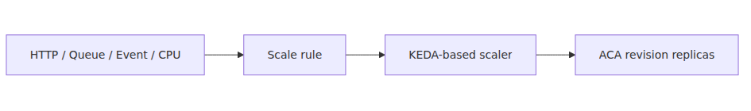

# Scaling — KEDA scalers and zero-to-N

> Azure Container Apps 101 series (5/7)

## What you'll learn

- How Azure Container Apps decides replica counts based on declarative scaling signals.
- The difference between built-in HTTP/TCP rules and custom KEDA scalers.
- When `min-replicas 0` (scale-to-zero) is safe and when it is dangerous.
- How to configure both an HTTP API and a Service Bus queue worker using `az containerapp` commands.

## Why this matters

The core ACA value proposition is "running containers without the weight of Kubernetes."
Scaling is where that promise becomes most visible.
You don't install HPA (Horizontal Pod Autoscaler) or KEDA yourself — the same KEDA scalers run inside the ACA control plane.

Misunderstanding scaling costs you in two ways.
First, **money**: leaving `min-replicas` above zero means you pay for idle replicas indefinitely.
Second, **reliability**: pinning a queue worker to an HTTP rule means messages pile up while replicas never grow.
Scaling rules are simultaneously a cost policy and an SLO policy.

## Mental Model

Think of scaling as a three-stage declarative pipeline:

1. **Signal** — what to observe: HTTP concurrent requests, TCP connections, Service Bus queue depth, CPU usage, etc.
2. **Rule** — how to interpret the signal: `--scale-rule-type http`, `azure-servicebus`, `cpu`, etc.
3. **Bounds** — KEDA picks a replica count between `--min-replicas` and `--max-replicas`.

Signal → Rule → Bounds. Once those three are set, ACA does the rest.
You don't write YAML or imperative scaling code — you declare "if this signal arrives, scale up to N."



## Core concepts

### 1. Three rule categories

| Category | Trigger | Scale-to-zero | Common use |
| --- | --- | --- | --- |
| HTTP rule | Concurrent HTTP requests | Yes | Web APIs, REST services |
| TCP rule | Concurrent TCP connections | Yes | gRPC, custom TCP servers |
| Custom KEDA rules | Service Bus, Event Hubs, Kafka, Redis, CPU, memory, etc. | Depends on scaler | Queue workers, batch processors |

HTTP and TCP are measured by the ACA ingress layer, so no extra auth is required.
Custom rules touch external resources (such as a Service Bus namespace), so you connect a secret via `--scale-rule-auth`.

### 2. What scale-to-zero actually means

`--min-replicas 0` says "drop replicas to zero when there is no traffic."
The next request triggers a cold start as ACA spins up a new replica.
HTTP rules and most event-driven KEDA scalers (Service Bus, Event Hubs, Kafka, etc.) can scale to zero.
**CPU and memory scalers belong to the custom category but do not scale to zero** — there must be a replica to measure CPU or memory against.

### 3. The cold-start trade-off

Scale-to-zero pushes idle cost to nearly zero, but the first request waits for the container to start.
Python/FastAPI typically takes 1–3 seconds; heavy model loading can stretch to 10+ seconds.
For user-facing synchronous APIs, prefer `min-replicas 1`. For async workers and nightly batches, `min-replicas 0` is appropriate.

## Before-After

### Before (no explicit scale rule)

```bash
az containerapp create \
  --name my-api --resource-group $RG --environment $ACA_ENV \
  --image $IMAGE --ingress external --target-port 8000
```

Without explicit rules, ACA applies a default HTTP scale rule (concurrency 10).
`min-replicas` defaults to 0, so idle is free but the first request hits a cold start.
Under load, it can scale up to 100 replicas — an unexpected cost ceiling.

### After (explicit HTTP rule)

```bash
az containerapp create \
  --name my-api --resource-group $RG --environment $ACA_ENV \
  --image $IMAGE --ingress external --target-port 8000 \
  --min-replicas 1 --max-replicas 10 \
  --scale-rule-name http-rule \
  --scale-rule-type http \
  --scale-rule-http-concurrency 50
```

`min-replicas 1` removes the cold start. `max-replicas 10` caps cost.
Replicas grow at 50 concurrent requests, keeping latency stable through traffic spikes.

## Step-by-step

### Step 1: Apply scaling to an HTTP API

Assume your FastAPI app is already pushed to ACR.

```bash
RG=rg-aca-demo
ACA_ENV=aca-env-demo
IMAGE=myacr.azurecr.io/my-api:latest

az containerapp create \
  --name my-api --resource-group $RG --environment $ACA_ENV \
  --image $IMAGE --ingress external --target-port 8000 \
  --min-replicas 0 --max-replicas 5 \
  --scale-rule-name http-rule \
  --scale-rule-type http \
  --scale-rule-http-concurrency 100
```

### Step 2: Build a Service Bus queue worker

```bash
az containerapp create \
  --name queue-worker --resource-group $RG --environment $ACA_ENV \
  --image $IMAGE \
  --min-replicas 0 --max-replicas 10 \
  --secrets "sb-connection=<SERVICE_BUS_CONNECTION_STRING>" \
  --scale-rule-name servicebus-rule \
  --scale-rule-type azure-servicebus \
  --scale-rule-metadata \
      "queueName=orders" \
      "namespace=mybus.servicebus.windows.net" \
      "messageCount=5" \
  --scale-rule-auth "connection=sb-connection"
```

`messageCount=5` means "one replica per five queued messages."
Empty queue scales to zero; 50 queued messages scale to 10 replicas (the max).

### Step 3: Verify behavior

```bash
az containerapp replica list --name queue-worker --resource-group $RG -o table
```

After enqueueing messages, replica count should change within 30–60 seconds.

## Common pitfalls

- **Using `min-replicas 0` on a latency-sensitive API** — every cold path pays the cold-start tax. Pin user-facing APIs to at least 1.
- **Not setting `max-replicas`** — a traffic spike or misconfigured rule turns into a cost incident.
- **HTTP rule on a queue worker** — messages pile up while replicas stay flat. Always use an event-driven scaler.
- **Configuring a Service Bus scaler without auth** — without `--scale-rule-auth`, KEDA cannot poll the queue and scaling never triggers.
- **Expecting `min-replicas 0` on CPU scalers** — CPU and memory scalers need a replica to measure, so they never go to zero.

## In production

Recommended settings by scenario:

- **Public REST API** — `min=1, max=10`, HTTP rule, concurrency 50–100. Prioritize cold-start removal.
- **Internal admin API** — `min=0, max=3`, HTTP rule. Prioritize cost.
- **Order processing worker** — `min=0, max=20`, Service Bus rule, `messageCount=10`. Prioritize burst handling.
- **Real-time inference API** — `min=2, max=20`, HTTP rule, concurrency 20. Latency SLO matters most.
- **Nightly batch** — `min=0, max=5`, scheduled or manual trigger.

KEDA scaler types are listed in the [official docs](https://keda.sh/docs/scalers/), and Microsoft Learn enumerates which scalers ACA supports.

## Checklist

- [ ] Did I pick the trigger category (HTTP / TCP / custom) that matches my workload?
- [ ] Does `min-replicas` match my cold-start tolerance?
- [ ] Did I cap cost with `max-replicas`?
- [ ] Did I attach `--scale-rule-auth` and a secret for any custom scaler?
- [ ] Does my queue worker use an event-driven scaler?
- [ ] Am I monitoring replica counts in Application Insights or Log Analytics?

## Exercises

1. For a REST API with average concurrency 30 and peak 200, what `min`, `max`, and `http-concurrency` would you choose? Justify each.
2. A Service Bus queue has 1000 messages, but only 10 worker replicas are running. List three plausible causes.
3. What happens if you set `min-replicas 0` on a CPU-based scaler? Why?

## Wrap-up and next post

Key takeaways:

- ACA scaling follows a declarative Signal → Rule → Bounds pipeline.
- HTTP and TCP are built-in rules; everything else is a custom KEDA scaler.
- Scale-to-zero drives idle cost to almost nothing but introduces cold starts.
- `min-replicas` and `max-replicas` are simultaneously cost and SLO policies.

Next post covers **Dapr integration** — how a sidecar gives you distributed-system building blocks like service invocation, pub/sub, and state store without library lock-in.

---

<!-- toc:begin -->
## In this series

- [What is Azure Container Apps? — running containers without Kubernetes](./01-what-is-aca.md)
- [Environment, Container App, Revision — ACA in three words](./02-environment-app-revision.md)
- [Your first deploy — Python/FastAPI](./03-first-deploy.md)
- [Ingress and traffic splitting — revision-based deployment strategies](./04-ingress-and-traffic-split.md)
- **Scaling — KEDA scalers and zero-to-N (current)**
- Dapr integration — what you get from a sidecar (upcoming)
- Monitoring and ops — Log Analytics and Application Insights (upcoming)

<!-- toc:end -->

---

## References

### Official Docs
- [Scaling in Azure Container Apps — Microsoft Learn](https://learn.microsoft.com/en-us/azure/container-apps/scale-app)
- [Azure Container Apps overview — Microsoft Learn](https://learn.microsoft.com/en-us/azure/container-apps/overview)
- [KEDA scalers documentation](https://keda.sh/docs/scalers/)
- [Azure Service Bus scaler — KEDA](https://keda.sh/docs/scalers/azure-service-bus/)

### Related Series
- [Azure App Service 101](../../azure-app-service-101/en/01-what-is-app-service.md)
- [Azure AKS 101](../../azure-aks-101/en/01-what-is-aks.md)
- [Azure Functions 101](../../azure-functions-101/en/01-what-is-azure-functions.md)

Tags: Azure, Container Apps, Serverless, Containers
