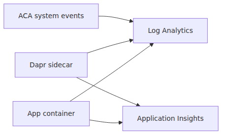

# Monitoring and ops — Log Analytics and Application Insights

> Azure Container Apps 101 series (7/7)

This post covers logs, traces, and day-two operations. The most important distinction is that ACA gives you platform logs through Log Analytics, while Application Insights is still an application instrumentation story. Those two signals complement each other, but they are not configured in the same place.

---

## The observability map

Log Analytics tells you what happened.
Application Insights helps you follow where the request went.


---

## Two log types

- ContainerAppConsoleLogs_CL
- ContainerAppSystemLogs_CL

---

## KQL examples

```kusto
ContainerAppConsoleLogs_CL
| where ContainerAppName_s == "fastapi-aca-demo"
| project Time=TimeGenerated, Revision=RevisionName_s, Message=Log_s
| take 100

ContainerAppSystemLogs_CL
| where ContainerAppName_s == "fastapi-aca-demo"
| project Time=TimeGenerated, Revision=RevisionName_s, Message=Log_s
| take 100
```

---

## Revision comparison

```kusto
ContainerAppConsoleLogs_CL
| where ContainerAppName_s == "fastapi-aca-demo"
| summarize count() by RevisionName_s
| order by count_ desc
```

---

## Application Insights

Application Insights is strong at distributed tracing and dependency analysis, but ACA does not magically emit full app traces just because the environment exists.

- **Log Analytics** stores ACA platform and container logs for the environment.
- **Application Insights** needs your app to emit telemetry through an SDK or OpenTelemetry pipeline.
- **Dapr telemetry** is a third signal. The `--dapr-connection-string` setting applies to Dapr sidecar telemetry, not to general application tracing.

In other words: connect the environment to Log Analytics for platform visibility, instrument the app itself for Application Insights, and only use Dapr-specific telemetry settings when you actually need sidecar-level traces.

---

## What matters operationally

- Read every log query with revision context first.
- Use system logs to understand platform decisions and console logs to understand app behavior.
- Treat Application Insights and Dapr telemetry as opt-in layers on top of the platform logging baseline.

---

<!-- toc:begin -->
## In this series

- [What is Azure Container Apps? — running containers without Kubernetes](./01-what-is-aca.md)
- [Environment, Container App, Revision — ACA in three words](./02-environment-app-revision.md)
- [Your first deploy — Python/FastAPI](./03-first-deploy.md)
- [Ingress and traffic splitting — revision-based deployment strategies](./04-ingress-and-traffic-split.md)
- [Scaling — KEDA scalers and zero-to-N](./05-scaling-with-keda.md)
- [Dapr integration — what you get from a sidecar](./06-dapr-integration.md)
- **Monitoring and ops — Log Analytics and Application Insights (current)**

<!-- toc:end -->

---

## References

### Official Docs
- [Monitor logs in Azure Container Apps with Log Analytics — Microsoft Learn](https://learn.microsoft.com/en-us/azure/container-apps/log-monitoring)
- [Observability in Azure Container Apps — Microsoft Learn](https://learn.microsoft.com/en-us/azure/container-apps/observability)
- [Azure Monitor Application Insights overview — Microsoft Learn](https://learn.microsoft.com/en-us/azure/azure-monitor/app/app-insights-overview)
- [Azure Container Apps environments — Microsoft Learn](https://learn.microsoft.com/en-us/azure/container-apps/environment)

### Related Series
- [Azure App Service 101](../../azure-app-service-101/en/01-what-is-app-service.md)
- [Azure AKS 101](../../azure-aks-101/en/01-what-is-aks.md)
- [Azure Functions 101](../../azure-functions-101/en/01-what-is-azure-functions.md)

Tags: Azure, Container Apps, Serverless, Containers
