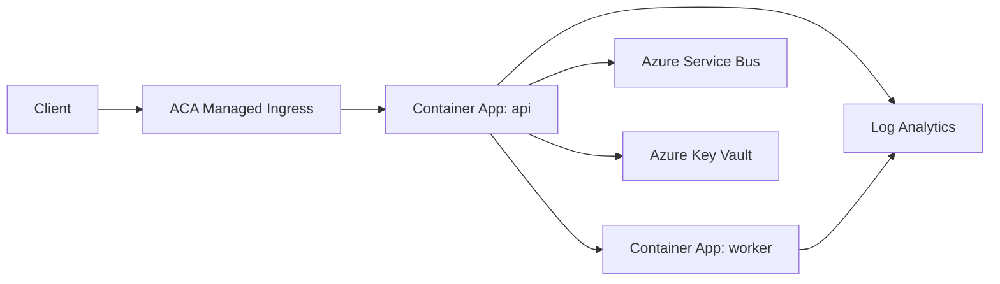

# Azure Container Apps 101 (1/7): Azure Container Apps란? — Kubernetes 없이 컨테이너 운영하기

처음 Azure Container Apps를 보면 App Service와 AKS 사이 어딘가를 메우는 서비스처럼 보입니다. 이 서비스를 제대로 쓰려면 플랫폼이 무엇을 추상화하고, 무엇은 여전히 사용자의 책임으로 남기는지부터 명확히 잡아야 합니다.

이 글은 Azure Container Apps 101 시리즈의 첫 번째 글입니다. 여기서는 ACA를 Azure 컨테이너 서비스 지도 위에 올려놓고, 어떤 워크로드에 가장 잘 맞는지부터 정리합니다.


*Azure Container Apps 101 1장 흐름 개요*
> Azure Container Apps란? — Kubernetes 없이 컨테이너 운영하기의 핵심은 기능 이름이 아니라, 어떤 경계에서 무엇을 검증하고 어떤 신호를 남길지 정하는 데 있습니다.

## 먼저 던지는 질문

- Azure Container Apps(ACA)는 다른 Azure 컨테이너 서비스(App Service, AKS, Functions)와 무엇이 다를까요?
- ACA의 세 가지 핵심 구성 요소인 Environment, Container App, Revision은 각각 어떤 역할을 할까요?
- 어떤 워크로드는 ACA에 잘 맞고, 어떤 워크로드는 다른 서비스에 두는 편이 나을까요?

## 왜 이 글이 중요한가

컨테이너 하나 만드는 일은 누구나 할 수 있습니다. 노트북에서도 잘 뜹니다. 어려운 지점은 그다음부터입니다.

> 어디에서 실행할지. HTTPS는 누가 끝낼지. 트래픽이 0일 때 비용을 어떻게 멈출지. 누가 스케일할지. 로그와 트레이스는 어디에 쌓일지.

이 질문의 답은 모두 플랫폼 선택에 묶여 있습니다. AKS는 완전한 자유를 주지만 클러스터를 직접 운영해야 합니다. App Service는 편리하지만 사이드카나 KEDA 스타일 스케일링은 어색합니다. Functions는 짧은 이벤트 핸들러에 최적화되어 있어서 장시간 실행되는 컨테이너에는 맞지 않습니다.

ACA는 정확히 그 사이의 빈 공간을 노립니다. 컨테이너는 직접 가져오되, 클러스터 운영은 Microsoft에 맡기는 모델입니다.

## 멘탈 모델

> ACA는 "컨테이너용 App Service"입니다.

App Service가 코드나 zip을 받아 ingress, scaling, slot이 연결된 웹 앱으로 바꿔 주듯, ACA는 컨테이너 이미지를 받아 비슷한 일을 해 줍니다. 차이는 입력이 컨테이너 이미지라는 점이고, 스케일러가 KEDA라서 0까지 내려갈 수 있다는 점입니다.

> 다른 비유로 보면, AKS가 "직접 운전하는 차"라면 ACA는 "택시를 부르는 것"에 가깝습니다. 목적지(이미지)와 몇 가지 선호사항(스케일 규칙, ingress)만 정하면 클러스터는 시야 밖에 머뭅니다.

## 하나의 ACA 환경부터 보기

이 그림이 시리즈 전체의 지도입니다. 뒤의 글들은 각 상자를 하나씩 확대합니다.

- 클라이언트와 ingress: 4화
- Environment, Container App, Revision: 2화
- 첫 배포: 3화
- KEDA 스케일링: 5화
- Dapr: 6화
- 관측성: 7화

## 핵심 개념 1 — 한 문장 정의

ACA는 관리형 서버리스 컨테이너 플랫폼입니다. Microsoft가 운영하는 Kubernetes 기반 위에 KEDA 기반 스케일링, 선택적 Dapr 통합, 관리형 ingress를 얹어 제공하지만, 사용자는 클러스터 자체를 보거나 제어하지 않습니다.

- 컨테이너 이미지가 배포 단위입니다.
- 유휴 상태에서는 replica 수가 줄고, 조건이 맞으면 0까지 내려갈 수 있습니다.
- Ingress, Revision, 관측성이 제품 안에 기본으로 들어 있습니다.

## 핵심 개념 2 — Azure 컨테이너 서비스 비교

| 서비스 | 추상화 수준 | 잘 맞는 워크로드 | 트레이드오프 |
|---|---|---|---|
| **AKS** | 낮음 (raw Kubernetes) | 복잡한 멀티 테넌트 시스템, 세밀한 제어 | 클러스터를 직접 운영해야 합니다 |
| **ACA** | 중간 (managed K8s) | HTTP API, worker, 마이크로서비스 | K8s API의 일부만 노출됩니다 |
| **App Service** | 높음 (PaaS) | 전형적인 웹 앱 | 비컨테이너 옵션은 많지 않습니다 |
| **Functions** | 가장 높음 (FaaS) | 이벤트 기반, 짧은 함수 | 장시간 실행 워크로드에는 맞지 않습니다 |

ACA는 "AKS만큼 자유롭지는 않지만, App Service보다 훨씬 더 컨테이너 네이티브하다"는 자리에 놓입니다.

## 적용 전후 비교
**Before (AKS만 알고 있을 때)**

```bash
# Just to put one small API on AKS:
az aks create ...                  # cluster creation (tens of minutes)
kubectl apply -f deployment.yaml   # write Deployment, Service, Ingress yourself
helm install ingress-nginx ...     # install your own ingress controller
helm install cert-manager ...      # configure TLS yourself
# + node maintenance, K8s upgrades, RBAC
```

**After (ACA)**

```bash
az containerapp up \
  --name myapi \
  --resource-group rg-demo \
  --image myregistry.azurecr.io/myapi:v1 \
  --ingress external \
  --target-port 8000
# → environment created, ingress + HTTPS + scaling 0..N configured automatically
```

차이는 명령 하나와 여러 도구의 차이입니다. 작은 API에 K8s 복잡도가 필요하지 않을 때 ACA가 빛납니다.

## 실습 — 첫 ACA 환경 만들기

본격적인 배포는 3화에서 다룹니다. 여기서는 환경만 만듭니다.

### 단계 1. CLI 준비

```bash
az login
az extension add --name containerapp --upgrade
az provider register --namespace Microsoft.App
```

### 단계 2. 리소스 그룹과 Environment 만들기

```bash
RG=rg-aca-demo
LOC=koreacentral
ENV=aca-env-demo

az group create --name $RG --location $LOC
az containerapp env create \
  --name $ENV \
  --resource-group $RG \
  --location $LOC
```

### 단계 3. hello-world 이미지 배포하기

```bash
az containerapp up \
  --name hello-aca \
  --resource-group $RG \
  --environment $ENV \
  --image mcr.microsoft.com/azuredocs/containerapps-helloworld:latest \
  --ingress external \
  --target-port 80
```

마지막 출력에는 `https://hello-aca.<unique>.azurecontainerapps.io` URL이 찍힙니다. HTTPS 인증서, ingress, scale-to-zero가 모두 자동으로 연결됩니다.

## 요청 하나가 지나가는 경로

가장 단순한 HTTP 요청을 따라가 보면 플랫폼이 맡는 책임이 더 구체적으로 보입니다.


*Client request flow to an active revision*

여러분이 결정하는 것:

- 이미지를 빌드하는 일
- 포트와 health probe 경로 선택
- 스케일 규칙 정의
- 트래픽 전략 선택(Revision split)
- 로그와 트레이스의 목적지 결정

ACA가 대신 처리하는 것: TLS 종료, 요청 라우팅, replica 오토스케일링, 컨테이너 재시작, 로그 수집입니다.

## 자주 하는 실수

### 실수 1. ACA를 "AKS 대체재"로만 보는 것

ACA는 K8s를 단순화한 서비스이지, 모든 기능을 노출하는 서비스가 아닙니다. CRD, custom controller, DaemonSet, StatefulSet, GPU 스케줄링이 필요하다면 AKS가 정답입니다.

### 실수 2. scale-to-zero를 항상 켜 두는 것

1–5초 수준의 cold start가 생기므로 사용자 대면 API의 첫 요청은 느려집니다. SLA가 엄격하다면 `--min-replicas 1`로 두고, scale-to-zero는 batch나 worker에 남겨 두는 편이 낫습니다.

### 실수 3. 서비스마다 Environment를 하나씩 만드는 것

Environment는 VNet과 로그 목적지를 공유하는 경계입니다. 같은 팀의 마이크로서비스는 하나의 Environment 안에 두는 편이 비용과 운영을 모두 관리하기 쉽습니다.

### 실수 4. 첫날부터 Dapr를 켜는 것

Dapr는 강력하지만 학습 곡선이 있습니다. 평범한 HTTP API라면 Dapr 없이 시작하고, pub/sub이나 state store가 실제로 필요해졌을 때 도입하는 편이 좋습니다(6화).

### 실수 5. worker에 external ingress를 붙이는 것

Worker(메시지 소비자, 배치 작업)는 외부 트래픽을 받지 않으므로 `--ingress disabled` 또는 `internal`을 사용해야 합니다. external ingress를 켜면 쓸모없는 엔드포인트만 외부에 노출됩니다.

## 실무에서는 이렇게 생각한다

프로덕션에서 ACA를 고를 때는 대개 몇 가지 질문으로 판단합니다.

- 우리가 K8s를 직접 운영할 인력이 있는가? 없다면 ACA가 거의 확실하게 더 맞습니다.
- 워크로드가 HTTP API + worker 조합인가? 그렇다면 ACA의 스위트 스팟에 가깝습니다.
- 유휴 시간이 긴가? 그렇다면 scale-to-zero로 비용을 크게 줄일 수 있습니다.
- K8s 네이티브 기능(Operator, GPU, custom scheduler)이 필요한가? 그렇다면 AKS로 가야 합니다.
- 컨테이너보다 zip/code 배포가 더 편한가? 그렇다면 App Service가 더 단순합니다.

앞의 세 질문에는 예, 마지막 두 질문에는 아니오라면 ACA가 가장 자연스러운 선택입니다.

## ACA가 잘 맞는 시나리오

- FastAPI 기반 API
- 트래픽이 몰렸다 줄어드는 worker
- 마이크로서비스 조합
- canary나 blue-green이 필요한 서비스

## 설계 예시 — ACA 기준 아키텍처와 IaC

개념을 운영으로 연결하려면 아키텍처와 선언 파일이 같이 있어야 합니다. 아래 예시는 가장 작은 프로덕션 시작점을 보여 줍니다.



*요청 경로와 운영 신호 경계*

위 구조에서 API와 worker는 같은 Environment를 공유하고, ingress는 API만 external로 엽니다. worker는 ingress를 끄고 큐 기반 scaler만 둡니다.

### Bicep으로 최소 프로덕션 골격 만들기

```bicep
param location string = resourceGroup().location
param envName string
param appName string
param workspaceName string
param image string

resource la 'Microsoft.OperationalInsights/workspaces@2022-10-01' = {
  name: workspaceName
  location: location
  properties: {
    sku: { name: 'PerGB2018' }
    retentionInDays: 30
  }
}

resource env 'Microsoft.App/managedEnvironments@2024-03-01' = {
  name: envName
  location: location
  properties: {
    appLogsConfiguration: {
      destination: 'log-analytics'
      logAnalyticsConfiguration: {
        customerId: la.properties.customerId
        sharedKey: la.listKeys().primarySharedKey
      }
    }
  }
}

resource app 'Microsoft.App/containerApps@2024-03-01' = {
  name: appName
  location: location
  properties: {
    managedEnvironmentId: env.id
    configuration: {
      ingress: {
        external: true
        targetPort: 8000
        transport: 'auto'
      }
    }
    template: {
      containers: [
        {
          name: 'api'
          image: image
          resources: { cpu: 0.5, memory: '1.0Gi' }
        }
      ]
      scale: { minReplicas: 1, maxReplicas: 10 }
    }
  }
}
```

CLI로 배포하면 다음 흐름이 나옵니다.

```bash
az deployment group create \
  --resource-group $RG \
  --template-file infra/main.bicep \
  --parameters envName=aca-env-prod appName=orders-api workspaceName=aca-logs image=$IMAGE
```

예상 출력 요약:

```text
ProvisioningState: Succeeded
managedEnvironment: aca-env-prod
containerApp: orders-api
ingressFqdn: orders-api.<hash>.koreacentral.azurecontainerapps.io
```

### AKS와 역할 경계 비교

AKS를 쓰면 Ingress Controller, Cert Manager, HPA/KEDA 운영이 팀 책임입니다. ACA를 쓰면 팀은 이미지/스케일 규칙/트래픽 정책을 선언하고, 클러스터 수명주기와 컨트롤 플레인 장애 대응은 플랫폼 책임으로 넘깁니다. 이 분리 덕분에 소규모 팀도 운영 품질을 일정 수준 이상 유지하기 쉽습니다.

## 워크로드 적합성 매트릭스

플랫폼 선택은 기능 비교표보다 운영 제약에서 더 선명하게 갈립니다. 아래 매트릭스는 실제 설계 리뷰에서 바로 쓰는 질문입니다.

| 질문 | ACA에 유리 | AKS에 유리 | App Service에 유리 |
|---|---|---|---|
| 트래픽이 유휴와 버스트를 반복하는가 | 예 | 부분적 | 부분적 |
| 클러스터 애드온을 직접 관리할 인력이 있는가 | 아니오 | 예 | 아니오 |
| 서비스당 컨테이너 제어가 필요한가 | 예 | 예 | 제한적 |
| DaemonSet/Operator/GPU가 필요한가 | 아니오 | 예 | 아니오 |
| 배포 전략으로 revision split이 필요한가 | 예 | 구현 필요 | 슬롯 중심 |

### 표준 환경 분리 전략

- `env-team-a-dev`: 외부 ingress 허용, 비용 우선, min replica 0 허용
- `env-team-a-stg`: prod와 동일 스케일 규칙, synthetic 테스트 연결
- `env-team-a-prod`: min replica 1 이상, 다단계 canary, 경보 필수

각 스테이지에서 같은 앱 이름 규칙을 유지하면 모니터링 쿼리를 재사용하기 쉽습니다. 예를 들어 `orders-api`를 모든 스테이지에서 동일하게 두고, 리소스 그룹 이름으로 환경만 나누면 KQL과 대시보드 템플릿을 그대로 복제할 수 있습니다.

### CLI 점검 세트

```bash
# Environment 목록
az containerapp env list --resource-group $RG --output table

# 특정 환경의 앱 목록
az containerapp list --resource-group $RG \
  --query "[?properties.managedEnvironmentId contains(@, 'aca-env-prod')].{name:name,latest:properties.latestRevisionName}" \
  -o table

# ingress 노출 상태 확인
az containerapp show --name orders-api --resource-group $RG \
  --query "properties.configuration.ingress.external" -o tsv
```

예상 출력:

```text
Name          Latest
------------  ---------------------
orders-api    orders-api--v12
payments-api  payments-api--v8
worker        worker--v21
```

### 비용 시뮬레이션 관점

ACA는 scale-to-zero가 가능하므로 평균 트래픽이 낮은 서비스군에서 비용 효율이 크게 올라갑니다. 반대로 24시간 고정 부하가 높은 서비스는 min replica를 상시 유지하게 되어, 관리 편의 외의 비용 이점이 줄어듭니다. 따라서 아키텍처 리뷰에서는 "평균"이 아니라 "부하 분산 형태"를 먼저 봐야 합니다.

- 낮은 평균 + 큰 버스트: ACA 우세
- 높은 평균 + 엄격한 지연 시간: ACA 가능하지만 min replica 고정 필요
- 고급 스케줄러/노드 제어: AKS 우세

이 기준을 문서로 남기면 이후 팀원이 바뀌어도 플랫폼 선택 기준이 흔들리지 않습니다.

## 실전 FAQ

### Q1. 포털에서는 정상인데 실제 응답은 불안정한 이유는 무엇일까요?

포털의 Provisioning 성공은 control plane 기준 신호입니다. 실제 사용자 품질은 data plane에서 결정됩니다. 따라서 항상 FQDN 호출 결과, revision health, system log를 함께 봐야 합니다. 운영 체크는 "설정이 저장됐는가"가 아니라 "요청이 안정적으로 처리되는가"로 마무리해야 합니다.

### Q2. `latest` 태그를 쓰면 왜 문제가 될까요?

`latest`는 사람이 보기에는 편하지만 감사/롤백/재현성에 모두 불리합니다. 같은 태그가 다른 이미지를 가리킬 수 있기 때문입니다. 프로덕션에서는 `v1.2.3` 또는 commit SHA처럼 불변 태그를 사용해야 합니다.

### Q3. 스케일과 배포를 동시에 바꾸면 어떤 위험이 있나요?

문제 원인 분리가 어려워집니다. 예를 들어 새 이미지와 새 스케일 규칙을 동시에 올리면 오류가 코드 문제인지 스케일 정책 문제인지 즉시 구분하기 어렵습니다. 안전한 팀은 배포와 스케일 변경을 분리하고, 각 변경마다 관측 지표를 따로 확인합니다.

### Q4. 멀티 서비스에서 네이밍 규칙은 어느 정도로 엄격해야 하나요?

매우 엄격해야 합니다. `orders-api--v12`처럼 서비스명과 revision suffix 패턴을 고정하면 로그, 알림, 런북 자동화가 쉬워집니다. 네이밍이 흔들리면 같은 쿼리를 서비스마다 다르게 써야 하고, 온콜 대응 속도가 느려집니다.

### Q5. 운영 문서에는 최소 무엇이 들어가야 하나요?

- 생성/변경 명령
- 예상 출력
- 실패 시 증상
- 확인할 로그 위치
- 즉시 복구 명령

이 다섯 가지를 글과 저장소 문서에 같이 유지하면, 팀 내 경험 차이가 있어도 대응 품질이 크게 흔들리지 않습니다.

## 참고용 명령 모음

```bash
# 앱 목록
az containerapp list --resource-group $RG -o table

# 단일 앱 상세
az containerapp show --name $APP --resource-group $RG -o json

# revision 목록
az containerapp revision list --name $APP --resource-group $RG -o table

# 트래픽 가중치
az containerapp ingress traffic show --name $APP --resource-group $RG -o table

# 최근 로그
az containerapp logs show --name $APP --resource-group $RG --tail 100
```

운영에서 중요한 것은 명령의 개수가 아니라 실행 순서입니다. 앱 상세 → revision 상태 → 트래픽 가중치 → 로그 순서로 보면 대부분의 이슈를 짧은 시간에 분류할 수 있습니다.

ACA를 장기 운영하는 팀은 플랫폼 선택 문서를 살아 있는 문서로 유지합니다. 새 서비스가 들어올 때마다 같은 질문 템플릿으로 판단 근거를 남기고, 3개월마다 실제 운영 지표와 비교해 선택이 맞았는지 재검토합니다. 이 과정이 누적되면 플랫폼 선택이 취향이 아니라 데이터 기반 의사결정으로 바뀝니다.

또한 환경 경계를 잘못 잡으면 비용보다 더 큰 문제가 생깁니다. 권한 경계, 로그 접근 경계, 네트워크 경계가 뒤엉키면 사고 조사 시점에 필요한 데이터를 즉시 꺼내기 어렵습니다. 그래서 초기 설계에서 Environment 기준을 팀/보안/네트워크 축으로 동시에 검토하는 습관이 중요합니다.

마지막으로, ACA는 "Kubernetes를 모른다"가 아니라 "Kubernetes 운영 부담을 줄인다"에 가깝습니다. 컨테이너 이미지 품질, 헬스 엔드포인트, graceful shutdown, 로그 구조화 같은 기본기는 여전히 그대로 필요합니다.

## 운영 메모 — 팀 합의가 필요한 항목

실제 운영에서는 기술 선택만큼 팀 합의가 중요합니다. 아래 항목은 서비스별로 값이 달라도 되지만, 같은 서비스 안에서는 반드시 고정해야 합니다.

- 배포 단위: 이미지 태그 규칙, revision suffix 규칙
- 검증 단위: healthz 통과 기준, canary 관찰 시간
- 복구 단위: 즉시 rollback 임계치, 단계적 복구 절차
- 기록 단위: 변경 이력, 영향 범위, 후속 액션

합의가 없는 상태에서는 같은 장애라도 담당자마다 전혀 다른 대응을 하게 됩니다. 반대로 합의를 문서와 자동화에 같이 넣으면, 야간 온콜에서도 대응 품질이 안정적으로 유지됩니다.

### 권장 문서 구조

1. 아키텍처 개요와 경계
2. 배포 절차와 검증 절차
3. 장애 분류와 즉시 조치
4. 모니터링 쿼리와 알림 임계치
5. 사후 분석(RCA) 템플릿

이 다섯 장이 준비되면 서비스 성숙도는 빠르게 올라갑니다. 특히 신입 엔지니어가 투입되어도 동일한 기준으로 운영할 수 있어 팀 전체의 평균 대응 시간이 짧아집니다.

## 체크리스트

- [ ] ACA가 AKS, App Service, Functions와 어떻게 다른지 한 문단으로 설명할 수 있습니다
- [ ] Environment, Container App, Revision의 관계를 직접 그릴 수 있습니다
- [ ] scale-to-zero를 켜야 할 때와 꺼야 할 때를 구분할 수 있습니다
- [ ] 위의 다섯 질문으로 우리 워크로드가 ACA에 맞는지 판단할 수 있습니다

## 연습 문제

1. 아래 워크로드마다 AKS / ACA / App Service / Functions 중 하나를 고르고, 한 줄 이유를 써 보세요.
   - "GitHub webhook을 받아 Slack에 보내는 함수"
   - "평균 초당 약 100 req/s를 처리하는 FastAPI REST API"
   - "GPU 기반 모델 학습 파이프라인"
   - "서비스 메시로 연결된 30개 마이크로서비스 시스템"
2. 위 Step 1-3을 따라 첫 ACA 환경을 만들고 hello-world URL을 호출해 보세요. 첫 번째 요청과 두 번째 요청의 지연 시간을 비교해 cold start를 직접 체감해 보세요.

## 정리

- ACA는 관리형 서버리스 컨테이너 플랫폼입니다. 다시 말해 "컨테이너는 직접 가져오되, 클러스터는 플랫폼에 맡기는" 모델입니다.
- Environment는 공용 경계이고, App과 Revision은 일상적인 운영 단위입니다.
- AKS만큼 자유롭지는 않지만, KEDA 기반 scale-to-zero와 revision 기반 트래픽 분할이 기본으로 들어 있습니다.
- 워크로드가 HTTP API + worker 조합이고 트래픽 변동이 크다면 ACA가 가장 자연스럽습니다.
- 클러스터를 숨긴다고 해서 ingress, scaling, rollout, observability 결정까지 사라지는 것은 아닙니다. 그 판단은 여전히 사용자 몫입니다.

다음 글에서는 이 모델을 Environment, Container App, Revision이라는 세 단어로 더 정밀하게 확대해 봅니다.

## 처음 질문으로 돌아가기

- **Azure Container Apps(ACA)는 다른 Azure 컨테이너 서비스(App Service, AKS, Functions)와 무엇이 다를까요?**
  - 본문의 기준은 Azure Container Apps란? — Kubernetes 없이 컨테이너 운영하기를 한 덩어리 개념으로 보지 않고 입력, 처리, 검증, 운영 신호가 만나는 경계로 나누어 확인하는 것입니다.
- **ACA의 세 가지 핵심 구성 요소인 Environment, Container App, Revision은 각각 어떤 역할을 할까요?**
  - 예제와 그림에서는 어떤 값이 들어오고, 어느 단계에서 바뀌며, 어떤 기준으로 통과 또는 실패하는지를 먼저 확인해야 합니다.
- **어떤 워크로드는 ACA에 잘 맞고, 어떤 워크로드는 다른 서비스에 두는 편이 나을까요?**
  - 운영에서는 이 판단을 체크리스트, 로그, 테스트로 남겨 다음 변경에서도 같은 실패가 반복되지 않게 막아야 합니다.

<!-- toc:begin -->
## 시리즈 목차

- **Azure Container Apps 101 (1/7): Azure Container Apps란? — Kubernetes 없이 컨테이너 운영하기 (현재 글)**
- Azure Container Apps 101 (2/7): Environment, Container App, Revision — ACA in three words (예정)
- Azure Container Apps 101 (3/7): 첫 배포하기 — Python/FastAPI (예정)
- Azure Container Apps 101 (4/7): Ingress와 트래픽 분할 — revision 기반 배포 전략 (예정)
- Azure Container Apps 101 (5/7): 스케일링 — KEDA scaler와 zero-to-N (예정)
- Azure Container Apps 101 (6/7): Dapr 통합 — 사이드카로 얻는 것 (예정)
- Azure Container Apps 101 (7/7): 모니터링과 운영 — Log Analytics와 Application Insights (예정)

<!-- toc:end -->

---

## 참고 자료

### 공식 문서

- [Azure Container Apps overview — Microsoft Learn](https://learn.microsoft.com/en-us/azure/container-apps/overview)
- [Azure Container Apps environments — Microsoft Learn](https://learn.microsoft.com/en-us/azure/container-apps/environment)
- [Update and deploy changes in Azure Container Apps — Microsoft Learn](https://learn.microsoft.com/en-us/azure/container-apps/revisions)
- [Ingress in Azure Container Apps — Microsoft Learn](https://learn.microsoft.com/en-us/azure/container-apps/ingress-overview)

### 관련 시리즈

- [Azure App Service 101](../../azure-app-service-101/ko/01-what-is-app-service.md)
- [Azure AKS 101](../../azure-aks-101/ko/01-what-is-aks.md)

- [이 글의 예제 코드 (book-examples)](https://github.com/yeongseon-books/book-examples/tree/main/azure-aca-101/ko/01-what-is-aca)

Tags: Azure, Container Apps, Serverless, Containers
