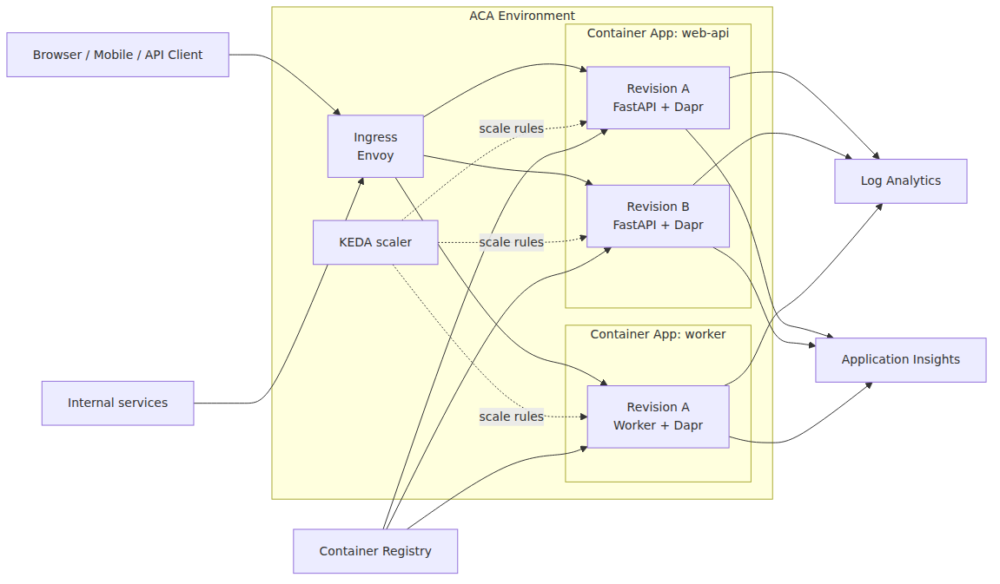
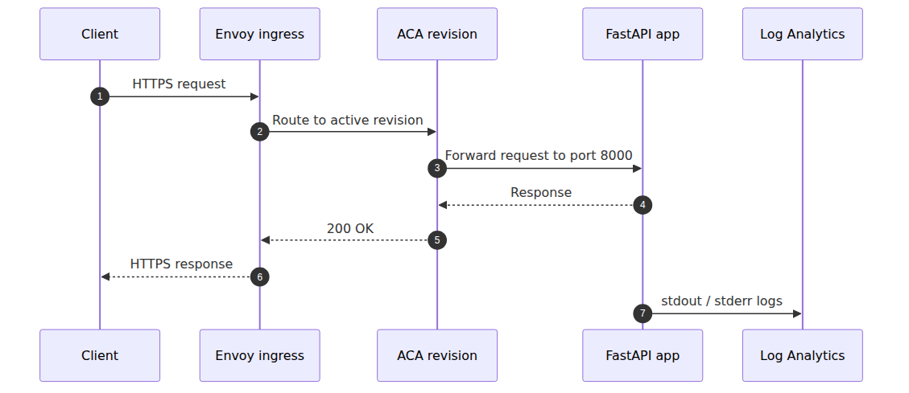

# Azure Container Apps란? — Kubernetes 없이 컨테이너 운영하기

> Azure Container Apps 101 시리즈 (1/7)

---

## 이 글에서 배울 것

- Azure Container Apps(ACA)가 다른 Azure 컨테이너 서비스(App Service, AKS, Functions)와 무엇이 다른지
- ACA의 핵심 구성 요소 Environment, Container App, Revision의 역할
- 어떤 워크로드가 ACA에 적합하고, 어떤 워크로드는 다른 서비스를 골라야 하는지
- 이 시리즈 7편이 어떤 순서로 ACA의 각 부분을 확장해나갈지

## 왜 중요한가

컨테이너는 만들 수 있습니다. 로컬에서도 잘 뜹니다. 문제는 그 다음입니다.

> 어디에 올릴지. HTTPS는 누가 붙일지. 트래픽이 0일 때 비용은 어떻게 줄일지. 스케일링은 누가 할지. 로그와 추적은 어디서 볼지.

이 결정은 모두 platform 선택에 묶여 있습니다. AKS는 자유롭지만 클러스터를 직접 운영해야 합니다. App Service는 편하지만 사이드카나 KEDA-style scaling이 어렵습니다. Functions는 짧은 함수에 최적화되어 있어 long-running container에는 맞지 않습니다.

ACA는 정확히 그 사이의 빈 칸을 노립니다. **컨테이너는 직접 가져가되, 클러스터 운영은 Microsoft에 맡기는 모델**입니다.

## Mental Model

> ACA는 "컨테이너용 App Service"입니다.

App Service가 코드(또는 zip)를 받아 web app으로 띄워주듯, ACA는 컨테이너 image를 받아 자동으로 ingress, scaling, revision 관리를 붙여줍니다. 차이는 컨테이너 단위라는 점, 그리고 KEDA 기반 scaling으로 0까지 내려갈 수 있다는 점입니다.

> 또 다른 비유: AKS가 "직접 운전하는 차"라면, ACA는 "택시"입니다. 목적지(이미지)와 옵션(scale 규칙, ingress)만 정하면 클러스터는 보이지 않습니다.

## 전체 그림 — Azure Container Apps 환경 한 장면

이 그림이 시리즈 전체의 지도입니다. 뒤의 글들은 각 박스를 하나씩 확대합니다.

- 클라이언트와 Ingress: 4화
- Environment·Container App·Revision: 2화
- 첫 배포: 3화
- KEDA scaling: 5화
- Dapr: 6화
- 관측성: 7화



## 핵심 개념 1 - 한 문장 정의

ACA는 **관리형 서버리스 컨테이너 platform**입니다. Microsoft가 관리하는 Kubernetes 위에 KEDA 기반 scaling, 선택적 Dapr 통합, 관리형 Ingress를 얹어 제공하지만, 사용자는 클러스터 자체를 보거나 제어하지 않습니다.

- 컨테이너 image가 배포 단위입니다.
- 유휴 시 replica가 줄고, 조건이 맞으면 0까지 내려갈 수 있습니다.
- Ingress, Revision, 관측성이 product 안에 묶여 있습니다.

## 핵심 개념 2 - Azure 컨테이너 서비스 비교

| 서비스 | 추상화 수준 | 적합한 워크로드 | 트레이드오프 |
|---|---|---|---|
| **AKS** | 낮음 (raw Kubernetes) | 복잡한 multi-tenant, 세밀한 control | cluster ops 직접 부담 |
| **ACA** | 중간 (managed K8s) | HTTP API, worker, microservices | K8s API 일부만 노출 |
| **App Service** | 높음 (PaaS) | 전형적 web app | 컨테이너 외 옵션 제한 |
| **Functions** | 가장 높음 (FaaS) | event-driven, 짧은 함수 | long-running 부적합 |

ACA는 "AKS만큼 자유롭지는 않지만, App Service보다 훨씬 컨테이너-네이티브하다"는 위치입니다.

## Before / After

**Before (AKS만 알고 있을 때)**

```bash
# AKS에 작은 API 하나 띄우려면:
az aks create ...                  # cluster 생성 (수십 분)
kubectl apply -f deployment.yaml   # Deployment, Service, Ingress 직접 작성
helm install ingress-nginx ...     # ingress controller 직접 설치
helm install cert-manager ...      # TLS 직접 설정
# + node 관리, K8s upgrade, RBAC 운영
```

**After (ACA 사용)**

```bash
az containerapp up \
  --name myapi \
  --resource-group rg-demo \
  --image myregistry.azurecr.io/myapi:v1 \
  --ingress external \
  --target-port 8000
# → 자동으로 환경 생성, ingress + HTTPS + scaling 0..N 설정
```

차이는 한 명령 vs 여러 도구입니다. 작은 API에 K8s 복잡도를 도입할 이유가 없을 때 ACA가 빛납니다.

## 단계별 실습 - 첫 ACA 환경 한 번 만들어보기

본격 배포는 3화에서 다루고, 여기서는 환경만 만듭니다.

### Step 1. CLI 준비

```bash
az login
az extension add --name containerapp --upgrade
az provider register --namespace Microsoft.App
```

### Step 2. Resource group과 Environment 생성

```bash
RG=rg-aca-demo
LOC=koreacentral
ENV=aca-env-demo

az group create --name $RG --location $LOC
az containerapp env create \
  --name $ENV \
  --resource-group $RG \
  --location $LOC
```

### Step 3. Hello-world image 배포

```bash
az containerapp up \
  --name hello-aca \
  --resource-group $RG \
  --environment $ENV \
  --image mcr.microsoft.com/azuredocs/containerapps-helloworld:latest \
  --ingress external \
  --target-port 80
```

마지막 출력에 `https://hello-aca.<unique>.azurecontainerapps.io` URL이 찍힙니다. HTTPS 인증서, ingress, scale-to-zero가 모두 자동입니다.

## 요청 하나의 흐름

가장 단순한 HTTP request 경로를 보면 platform의 책임이 선명해집니다.



사용자가 결정하는 것:

- image 만들기
- port와 health probe 경로 맞추기
- scale 규칙 정하기
- traffic 전략 정하기 (Revision split)
- 로그/추적 destination 정하기

ACA가 대신 해주는 것: TLS termination, request routing, replica autoscaling, container restart, log shipping.

## 자주 하는 실수

### 실수 1. ACA를 "AKS 대체"로 생각한다

ACA는 K8s를 단순화한 것이지 모든 K8s 기능을 노출하지 않습니다. CRD, custom controller, DaemonSet, StatefulSet, GPU 스케줄링 같은 기능이 필요하면 AKS가 맞습니다.

### 실수 2. scale-to-zero를 무조건 켠다

cold start latency가 1-5초씩 발생하므로 user-facing API에서는 첫 요청이 느려집니다. SLA가 빡빡한 API는 `--min-replicas 1`로 두고, batch/worker만 0까지 내립니다.

### 실수 3. Environment를 service당 하나씩 만든다

Environment는 VNet, log destination을 공유하는 boundary입니다. 같은 팀의 microservices는 한 Environment에 묶어야 비용·관리가 쉽습니다.

### 실수 4. Dapr을 처음부터 켠다

Dapr은 강력하지만 학습 곡선이 있습니다. 일반 HTTP API라면 Dapr 없이 시작하고, pub/sub이나 state store가 필요해지면 도입합니다(6화).

### 실수 5. ingress가 없는 worker에 external을 붙인다

worker(메시지 소비, batch)는 외부 트래픽이 없으므로 `--ingress disabled` 또는 `internal`을 씁니다. external을 켜면 불필요한 endpoint가 노출됩니다.

## 실무에서는 이렇게 생각한다

production에서 ACA를 고를 때 던지는 질문은 보통 이렇습니다.

- **K8s 직접 운영 인력이 있는가?** 없으면 ACA가 즉시 정답에 가까움.
- **워크로드가 HTTP API + worker 조합인가?** 그렇다면 ACA의 sweet spot.
- **idle 시간이 긴가?** scale-to-zero로 비용 큰 폭 절감 가능.
- **K8s native 기능(Operator, GPU, custom scheduler)이 필요한가?** 그렇다면 AKS.
- **컨테이너가 아닌 zip/code 배포가 편한가?** App Service가 더 단순.

답이 첫 세 질문 yes + 마지막 둘 no면 ACA가 가장 자연스러운 선택입니다.

## 어떤 시나리오에 맞나

- FastAPI 기반 API
- 트래픽이 들쭉날쭉한 worker
- microservices 조합
- Canary와 Blue-Green이 필요한 service

## 체크리스트

- [ ] ACA가 AKS, App Service, Functions와 어떻게 다른지 한 문단으로 설명할 수 있다
- [ ] Environment, Container App, Revision의 관계를 그릴 수 있다
- [ ] scale-to-zero를 켜는/끄는 기준을 안다
- [ ] 우리 워크로드가 ACA에 적합한지 5개 질문으로 판단할 수 있다

## 연습 문제

1. 다음 워크로드 각각에 대해 AKS / ACA / App Service / Functions 중 무엇이 가장 적합한지 고르고 이유를 한 줄로 적어보세요.
   - "GitHub webhook을 받아 Slack 알림을 보내는 함수"
   - "FastAPI 기반 REST API, 일평균 100 req/s"
   - "GPU로 모델을 학습하는 파이프라인"
   - "30개 microservice가 service mesh로 묶인 시스템"
2. 본문 Step 1-3을 따라 첫 ACA 환경을 만들고, hello-world URL에 접속해보세요. 첫 요청과 두 번째 요청의 latency를 비교해 cold start 영향을 체감해봅니다.

## 정리

- ACA는 "컨테이너는 직접 가져오되, 클러스터 운영은 맡기는" 관리형 서버리스 컨테이너 platform입니다.
- Environment는 공용 boundary이고, App과 Revision은 실제 운영 단위입니다.
- AKS만큼 자유롭지는 않지만, KEDA scale-to-zero와 Revision 기반 traffic split이 기본으로 들어 있습니다.
- HTTP API + worker 조합 + 가변 트래픽이라는 세 조건이 맞으면 ACA가 가장 자연스러운 선택입니다.
- ACA가 클러스터를 숨겨준다고 해서 ingress, scaling, rollout, 관측성 결정을 대신 내려주지는 않습니다.

## 다음 글

다음 글에서는 Environment·Container App·Revision 세 단어로 ACA의 운영 모델을 더 깊게 들여다봅니다.

---

<!-- toc:begin -->
## 시리즈 목차

- **Azure Container Apps란? — Kubernetes 없이 컨테이너 운영하기 (현재 글)**
- Environment·Container App·Revision — 세 단어로 보는 ACA (예정)
- 첫 앱 배포하기 — Python/FastAPI (예정)
- Ingress와 트래픽 분할 — Revision 기반 배포 전략 (예정)
- 스케일링 — KEDA scaler와 0-to-N (예정)
- Dapr 통합 — 사이드카로 얻는 것 (예정)
- 모니터링과 운영 — Log Analytics와 Application Insights (예정)
<!-- toc:end -->

## 참고 자료

### 공식 문서
- [Azure Container Apps overview — Microsoft Learn](https://learn.microsoft.com/en-us/azure/container-apps/overview)
- [Azure Container Apps environments — Microsoft Learn](https://learn.microsoft.com/en-us/azure/container-apps/environment)
- [Update and deploy changes in Azure Container Apps — Microsoft Learn](https://learn.microsoft.com/en-us/azure/container-apps/revisions)
- [Ingress in Azure Container Apps — Microsoft Learn](https://learn.microsoft.com/en-us/azure/container-apps/ingress-overview)

### 관련 시리즈
- [Azure App Service 101](../../azure-app-service-101/ko/01-what-is-app-service.md)
- [Azure AKS 101](../../azure-aks-101/ko/01-what-is-aks.md)
- [Azure Functions 101](../../azure-functions-101/ko/01-what-is-azure-functions.md)

Tags: Azure, Container Apps, Serverless, KEDA, Dapr, Containers
