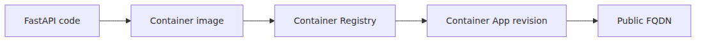

# 첫 앱 배포하기 — Python/FastAPI

> Azure Container Apps 101 시리즈 (3/7)

---

## 이 글에서 배울 것

- 로컬 FastAPI 코드가 ACA의 한 Revision으로 살아 움직이기까지의 전체 경로
- ACA가 image를 build해주지 않는다는 사실, 그리고 그것이 의미하는 책임 분담
- ACR(Azure Container Registry) → ACA Environment → Container App → Revision의 4단계 의존성
- 첫 배포가 잘 끝났는지 portal이 아니라 **CLI로** 확인하는 법

## 이 글에서 답할 질문

- ACA 자체는 image build를 책임지지 않는다 — 그러면 build는 누가, 어디서 하는가?
- ACR(Azure Container Registry) → Environment → Container App → Revision의 4단계는 왜 이 순서로 의존하는가?
- 첫 배포에서 비용이 정확히 언제부터 발생하기 시작하는가?
- 배포가 "성공"했다는 신호를 portal이 아니라 CLI로 어떻게 확인하는가?
- FastAPI 앱을 ACA에 올릴 때 Dockerfile에서 흔히 하는 실수는 무엇인가?

## 왜 중요한가

"hello world를 한 번 띄웠다"는 경험은 ACA를 머리로 이해하는 것과 손으로 이해하는 것 사이를 가로지르는 경계입니다. 첫 배포 한 번이면 다음과 같은 질문에 자기 답이 생깁니다.

- ACA는 어디서부터 어디까지 책임을 지나? (image build는 책임지지 않습니다.)
- 왜 ACR 같은 registry가 무조건 필요할까? (ACA는 image reference만 가져와 실행하기 때문입니다.)
- 어디서 비용이 발생하기 시작할까? (Environment 생성과 Revision running 시점입니다.)
- 배포가 성공했다는 신호는 무엇으로 봐야 할까? (FQDN 응답과 Revision의 healthy 상태입니다.)

이 글은 그 첫 한 번을 끝까지 이어줍니다.

## Mental Model

> ACA의 첫 배포는 "택시를 부르기 전에 출발지가 있어야 한다"와 같습니다.

택시(ACA)는 손님(image)을 알아서 데려다주지만, 손님이 어디에도 없으면 출발도 못 합니다. 손님은 미리 어딘가(레지스트리)에 서 있어야 하고, 그 주소(image reference)를 택시에 알려줘야 출발합니다.

그래서 첫 배포는 image build → registry push → ACA가 그 image를 가리키는 Revision을 만드는 순서로 흐릅니다. 한 단계라도 빠지면 다음이 진행되지 않습니다.

## 배포 경로 전체 보기

경로를 먼저 보면 배포가 훨씬 단순하게 느껴집니다.



*로컬 코드가 ACA 배포로 이어지는 경로*

핵심 의존성:

1. **Resource group** — 모든 Azure 리소스의 컨테이너
2. **ACR** — image를 보관할 곳 (혹은 다른 OCI registry)
3. **ACA Environment** — Revision이 실제로 실행될 boundary
4. **Container App + Revision** — image reference + 설정 = 실행되는 인스턴스

## 핵심 개념 — ACA가 "안 해주는" 것

| 책임 | 누가 |
|---|---|
| Source code → image build | **개발자/CI** (ACA 아님) |
| Image storage | **ACR 또는 외부 registry** (ACA 아님) |
| Image pull credential 관리 | ACA (managed identity로) |
| Container 실행, 재시작 | ACA |
| Ingress, TLS termination | ACA |
| 0-to-N scaling | ACA |
| Log shipping | ACA (Log Analytics로) |

이 표를 한 번 외워두면 "왜 안 되지?"의 90%가 사라집니다. ACA는 image를 만들어주지 않습니다.

## Before / After

**Before — image build를 ACA가 해줄 거라 생각**

```bash
# 이렇게 코드만 가리키면 안 됩니다 - ACA는 source build를 안 합니다
az containerapp create \
  --name myapi \
  --source ./my-fastapi-folder   # ← 일부 시나리오에서만 동작 (containerapp up + Buildpack)
```

`az containerapp up`이 내부적으로 buildpack을 호출하긴 하지만, production CI/CD에서는 명시적인 build → push → deploy 분리가 표준입니다.

**After — image를 명시적으로 빌드·푸시 후 deploy**

```bash
az acr build --registry $ACR_NAME --image fastapi-hello:v1 .
az containerapp create --name myapi --image $ACR_NAME.azurecr.io/fastapi-hello:v1 ...
```

후자는 image tag가 곧 "배포된 것"의 정체이기 때문에 추적·rollback·audit이 모두 깔끔합니다.

## 단계별 실습

### Step 0. 변수와 CLI 준비

```bash
az extension add --name containerapp --upgrade
az provider register --namespace Microsoft.App
az provider register --namespace Microsoft.OperationalInsights

RG="rg-aca-101-demo"
LOCATION="eastus"
ACA_ENV="aca-env-101-demo"
ACR_NAME="aca101demo$RANDOM"
APP_NAME="fastapi-aca-demo"
IMAGE="$ACR_NAME.azurecr.io/fastapi-hello:v1"
```

### Step 1. FastAPI 앱과 Dockerfile

```python
# app/main.py
from fastapi import FastAPI

app = FastAPI()

@app.get("/")
def read_root():
    return {"message": "hello from azure container apps"}

@app.get("/healthz")
def healthz():
    return {"status": "ok"}
```

```dockerfile
FROM python:3.12-slim
WORKDIR /app
COPY requirements.txt .
RUN pip install --no-cache-dir -r requirements.txt
COPY app ./app
CMD ["uvicorn", "app.main:app", "--host", "0.0.0.0", "--port", "8000"]
```

`requirements.txt`에는 최소 `fastapi`와 `uvicorn[standard]`이 있어야 합니다.

### Step 2. Resource group과 ACR 만들기

```bash
az group create --name $RG --location $LOCATION
az acr create --name $ACR_NAME --resource-group $RG --location $LOCATION --sku Basic
```

### Step 3. Image build & push (한 번에)

```bash
az acr build --registry $ACR_NAME --image fastapi-hello:v1 .
```

`az acr build`는 source를 ACR로 보내 클라우드에서 build하고 push까지 끝내줍니다. 로컬 Docker 데몬이 없어도 됩니다.

### Step 4. ACA Environment 만들기

```bash
az containerapp env create \
  --name $ACA_ENV \
  --resource-group $RG \
  --location $LOCATION
```

Environment는 네트워크, 로그 destination, 선택적 통합(예: Dapr)을 공유하는 boundary입니다. 이 명령은 약 2-3분 걸립니다.

### Step 5. 첫 Container App + Revision 생성

```bash
az containerapp create \
  --name $APP_NAME \
  --resource-group $RG \
  --environment $ACA_ENV \
  --image $IMAGE \
  --ingress external \
  --target-port 8000 \
  --cpu 0.5 \
  --memory 1.0Gi \
  --min-replicas 0 \
  --max-replicas 3
```

이 한 명령이 (1) Container App 생성, (2) 첫 Revision 생성, (3) ingress + TLS 자동 설정, (4) scale-to-zero 활성화를 모두 처리합니다.

### Step 6. CLI로 배포 검증

```bash
# FQDN 가져오기
FQDN=$(az containerapp show --name $APP_NAME --resource-group $RG \
  --query properties.configuration.ingress.fqdn --output tsv)
echo "https://$FQDN"

# 실제 호출
curl https://$FQDN/
curl https://$FQDN/healthz

# Revision 상태 확인
az containerapp revision list --name $APP_NAME --resource-group $RG \
  --query "[].{name:name, active:properties.active, healthState:properties.healthState}" \
  --output table
```

`healthState: Healthy`이면 성공입니다.

## 자주 하는 실수

### 실수 1. `target-port`를 Dockerfile의 EXPOSE와 다르게 지정

ACA의 `--target-port`는 컨테이너 안에서 실제로 listening 중인 port여야 합니다. Dockerfile에서 `8000`으로 띄웠는데 `--target-port 80`을 주면 ingress가 응답을 받지 못합니다.

### 실수 2. ACR에 image가 없는 상태로 `az containerapp create` 실행

순서가 중요합니다. Step 3 (image push)가 끝나야 Step 5 (app create)가 image를 pull할 수 있습니다. `ImagePullBackOff` 비슷한 상태로 Revision이 startup에 실패합니다.

### 실수 3. ACR pull 권한을 수동으로 설정 안 함

같은 subscription의 ACR이면 `az containerapp create`가 보통 자동으로 system-assigned managed identity를 생성하고 `AcrPull` role을 붙여줍니다. 그렇지 않은 경우 (cross-subscription, 외부 registry) 수동으로 `--registry-server`, `--registry-username`, `--registry-password`나 managed identity를 지정해야 합니다.

### 실수 4. `min-replicas 0`인데 health check를 자주 호출하지 않음

scale-to-zero가 작동하면 첫 호출에서 cold start가 발생합니다. `/healthz`가 너무 무겁거나 startup 시간이 길면 ingress가 timeout을 일으킬 수 있습니다. 첫 배포 검증용으로는 `--min-replicas 1`로 잠깐 두는 것도 좋습니다.

### 실수 5. portal에서 "Provisioning succeeded"만 보고 끝낸다

provisioning success는 control plane 응답이지 application healthy를 의미하지 않습니다. 반드시 Revision의 `healthState`와 실제 endpoint 응답을 확인해야 합니다.

## 실무에서는 이렇게 생각한다

production 첫 배포 점검 항목:

- **Image tag가 immutable한가?** `:latest` 사용 금지. `:v1`, `:sha-abc123` 같은 명시적 tag.
- **Build 환경이 재현 가능한가?** `az acr build`는 ACR이 ephemeral build agent를 띄워주므로 재현성이 좋습니다.
- **Env var와 secret이 분리됐는가?** secret은 `--secrets` 옵션으로 따로, 일반 설정은 `--env-vars`로.
- **첫 deploy의 cost가 보이는가?** Environment 생성 즉시 Log Analytics 비용이 발생합니다.
- **Rollback path가 보이는가?** Step 5를 한 번 더 다른 image tag로 실행하면 새 Revision이 생기고, Multiple mode면 weight 조정이 가능합니다.

## 체크리스트

- [ ] Image build → push → deploy의 책임 분담을 설명할 수 있다
- [ ] `--target-port`와 Dockerfile EXPOSE/CMD가 어떻게 맞아야 하는지 안다
- [ ] FQDN을 CLI로 가져와 실제 응답을 확인했다
- [ ] Revision의 `healthState`를 CLI로 확인하는 법을 안다
- [ ] Image tag를 immutable하게 관리해야 하는 이유를 설명할 수 있다

## 연습 문제

1. 위 Step 1-6을 그대로 따라 한 번 배포해보세요. 그 다음 `app/main.py`의 응답 메시지를 바꿔 image tag `:v2`로 다시 build·push·update하고, 새 Revision이 생기는 것을 `az containerapp revision list`로 확인하세요.
2. `--min-replicas 0`으로 둔 상태에서 5분 동안 호출이 없게 둔 후 첫 호출의 latency를 측정해보세요. 그 다음 `--min-replicas 1`로 update하고 같은 측정을 반복해 cold start 차이를 비교합니다.

## 정리

- ACA는 image build를 책임지지 않습니다 — 그것은 개발자/CI의 영역입니다.
- 첫 배포 흐름은 RG → ACR → image build/push → Environment → Container App + Revision 순서로 흐릅니다.
- `az containerapp create` 한 줄이 (1) App, (2) 첫 Revision, (3) ingress+TLS, (4) scaling을 모두 켭니다.
- 배포 검증은 portal의 "Provisioning succeeded"가 아니라 **Revision healthState + FQDN 응답**으로 합니다.
- Image tag는 immutable하게 (`:v1`, `:sha-abc123`) 관리해야 추적·rollback이 가능합니다.

## 다음 글

다음 글에서는 ingress와 traffic split을 깊게 다룹니다. 두 Revision을 만들어 90/10 canary로 흘려보내고, 문제 발견 시 즉시 100/0으로 되돌리는 패턴을 손에 익힙니다.

<!-- toc:begin -->
## 시리즈 목차

- [Azure Container Apps란? — Kubernetes 없이 컨테이너 운영하기](./01-what-is-aca.md)
- [Environment·Container App·Revision — 세 단어로 보는 ACA](./02-environment-app-revision.md)
- **첫 앱 배포하기 — Python/FastAPI (현재 글)**
- Ingress와 트래픽 분할 — Revision 기반 배포 전략 (예정)
- 스케일링 — KEDA scaler와 0-to-N (예정)
- Dapr 통합 — 사이드카로 얻는 것 (예정)
- 모니터링과 운영 — Log Analytics와 Application Insights (예정)

<!-- toc:end -->

---

## 참고 자료

### 공식 문서
- [Quickstart: Deploy your first container app with containerapp up — Microsoft Learn](https://learn.microsoft.com/en-us/azure/container-apps/get-started)
- [az containerapp create — Microsoft Learn](https://learn.microsoft.com/en-us/cli/azure/containerapp#az-containerapp-create)
- [Azure Container Apps environments — Microsoft Learn](https://learn.microsoft.com/en-us/azure/container-apps/environment)
- [Run containers from any registry — Microsoft Learn](https://learn.microsoft.com/en-us/azure/container-apps/containers)

### 관련 시리즈
- [Azure App Service 101](../../azure-app-service-101/ko/01-what-is-app-service.md)
- [Azure AKS 101](../../azure-aks-101/ko/01-what-is-aks.md)
- [Azure Functions 101](../../azure-functions-101/ko/01-what-is-azure-functions.md)

Tags: Azure, Container Apps, Serverless, Containers
