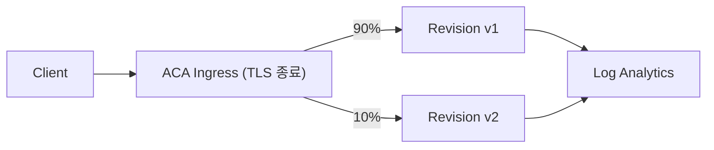

# Azure Container Apps 101 (4/7): Ingress와 트래픽 분할 — revision 기반 배포 전략

Ingress와 트래픽 분할은 ACA에서 가장 중요한 운영 레버 두 개입니다. 설정 한 줄만 바뀌어도 외부 노출 방식과 배포 안전성이 함께 달라지므로, 둘은 따로보다 함께 볼 때 더 잘 이해됩니다.

이 글은 Azure Container Apps 101 시리즈의 4번째 글입니다. 여기서는 ingress 설계와 revision 기반 배포 전략을 하나의 흐름으로 연결해 보겠습니다.

## 먼저 던지는 질문

- ACA의 관리형 Ingress는 무엇을 책임지고(TLS, external/internal 노출, Revision 라우팅), 무엇은 책임지지 않을까요?
- `external`, `internal`, `disabled` ingress mode의 차이는 정확히 무엇일까요?
- Single mode와 Multiple mode는 트래픽 분배 동작을 어떻게 바꿀까요?

## 큰 그림


*Azure Container Apps 101 4장 흐름 개요*

이 그림에서는 Ingress와 트래픽 분할 — revision 기반 배포 전략를 운영 흐름 안에서 어디에 배치해야 하는지 봅니다. 핵심은 개념을 따로 외우는 것이 아니라 입력, 처리, 검증, 운영 신호가 어떤 경계로 이어지는지 확인하는 데 있습니다.

> Ingress와 트래픽 분할 — revision 기반 배포 전략의 핵심은 기능 이름이 아니라, 어떤 경계에서 무엇을 검증하고 어떤 신호를 남길지 정하는 데 있습니다.

## 왜 이 글이 중요한가

ACA의 가장 강력한 프로덕션 기능 중 하나가 revision 기반 traffic split입니다. 하지만 이 기능을 제대로 쓰려면 먼저 ingress 설정이 맞아 있어야 합니다.

자주 보는 사고는 아래와 같습니다.

- "external ingress를 켰는데 인터넷에서 접속이 안 됩니다" → `target-port`가 맞지 않았습니다
- "canary로 10%만 보내려 했는데 100%가 새 버전으로 갔습니다" → Single mode였습니다
- "rollback은 재배포처럼 몇 분 걸린다고 들었습니다" → 실제로는 가중치 변경이고 수 초 안에 끝납니다
- "internal ingress로 만들었는데 외부에서 접근됩니다" → ingress mode를 잘못 이해했습니다

이 글은 ingress와 traffic split을 하나의 흐름으로 묶어, 이런 사고의 뿌리를 끊어 줍니다.

## 멘탈 모델

> Ingress는 ACA의 "정문"이고, 트래픽 가중치는 "엘리베이터 배차 비율"입니다.

정문(Ingress)은 외부 방문자를 받을지(`external`), 같은 건물 사람만 받을지(`internal`), 아예 닫아 둘지(`disabled`)를 결정합니다. 정문을 통과한 뒤에는 엘리베이터(traffic split rule)가 설정된 비율에 따라 각 방문자를 어느 사무실(Revision)로 보낼지 결정합니다.

이 두 단계는 서로 분리돼 있으므로, "외부 노출"과 "버전 분배"를 독립적으로 운영할 수 있습니다.

## 요청 경로

ACA의 관리형 Ingress 레이어는 정문 역할을 하고, 그 뒤에서 가중치에 따라 active Revision으로 트래픽을 보냅니다.

핵심 단계는 다음과 같습니다.

1. 클라이언트가 `https://<app>.<env-id>.<region>.azurecontainerapps.io`로 요청합니다
2. ACA의 관리형 envoy proxy가 TLS를 종료합니다
3. 해당 Container App의 Revision 가중치 테이블을 참조합니다
4. 비율에 따라 하나의 Revision의 하나의 replica로 트래픽을 보냅니다
5. Replica가 응답하고, 로그는 Log Analytics로 흘러갑니다

## 핵심 개념 1 — 세 가지 ingress mode

| Mode | 노출 범위 | URL | 잘 맞는 용도 |
|---|---|---|---|
| `external` | 퍼블릭 인터넷 | `https://<app>.<env-id>.<region>.azurecontainerapps.io` | 공개 API, 웹 프런트엔드 |
| `internal` | 같은 Environment 내부만 | `https://<app>.internal.<env-id>.<region>.azurecontainerapps.io` | 마이크로서비스 간 호출 |
| `disabled` | 노출되지 않음 | (none) | worker, 배치 작업, 메시지 소비자 |

CLI 예시는 다음과 같습니다.

```bash
az containerapp ingress enable \
  --name myapi --resource-group $RG \
  --type external --target-port 8000 --transport auto
```

`--transport`에는 `auto`(권장), `http`, `http2`, `tcp` 중 하나를 씁니다.

## 핵심 개념 2 — Single vs Multiple revision mode

| 항목 | Single mode | Multiple mode |
|---|---|---|
| Active Revision 수 | 항상 1 | N개 동시 active |
| 새 Revision 배포 시 | 트래픽 100%가 즉시 넘어감 | 가중치는 설정값 유지 |
| Canary | 불가능 | 가능 |
| Blue-Green | 불가능 | 가능 |
| 잘 맞는 용도 | 단순한 서비스, dev | 프로덕션 API |

기본값은 Single입니다. 프로덕션에서는 Multiple을 써야 합니다.

```bash
az containerapp revision set-mode \
  --name $APP_NAME --resource-group $RG \
  --mode multiple
```

## Before / After

**Before — Single mode에서 canary를 시도하는 경우**

```bash
# Single mode is the default
az containerapp update --name myapi --image myregistry.azurecr.io/myapi:v2
# → New Revision is created and 100% of traffic moves to v2 instantly
# The exact opposite of "send only some users."
```

**After — Multiple mode + 가중치 분할**

```bash
# 1. Switch to Multiple mode
az containerapp revision set-mode --name myapi --resource-group $RG --mode multiple

# 2. Deploy the new Revision (traffic still 0%)
az containerapp update --name myapi --image myregistry.azurecr.io/myapi:v2 --revision-suffix v2

# 3. Adjust weights gradually
az containerapp ingress traffic set --name myapi --resource-group $RG \
  --revision-weight myapi--v1=90 myapi--v2=10
```

핵심 차이는 트래픽을 정말 의도한 비율로 흘릴 수 있느냐입니다.

## 실습 — 90/10 canary와 즉시 rollback

### Step 1. Multiple mode로 전환하기

```bash
RG=rg-aca-demo
APP=myapi

az containerapp revision set-mode --name $APP --resource-group $RG --mode multiple
```

### Step 2. v1 배포하기(하나의 Revision이 100%)

```bash
az containerapp update --name $APP --resource-group $RG \
  --image myregistry.azurecr.io/myapi:v1 --revision-suffix v1
```

### Step 3. v2를 트래픽 0%로 배포하기

```bash
az containerapp update --name $APP --resource-group $RG \
  --image myregistry.azurecr.io/myapi:v2 --revision-suffix v2

# Pin v1=100, v2=0 first
az containerapp ingress traffic set --name $APP --resource-group $RG \
  --revision-weight $APP--v1=100 $APP--v2=0
```

### Step 4. 90/10 canary 시작하기

```bash
az containerapp ingress traffic set --name $APP --resource-group $RG \
  --revision-weight $APP--v1=90 $APP--v2=10
```

이제 Log Analytics에서 `RevisionName` 기준으로 에러율과 지연 시간을 비교합니다.

### Step 5a. 건강하면 50/50 → 0/100으로 진행하기

```bash
az containerapp ingress traffic set --name $APP --resource-group $RG \
  --revision-weight $APP--v1=50 $APP--v2=50
# After more monitoring
az containerapp ingress traffic set --name $APP --resource-group $RG \
  --revision-weight $APP--v1=0 $APP--v2=100
```

### Step 5b. 문제가 보이면 즉시 rollback하기

```bash
az containerapp ingress traffic set --name $APP --resource-group $RG \
  --revision-weight $APP--v1=100 $APP--v2=0
```

v2 트래픽은 수 초 안에 0이 됩니다.

## 자주 하는 실수

### 실수 1. `target-port`를 ingress 포트로 착각하는 것

`--target-port`는 컨테이너가 듣는 포트입니다. 외부에 노출되는 포트는 항상 443(HTTPS)이고, 매핑은 ACA가 처리합니다.

### 실수 2. `internal`이면 NSG 없이도 무조건 안전하다고 생각하는 것

`internal`은 같은 Environment 안에서만 라우팅됩니다. Environment를 VNet 통합 없이 만들었다면, internal 엔드포인트는 같은 ACA 리전 안의 다른 Container App만 호출할 수 있습니다. 온프레미스나 다른 VNet에서 호출하려면 VNet 통합 Environment가 필요합니다.

### 실수 3. canary를 시작하면서 v2의 `min-replicas`를 0으로 두는 것

트래픽이 10%뿐이어도 v2의 첫 요청은 cold start 비용을 지불합니다. canary 동안에는 v2의 `--min-replicas 1`로 두어야 지연 시간 측정이 깔끔합니다.

### 실수 4. 가중치를 바꾸자마자 메트릭을 보는 것

Ingress 가중치 변경은 즉시 반영되지만, Log Analytics 쿼리는 1-3분 정도 지연될 수 있습니다. 결론을 내리기 전 5-10분은 기다리는 편이 안전합니다.

### 실수 5. header나 cookie 기반 라우팅을 기대하는 것

ACA traffic split은 비율 기반입니다. "이 user-agent만 v2로 보내기" 같은 라우팅은 지원하지 않습니다. 그런 요구가 있으면 앞단에 Application Gateway나 Front Door를 둬야 합니다.

## 실무에서는 이렇게 생각한다

프로덕션 canary 플레이북은 대개 아래처럼 갑니다.

- 시작 가중치는 1-10% — 너무 작으면 통계적 신호가 약하고, 너무 크면 blast radius가 커집니다
- 단계 사이에 최소 10-15분 대기 — 로그 지연과 트래픽 다양성을 흡수해야 합니다
- rollback 기준을 미리 합의 — 예: 5xx > 1%, p95 latency +20%
- 두 Revision의 `min-replicas`를 같게 유지 — cold start 편향을 피해야 합니다
- 의미 있는 Revision suffix 사용 — 단순 `v2`보다 `v2-fix-bug-1234`가 낫습니다

## 트래픽 정책 심화 — 구성 예시와 검증 흐름

Ingress를 열고 가중치를 나누는 작업은 한 번의 명령으로 끝나지 않습니다. 설정, 관측, 복귀 조건을 세트로 가져가야 안전합니다.

### 아키텍처 다이어그램 — 정문과 Revision 분기



*Revision 가중치 분기와 로그 수집*

### traffic split ARM 예시

```json
{
  "configuration": {
    "activeRevisionsMode": "Multiple",
    "ingress": {
      "external": true,
      "targetPort": 8000,
      "traffic": [
        { "revisionName": "myapi--v1", "weight": 90 },
        { "revisionName": "myapi--v2", "weight": 10 }
      ]
    }
  }
}
```

### 검증 루틴 예시

```bash
# 가중치 확인
az containerapp ingress traffic show --name myapi --resource-group $RG --output table

# 200회 샘플 호출 후 분포 확인(헤더 기반 revision 식별 로그가 있다는 가정)
for i in $(seq 1 200); do curl -s https://$FQDN/ >/dev/null; done
```

예상 관찰:

```text
revision v1: 176 requests
revision v2: 24 requests
```

분포가 정확히 90/10으로 고정되지는 않습니다. 작은 표본에서는 오차가 생기며, 1000회 이상 집계하면 목표값에 수렴합니다.

### 복귀 조건 문서 예시

- 5분 이동 평균 `5xx > 1%`면 즉시 `100/0` 복귀
- p95 latency가 기준 대비 20% 이상 상승하면 확장 중단
- 시스템 로그에 probe 실패가 연속 3회 나오면 신규 revision 트래픽 동결

이 기준을 사전에 문서화하면 배포 중 의사결정이 개인 감각이 아니라 팀 규칙으로 바뀝니다.

## 고급 배포 전략 — 기능 플래그와 트래픽 분할 결합

트래픽 분할만으로 모든 위험을 제어할 수는 없습니다. 새 revision 내부에서도 기능 플래그를 같이 써야 blast radius를 더 줄일 수 있습니다.

### 결합 전략 예시

1. v2 배포 후 트래픽 5%
2. v2 내부 기능 플래그는 OFF 유지
3. 안정성 확인 후 플래그 ON
4. 트래픽 50% 확대
5. 최종 100% 전환

이 방식은 "코드 배포 위험"과 "기능 노출 위험"을 분리합니다.

### CLI 구성 템플릿

```bash
# v2 배포
az containerapp update --name myapi --resource-group $RG \
  --image myregistry.azurecr.io/myapi:v2 --revision-suffix v2

# 95/5
az containerapp ingress traffic set --name myapi --resource-group $RG \
  --revision-weight myapi--v1=95 myapi--v2=5

# 상태 확인
az containerapp ingress traffic show --name myapi --resource-group $RG -o json
```

### 운영 지표 기준선

- 성공률: 99.9% 이상 유지
- p95 latency: 기준선 +15% 이내
- 재시도율: 기준선 +20% 이내
- 시스템 로그 probe 실패: 0에 가까워야 함

지표를 숫자로 두지 않으면 "괜찮아 보인다" 수준의 판단이 반복됩니다.

### 트러블슈팅 루트

- 분할 비율은 맞는데 v2 요청이 거의 없을 때: 표본 수 부족 또는 캐시 경로 확인
- v2만 502가 날 때: target-port, startup probe, dependency timeout 순으로 확인
- rollback 후에도 오류 지속: 트래픽 문제가 아니라 공통 의존성 장애 가능성

### ARM 파라미터화 예시

```json
{
  "trafficV1": { "value": 90 },
  "trafficV2": { "value": 10 }
}
```

파라미터화하면 환경별로 같은 템플릿을 재사용하면서도 분할 비율만 안전하게 조정할 수 있습니다.

## 실전 FAQ

### Q1. 포털에서는 정상인데 실제 응답은 불안정한 이유는 무엇일까요?

포털의 Provisioning 성공은 control plane 기준 신호입니다. 실제 사용자 품질은 data plane에서 결정됩니다. 따라서 항상 FQDN 호출 결과, revision health, system log를 함께 봐야 합니다. 운영 체크는 "설정이 저장됐는가"가 아니라 "요청이 안정적으로 처리되는가"로 마무리해야 합니다.

### Q2. `latest` 태그를 쓰면 왜 문제가 될까요?

`latest`는 사람이 보기에는 편하지만 감사/롤백/재현성에 모두 불리합니다. 같은 태그가 다른 이미지를 가리킬 수 있기 때문입니다. 프로덕션에서는 `v1.2.3` 또는 commit SHA처럼 불변 태그를 사용해야 합니다.

### Q3. 스케일과 배포를 동시에 바꾸면 어떤 위험이 있나요?

문제 원인 분리가 어려워집니다. 예를 들어 새 이미지와 새 스케일 규칙을 동시에 올리면 오류가 코드 문제인지 스케일 정책 문제인지 즉시 구분하기 어렵습니다. 안전한 팀은 배포와 스케일 변경을 분리하고, 각 변경마다 관측 지표를 따로 확인합니다.

### Q4. 멀티 서비스에서 네이밍 규칙은 어느 정도로 엄격해야 하나요?

매우 엄격해야 합니다. `orders-api--v12`처럼 서비스명과 revision suffix 패턴을 고정하면 로그, 알림, 런북 자동화가 쉬워집니다. 네이밍이 흔들리면 같은 쿼리를 서비스마다 다르게 써야 하고, 온콜 대응 속도가 느려집니다.

### Q5. 운영 문서에는 최소 무엇이 들어가야 하나요?

- 생성/변경 명령
- 예상 출력
- 실패 시 증상
- 확인할 로그 위치
- 즉시 복구 명령

이 다섯 가지를 글과 저장소 문서에 같이 유지하면, 팀 내 경험 차이가 있어도 대응 품질이 크게 흔들리지 않습니다.

## 참고용 명령 모음

```bash
# 앱 목록
az containerapp list --resource-group $RG -o table

# 단일 앱 상세
az containerapp show --name $APP --resource-group $RG -o json

# revision 목록
az containerapp revision list --name $APP --resource-group $RG -o table

# 트래픽 가중치
az containerapp ingress traffic show --name $APP --resource-group $RG -o table

# 최근 로그
az containerapp logs show --name $APP --resource-group $RG --tail 100
```

운영에서 중요한 것은 명령의 개수가 아니라 실행 순서입니다. 앱 상세 → revision 상태 → 트래픽 가중치 → 로그 순서로 보면 대부분의 이슈를 짧은 시간에 분류할 수 있습니다.

트래픽 분할은 비율 조정 기능이지만, 운영 관점에서는 위험 예산을 나누는 도구입니다. 10% canary는 트래픽 10%를 보내는 것이 아니라 장애 영향을 10%로 제한하는 계약입니다. 이 관점을 팀이 공유하면 배포 논의가 훨씬 명확해집니다.

또한 canary 단계마다 관측 기준이 다를 수 있습니다. 초기 5~10% 구간에서는 오류율을, 30~50% 구간에서는 지연 시간과 재시도율을 더 엄격히 보는 식으로 단계별 판단 기준을 둬야 합니다.

실제 운영에서는 배포 자동화보다 롤백 자동화가 더 중요합니다. 이상 신호 감지 후 30초 내에 가중치를 복귀할 수 있어야 blast radius를 작게 유지할 수 있습니다.

## 운영 메모 — 팀 합의가 필요한 항목

실제 운영에서는 기술 선택만큼 팀 합의가 중요합니다. 아래 항목은 서비스별로 값이 달라도 되지만, 같은 서비스 안에서는 반드시 고정해야 합니다.

- 배포 단위: 이미지 태그 규칙, revision suffix 규칙
- 검증 단위: healthz 통과 기준, canary 관찰 시간
- 복구 단위: 즉시 rollback 임계치, 단계적 복구 절차
- 기록 단위: 변경 이력, 영향 범위, 후속 액션

합의가 없는 상태에서는 같은 장애라도 담당자마다 전혀 다른 대응을 하게 됩니다. 반대로 합의를 문서와 자동화에 같이 넣으면, 야간 온콜에서도 대응 품질이 안정적으로 유지됩니다.

### 권장 문서 구조

1. 아키텍처 개요와 경계
2. 배포 절차와 검증 절차
3. 장애 분류와 즉시 조치
4. 모니터링 쿼리와 알림 임계치
5. 사후 분석(RCA) 템플릿

이 다섯 장이 준비되면 서비스 성숙도는 빠르게 올라갑니다. 특히 신입 엔지니어가 투입되어도 동일한 기준으로 운영할 수 있어 팀 전체의 평균 대응 시간이 짧아집니다.

## 추가 시나리오 — 내부 트래픽만 허용하는 서비스

BFF나 내부 API는 external ingress가 필요 없는 경우가 많습니다. 이때는 `internal` 모드를 쓰고, 호출 주체를 같은 Environment 앱으로 제한하면 표면적 공격면을 줄일 수 있습니다. 내부 서비스라도 revision split 전략은 동일하게 적용할 수 있으므로, 운영 안정성을 희생하지 않고 보안 경계를 강화할 수 있습니다.

```bash
az containerapp ingress enable \
  --name internal-api --resource-group $RG \
  --type internal --target-port 8080
```

전환 절차는 external 서비스와 같습니다. 새 revision을 10%로 시작하고, 내부 호출 성공률을 확인한 뒤 100%로 올립니다. 차이는 검증 트래픽이 인터넷이 아니라 서비스 간 호출에서 나온다는 점입니다.

운영 경험상 ingress 정책은 애플리케이션 코드보다 변경 빈도가 낮아야 합니다. 잦은 ingress 정책 변경은 DNS, 캐시, 클라이언트 재시도 정책과 결합되어 예상치 못한 장애를 만들 수 있습니다. 그래서 팀은 월 단위로 ingress 변경 창을 묶고, 그 외 기간에는 revision 트래픽 가중치만 조정하는 방식으로 안정성을 확보하는 경우가 많습니다.

추가로, 배포 직후 5분과 30분 지표를 모두 확인해야 단기 이상과 장기 이상을 구분할 수 있습니다.

## 체크리스트

- [ ] external/internal/disabled ingress mode 차이를 설명할 수 있습니다
- [ ] Single과 Multiple mode 차이가 canary 가능 여부를 어떻게 바꾸는지 알고 있습니다
- [ ] 트래픽 가중치를 설정하는 CLI 명령을 외우고 있습니다
- [ ] rollback이 가중치 변경으로 수 초 안에 끝난다는 점을 확인했습니다
- [ ] header/cookie 기반 라우팅은 ACA traffic split의 범위가 아니라는 점을 알고 있습니다

## 연습 문제

1. Step 1-5a를 따라 v1 → v2 100% 전환을 90/10 → 50/50 → 0/100 순서로 진행해 보세요. 각 단계에서 Log Analytics로 `RevisionName`별 요청 수를 조회하고, 의도한 비율과 실제 비율을 비교해 보세요.
2. v2에 의도적으로 500 에러를 넣고 90/10 canary를 시작한 뒤 rollback 명령을 실행해 보세요. v2 트래픽이 0이 되기까지 걸리는 시간을 측정해 보세요.

## 정리

- ACA Ingress는 TLS, external/internal 노출, Revision 라우팅을 맡습니다.
- 첫 번째 결정은 `external` / `internal` / `disabled` 중 무엇을 고를지입니다.
- 프로덕션에서 canary와 즉시 rollback을 하려면 Multiple revision mode가 필요합니다.
- Traffic split은 비율 기반이며, header/cookie 기반 라우팅은 지원하지 않습니다.
- rollback은 새 배포가 아니라 가중치 변경이므로 수 초 안에 끝납니다.

다음 글에서는 KEDA 기반 스케일링을 다룹니다. HTTP 트래픽뿐 아니라 큐 길이, CPU, 사용자 정의 메트릭까지 신호로 삼아 0-to-N 스케일링을 구성해 보겠습니다.

## 처음 질문으로 돌아가기

- **ACA의 관리형 Ingress는 무엇을 책임지고(TLS, external/internal 노출, Revision 라우팅), 무엇은 책임지지 않을까요?**
  - 본문의 기준은 Ingress와 트래픽 분할 — revision 기반 배포 전략를 한 덩어리 개념으로 보지 않고 입력, 처리, 검증, 운영 신호가 만나는 경계로 나누어 확인하는 것입니다.
- **`external`, `internal`, `disabled` ingress mode의 차이는 정확히 무엇일까요?**
  - 예제와 그림에서는 어떤 값이 들어오고, 어느 단계에서 바뀌며, 어떤 기준으로 통과 또는 실패하는지를 먼저 확인해야 합니다.
- **Single mode와 Multiple mode는 트래픽 분배 동작을 어떻게 바꿀까요?**
  - 운영에서는 이 판단을 체크리스트, 로그, 테스트로 남겨 다음 변경에서도 같은 실패가 반복되지 않게 막아야 합니다.

<!-- toc:begin -->
## 시리즈 목차

- [Azure Container Apps 101 (1/7): Azure Container Apps란? — Kubernetes 없이 컨테이너 운영하기](./01-what-is-aca.md)
- [Azure Container Apps 101 (2/7): Environment, Container App, Revision — ACA in three words](./02-environment-app-revision.md)
- [Azure Container Apps 101 (3/7): 첫 배포하기 — Python/FastAPI](./03-first-deploy.md)
- **Azure Container Apps 101 (4/7): Ingress와 트래픽 분할 — revision 기반 배포 전략 (현재 글)**
- Azure Container Apps 101 (5/7): 스케일링 — KEDA scaler와 zero-to-N (예정)
- Azure Container Apps 101 (6/7): Dapr 통합 — 사이드카로 얻는 것 (예정)
- Azure Container Apps 101 (7/7): 모니터링과 운영 — Log Analytics와 Application Insights (예정)

<!-- toc:end -->

---

## 참고 자료

### 공식 문서

- [Ingress in Azure Container Apps — Microsoft Learn](https://learn.microsoft.com/en-us/azure/container-apps/ingress-overview)
- [Configure ingress for your app in Azure Container Apps — Microsoft Learn](https://learn.microsoft.com/en-us/azure/container-apps/ingress-how-to)
- [Traffic splitting in Azure Container Apps — Microsoft Learn](https://learn.microsoft.com/en-us/azure/container-apps/traffic-splitting)
- [Update and deploy changes in Azure Container Apps — Microsoft Learn](https://learn.microsoft.com/en-us/azure/container-apps/revisions)

### 관련 시리즈

- [Azure App Service 101](../../azure-app-service-101/ko/01-what-is-app-service.md)
- [Azure AKS 101](../../azure-aks-101/ko/01-what-is-aks.md)
- [Azure Functions 101](../../azure-functions-101/ko/01-what-is-azure-functions.md)

- [이 글의 예제 코드 (book-examples)](https://github.com/yeongseon-books/book-examples/tree/main/azure-aca-101/ko/04-ingress-and-traffic-split)

Tags: Azure, Container Apps, Serverless, Containers
