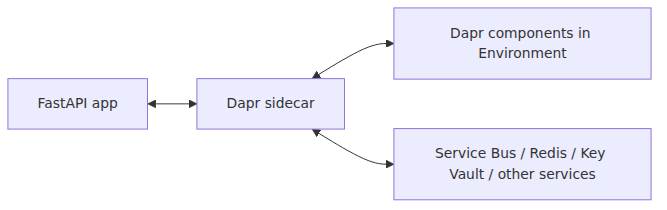

# Dapr 통합 — 사이드카로 얻는 것

Dapr는 마이크로서비스에서 반복되는 배관 작업을 많이 줄여 주지만, 아키텍처의 트레이드오프 자체를 지워 주지는 않습니다. 어디까지가 플랫폼의 몫이고 어디서부터 설계의 몫인지 보려면 App 수준 설정과 Environment 수준 component를 분리해서 봐야 합니다.

이 글은 Azure Container Apps 101 시리즈의 6번째 글입니다. 여기서는 ACA에서 사이드카가 무엇을 제공하고, 무엇은 여전히 여러분이 책임져야 하는지 살펴보겠습니다.

## 이 글에서 다룰 문제

- Dapr가 무엇이며, 그 사이드카는 ACA 안에서 정확히 어디에 붙을까요?
- App 수준 설정과 Environment 수준 component는 왜 분리해서 봐야 할까요?
- Service invocation, Pub/Sub, State store, Secret store 네 가지 핵심 구성요소는 각각 어떤 문제를 해결할까요?
- `--enable-dapr`와 component YAML로 실제 Dapr 통합을 어떻게 구성할까요?

## 이 글이 답할 질문

- Dapr 사이드카는 ACA pod 안의 어디에 붙고, 앱은 어떤 엔드포인트를 호출할까요?
- App 수준의 `--enable-dapr` 설정과 Environment 수준 component가 왜 분리될까요?
- Service invocation, Pub/Sub, State store, Secret store는 각각 어떤 문제를 푸는 걸까요?
- AKS에서 Dapr를 돌릴 때와 ACA에서 돌릴 때의 결정적인 차이는 무엇일까요?
- "첫날부터 Dapr를 켜는 것"이 왜 자주 안티패턴으로 언급될까요?

## 왜 이 글이 중요한가

마이크로서비스는 늘 비슷한 문제를 다시 만납니다.
Service A가 Service B를 호출하려면 서비스 디스커버리가 필요합니다. 둘 사이에 메시지를 보내려면 브로커 SDK가 필요합니다. 상태를 저장하려면 Redis나 Cosmos DB SDK가 필요합니다.
**Dapr는 이 네 가지를 표준 HTTP/gRPC API 뒤로 추상화합니다.** 앱은 `localhost:3500`의 Dapr 사이드카에 말하고, 사이드카가 실제 백엔드(Service Bus, Redis, Key Vault 등)와 통신합니다.

ACA에서 Dapr가 특히 매력적인 이유는 **런타임 설치 비용이 0**이기 때문입니다.
Kubernetes에서는 Helm chart를 설치하고 Dapr control plane을 직접 운영해야 합니다. ACA에서는 그 control plane을 플랫폼이 관리합니다.
앱에 `--enable-dapr true`만 주면 사이드카가 자동으로 주입됩니다.

## 멘탈 모델

Dapr는 두 수준으로 보면 단순해집니다.

1. **App level** — 이 앱이 Dapr를 쓰는가? `app-id`는 무엇인가? 앱은 몇 번 포트를 듣는가?
2. **Environment level** — 이 ACA Environment는 어떤 component를 제공하는가? Service Bus를 pubsub으로 쓸 것인가? Redis를 state store로 쓸 것인가?

App 수준은 앱별 옵트인이고, Environment 수준은 공유 인프라 카탈로그입니다.
하나의 component를 Environment에 등록하면, 같은 Environment 안의 여러 앱이 scope 설정을 통해 그것을 공유할 수 있습니다.

> Dapr를 켜는 일은 이 앱이 사이드카를 쓸 것인가를 정하는 일이고, component를 등록하는 일은 이 환경이 어떤 공용 기능을 제공할 것인가를 정하는 일입니다.



*Dapr sidecar next to the app and connections to external services*

## 핵심 개념

### 1. 사이드카 모델

`--enable-dapr true`를 주면 ACA는 앱 컨테이너 옆에 `daprd` 사이드카를 띄웁니다.
여러분의 코드는 비즈니스 로직만 맡고, 외부 시스템과의 통신은 사이드카가 담당합니다.

```text
┌─────────────────────────────────────┐
│  Container App: api-app             │
│  ┌──────────────┐  ┌─────────────┐  │
│  │ Your code    │  │ Dapr        │  │
│  │ FastAPI      │◄─┤ sidecar     │──┼──► Service Bus
│  │ :8000        │  │ :3500       │  │    Redis
│  └──────────────┘  └─────────────┘  │    Key Vault
└─────────────────────────────────────┘
```

### 2. 네 가지 핵심 구성요소

| Building block | 역할 | ACA에서 흔한 백엔드 |
| --- | --- | --- |
| **Service invocation** | 앱 간 호출(service discovery + retry + mTLS) | 다른 Container App(`app-id` 기준) |
| **Pub/Sub** | publish/subscribe 메시징 | Azure Service Bus, Event Hubs, Kafka |
| **State store** | key-value 상태 저장 | Cosmos DB, Redis, PostgreSQL |
| **Secret store** | secret 조회 추상화 | Azure Key Vault, ACA secrets |

### 3. Component와 scope

Component YAML은 "이 이름으로 이 백엔드를 사용한다"고 정의하는 문서입니다.
`scopes:` 필드는 어떤 `app-id`가 그 component에 접근할 수 있는지 명시적으로 제한합니다.
비워 두면 Environment 안의 모든 앱이 사용할 수 있습니다. 프로덕션에서는 항상 명시적으로 넣는 편이 좋습니다.

## Before / After

### Before (SDK를 직접 호출하는 경우)

```python
# Service Bus SDK directly
from azure.servicebus import ServiceBusClient, ServiceBusMessage

connection_str = os.environ["SERVICE_BUS_CONNECTION_STRING"]
with ServiceBusClient.from_connection_string(connection_str) as client:
    sender = client.get_queue_sender(queue_name="orders")
    sender.send_messages(ServiceBusMessage("order-123"))
```

백엔드를 Service Bus에서 Kafka로 바꾸면 SDK, 의존성, 코드까지 모두 바뀝니다.

### After (Dapr Pub/Sub API)

```python
import requests

requests.post(
    "http://localhost:3500/v1.0/publish/orderpubsub/orders",
    json={"orderId": "order-123"}
)
```

백엔드를 바꿔도 코드가 아니라 component YAML만 바꾸면 됩니다.

## 단계별 실습

### Step 1: 앱에 Dapr 켜기

```bash
RG=rg-aca-demo
ACA_ENV=aca-env-demo
IMAGE=myacr.azurecr.io/api-app:latest

az containerapp create \
  --name api-app --resource-group $RG --environment $ACA_ENV \
  --image $IMAGE --ingress external --target-port 8000 \
  --enable-dapr true \
  --dapr-app-id api-app \
  --dapr-app-port 8000
```

기존 앱이라면 다음처럼 켤 수도 있습니다.

```bash
az containerapp dapr enable \
  --name api-app --resource-group $RG \
  --dapr-app-id api-app --dapr-app-port 8000
```

### Step 2: Pub/Sub component 등록하기(Service Bus)

`pubsub.yaml`:

```yaml
componentType: pubsub.azure.servicebus.queues
version: v1
metadata:
  - name: namespaceName
    value: mybus.servicebus.windows.net
  - name: connectionString
    secretRef: servicebus-connection-string
secrets:
  - name: servicebus-connection-string
    value: "<SERVICE_BUS_CONNECTION_STRING>"
scopes:
  - api-app
  - worker-app
```

```bash
az containerapp env dapr-component set \
  --name $ACA_ENV --resource-group $RG \
  --dapr-component-name orderpubsub \
  --yaml pubsub.yaml
```

### Step 3: 앱에서 호출하기

```python
import requests

# Publish
requests.post(
    "http://localhost:3500/v1.0/publish/orderpubsub/orders",
    json={"orderId": "order-123"}
)

# Invoke another app (service invocation)
requests.post(
    "http://localhost:3500/v1.0/invoke/worker-app/method/process",
    json={"orderId": "order-123"}
)
```

## 자주 하는 실수

- 앱 수준 enable과 environment 수준 component를 혼동하는 것 — `--enable-dapr`만 켜고 component를 등록하지 않으면 사이드카는 뜨지만 publish는 모두 실패합니다.
- scope를 비워 두는 것 — 모든 앱이 모든 component에 접근하게 되어 보안 경계가 흐려집니다.
- secret 값을 inline으로 넣는 것 — connection string을 component YAML에 평문으로 넣으면 안 됩니다. `secretRef` + `secrets:` 블록 또는 Key Vault secret store를 써야 합니다.
- `dapr-app-port`를 빼먹는 것 — 들어오는 service invocation을 어디로 포워딩해야 할지 몰라 502가 납니다.
- 한 앱에서 HTTP API와 gRPC API를 섞어 쓰는 것 — Dapr는 둘 다 지원하지만, 혼용하면 트러블슈팅이 복잡해집니다.

## 프로덕션에서는 이렇게 본다

Dapr를 써야 할 때와 건너뛸 때는 대개 아래처럼 나뉩니다.

- 쓸 가치가 있는 경우: 마이크로서비스가 3개 이상이고, pub/sub와 service invocation이 모두 필요하며, 나중에 백엔드를 바꿀 가능성도 있습니다.
- 건너뛰는 편이 나은 경우: 단일 모놀리식 API와 DB 하나뿐인 구조입니다. SDK 호출이 한두 줄이면, 추상화가 줄여 주는 것보다 늘리는 복잡도가 더 큽니다.
- 프로덕션 체크리스트: managed identity 인증으로 전환하고, 명시적인 scope를 넣고, retry policy를 구성하고, Dapr telemetry를 Application Insights에 연결합니다.

ACA는 Dapr 버전을 플랫폼 차원에서 관리합니다. 메이저 업그레이드가 있을 때는 breaking change가 없는지 release note를 확인해야 합니다.

## 체크리스트

- [ ] `--enable-dapr true`, `--dapr-app-id`, `--dapr-app-port`를 설정했습니까?
- [ ] component YAML을 Environment에 등록했습니까?
- [ ] 각 component에 명시적인 `scopes:`를 넣었습니까?
- [ ] secret은 inline 값이 아니라 `secretRef`나 Key Vault로 관리하고 있습니까?
- [ ] Service invocation과 Pub/Sub 경로가 Application Insights에서 보입니까?
- [ ] 단일 앱 시나리오라면 Dapr가 정말 필요한지 다시 검토했습니까?

## 연습 문제

1. 같은 Environment에 `api-app`과 `worker-app`이 있지만 Service Bus pubsub component는 `api-app`만 써야 합니다. `scopes:`를 어떻게 적겠습니까?
2. Dapr service invocation과 앱 FQDN으로 직접 HTTP 호출하는 방식의 차이 세 가지를 적어 보세요.
3. state store 백엔드를 Redis에서 Cosmos DB로 바꾸고 싶습니다. 앱 코드는 얼마나 바뀔까요? 왜 그럴까요?

## 정리

- Dapr는 사이드카로 동작하며, 분산 시스템의 핵심 구성요소를 표준 API 뒤로 추상화합니다.
- App 수준 설정(enable, app-id)과 Environment 수준 component는 서로 독립적인 결정입니다.
- 네 가지 핵심 구성요소는 Service invocation, Pub/Sub, State store, Secret store입니다.
- Scope, secret 관리, retry policy는 여전히 사용자 책임입니다. Dapr가 대신 골라 주지 않습니다.

다음 글에서는 시리즈를 모니터링과 운영 주제로 마무리합니다. Log Analytics와 Application Insights를 ACA에 연결하고, 로그·메트릭·트레이스를 수집하는 방법과 운영 알림 구성을 함께 정리합니다.

---

<!-- toc:begin -->
## 시리즈 목차

- [Azure Container Apps란? — Kubernetes 없이 컨테이너 운영하기](./01-what-is-aca.md)
- [Environment, Container App, Revision — ACA in three words](./02-environment-app-revision.md)
- [첫 배포하기 — Python/FastAPI](./03-first-deploy.md)
- [Ingress와 트래픽 분할 — revision 기반 배포 전략](./04-ingress-and-traffic-split.md)
- [스케일링 — KEDA scaler와 zero-to-N](./05-scaling-with-keda.md)
- **Dapr 통합 — 사이드카로 얻는 것 (현재 글)**
- Monitoring and ops — Log Analytics and Application Insights (예정)

<!-- toc:end -->

---

## 참고 자료

### 공식 문서

- [Configure Dapr on an Existing Container App — Microsoft Learn](https://learn.microsoft.com/en-us/azure/container-apps/enable-dapr)
- [Microservice APIs powered by Dapr — Microsoft Learn](https://learn.microsoft.com/en-us/azure/container-apps/dapr-overview)
- [Dapr Components in Azure Container Apps — Microsoft Learn](https://learn.microsoft.com/en-us/azure/container-apps/dapr-components)
- [Dapr overview](https://docs.dapr.io/concepts/overview/)

### 관련 시리즈

- [Azure App Service 101](../../azure-app-service-101/ko/01-what-is-app-service.md)
- [Azure AKS 101](../../azure-aks-101/ko/01-what-is-aks.md)
- [Azure Functions 101](../../azure-functions-101/ko/01-what-is-azure-functions.md)

Tags: Azure, Container Apps, Serverless, Containers
