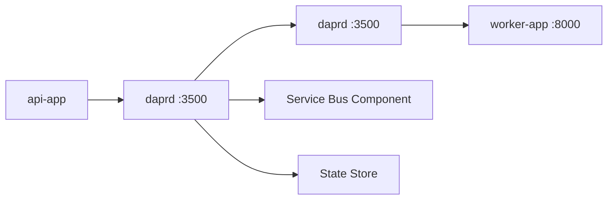

# Azure Container Apps 101 (6/7): Dapr 통합 — 사이드카로 얻는 것

Dapr는 마이크로서비스에서 반복되는 배관 작업을 많이 줄여 주지만, 아키텍처의 트레이드오프 자체를 지워 주지는 않습니다. 어디까지가 플랫폼의 몫이고 어디서부터 설계의 몫인지 보려면 App 수준 설정과 Environment 수준 component를 분리해서 봐야 합니다.

이 글은 Azure Container Apps 101 시리즈의 6번째 글입니다. 여기서는 ACA에서 사이드카가 무엇을 제공하고, 무엇은 여전히 여러분이 책임져야 하는지 살펴보겠습니다.


*Azure Container Apps 101 6장 흐름 개요*
> Dapr 통합 — 사이드카로 얻는 것의 핵심은 기능 이름이 아니라, 어떤 경계에서 무엇을 검증하고 어떤 신호를 남길지 정하는 데 있습니다.

## 먼저 던지는 질문

- Dapr가 무엇이며, 그 사이드카는 ACA 안에서 정확히 어디에 붙을까요?
- App 수준 설정과 Environment 수준 component는 왜 분리해서 봐야 할까요?
- Service invocation, Pub/Sub, State store, Secret store 네 가지 핵심 구성요소는 각각 어떤 문제를 해결할까요?

## 이 글이 답할 질문

- Dapr 사이드카는 ACA pod 안의 어디에 붙고, 앱은 어떤 엔드포인트를 호출할까요?
- App 수준의 `--enable-dapr` 설정과 Environment 수준 component가 왜 분리될까요?
- Service invocation, Pub/Sub, State store, Secret store는 각각 어떤 문제를 푸는 걸까요?
- AKS에서 Dapr를 돌릴 때와 ACA에서 돌릴 때의 결정적인 차이는 무엇일까요?
- "첫날부터 Dapr를 켜는 것"이 왜 자주 안티패턴으로 언급될까요?

## 왜 이 글이 중요한가

마이크로서비스는 늘 비슷한 문제를 다시 만납니다.
Service A가 Service B를 호출하려면 서비스 디스커버리가 필요합니다. 둘 사이에 메시지를 보내려면 브로커 SDK가 필요합니다. 상태를 저장하려면 Redis나 Cosmos DB SDK가 필요합니다.
**Dapr는 이 네 가지를 표준 HTTP/gRPC API 뒤로 추상화합니다.** 앱은 `localhost:3500`의 Dapr 사이드카에 말하고, 사이드카가 실제 백엔드(Service Bus, Redis, Key Vault 등)와 통신합니다.

ACA에서 Dapr가 특히 매력적인 이유는 **런타임 설치 비용이 0**이기 때문입니다.
Kubernetes에서는 Helm chart를 설치하고 Dapr control plane을 직접 운영해야 합니다. ACA에서는 그 control plane을 플랫폼이 관리합니다.
앱에 `--enable-dapr true`만 주면 사이드카가 자동으로 주입됩니다.

## 멘탈 모델

Dapr는 두 수준으로 보면 단순해집니다.

1. **App level** — 이 앱이 Dapr를 쓰는가? `app-id`는 무엇인가? 앱은 몇 번 포트를 듣는가?
2. **Environment level** — 이 ACA Environment는 어떤 component를 제공하는가? Service Bus를 pubsub으로 쓸 것인가? Redis를 state store로 쓸 것인가?

App 수준은 앱별 옵트인이고, Environment 수준은 공유 인프라 카탈로그입니다.
하나의 component를 Environment에 등록하면, 같은 Environment 안의 여러 앱이 scope 설정을 통해 그것을 공유할 수 있습니다.

> Dapr를 켜는 일은 이 앱이 사이드카를 쓸 것인가를 정하는 일이고, component를 등록하는 일은 이 환경이 어떤 공용 기능을 제공할 것인가를 정하는 일입니다.

## 핵심 개념

### 1. 사이드카 모델

`--enable-dapr true`를 주면 ACA는 앱 컨테이너 옆에 `daprd` 사이드카를 띄웁니다.
여러분의 코드는 비즈니스 로직만 맡고, 외부 시스템과의 통신은 사이드카가 담당합니다.

```text
┌─────────────────────────────────────┐
│  Container App: api-app             │
│  ┌──────────────┐  ┌─────────────┐  │
│  │ Your code    │  │ Dapr        │  │
│  │ FastAPI      │◄─┤ sidecar     │──┼──► Service Bus
│  │ :8000        │  │ :3500       │  │    Redis
│  └──────────────┘  └─────────────┘  │    Key Vault
└─────────────────────────────────────┘
```

### 2. 네 가지 핵심 구성요소

| Building block | 역할 | ACA에서 흔한 백엔드 |
| --- | --- | --- |
| **Service invocation** | 앱 간 호출(service discovery + retry + mTLS) | 다른 Container App(`app-id` 기준) |
| **Pub/Sub** | publish/subscribe 메시징 | Azure Service Bus, Event Hubs, Kafka |
| **State store** | key-value 상태 저장 | Cosmos DB, Redis, PostgreSQL |
| **Secret store** | secret 조회 추상화 | Azure Key Vault, ACA secrets |

### 3. Component와 scope

Component YAML은 "이 이름으로 이 백엔드를 사용한다"고 정의하는 문서입니다.
`scopes:` 필드는 어떤 `app-id`가 그 component에 접근할 수 있는지 명시적으로 제한합니다.
비워 두면 Environment 안의 모든 앱이 사용할 수 있습니다. 프로덕션에서는 항상 명시적으로 넣는 편이 좋습니다.

## 적용 전후 비교
### Before (SDK를 직접 호출하는 경우)

```python
# Service Bus SDK 직접
from azure.servicebus import ServiceBusClient, ServiceBusMessage

connection_str = os.environ["SERVICE_BUS_CONNECTION_STRING"]
with ServiceBusClient.from_connection_string(connection_str) as client:
    sender = client.get_queue_sender(queue_name="orders")
    sender.send_messages(ServiceBusMessage("order-123"))
```

백엔드를 Service Bus에서 Kafka로 바꾸면 SDK, 의존성, 코드까지 모두 바뀝니다.

### 적용 후(Dapr Pub/Sub API)

```python
import requests

requests.post(
    "http://localhost:3500/v1.0/publish/orderpubsub/orders",
    json={"orderId": "order-123"}
)
```

백엔드를 바꿔도 코드가 아니라 component YAML만 바꾸면 됩니다.

## 단계별 실습

### 단계 1: 앱에 Dapr 켜기

```bash
RG=rg-aca-demo
ACA_ENV=aca-env-demo
IMAGE=myacr.azurecr.io/api-app:latest

az containerapp create \
  --name api-app --resource-group $RG --environment $ACA_ENV \
  --image $IMAGE --ingress external --target-port 8000 \
  --enable-dapr true \
  --dapr-app-id api-app \
  --dapr-app-port 8000
```

기존 앱이라면 다음처럼 켤 수도 있습니다.

```bash
az containerapp dapr enable \
  --name api-app --resource-group $RG \
  --dapr-app-id api-app --dapr-app-port 8000
```

### 단계 2: Pub/Sub component 등록하기(Service Bus)

`pubsub.yaml`:

```yaml
componentType: pubsub.azure.servicebus.queues
version: v1
metadata:
  - name: namespaceName
    value: mybus.servicebus.windows.net
  - name: connectionString
    secretRef: servicebus-connection-string
secrets:
  - name: servicebus-connection-string
    value: "<SERVICE_BUS_CONNECTION_STRING>"
scopes:
  - api-app
  - worker-app
```

```bash
az containerapp env dapr-component set \
  --name $ACA_ENV --resource-group $RG \
  --dapr-component-name orderpubsub \
  --yaml pubsub.yaml
```

### 단계 3: 앱에서 호출하기

```python
import requests

# Publish
requests.post(
    "http://localhost:3500/v1.0/publish/orderpubsub/orders",
    json={"orderId": "order-123"}
)

# 다른 앱 호출(서비스 호출)
requests.post(
    "http://localhost:3500/v1.0/invoke/worker-app/method/process",
    json={"orderId": "order-123"}
)
```

## 자주 하는 실수

- 앱 수준 enable과 environment 수준 component를 혼동하는 것 — `--enable-dapr`만 켜고 component를 등록하지 않으면 사이드카는 뜨지만 publish는 모두 실패합니다.
- scope를 비워 두는 것 — 모든 앱이 모든 component에 접근하게 되어 보안 경계가 흐려집니다.
- secret 값을 inline으로 넣는 것 — connection string을 component YAML에 평문으로 넣으면 안 됩니다. `secretRef` + `secrets:` 블록 또는 Key Vault secret store를 써야 합니다.
- `dapr-app-port`를 빼먹는 것 — 들어오는 service invocation을 어디로 포워딩해야 할지 몰라 502가 납니다.
- 한 앱에서 HTTP API와 gRPC API를 섞어 쓰는 것 — Dapr는 둘 다 지원하지만, 혼용하면 트러블슈팅이 복잡해집니다.

## 프로덕션에서는 이렇게 본다

Dapr를 써야 할 때와 건너뛸 때는 대개 아래처럼 나뉩니다.

- 쓸 가치가 있는 경우: 마이크로서비스가 3개 이상이고, pub/sub와 service invocation이 모두 필요하며, 나중에 백엔드를 바꿀 가능성도 있습니다.
- 건너뛰는 편이 나은 경우: 단일 모놀리식 API와 DB 하나뿐인 구조입니다. SDK 호출이 한두 줄이면, 추상화가 줄여 주는 것보다 늘리는 복잡도가 더 큽니다.
- 프로덕션 체크리스트: managed identity 인증으로 전환하고, 명시적인 scope를 넣고, retry policy를 구성하고, Dapr telemetry를 Application Insights에 연결합니다.

ACA는 Dapr 버전을 플랫폼 차원에서 관리합니다. 메이저 업그레이드가 있을 때는 breaking change가 없는지 release note를 확인해야 합니다.

## Dapr 실전 예시 — Invocation, Pub/Sub, State

Dapr를 도입할 때는 한 번에 모든 building block을 켜기보다, 호출 경로와 오류 처리 규칙이 분명한 것부터 시작하는 편이 안전합니다.

### 서비스 호출 아키텍처



*Dapr 사이드카 간 호출과 백엔드 연결*

### Service invocation 예시(FastAPI)

```python
import requests

def call_worker(order_id: str) -> dict:
    resp = requests.post(
        "http://localhost:3500/v1.0/invoke/worker-app/method/process",
        json={"orderId": order_id},
        timeout=3,
    )
    resp.raise_for_status()
    return resp.json()
```

### State store 읽기/쓰기 예시

```python
import requests

def save_state(key: str, value: dict) -> None:
    requests.post(
        "http://localhost:3500/v1.0/state/orderstate",
        json=[{"key": key, "value": value}],
        timeout=3,
    ).raise_for_status()

def load_state(key: str) -> dict:
    r = requests.get(f"http://localhost:3500/v1.0/state/orderstate/{key}", timeout=3)
    if r.status_code == 204:
        return {}
    r.raise_for_status()
    return r.json()
```

### Component 배포 CLI 출력 확인

```bash
az containerapp env dapr-component list --name $ACA_ENV --resource-group $RG --output table
```

예상 출력:

```text
Name         ComponentType                     Scopes
-----------  --------------------------------  -------------------
orderpubsub  pubsub.azure.servicebus.queues    api-app,worker-app
orderstate   state.redis                       api-app,worker-app
```

### 오류 시나리오

- scope 누락: 특정 앱에서 `ERR_STATE_STORE_NOT_CONFIGURED` 발생
- secretRef 오타: component는 등록되지만 호출 시 인증 실패
- app-id 불일치: invocation URL은 404를 반환

이 오류는 대부분 IaC 검토 단계에서 잡을 수 있습니다. component 이름, scope, secretRef를 리뷰 체크리스트에 고정하면 런타임 장애를 크게 줄일 수 있습니다.

## 보안과 신뢰성 — Dapr 도입 시 필수 점검

Dapr는 개발 속도를 올려 주지만, 컴포넌트 경계가 늘어나므로 보안 점검 항목도 함께 늘어납니다.

### 권장 보안 구성

- component secret은 Key Vault 기반 secret store로 이동
- scopes를 앱 단위 최소 권한으로 제한
- 재시도 정책과 타임아웃을 명시
- dead-letter 경로를 메시지 시스템 쪽에서 준비

### Component 예시(Secret store + Pub/Sub)

```yaml
componentType: secretstores.azure.keyvault
version: v1
metadata:
  - name: vaultName
    value: my-kv
scopes:
  - api-app
  - worker-app
```

```yaml
componentType: pubsub.azure.servicebus.queues
version: v1
metadata:
  - name: namespaceName
    value: mybus.servicebus.windows.net
  - name: connectionString
    secretRef: sb-conn
secrets:
  - name: sb-conn
    value: "<REDACTED>"
scopes:
  - api-app
  - worker-app
```

### 실패 복원 시나리오

- pub/sub publish 실패 시: 앱은 로컬 재시도 후 실패 이벤트를 별도 저장
- invocation timeout 시: idempotency key를 포함해 재호출
- state write 충돌 시: ETag 기반 낙관적 동시성 사용

### 운영 확인 명령

```bash
az containerapp env dapr-component list --name $ACA_ENV --resource-group $RG -o json
az containerapp logs show --name api-app --resource-group $RG --follow
```

로그에서 `ERR_` 패턴을 초기에 수집해 분류하면, 도입 초기 장애를 빠르게 패턴화할 수 있습니다.

### 도입 순서 권장안

1. service invocation만 먼저 적용
2. pub/sub 추가
3. state store 추가
4. secret store와 정책 고도화

이 순서는 디버깅 범위를 단계적으로 넓혀 줍니다. 처음부터 네 가지를 동시에 넣으면 장애 원인 분리가 매우 어려워집니다.

## 실전 FAQ

### Q1. 포털에서는 정상인데 실제 응답은 불안정한 이유는 무엇일까요?

포털의 Provisioning 성공은 control plane 기준 신호입니다. 실제 사용자 품질은 data plane에서 결정됩니다. 따라서 항상 FQDN 호출 결과, revision health, system log를 함께 봐야 합니다. 운영 체크는 "설정이 저장됐는가"가 아니라 "요청이 안정적으로 처리되는가"로 마무리해야 합니다.

### Q2. `latest` 태그를 쓰면 왜 문제가 될까요?

`latest`는 사람이 보기에는 편하지만 감사/롤백/재현성에 모두 불리합니다. 같은 태그가 다른 이미지를 가리킬 수 있기 때문입니다. 프로덕션에서는 `v1.2.3` 또는 commit SHA처럼 불변 태그를 사용해야 합니다.

### Q3. 스케일과 배포를 동시에 바꾸면 어떤 위험이 있나요?

문제 원인 분리가 어려워집니다. 예를 들어 새 이미지와 새 스케일 규칙을 동시에 올리면 오류가 코드 문제인지 스케일 정책 문제인지 즉시 구분하기 어렵습니다. 안전한 팀은 배포와 스케일 변경을 분리하고, 각 변경마다 관측 지표를 따로 확인합니다.

### Q4. 멀티 서비스에서 네이밍 규칙은 어느 정도로 엄격해야 하나요?

매우 엄격해야 합니다. `orders-api--v12`처럼 서비스명과 revision suffix 패턴을 고정하면 로그, 알림, 런북 자동화가 쉬워집니다. 네이밍이 흔들리면 같은 쿼리를 서비스마다 다르게 써야 하고, 온콜 대응 속도가 느려집니다.

### Q5. 운영 문서에는 최소 무엇이 들어가야 하나요?

- 생성/변경 명령
- 예상 출력
- 실패 시 증상
- 확인할 로그 위치
- 즉시 복구 명령

이 다섯 가지를 글과 저장소 문서에 같이 유지하면, 팀 내 경험 차이가 있어도 대응 품질이 크게 흔들리지 않습니다.

## 참고용 명령 모음

```bash
# 앱 목록
az containerapp list --resource-group $RG -o table

# 단일 앱 상세
az containerapp show --name $APP --resource-group $RG -o json

# revision 목록
az containerapp revision list --name $APP --resource-group $RG -o table

# 트래픽 가중치
az containerapp ingress traffic show --name $APP --resource-group $RG -o table

# 최근 로그
az containerapp logs show --name $APP --resource-group $RG --tail 100
```

운영에서 중요한 것은 명령의 개수가 아니라 실행 순서입니다. 앱 상세 → revision 상태 → 트래픽 가중치 → 로그 순서로 보면 대부분의 이슈를 짧은 시간에 분류할 수 있습니다.

Dapr를 도입하면 애플리케이션 코드는 단순해지지만, 런타임 관찰 포인트는 늘어납니다. 앱 로그, 사이드카 로그, 백엔드 서비스 상태를 함께 봐야 하므로 관측 대시보드를 미리 구성해 두는 편이 좋습니다.

또한 Dapr를 쓰는 서비스와 쓰지 않는 서비스를 혼합 운영할 때 경계 문서가 중요합니다. 어떤 호출은 Dapr invocation으로 가고, 어떤 호출은 직접 HTTP로 가는지 일관된 규칙이 없으면 트러블슈팅이 길어집니다.

도입 초기에는 "한 기능씩" 원칙이 가장 안전합니다. invocation 안정화 후 pub/sub, 그다음 state store를 추가하면 장애 범위를 통제하기 쉽고 팀 학습도 빠르게 진행됩니다.

## 운영 메모 — 팀 합의가 필요한 항목

실제 운영에서는 기술 선택만큼 팀 합의가 중요합니다. 아래 항목은 서비스별로 값이 달라도 되지만, 같은 서비스 안에서는 반드시 고정해야 합니다.

- 배포 단위: 이미지 태그 규칙, revision suffix 규칙
- 검증 단위: healthz 통과 기준, canary 관찰 시간
- 복구 단위: 즉시 rollback 임계치, 단계적 복구 절차
- 기록 단위: 변경 이력, 영향 범위, 후속 액션

합의가 없는 상태에서는 같은 장애라도 담당자마다 전혀 다른 대응을 하게 됩니다. 반대로 합의를 문서와 자동화에 같이 넣으면, 야간 온콜에서도 대응 품질이 안정적으로 유지됩니다.

### 권장 문서 구조

1. 아키텍처 개요와 경계
2. 배포 절차와 검증 절차
3. 장애 분류와 즉시 조치
4. 모니터링 쿼리와 알림 임계치
5. 사후 분석(RCA) 템플릿

이 다섯 장이 준비되면 서비스 성숙도는 빠르게 올라갑니다. 특히 신입 엔지니어가 투입되어도 동일한 기준으로 운영할 수 있어 팀 전체의 평균 대응 시간이 짧아집니다.

## 추가 시나리오 — 점진 도입 후 무중단 전환

기존 SDK 호출 코드를 한 번에 Dapr로 바꾸기 어렵다면, 동일 기능을 두 경로로 잠시 병행한 뒤 트래픽 기반으로 전환할 수 있습니다. 예를 들어 API는 먼저 Dapr invocation 경로를 추가하고, worker는 기존 경로를 유지합니다. 이후 모니터링 지표가 안정적이면 기존 SDK 경로를 제거합니다.

이 방식은 변경 범위를 줄여 장애 가능성을 낮춥니다. 다만 병행 기간에는 로그 분류가 복잡해지므로, 요청마다 `path=legacy` 또는 `path=dapr` 같은 태그를 반드시 남겨야 분석이 가능합니다.

Dapr 전환 후에는 앱 로그에 component 이름을 함께 남기는 습관이 중요합니다. 같은 publish 실패라도 어떤 component에서 실패했는지 알 수 있어야 복구 시간이 짧아집니다. 운영 로그 스키마에 `dapr_component`, `dapr_operation` 필드를 넣어 두면 분석 속도가 크게 좋아집니다.

## 체크리스트

- [ ] `--enable-dapr true`, `--dapr-app-id`, `--dapr-app-port`를 설정했습니까?
- [ ] component YAML을 Environment에 등록했습니까?
- [ ] 각 component에 명시적인 `scopes:`를 넣었습니까?
- [ ] secret은 inline 값이 아니라 `secretRef`나 Key Vault로 관리하고 있습니까?
- [ ] Service invocation과 Pub/Sub 경로가 Application Insights에서 보입니까?
- [ ] 단일 앱 시나리오라면 Dapr가 정말 필요한지 다시 검토했습니까?

## 연습 문제

1. 같은 Environment에 `api-app`과 `worker-app`이 있지만 Service Bus pubsub component는 `api-app`만 써야 합니다. `scopes:`를 어떻게 적겠습니까?
2. Dapr service invocation과 앱 FQDN으로 직접 HTTP 호출하는 방식의 차이 세 가지를 적어 보세요.
3. state store 백엔드를 Redis에서 Cosmos DB로 바꾸고 싶습니다. 앱 코드는 얼마나 바뀔까요? 왜 그럴까요?

## 정리

- Dapr는 사이드카로 동작하며, 분산 시스템의 핵심 구성요소를 표준 API 뒤로 추상화합니다.
- App 수준 설정(enable, app-id)과 Environment 수준 component는 서로 독립적인 결정입니다.
- 네 가지 핵심 구성요소는 Service invocation, Pub/Sub, State store, Secret store입니다.
- Scope, secret 관리, retry policy는 여전히 사용자 책임입니다. Dapr가 대신 골라 주지 않습니다.

다음 글에서는 시리즈를 모니터링과 운영 주제로 마무리합니다. Log Analytics와 Application Insights를 ACA에 연결하고, 로그·메트릭·트레이스를 수집하는 방법과 운영 알림 구성을 함께 정리합니다.

---

## 처음 질문으로 돌아가기

- **Dapr가 무엇이며, 그 사이드카는 ACA 안에서 정확히 어디에 붙을까요?**
  - Dapr는 앱 컨테이너 옆에 `daprd`를 붙여 `localhost:3500` 뒤로 service invocation, pub/sub, state, secret 호출을 추상화하는 사이드카 런타임입니다. 본문 그림처럼 `FastAPI :8000` 옆에 `Dapr sidecar :3500`이 붙고, 앱 코드는 `http://localhost:3500/v1.0/publish/...`나 `/invoke/worker-app/method/process`를 호출합니다. 즉 Dapr는 앱 바깥의 별도 서비스가 아니라, 같은 Container App 안에서 앱과 함께 움직이는 실행 구성요소입니다.
- **App 수준 설정과 Environment 수준 component는 왜 분리해서 봐야 할까요?**
  - `--enable-dapr true`, `--dapr-app-id api-app`, `--dapr-app-port 8000`은 "이 앱이 사이드카를 쓸 것인가"를 정하는 App 수준 설정입니다. 반면 `az containerapp env dapr-component set --dapr-component-name orderpubsub --yaml pubsub.yaml`은 같은 Environment가 어떤 공용 backend catalog를 제공할지 정하는 Environment 수준 설정입니다. 이 둘을 나눠 봐야 "사이드카는 떴는데 publish가 실패한다" 같은 문제를 component 등록 누락으로 바로 좁힐 수 있습니다.
- **Service invocation, Pub/Sub, State store, Secret store 네 가지 핵심 구성요소는 각각 어떤 문제를 해결할까요?**
  - Service invocation은 `worker-app` 같은 다른 앱 호출을 `app-id` 기준으로 단순화하고, Pub/Sub는 `orderpubsub/orders`처럼 메시지 시스템을 표준 API 뒤로 숨깁니다. State store는 `v1.0/state/orderstate`로 key-value 저장을 추상화하고, Secret store는 Key Vault 같은 비밀 저장소를 공통 인터페이스로 연결합니다. 본문이 `scope`, `secretRef`, component 이름 검토를 강조한 이유는 결국 이 네 가지가 편의 기능이 아니라 운영 경계이기 때문입니다.

<!-- toc:begin -->
## 시리즈 목차

- [Azure Container Apps 101 (1/7): Azure Container Apps란? — Kubernetes 없이 컨테이너 운영하기](./01-what-is-aca.md)
- [Azure Container Apps 101 (2/7): Environment, Container App, Revision — ACA in three words](./02-environment-app-revision.md)
- [Azure Container Apps 101 (3/7): 첫 배포하기 — Python/FastAPI](./03-first-deploy.md)
- [Azure Container Apps 101 (4/7): Ingress와 트래픽 분할 — revision 기반 배포 전략](./04-ingress-and-traffic-split.md)
- [Azure Container Apps 101 (5/7): 스케일링 — KEDA scaler와 zero-to-N](./05-scaling-with-keda.md)
- **Azure Container Apps 101 (6/7): Dapr 통합 — 사이드카로 얻는 것 (현재 글)**
- Azure Container Apps 101 (7/7): 모니터링과 운영 — Log Analytics와 Application Insights (예정)

<!-- toc:end -->

---

## 참고 자료

### 공식 문서

- [Configure Dapr on an Existing Container App — Microsoft Learn](https://learn.microsoft.com/en-us/azure/container-apps/enable-dapr)
- [Microservice APIs powered by Dapr — Microsoft Learn](https://learn.microsoft.com/en-us/azure/container-apps/dapr-overview)
- [Dapr Components in Azure Container Apps — Microsoft Learn](https://learn.microsoft.com/en-us/azure/container-apps/dapr-components)
- [Dapr overview](https://docs.dapr.io/concepts/overview/)

### 관련 시리즈

- [Azure App Service 101](../../azure-app-service-101/ko/01-what-is-app-service.md)
- [Azure AKS 101](../../azure-aks-101/ko/01-what-is-aks.md)
- [Azure Functions 101](../../azure-functions-101/ko/01-what-is-azure-functions.md)

- [이 글의 예제 코드 (book-examples)](https://github.com/yeongseon-books/book-examples/tree/main/azure-aca-101/ko/06-dapr-integration)

Tags: Azure, Container Apps, Serverless, Containers
