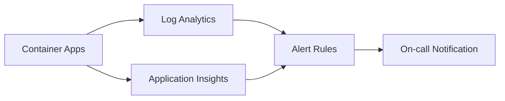

# Azure Container Apps 101 (7/7): 모니터링과 운영 — Log Analytics와 Application Insights

운영 사고에서 어려운 지점은 데이터가 있느냐보다, 어느 계층이 답을 가지고 있느냐를 아는 일입니다. ACA는 로그, 트레이스, 메트릭을 서로 다른 시스템에 나눠 두고, 그 경계를 이해하느냐가 프로덕션 문제를 얼마나 빨리 진단하는지를 좌우합니다.

이 글은 Azure Container Apps 101 시리즈의 마지막 글입니다. 여기서는 Log Analytics와 Application Insights를 중심으로 그 계층을 지도처럼 정리하겠습니다.


*Azure Container Apps 101 7장 흐름 개요*
> 모니터링과 운영 — Log Analytics와 Application Insights의 핵심은 기능 이름이 아니라, 어떤 경계에서 무엇을 검증하고 어떤 신호를 남길지 정하는 데 있습니다.

## 먼저 던지는 질문

- ACA 관측성은 어떤 계층 구조로 나뉠까요?
- `ContainerAppConsoleLogs_CL`와 `ContainerAppSystemLogs_CL`는 무엇이 다를까요?
- Log Analytics에서 Revision 기준으로 로그를 묶는 KQL 쿼리는 어떻게 작성할까요?

## 이 글이 답할 질문

- ACA 관측성은 어떤 세 계층으로 나뉘고, 각 계층은 무엇을 책임질까요?
- `ContainerAppConsoleLogs_CL`는 무엇을 담고, `ContainerAppSystemLogs_CL`는 무엇을 담을까요?
- Log Analytics에서 Revision 기준으로 로그를 묶는 KQL은 어떻게 쓸까요?
- OpenTelemetry를 통해 FastAPI 앱을 Application Insights에 연결하는 가장 짧은 경로는 무엇일까요?
- ACA가 기본으로 주는 관측성과, 앱이 직접 계측해야 하는 관측성의 경계는 어디일까요?

## 왜 이 글이 중요한가

프로덕션 ACA 앱이 5xx를 뿜기 시작했다고 가정해 보겠습니다.
첫 번째 질문은 "어느 revision에서 생겼지?"입니다. 이 답은 Log Analytics의 `RevisionName_s`가 줍니다.
두 번째 질문은 "어느 dependency가 느려졌지?"입니다. 이 답은 Application Insights의 분산 트레이스가 줍니다.
세 번째 질문은 "replica가 몇 개까지 늘었지?"입니다. 이 답은 Azure Monitor 메트릭이 줍니다.

**ACA가 첫 번째 질문의 답은 기본으로 제공합니다.** 두 번째와 세 번째는 앱 계측이나 명시적인 Diagnostic Settings가 있어야 얻을 수 있습니다.
이 경계를 놓치면 사고 중에 "왜 trace가 안 보이지?"를 한 시간씩 묻게 됩니다.

## 멘탈 모델

ACA 관측성은 세 개의 독립된 계층으로 나뉩니다.

1. **Platform layer (Log Analytics)** — ACA가 자동으로 내보냅니다. 컨테이너 stdout/stderr와 시스템 이벤트입니다.
2. **Application layer (Application Insights)** — SDK나 OpenTelemetry를 통해 앱 코드가 직접 내보냅니다. 분산 트레이스, custom metrics, dependency map이 여기에 있습니다.
3. **Sidecar layer (Dapr telemetry)** — Dapr를 쓸 때만 의미가 있습니다. `--dapr-connection-string`은 일반 앱 트레이싱이 아니라 이 계층 설정입니다.

세 계층은 같은 Application Insights 인스턴스로 모일 수도 있고 따로 남을 수도 있습니다.
중요한 규율은 항상 "이 신호는 어느 계층에서 왔는가?"를 아는 것입니다.

> 관측성에서 가장 먼저 할 일은 데이터를 더 모으는 것이 아니라, 지금 보고 있는 신호가 플랫폼 로그인지, 앱 트레이스인지, 사이드카 텔레메트리인지 먼저 구분하는 일입니다.

## 핵심 개념

### 1. 두 개의 플랫폼 로그 테이블

| Table | 내용 | 주된 용도 |
| --- | --- | --- |
| `ContainerAppConsoleLogs_CL` | 컨테이너 stdout/stderr | 앱 동작, 비즈니스 로그 추적 |
| `ContainerAppSystemLogs_CL` | ACA 플랫폼 이벤트(스케일링, revision 변경, probe 실패 등) | 플랫폼 결정 추적 |

`_CL` 접미사는 "Custom Log"를 뜻합니다. 두 테이블은 모두 Log Analytics workspace에 들어가고, KQL로 조회합니다.

### 2. Revision이 가장 강한 그룹 키

ACA는 모든 로그 행에 `RevisionName_s`를 채워 줍니다.
사고가 났을 때 첫 쿼리는 거의 항상 "어느 revision에서 에러가 치솟았는가?"입니다.

### 3. Application Insights로 가는 두 경로

- **App-level instrumentation** — `APPLICATIONINSIGHTS_CONNECTION_STRING`을 주입하고 OpenTelemetry SDK로 export합니다.
- **Dapr telemetry** — `az containerapp env update --dapr-instrumentation-key`를 설정해 사이드카가 자체 telemetry를 내보내게 합니다. 앱 코드 트레이스와는 독립적입니다.

## 적용 전후 비교
### Before (관측성이 없는 경우)

```bash
az containerapp create \
  --name fastapi-aca-demo --resource-group $RG --environment $ACA_ENV \
  --image $IMAGE --ingress external --target-port 8000
```

사고가 나면:
- "5xx가 어디서 나는 거지?" → SSH도 없고 디버깅도 어렵습니다
- 컨테이너 재시작이 한 번만 일어나도 stdout 기록이 사라집니다

### After (Log Analytics + App Insights를 연결한 경우)

```bash
# 1. Connect a Log Analytics workspace when creating the Environment
az containerapp env create \
  --name $ACA_ENV --resource-group $RG --location koreacentral \
  --logs-workspace-id $LOG_WORKSPACE_ID \
  --logs-workspace-key $LOG_WORKSPACE_KEY

# 2. Inject the App Insights connection string
az containerapp create \
  --name fastapi-aca-demo --resource-group $RG --environment $ACA_ENV \
  --image $IMAGE --ingress external --target-port 8000 \
  --env-vars "APPLICATIONINSIGHTS_CONNECTION_STRING=$AI_CONN"
```

사고가 나면:
- KQL 한 줄로 revision별 에러 수를 볼 수 있습니다
- App Insights가 trace, dependency, exception을 자동 수집합니다

## 단계별 실습

### 단계 1: Log Analytics workspace 만들기

```bash
RG=rg-aca-demo
LOG_WS=aca-logs

az monitor log-analytics workspace create \
  --resource-group $RG --workspace-name $LOG_WS

LOG_WORKSPACE_ID=$(az monitor log-analytics workspace show \
  --resource-group $RG --workspace-name $LOG_WS \
  --query customerId -o tsv)

LOG_WORKSPACE_KEY=$(az monitor log-analytics workspace get-shared-keys \
  --resource-group $RG --workspace-name $LOG_WS \
  --query primarySharedKey -o tsv)
```

### 단계 2: ACA Environment에 연결하기

```bash
az containerapp env create \
  --name aca-env-demo --resource-group $RG --location koreacentral \
  --logs-workspace-id $LOG_WORKSPACE_ID \
  --logs-workspace-key $LOG_WORKSPACE_KEY
```

### 단계 3: KQL로 조회하기

Azure Portal → Log Analytics workspace → Logs에서 아래를 실행합니다.

```kusto
// Most recent 100 console logs
ContainerAppConsoleLogs_CL
| where ContainerAppName_s == "fastapi-aca-demo"
| project Time=TimeGenerated, Revision=RevisionName_s, Message=Log_s
| top 100 by Time desc

// Errors per revision
ContainerAppConsoleLogs_CL
| where ContainerAppName_s == "fastapi-aca-demo"
| where Log_s contains "ERROR"
| summarize ErrorCount=count() by RevisionName_s
| order by ErrorCount desc

// Scaling events
ContainerAppSystemLogs_CL
| where ContainerAppName_s == "fastapi-aca-demo"
| where Log_s contains "Scal"
| project Time=TimeGenerated, Message=Log_s
| top 50 by Time desc
```

### 단계 4: Application Insights 연결하기(FastAPI)

```bash
AI_NAME=aca-appinsights
az monitor app-insights component create \
  --app $AI_NAME --location koreacentral --resource-group $RG \
  --workspace $LOG_WORKSPACE_ID

AI_CONN=$(az monitor app-insights component show \
  --app $AI_NAME --resource-group $RG --query connectionString -o tsv)

az containerapp update \
  --name fastapi-aca-demo --resource-group $RG \
  --set-env-vars "APPLICATIONINSIGHTS_CONNECTION_STRING=$AI_CONN"
```

FastAPI 앱 코드는 다음과 같습니다.

```python
from azure.monitor.opentelemetry import configure_azure_monitor
from fastapi import FastAPI

configure_azure_monitor()  # Auto-detects APPLICATIONINSIGHTS_CONNECTION_STRING
app = FastAPI()

@app.get("/")
def root():
    return {"status": "ok"}
```

`requirements.txt`에 `azure-monitor-opentelemetry`를 추가하면 trace, request, dependency가 자동 수집됩니다.

## 자주 하는 실수

- **Environment에 Log Analytics를 연결하지 않는 것** — 로그가 ACA 포털 블레이드에는 보여도 KQL에서는 바로 보이지 않습니다.
- **App Insights connection string을 평문 env-var로 두는 것** — 프로덕션에서는 `--secrets`로 보호해야 합니다.
- **App Insights가 trace를 자동 수집한다고 생각하는 것** — connection string만 주입해서는 충분하지 않습니다. 앱이 OpenTelemetry SDK로 export해야 합니다.
- **Dapr telemetry와 앱 telemetry를 혼동하는 것** — `--dapr-instrumentation-key`는 사이드카 전용입니다.
- **로그 보존 기간을 기본값으로 방치하는 것** — Log Analytics 기본 보존 기간은 30일입니다. 규정상 더 길어야 할 수 있습니다.

## 프로덕션에서는 이렇게 본다

프로덕션 체크리스트는 대개 아래와 같습니다.

- Diagnostic Settings 활성화 — Log Analytics와 Storage Account를 함께 연결해 장기 보존을 확보합니다.
- 알림 규칙 구성 — 예: "특정 revision의 5xx 비율 > 5%" 같은 KQL 기반 알림.
- Workbook 구성 — revision별 지연 시간, 에러율, replica 수를 한 화면에 모읍니다.
- 비용 관리 — App Insights는 수집량 기준 과금이므로 sampling 비율을 조정합니다.
- OpenTelemetry 표준화 — OTel SDK + Azure Monitor exporter 조합이 벤더 종속 SDK보다 이식성이 좋습니다.

## 운영 런북 — 장애 탐지부터 복구까지

관측성 도구를 붙이는 것과 운영 가능한 상태는 다릅니다. 운영 가능한 상태는 "어떤 경보가 울리면 어떤 명령으로 무엇을 확인할지"가 정리되어 있을 때 만들어집니다.

### 장애 대응 아키텍처



*로그, 트레이스, 알림의 연결 경로*

### KQL 운영 쿼리 모음

```kusto
// 최근 15분 revision별 5xx 비율
let total = ContainerAppConsoleLogs_CL
| where TimeGenerated > ago(15m)
| where ContainerAppName_s == "fastapi-aca-demo"
| summarize total=count() by RevisionName_s;
let errors = ContainerAppConsoleLogs_CL
| where TimeGenerated > ago(15m)
| where ContainerAppName_s == "fastapi-aca-demo"
| where Log_s contains " 5"
| summarize err=count() by RevisionName_s;
total
| join kind=leftouter errors on RevisionName_s
| extend err = coalesce(err, 0), errorRate = todouble(err) / todouble(total)
| order by errorRate desc
```

```kusto
// 시스템 로그에서 스케일 이벤트 추출
ContainerAppSystemLogs_CL
| where TimeGenerated > ago(30m)
| where ContainerAppName_s == "fastapi-aca-demo"
| where Log_s has_any ("scale", "replica", "probe")
| project TimeGenerated, RevisionName_s, Log_s
| order by TimeGenerated desc
```

### az CLI로 즉시 점검

```bash
# 최신 revision과 트래픽
az containerapp show --name fastapi-aca-demo --resource-group $RG \
  --query "{latest:properties.latestRevisionName,traffic:properties.configuration.ingress.traffic}" -o json

# revision health
az containerapp revision list --name fastapi-aca-demo --resource-group $RG \
  --query "[].{name:name,active:properties.active,health:properties.healthState}" -o table
```

### 복구 플레이북 예시

1. 경보 수신: `revision v5 errorRate > 5%`
2. 트래픽 복귀: `v4=100, v5=0`
3. 시스템 로그에서 probe 실패 여부 확인
4. App Insights에서 dependency 지연 확인
5. RCA 문서에 revision, 이미지 태그, 시작 시각 기록

복구는 기술 동작뿐 아니라 기록 동작까지 포함해야 합니다. 기록이 없으면 같은 장애가 같은 방식으로 반복됩니다.

### ARM Diagnostic Settings 예시

```json
{
  "type": "Microsoft.Insights/diagnosticSettings",
  "apiVersion": "2021-05-01-preview",
  "name": "aca-diagnostics",
  "properties": {
    "workspaceId": "/subscriptions/<sub>/resourceGroups/<rg>/providers/Microsoft.OperationalInsights/workspaces/aca-logs",
    "logs": [
      { "category": "ContainerAppConsoleLogs", "enabled": true },
      { "category": "ContainerAppSystemLogs", "enabled": true }
    ],
    "metrics": [
      { "category": "AllMetrics", "enabled": true }
    ]
  }
}
```

Diagnostic Settings를 IaC에 넣어 두면 신규 환경에서도 로그 누락 없이 동일한 운영 기준을 유지할 수 있습니다.

## SLO 운영 — 수집에서 의사결정까지

관측성의 목표는 대시보드가 아니라 결정입니다. 결정 기준이 없으면 로그와 메트릭은 늘어도 복구 속도는 개선되지 않습니다.

### SLI/SLO 예시

- 가용성 SLI: 성공 응답 비율
- 지연 SLI: p95 응답 시간
- 스케일 SLI: 스케일 이벤트 후 안정화 시간

예시 SLO:

- 월간 성공률 99.9% 이상
- p95 400ms 이하
- 버스트 이후 3분 내 목표 replica 도달

### 알림 구성 예시

```text
Alert A: revision별 5xx 비율 > 2% (5분)
Alert B: p95 latency > 600ms (10분)
Alert C: system log probe 실패 연속 3회
```

### 온콜 초기 10분 체크리스트

1. 현재 트래픽이 어느 revision으로 가는지 확인
2. 해당 revision healthState 확인
3. system log에서 스케일/프로브 오류 검색
4. app insights에서 dependency 병목 확인
5. 필요 시 즉시 rollback

### 운영 보고 템플릿

- Incident ID
- 감지 시각
- 영향 범위(요청 수, 사용자)
- 임시 조치(rollback/scale 변경)
- 근본 원인
- 재발 방지 액션

### 장기 보존 전략

Log Analytics 기본 보존만으로는 감사 요구를 충족하지 못하는 경우가 많습니다. Diagnostic Settings로 Storage Account 보관을 병행하면 감사 추적, 보안 분석, 장기 트렌드 분석이 수월해집니다.

### 결론

운영 성숙도는 도구 개수로 올라가지 않습니다. 같은 도구라도 "어떤 임계치를 넘으면 어떤 조치를 할지"가 명확할수록 팀의 MTTR이 짧아집니다. ACA에서는 revision 단위 신호가 강력하므로, 모든 경보와 런북을 revision 중심으로 정렬하는 것이 가장 실용적입니다.

## 실전 FAQ

### Q1. 포털에서는 정상인데 실제 응답은 불안정한 이유는 무엇일까요?

포털의 Provisioning 성공은 control plane 기준 신호입니다. 실제 사용자 품질은 data plane에서 결정됩니다. 따라서 항상 FQDN 호출 결과, revision health, system log를 함께 봐야 합니다. 운영 체크는 "설정이 저장됐는가"가 아니라 "요청이 안정적으로 처리되는가"로 마무리해야 합니다.

### Q2. `latest` 태그를 쓰면 왜 문제가 될까요?

`latest`는 사람이 보기에는 편하지만 감사/롤백/재현성에 모두 불리합니다. 같은 태그가 다른 이미지를 가리킬 수 있기 때문입니다. 프로덕션에서는 `v1.2.3` 또는 commit SHA처럼 불변 태그를 사용해야 합니다.

### Q3. 스케일과 배포를 동시에 바꾸면 어떤 위험이 있나요?

문제 원인 분리가 어려워집니다. 예를 들어 새 이미지와 새 스케일 규칙을 동시에 올리면 오류가 코드 문제인지 스케일 정책 문제인지 즉시 구분하기 어렵습니다. 안전한 팀은 배포와 스케일 변경을 분리하고, 각 변경마다 관측 지표를 따로 확인합니다.

### Q4. 멀티 서비스에서 네이밍 규칙은 어느 정도로 엄격해야 하나요?

매우 엄격해야 합니다. `orders-api--v12`처럼 서비스명과 revision suffix 패턴을 고정하면 로그, 알림, 런북 자동화가 쉬워집니다. 네이밍이 흔들리면 같은 쿼리를 서비스마다 다르게 써야 하고, 온콜 대응 속도가 느려집니다.

### Q5. 운영 문서에는 최소 무엇이 들어가야 하나요?

- 생성/변경 명령
- 예상 출력
- 실패 시 증상
- 확인할 로그 위치
- 즉시 복구 명령

이 다섯 가지를 글과 저장소 문서에 같이 유지하면, 팀 내 경험 차이가 있어도 대응 품질이 크게 흔들리지 않습니다.

## 참고용 명령 모음

```bash
# 앱 목록
az containerapp list --resource-group $RG -o table

# 단일 앱 상세
az containerapp show --name $APP --resource-group $RG -o json

# revision 목록
az containerapp revision list --name $APP --resource-group $RG -o table

# 트래픽 가중치
az containerapp ingress traffic show --name $APP --resource-group $RG -o table

# 최근 로그
az containerapp logs show --name $APP --resource-group $RG --tail 100
```

운영에서 중요한 것은 명령의 개수가 아니라 실행 순서입니다. 앱 상세 → revision 상태 → 트래픽 가중치 → 로그 순서로 보면 대부분의 이슈를 짧은 시간에 분류할 수 있습니다.

운영 데이터가 충분해도 대응이 느린 팀의 공통점은 "판단 기준 부재"입니다. 같은 그래프를 봐도 누군가는 문제라고 하고 누군가는 정상이라고 말하면 조치가 늦어집니다. 그래서 SLO와 경보 임계치를 숫자로 합의해 두는 일이 필수입니다.

또한 사고 후에는 기술 조치만 기록하지 말고 의사결정 기록도 남겨야 합니다. 왜 rollback을 선택했는지, 왜 scale-out을 먼저 했는지 같은 맥락이 남아야 다음 사고에서 같은 토론을 반복하지 않습니다.

ACA에서는 revision 단위로 신호가 정리되므로, 알림과 런북을 revision 중심으로 설계하면 MTTR을 눈에 띄게 줄일 수 있습니다.

## 운영 메모 — 팀 합의가 필요한 항목

실제 운영에서는 기술 선택만큼 팀 합의가 중요합니다. 아래 항목은 서비스별로 값이 달라도 되지만, 같은 서비스 안에서는 반드시 고정해야 합니다.

- 배포 단위: 이미지 태그 규칙, revision suffix 규칙
- 검증 단위: healthz 통과 기준, canary 관찰 시간
- 복구 단위: 즉시 rollback 임계치, 단계적 복구 절차
- 기록 단위: 변경 이력, 영향 범위, 후속 액션

합의가 없는 상태에서는 같은 장애라도 담당자마다 전혀 다른 대응을 하게 됩니다. 반대로 합의를 문서와 자동화에 같이 넣으면, 야간 온콜에서도 대응 품질이 안정적으로 유지됩니다.

### 권장 문서 구조

1. 아키텍처 개요와 경계
2. 배포 절차와 검증 절차
3. 장애 분류와 즉시 조치
4. 모니터링 쿼리와 알림 임계치
5. 사후 분석(RCA) 템플릿

이 다섯 장이 준비되면 서비스 성숙도는 빠르게 올라갑니다. 특히 신입 엔지니어가 투입되어도 동일한 기준으로 운영할 수 있어 팀 전체의 평균 대응 시간이 짧아집니다.

## 체크리스트

- [ ] ACA Environment가 Log Analytics workspace에 연결돼 있습니까?
- [ ] `ContainerAppConsoleLogs_CL`와 `ContainerAppSystemLogs_CL` 모두 데이터가 들어오고 있습니까?
- [ ] App Insights connection string을 secret으로 관리하고 있습니까?
- [ ] FastAPI 앱이 OpenTelemetry로 trace를 export하고 있습니까?
- [ ] revision 기준으로 에러를 묶는 KQL 알림이 있습니까?
- [ ] 로그 보존 기간이 규정 요구사항과 맞습니까?

## 연습 문제

1. 새 revision 배포 직후 5xx 비율이 급증했습니다. 이전 revision과 현재 revision의 에러율을 비교하는 KQL을 직접 작성해 보세요.
2. App Insights connection string을 평문 env-var로 노출하는 것과 secret으로 주입하는 것의 차이는 무엇일까요?
3. 평범한 FastAPI 앱(Dapr 없음)이라면 `--dapr-instrumentation-key`를 설정해야 할까요? 왜 그럴까요?

## 정리

- ACA 관측성은 platform / application / sidecar 세 계층으로 나뉩니다.
- Log Analytics는 `_CL` 테이블에 console log와 system log를 자동으로 수집합니다.
- Application Insights는 앱이 OpenTelemetry로 export할 때 비로소 의미가 생깁니다.
- 사고 초기 대응에서는 Revision이 가장 강한 그룹 키입니다.

이것으로 **Azure Container Apps 101 시리즈 7편**을 모두 마칩니다.
1화에서는 개념을, 2화에서는 구조를, 3화에서는 첫 배포를, 4화에서는 트래픽 분할을, 5화에서는 스케일링을, 6화에서는 Dapr 통합을, 그리고 이번 글에서는 관측성을 정리했습니다.

다음 단계로는 **Azure App Service 101**, **Azure AKS 101**, **Azure Functions 101**과 같은 방식으로 비교해 보면서 서버리스 컨테이너 플랫폼의 트레이드오프를 입체적으로 보는 것이 좋습니다.

---

## 처음 질문으로 돌아가기

- **ACA 관측성은 어떤 계층 구조로 나뉠까요?**
  - 본문의 기준은 모니터링과 운영 — Log Analytics와 Application Insights를 한 덩어리 개념으로 보지 않고 입력, 처리, 검증, 운영 신호가 만나는 경계로 나누어 확인하는 것입니다.
- **`ContainerAppConsoleLogs_CL`와 `ContainerAppSystemLogs_CL`는 무엇이 다를까요?**
  - 예제와 그림에서는 어떤 값이 들어오고, 어느 단계에서 바뀌며, 어떤 기준으로 통과 또는 실패하는지를 먼저 확인해야 합니다.
- **Log Analytics에서 Revision 기준으로 로그를 묶는 KQL 쿼리는 어떻게 작성할까요?**
  - 운영에서는 이 판단을 체크리스트, 로그, 테스트로 남겨 다음 변경에서도 같은 실패가 반복되지 않게 막아야 합니다.

<!-- toc:begin -->
## 시리즈 목차

- [Azure Container Apps 101 (1/7): Azure Container Apps란? — Kubernetes 없이 컨테이너 운영하기](./01-what-is-aca.md)
- [Azure Container Apps 101 (2/7): Environment, Container App, Revision — ACA in three words](./02-environment-app-revision.md)
- [Azure Container Apps 101 (3/7): 첫 배포하기 — Python/FastAPI](./03-first-deploy.md)
- [Azure Container Apps 101 (4/7): Ingress와 트래픽 분할 — revision 기반 배포 전략](./04-ingress-and-traffic-split.md)
- [Azure Container Apps 101 (5/7): 스케일링 — KEDA scaler와 zero-to-N](./05-scaling-with-keda.md)
- [Azure Container Apps 101 (6/7): Dapr 통합 — 사이드카로 얻는 것](./06-dapr-integration.md)
- **Azure Container Apps 101 (7/7): 모니터링과 운영 — Log Analytics와 Application Insights (현재 글)**

<!-- toc:end -->

---

## 참고 자료

### 공식 문서

- [Monitor logs in Azure Container Apps with Log Analytics — Microsoft Learn](https://learn.microsoft.com/en-us/azure/container-apps/log-monitoring)
- [Observability in Azure Container Apps — Microsoft Learn](https://learn.microsoft.com/en-us/azure/container-apps/observability)
- [Azure Monitor Application Insights overview — Microsoft Learn](https://learn.microsoft.com/en-us/azure/azure-monitor/app/app-insights-overview)
- [Azure Container Apps environments — Microsoft Learn](https://learn.microsoft.com/en-us/azure/container-apps/environment)
- [Azure Monitor OpenTelemetry distro for Python](https://learn.microsoft.com/en-us/azure/azure-monitor/app/opentelemetry-enable?tabs=python)

### 관련 시리즈

- [Azure App Service 101](../../azure-app-service-101/ko/01-what-is-app-service.md)
- [Azure AKS 101](../../azure-aks-101/ko/01-what-is-aks.md)
- [Azure Functions 101](../../azure-functions-101/ko/01-what-is-azure-functions.md)

- [이 글의 예제 코드 (book-examples)](https://github.com/yeongseon-books/book-examples/tree/main/azure-aca-101/ko/07-monitoring-and-ops)

Tags: Azure, Container Apps, Serverless, Containers
