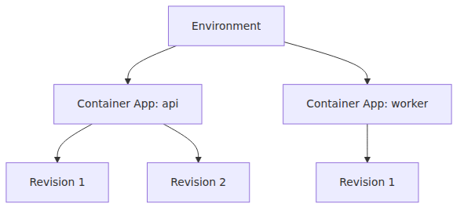

<!-- Medium import-ready. Tags go in Medium's tag field, not the body. -->
<!-- Tags: Azure, Container Apps, Serverless, Containers -->

# Environment, Container App, Revision — ACA in three words

> Azure Container Apps 101 series (2/7)

Part 1 positioned ACA on the map.
Part 2 turns the three core nouns into operating units.

---

## Start with the hierarchy

Environment is the boundary.
Container App is the logical service.
Revision is the immutable snapshot of image and config.

---

## Environment

- shared network boundary
- shared log destination
- shared Dapr configuration surface
- boundary for related services

---

## Container App

A Container App can accumulate several revisions over time.

- image
- environment variables
- secrets
- ingress
- resources
- scale rules

---

## Revision

- immutable snapshot of image and config
- can be a live traffic target
- not the same thing as automatic rollback

---

## Single and multiple mode

Single is the default.
Multiple enables canary and blue-green strategies.

---

## Which changes create a new revision

- image changes
- CPU or memory changes
- scale rule changes

---

## What should stick from the model

- The environment is the shared platform boundary.
- The app is the long-lived service identity.
- The revision is the versioned execution snapshot you observe during rollout, rollback, and troubleshooting.

---

## In this series

- [What is Azure Container Apps? — running containers without Kubernetes](https://github.com/yeongseon/tech-writing/blob/f24a126/content/azure-aca-101/en/01-what-is-aca.md)
- **Environment, Container App, Revision — ACA in three words (current)**
- Your first deploy — Python/FastAPI (upcoming)
- Ingress and traffic splitting — revision-based deployment strategies (upcoming)
- Scaling — KEDA scalers and zero-to-N (upcoming)
- Dapr integration — what you get from a sidecar (upcoming)
- Monitoring and ops — Log Analytics and Application Insights (upcoming)

---

## References

**Official Docs**
- [Azure Container Apps environments — Microsoft Learn](https://learn.microsoft.com/en-us/azure/container-apps/environment)
- [Update and deploy changes in Azure Container Apps — Microsoft Learn](https://learn.microsoft.com/en-us/azure/container-apps/revisions)
- [Manage revisions in Azure Container Apps — Microsoft Learn](https://learn.microsoft.com/en-us/azure/container-apps/revisions-manage)
- [Azure Container Apps overview — Microsoft Learn](https://learn.microsoft.com/en-us/azure/container-apps/overview)

**Related Series**
- [Azure App Service 101](https://github.com/yeongseon/tech-writing/blob/f24a126/content/azure-app-service-101/en/01-what-is-app-service.md)
- [Azure AKS 101](https://github.com/yeongseon/tech-writing/blob/f24a126/content/azure-aks-101/en/01-what-is-aks.md)
- [Azure Functions 101](https://github.com/yeongseon/tech-writing/blob/f24a126/content/azure-functions-101/en/01-what-is-azure-functions.md)
