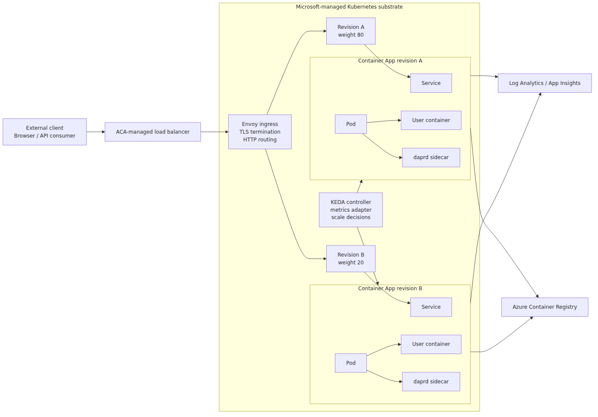
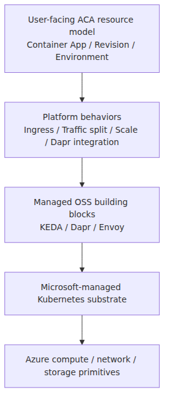
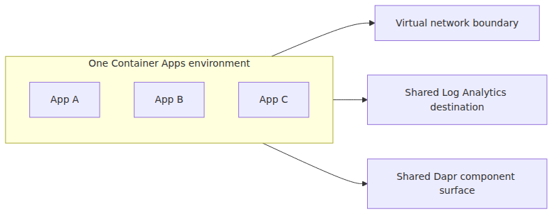
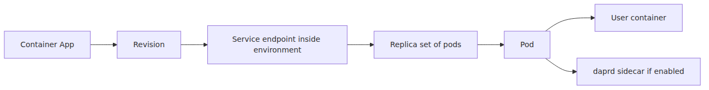
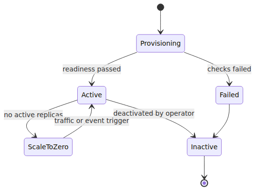
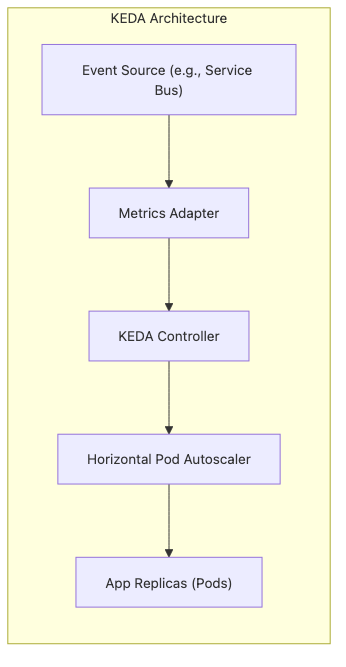
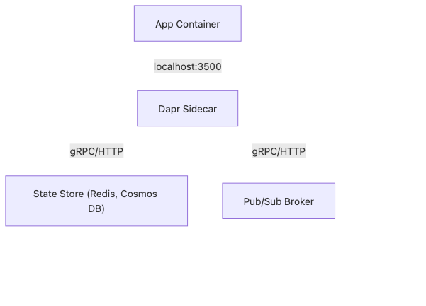
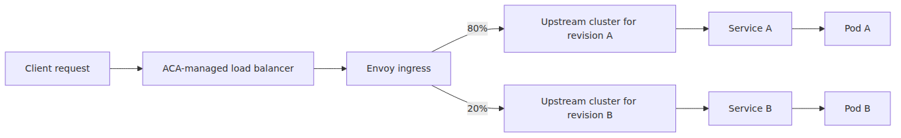
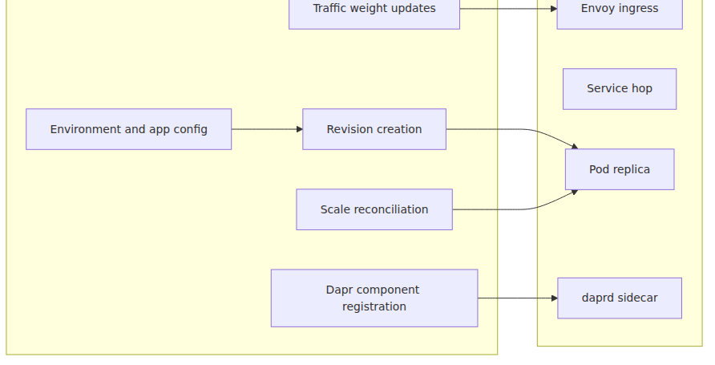

# ACA architecture — what Microsoft layered on a hidden Kubernetes

## Source Version

External references in this post are pinned to these upstream baselines:
- Dapr: v1.13.x (https://github.com/dapr/dapr)
- KEDA: v2.14.x (https://github.com/kedacore/keda)
- Envoy: v1.30.x (https://github.com/envoyproxy/envoy)

ACA's internal implementation is not published by Microsoft, so these versions are used only as comparison anchors.

## Evidence Model

- **Documented by Microsoft**: ACA is Kubernetes-powered, environment-scoped, revision-based, and integrates ingress, Dapr, and autoscaling as product features.
- **Inferred from upstream behavior**: the hidden substrate most plausibly composes Kubernetes primitives with Envoy, KEDA, and Dapr-like runtime pieces.
- **Out of bounds**: exact cluster topology, private control-plane binaries, and per-environment implementation details Microsoft does not publish.

> Azure Container Apps Deep Dive series (1/6)

The public story for Azure Container Apps is intentionally simple.
You push a container.
You turn on ingress, Dapr, or scale rules.
Microsoft runs the platform.

That simplicity is useful.
It is also exactly why the internals are easy to blur together.

Container Apps is not a raw Kubernetes service.
It is not "just AKS with nicer defaults" either.
Microsoft documents ACA as Kubernetes-powered, but does not expose the exact substrate behind each environment.
The safest description is that it is a serverless container platform built on Microsoft-managed Kubernetes infrastructure, with its own control surfaces for revisions, ingress, autoscaling, Dapr integration, logging, and environment scoping.

This series is about that layering.
Episode 1 draws the map.
The later episodes zoom into each box.

---

## The big picture — one Container Apps environment

This is the map for the whole series.
Every later post expands one box from this picture.
Get the shape first, then the platform behaviors stop looking like isolated features.

The left edge is the user-facing path.
The middle is the runtime surface you configure as Container Apps.
The dotted boundary is the Kubernetes layer you do not directly control.
The right edge is where images and telemetry leave the request path.

Episode 2 zooms into the environment boundary, network, and shared observability.
Episode 3 follows revisions and traffic weights.
Episode 4 opens the KEDA box.
Episode 5 opens the Dapr sidecar box.
Episode 6 follows the Envoy ingress path from the first packet to the pod.

---

## The first correction: hidden Kubernetes does not mean absent Kubernetes

The easiest mistake with ACA is to mentally remove Kubernetes because the cluster is not exposed.
That is the wrong abstraction.

Some managed Kubernetes substrate is there.
You just do not manage it, and Microsoft does not publish the exact cluster implementation behind the product surface.

Microsoft states the platform runs on a managed environment boundary, with the runtime handling OS upgrades, scale operations, failover, and resource balancing.
That wording matters.
It describes a higher-level product sitting above an orchestrator layer, not a featureless VM farm.

What you lose compared with AKS is direct cluster control.

- No cluster API endpoint to administer.
- No direct access to nodes.
- No direct `kubectl` workflow against the underlying control plane.
- No direct installation of arbitrary cluster-wide add-ons.

What you keep is the behavior of familiar Kubernetes-adjacent ideas, expressed through ACA resources.

- Pod-like runtime units behind each revision.
- Service-style internal hops as the most defensible Kubernetes inference, not as an ACA-public object model.
- Revision snapshots that behave like immutable deployment templates.
- KEDA-driven horizontal scaling.
- Dapr sidecar integration anchored to upstream runtime behavior.
- Envoy-based ingress and traffic shaping.

That is the frame for the rest of the series.

---

## A simpler model: ACA is a product surface over several lower layers

The stack is easier to reason about when split into layers.

The top layer is what you declare.
The middle layers are how the declaration becomes runtime behavior.
The bottom layer is where the actual execution capacity lives.

When something surprising happens in ACA, it usually lives at one of these boundaries.

- An environment setting changes behavior for every app in that environment.
- A revision-scope change creates a new immutable snapshot.
- A scale rule turns into KEDA objects and HPA behavior.
- A Dapr setting turns into a sidecar process and localhost ports.
- A traffic split most plausibly turns into Envoy route and cluster weights, based on documented ACA traffic splitting and Envoy's weighted-cluster model.

---

## What the Environment really is

The Environment is not a decorative parent resource.
It is the primary isolation boundary.

Microsoft documents it as the secure boundary around one or more apps and jobs.
Apps in the same environment share the same virtual network boundary, the same logging destination, and the same Dapr configuration surface.

That means the Environment is where several platform-wide concerns become real.

- Network reachability.
- DNS and ingress surface.
- Shared Log Analytics workspace.
- Dapr component scope.
- Cross-app service invocation inside the same environment.

This is why an environment choice is architectural, not cosmetic.

If two apps must never share those boundaries, they do not belong in the same environment.
If they should communicate through built-in Dapr service invocation and land in the same telemetry plane, the environment is exactly where you group them.

Episode 2 is entirely about this boundary.

---

## What a Container App becomes at runtime

A Container App is still not the final runtime unit.
A revision is closer.

The platform stores app-wide configuration and template-like revision configuration separately.
When you change revision-scope settings such as image, container template, or scale rules, ACA creates a new revision.
That revision is immutable.

You can think of the runtime expansion like this:

The user experience says, "I updated my app."
The runtime reality is closer to, "the platform minted a new immutable revision template, attached traffic and scale policy to it, then ran replicas from that snapshot."

That is why revision thinking is central to ACA operations.

---

## Revisions are the operational center of gravity

Many Azure services have deployment history.
ACA makes that history first-class.

A revision is not only a record.
It is an addressable live thing.

You can:

- Keep one active revision at a time.
- Run multiple revisions concurrently.
- Split ingress traffic across them.
- Attach labels for direct revision access.
- Roll forward and back by moving weights instead of replacing infrastructure.

This is why ACA can do canary and blue-green without making you design that wiring from scratch.

The important nuance is that traffic policy is app-facing, but scale happens per revision.
That separation explains a lot of rollout behavior.

Episode 3 follows this in detail.

---

## Why KEDA matters even if you never see a ScaledObject

ACA scaling is declarative.
You write scale rules on the Container App.
The platform applies them.

But the engine underneath is KEDA.

Microsoft explicitly documents Container Apps scaling as KEDA-powered.
That tells you what kind of machinery to expect:

- Event-driven scale decisions.
- Per-revision min and max replica limits.
- Scale-to-zero.
- External metrics feeding HPA-style decisions.

For custom rules, the mapping is conceptually straightforward: ACA rule intent becomes KEDA scaler intent.
For HTTP, ACA exposes a built-in HTTP scaling feature based on request concurrency.
That resembles the KEDA HTTP add-on idea, but it is not a promise that ACA literally runs the upstream `kedacore/http-add-on` project one-to-one.
The product surface is ACA's own.

Episode 4 opens that black box.

---

## Dapr in ACA is not a mock integration

Another place where the abstraction can mislead is Dapr.

ACA does not present a fake Dapr-like API.
It integrates the upstream Dapr runtime, then constrains the management surface to fit the platform.

The most useful way to picture this is simple.

- Enabling Dapr on an app means the pod gets a `daprd` sidecar.
- Your container talks to that sidecar over localhost.
- ACA documents the Dapr HTTP API on port 3500 and the Dapr gRPC API on port 50001.
- Components are configured at the environment level, then loaded according to Dapr scopes.

That is a real sidecar process, not a control-plane simulation.

Episode 5 traces the injector and the Go runtime process itself.

---

## Envoy is where ingress becomes runtime routing

ACA ingress looks compact in the portal.
The runtime path is not.

HTTP ingress gives you TLS termination, HTTP/1.1 and HTTP/2 support, gRPC support, a stable FQDN, session affinity, and traffic splitting.
Those are reverse-proxy jobs.
In ACA, Envoy is the proxy layer worth keeping in your head.

The critical detail for this series is how weights are applied.
In Envoy terminology, a cluster is an upstream service target, not a Kubernetes cluster.
Traffic splitting across ACA revisions maps most naturally onto weighted upstream cluster selection, which is the best-supported inference rather than an ACA-public implementation guarantee.

Episode 6 follows this path in full.

---

## Control plane versus data plane in ACA

This split helps when debugging.

If a new revision exists but serves no traffic, that is usually a control-plane decision.
If traffic reaches the revision but fails before the app responds, that is a data-plane path problem.
If scale rules exist but replicas stay at zero, the boundary is KEDA metrics and activation logic.

The whole series is really a guided tour of these boundaries.

---

## Where ACA differs from AKS, operationally

The short answer is control.

In AKS, you choose and operate much more of the cluster surface.
In ACA, Microsoft decides far more on your behalf so the product can preserve a serverless container contract.

That trade changes how you troubleshoot.

In AKS, you might inspect native Kubernetes objects directly.
In ACA, you infer the lower-layer state through product features, logs, revision status, Dapr health, ingress behavior, and scaling results.

This does not make ACA vague.
It just means the debugging entry points are different.

That is also why closed-source ACA behavior must be anchored to Microsoft Learn, while KEDA, Dapr, and Envoy behavior can be anchored to pinned upstream source.

---

## Episode 1 wrap

If you keep one model from this post, keep this one.

> Azure Container Apps is a managed product surface over Microsoft-managed Kubernetes infrastructure whose exact substrate is not part of the public contract. The Environment is the isolation boundary. Revisions are immutable runtime snapshots. KEDA supplies the scaling engine. Dapr supplies the sidecar runtime. Envoy supplies the ingress and weighted routing layer.

Every episode that follows just makes one noun in that paragraph concrete.

---

## Where this fits in the series

This opening post is the architectural map for the Azure Container Apps Deep Dive series. If you want the gentler product-level setup first, read the ACA 101 series before continuing here, and compare the control-surface framing with the AKS and Azure Functions deep-dive series.

---

## Evidence Boundaries

This chapter mixes Microsoft-documented product behavior with carefully bounded upstream inference.

**Documented (Microsoft Learn / primary sources):**
- ACA is powered by Kubernetes and open-source technologies such as KEDA, Dapr, and Envoy, while not exposing the underlying Kubernetes APIs.
- The Environment is the secure boundary around apps and jobs, including network, logging, ingress, and Dapr-related product surfaces.
- Revisions are immutable snapshots, and ACA scaling is KEDA-powered.

**Inferred from upstream behavior:**
- Revision traffic percentages are best explained through Envoy weighted upstream selection.
- Dapr enablement is best explained through an upstream `daprd` sidecar runtime model.
- Service-style hops between ingress and replicas are the most defensible Kubernetes-shaped explanation for the hidden data plane.

**Speculation (ACA-internal, not exposed):**
- The exact Kubernetes substrate, cluster topology, and internal object naming inside ACA are not public.
- The precise private adapter code that translates ACA resources into Envoy, KEDA, or Dapr configuration is not public.

<!-- toc:begin -->
## In this series

- **ACA architecture — what Microsoft layered on a hidden Kubernetes (current)**
- Environment internals — the network, observability, and Dapr scope boundary (upcoming)
- Revisions and traffic splitting — where Envoy weights come from (upcoming)
- KEDA inside ACA — what a scale rule actually creates (upcoming)
- Dapr sidecar internals — the Go process that lives next to your container (upcoming)
- The Envoy ingress path — how the first request reaches your container (upcoming)

<!-- toc:end -->

---

## References

### Primary sources
- [`kedacore/keda` tree at `v2.14.0`](https://github.com/kedacore/keda/tree/v2.14.0)
- [`ScaledObject` type in KEDA](https://github.com/kedacore/keda/blob/v2.14.0/apis/keda/v1alpha1/scaledobject_types.go)
- [`ScaledObjectReconciler` in KEDA](https://github.com/kedacore/keda/blob/v2.14.0/controllers/keda/scaledobject_controller.go)
- [`HPA generation in KEDA`](https://github.com/kedacore/keda/blob/v2.14.0/controllers/keda/hpa.go)
- [`dapr/dapr` tree at `v1.13.0`](https://github.com/dapr/dapr/tree/v1.13.0)
- [`daprd` entrypoint](https://github.com/dapr/dapr/blob/v1.13.0/cmd/daprd/main.go)
- [`daprd` application bootstrap](https://github.com/dapr/dapr/blob/v1.13.0/cmd/daprd/app/app.go)
- [`Dapr runtime config defaults`](https://github.com/dapr/dapr/blob/v1.13.0/pkg/runtime/config.go)
- [`Dapr injector pod patch`](https://github.com/dapr/dapr/blob/v1.13.0/pkg/injector/service/pod_patch.go)
- [`Envoy` route components at `v1.30.0`](https://github.com/envoyproxy/envoy/blob/v1.30.0/api/envoy/config/route/v3/route_components.proto)
- [`Envoy` router implementation at `v1.30.0`](https://github.com/envoyproxy/envoy/blob/v1.30.0/source/common/router/config_impl.cc)

### Secondary sources
- [Comparing Container Apps with other Azure container options](https://learn.microsoft.com/en-us/azure/container-apps/compare-options)
- [Azure Container Apps environments](https://learn.microsoft.com/en-us/azure/container-apps/environment)
- [Update and deploy changes in Azure Container Apps](https://learn.microsoft.com/en-us/azure/container-apps/revisions)
- [Traffic splitting in Azure Container Apps](https://learn.microsoft.com/en-us/azure/container-apps/traffic-splitting)
- [Scaling in Azure Container Apps](https://learn.microsoft.com/en-us/azure/container-apps/scale-app)
- [Microservice APIs Powered by Dapr](https://learn.microsoft.com/en-us/azure/container-apps/dapr-overview)
- [Dapr Components in Azure Container Apps](https://learn.microsoft.com/en-us/azure/container-apps/dapr-components)
- [Ingress in Azure Container Apps](https://learn.microsoft.com/en-us/azure/container-apps/ingress-overview)

### Related series
- [Azure Container Apps 101](../../azure-aca-101/en/)
- [Azure AKS Deep Dive](../../azure-aks-deep-dive/en/)
- [Azure Functions Deep Dive](../../azure-functions-deep-dive/en/)

Tags: Container Apps, KEDA, Dapr, Envoy
