# KEDA inside ACA — what a scale rule actually creates

## Source Version

External references in this post are pinned to these upstream baselines:
- Dapr: v1.13.x (https://github.com/dapr/dapr)
- KEDA: v2.14.x (https://github.com/kedacore/keda)
- Envoy: v1.30.x (https://github.com/envoyproxy/envoy)

ACA's internal implementation is not published by Microsoft, so these versions are used only as comparison anchors.

## Evidence Model

- **Documented by Microsoft**: ACA scaling is KEDA-powered and exposes HTTP, TCP, and custom scale rules at the product surface.
- **Inferred from upstream behavior**: those rules most likely materialize as KEDA/HPA-style control loops behind the service boundary.
- **Out of bounds**: the exact managed KEDA deployment shape and private wiring Microsoft uses inside ACA.

> Azure Container Apps Deep Dive series (4/6)

At the product surface, scaling in Azure Container Apps is only a handful of fields.

You set `minReplicas`.
You set `maxReplicas`.
You add an HTTP, TCP, or custom rule.
The platform handles the rest.

That surface is intentionally terse.
The real question is what the platform has to create underneath in order for those rules to turn into replica counts.

The answer is KEDA.

Microsoft documents Container Apps scaling as KEDA-powered.
That tells you two things immediately.

1. The platform is using event-driven autoscaling concepts rather than inventing a wholly separate model.
2. ACA scale rules should map onto the same broad control-loop shape as KEDA `ScaledObject`-driven scaling, even though ACA does not expose those Kubernetes objects directly.

This episode follows that hidden mapping.

---

## Questions this chapter answers

- What is the same and what is restricted between ACA's KEDA and stock KEDA?
- Where is the boundary between triggers that scale to zero and triggers that cannot?
- How do polling interval, cooldown, and max replicas trade cost against latency?
- When multiple scalers attach to one app, how is priority resolved?
- Where can you verify KEDA scaler metrics, and what do you suspect when they vanish?

## The short version: a scale rule is not the scaler itself

In ACA, the scale rule you author is product configuration.
It is not the runtime scaler object.

The platform has to translate that rule into something KEDA can reconcile.

The right mental model is this.

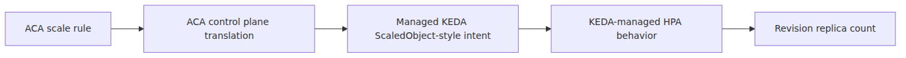

*ACA rule to hidden scaler object mapping*
You never see the hidden object directly.
You still need to understand it, because the behavior you observe is downstream of that translation.

---

## Why KEDA is the correct anchor

KEDA upstream is built around a clean contract.

- A `ScaledObject` describes the target and triggers.
- The KEDA operator reconciles it.
- KEDA creates and updates an HPA.
- The metrics adapter answers external-metric queries for the HPA.

Upstream KEDA source makes this concrete.
The `ScaledObject` type defines trigger metadata, cooldown, min and max replica counts, and target references.
The controller reconciles it and builds the HPA spec.

That is why the quality gate for ACA deep dives insists on pinned KEDA references.
Even though ACA itself is closed-source, KEDA behavior explains the shape of the hidden autoscaling loop.

---

## What ACA exposes versus what KEDA needs

The mapping becomes easier when put side by side.

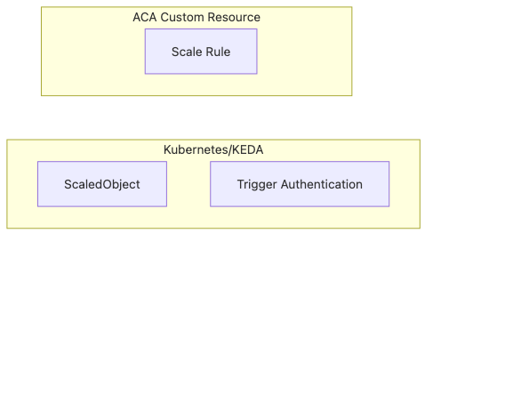

*ACA scale fields and KEDA inputs*
KEDA needs a scale target, metrics or trigger definitions, and limits.
ACA already has those ideas in its revision template.

That is why the conceptual jump from ACA scale rule to hidden KEDA object is small, even if the product keeps the actual object private.

---

## The first key behavior: scaling is per revision

ACA traffic is app-facing.
Scaling is revision-facing.

That means when you change a scale rule, you are changing a revision-scope property and therefore minting a new revision.
Microsoft's revisions documentation says so directly.

This matters because the scaling engine is attached to immutable revision snapshots, not to one endlessly mutable deployment identity.

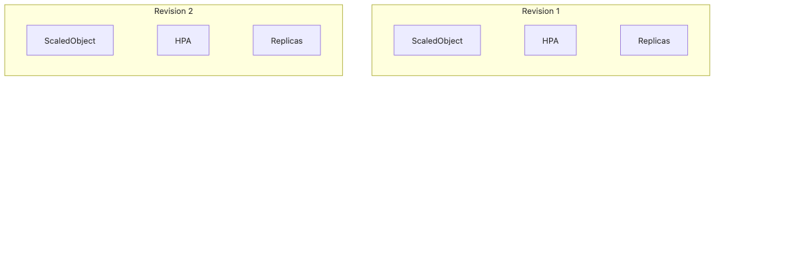

*Per-revision independent scaling behavior*
If two revisions are active at once, they can each carry their own scaling behavior while sharing one app-level ingress surface.

That is one of the reasons rollout math and scaling math should never be collapsed into the same concept.

---

## A `ScaledObject` creates HPA behavior, not a replacement for HPA

This is the most common KEDA misunderstanding.
KEDA does not replace HPA with a magical entirely different subsystem.
KEDA manages and feeds HPA behavior.

Upstream KEDA source shows this clearly.
The controller reconciles `ScaledObject` resources and builds HPA specs.
The HPA creation logic sets min and max replica counts, metric targets, and scale target references.

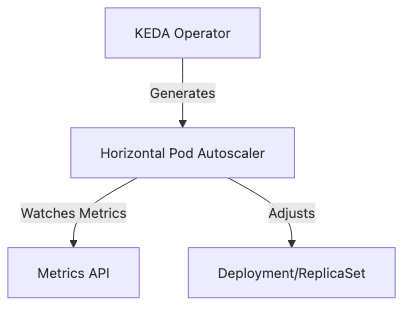

*ScaledObject and HPA control relationship*
In ACA, you should assume the same broad division of labor.
The product surface gives KEDA enough information to produce HPA-like decisions for the revision.

---

## minReplicas can be zero, and that changes everything

ACA explicitly allows `minReplicas: 0`.
That is the scale-to-zero story.

This is where KEDA's event-driven model matters more than a plain HPA mental model.
A traditional HPA-only framing does not naturally explain activation from zero against event signals.
KEDA does.

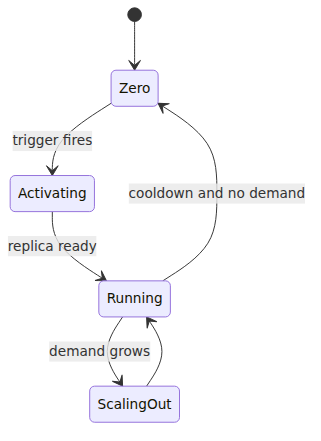

*minReplicas zero and scale-to-zero activation path*
Microsoft's scaling docs also note that cooldown behavior is especially relevant when scaling from the final replica down to zero.
That is exactly the kind of lifecycle that makes KEDA the right conceptual anchor.

---

## The control loop: how a custom rule becomes replicas

For custom rules, the flow is easiest to visualize.

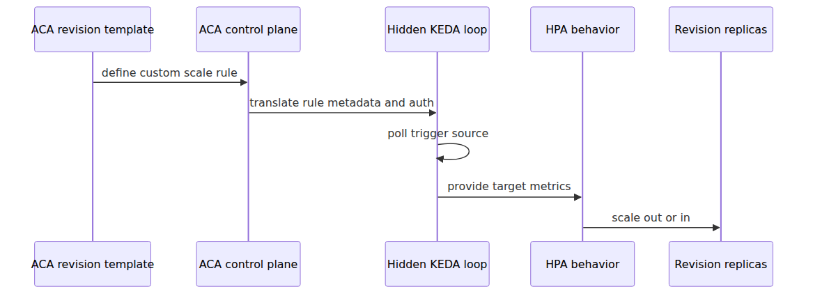

*Custom rule to replica control loop*
That flow is the right abstraction even when you cannot inspect the actual Kubernetes objects under the product.

---

## HTTP scaling is built in, but the shape still resembles KEDA thinking

ACA has a built-in HTTP scaler based on request concurrency.
Microsoft documents the rule in terms of concurrent requests and a 15-second measurement window.

This is where a careful distinction matters.

Do not say ACA HTTP scaling is literally the upstream `kedacore/http-add-on` product.
That would overstate what the sources prove.

Do say this instead.

- ACA exposes HTTP scaling as a built-in product feature.
- The scaling model is conceptually aligned with KEDA's event-driven autoscaling design.
- The trigger input is request concurrency.

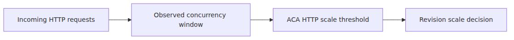

*HTTP concurrency in a KEDA-shaped loop*
That wording stays accurate without pretending the product uses the upstream HTTP add-on one-to-one.

---

## TCP scaling follows the same broad pattern

ACA also exposes TCP concurrency scaling.
The surface looks parallel to HTTP.

- Define a concurrent connection threshold.
- Observe demand over the measurement window.
- Increase replicas when the threshold is exceeded.

The deeper story is the same as HTTP.
The platform owns the product implementation.
The shape still fits a KEDA-style autoscaling loop that turns trigger state into replica changes.

---

## Custom rules are the clearest KEDA-shaped part of ACA

Microsoft's scaling guide is explicit that custom ACA rules map from KEDA scalers.
It even walks the reader through translating KEDA scaler metadata and authentication into ACA rule fields.

That is as close as the product gets to saying, "yes, think in KEDA terms here."

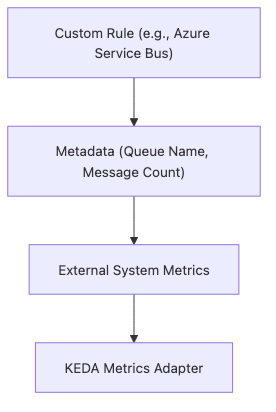

*Custom rules and KEDA scaler translation*
This documentation pattern is a giveaway.
The product is intentionally exposing a curated KEDA surface, not inventing an unrelated autoscaling language.

---

## Authentication for scale rules is another translation boundary

Upstream KEDA often uses `TriggerAuthentication` resources or identity configuration.
ACA does not expose those raw objects directly.

Instead, the product lets you express the same intent with:

- secrets referenced by scale rule auth fields
- managed identity settings for supported Azure triggers

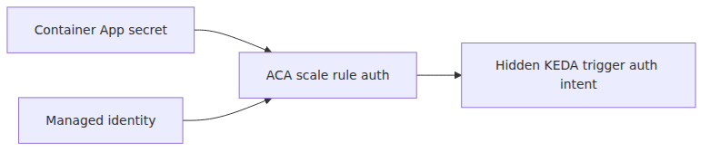

*Scale rule auth and product translation boundary*
The shape remains recognizable.
The resource model is productized.

---

## Why the metrics adapter matters, even when you never name it

Upstream KEDA includes a metrics adapter because HPA needs metric answers.
The KEDA HPA logic attaches external metric selectors so the adapter can answer the HPA's queries for the correct scaled object.

That is an important hidden link.

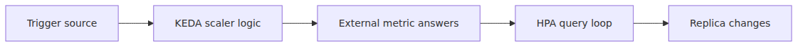

*HPA queries and metrics adapter path*
In ACA you never configure the adapter directly.
You still see its consequences every time an external event source or concurrency rule changes replica count.

---

## The KEDA defaults explain ACA behavior readers often notice later

Microsoft's scaling docs call out default polling and cooldown values for custom rules.
Those numbers align with KEDA's control-loop style.

Common observed behaviors that this helps explain:

- Scale changes are not continuous every millisecond.
- Scale-in from one replica to zero has a cooldown flavor that stands out operationally.
- Event-driven activation from zero can feel different from steady-state scaling between nonzero counts.

Those behaviors are not arbitrary product quirks.
They follow from an event-driven autoscaling loop with polling and cooldown semantics.

---

## One rule can wake the revision up

ACA docs also point out that if multiple scale rules exist, the app begins to scale once the first rule condition is met.

That is exactly how you should picture the activation logic.

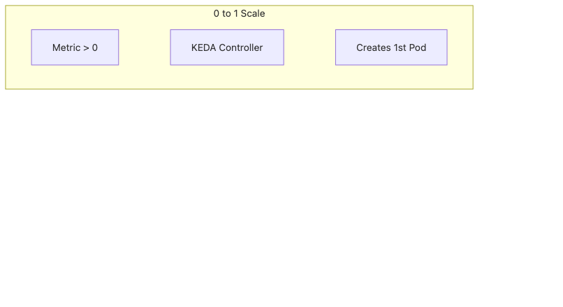

*Multiple scale rules with separate activation paths*
The deep-dive implication is that rules are not averaged into one giant threshold.
They are multiple activation paths into the same scaling target.

---

## Scale rules belong to the revision template for a reason

Why did ACA choose to make scale rules revision-scope?

Because scaling is part of runtime behavior, not just metadata.

A canary revision might need different limits or trigger thresholds than the currently stable revision.
A new version could change request handling efficiency and therefore justify a different concurrency threshold.

If scale rules were app-scope only, rollout experiments would lose one of the most important control knobs.

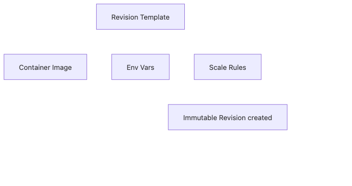

*Scale rules attached to revision templates*
Revision-scope scaling is what makes that split possible.

---

## What you should not claim

There are two mistakes worth eliminating explicitly.

First, do not claim ACA HTTP scaling is the same thing as the upstream KEDA HTTP add-on.
The conceptual family resemblance is real.
The one-to-one implementation claim is not established by the sources.

Second, do not claim KEDA replaces HPA.
Upstream KEDA source shows it manages and feeds HPA behavior.
ACA inherits that shape conceptually.

Those two corrections keep the story accurate.

---

## The whole autoscaling picture in one diagram

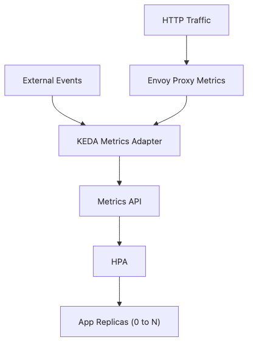

*End-to-end ACA autoscaling control flow*
If you remember this diagram, you have the autoscaling internals at the right level of fidelity.

---

## Episode 4 wrap

The compressed model is this.

> In Azure Container Apps, a scale rule is product configuration that the platform translates into KEDA-driven autoscaling behavior for one revision. KEDA then manages the HPA-style control loop that turns trigger state, concurrency, or external metrics into replica counts, including scale-to-zero when `minReplicas` is 0.

That is the hidden machinery behind the friendly Scale blade.

---

## Where this fits in the series

Part 3 explained how revisions receive traffic. This part explained how those same revisions gain or lose replicas underneath the traffic policy. The practical value is keeping routing policy and scaling policy in separate mental buckets even though both act on the same revision targets.

---

## Evidence Boundaries

This chapter leans on Microsoft's KEDA-powered scaling contract and uses upstream KEDA to explain the hidden control-loop shape.

**Documented (Microsoft Learn / primary sources):**
- ACA scaling is KEDA-powered.
- Scale rules are configured on the revision template, and `minReplicas` can be zero.
- ACA documents built-in HTTP/TCP scaling behavior and custom-rule translation concepts.

**Inferred from upstream behavior:**
- Hidden ACA scale rules are best understood through upstream KEDA `ScaledObject`, HPA, metrics-adapter, polling, and cooldown behavior.
- Statements about activation paths and per-revision autoscaling loops are grounded in upstream KEDA controller design rather than ACA-published internal objects.

**Speculation (ACA-internal, not exposed):**
- ACA does not publish the exact hidden Kubernetes objects or private controllers it creates for each scale rule.
- ACA HTTP scaling should not be claimed to be a one-to-one deployment of the upstream KEDA HTTP add-on.

### Define a scale rule (queue-based)

```bash
az containerapp update -n my-app -g my-rg \
  --min-replicas 0 --max-replicas 30 \
  --scale-rule-name queue-rule \
  --scale-rule-type azure-queue \
  --scale-rule-metadata queueName=jobs queueLength=5 \
  --scale-rule-auth connection=queue-conn
```

## Operational checklist

- [ ] Decided whether scale-to-zero is acceptable per the SLA
- [ ] Tuned polling interval and cooldown to match workload spike shape
- [ ] Confirmed max replicas will not break downstream (DB connections, API quota)
- [ ] Documented priority and aggregation when stacking multiple scalers
- [ ] Monitor consistency between KEDA metrics and actual replica count

<!-- toc:begin -->
## In this series

- [ACA architecture — what Microsoft layered on a hidden Kubernetes](./01-aca-architecture.md)
- [Environment internals — the network, observability, and Dapr scope boundary](./02-environment-internals.md)
- [Revisions and traffic splitting — where Envoy weights come from](./03-revision-and-traffic-split.md)
- **KEDA inside ACA — what a scale rule actually creates (current)**
- Dapr sidecar internals — the Go process that lives next to your container (upcoming)
- The Envoy ingress path — how the first request reaches your container (upcoming)

<!-- toc:end -->

---

## References

### Primary sources
- [`kedacore/keda` tree at `v2.14.0`](https://github.com/kedacore/keda/tree/v2.14.0)
- [`ScaledObject` type in KEDA](https://github.com/kedacore/keda/blob/v2.14.0/apis/keda/v1alpha1/scaledobject_types.go)
- [`ScaledObjectReconciler` in KEDA](https://github.com/kedacore/keda/blob/v2.14.0/controllers/keda/scaledobject_controller.go)
- [`HPA generation in KEDA`](https://github.com/kedacore/keda/blob/v2.14.0/controllers/keda/hpa.go)

### Secondary sources
- [Scaling in Azure Container Apps](https://learn.microsoft.com/en-us/azure/container-apps/scale-app)
- [Update and deploy changes in Azure Container Apps](https://learn.microsoft.com/en-us/azure/container-apps/revisions)

### Related series
- [Azure Container Apps 101](../../azure-aca-101/en/)
- [Azure AKS Deep Dive](../../azure-aks-deep-dive/en/)
- [Azure Functions Deep Dive](../../azure-functions-deep-dive/en/)

Tags: Container Apps, KEDA, Dapr, Envoy
