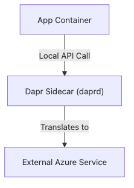
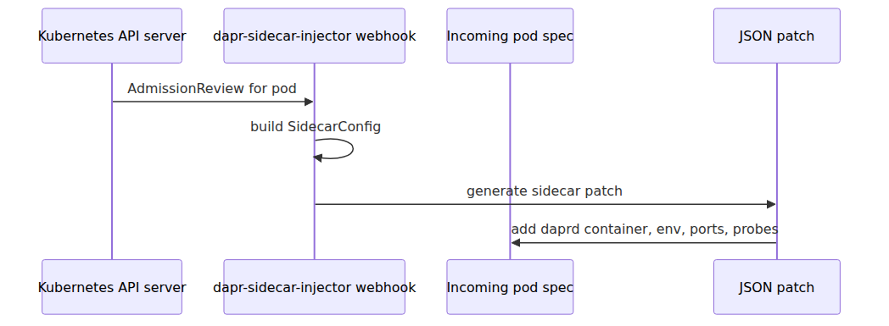
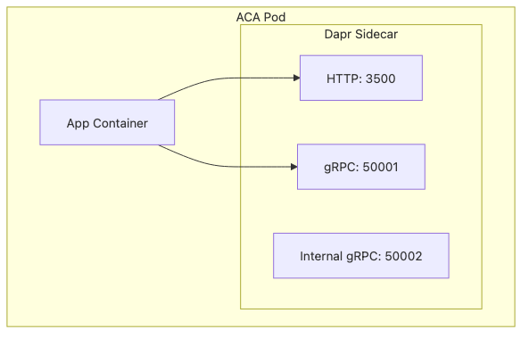
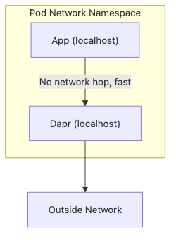
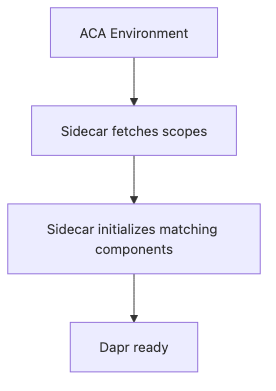
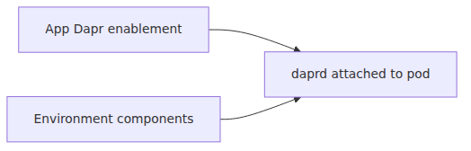
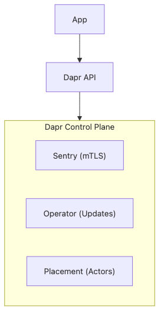
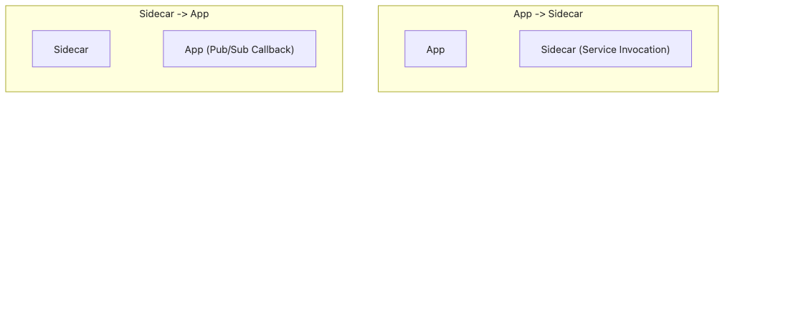
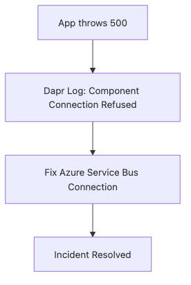
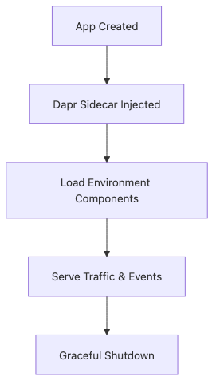

# Dapr sidecar internals — the Go process that lives next to your container

## Source Version

External references in this post are pinned to these upstream baselines:
- Dapr: v1.13.x (https://github.com/dapr/dapr)
- KEDA: v2.14.x (https://github.com/kedacore/keda)
- Envoy: v1.30.x (https://github.com/envoyproxy/envoy)

ACA's internal implementation is not published by Microsoft, so these versions are used only as comparison anchors.

## Evidence Model

- **Documented by Microsoft**: enabling Dapr exposes localhost APIs and environment-scoped components in ACA.
- **Inferred from upstream behavior**: sidecar injection details, port behavior, and mTLS/control-plane plumbing follow upstream Dapr patterns unless ACA documents otherwise.
- **Out of bounds**: ACA-specific webhook internals, hidden cert distribution details, and private runtime arguments Microsoft does not publish.

> Azure Container Apps Deep Dive series (5/6)

When readers first enable Dapr in Azure Container Apps, the feature looks deceptively light.

You check a box or set a few fields.
An app ID appears.
Suddenly your service can call localhost on port 3500 or 50001 and talk in terms of state stores, pub/sub, service invocation, or secrets.

That surface is tiny.
The runtime change is not.

What actually happened is that the platform arranged for an upstream Dapr sidecar process, `daprd`, to run beside your user container.
That process is written in Go.
It is injected into the pod.
It gets its own ports, args, probes, certificates, and component-loading behavior.

This episode follows that path from pod mutation to localhost API calls.

---

## The shortest accurate sentence

ACA Dapr is upstream Dapr runtime integrated into the Container Apps product surface.

That sentence matters because it rules out two bad mental models.

First, ACA is not faking a Dapr-like API purely in the control plane.
Second, enabling Dapr is not merely adding metadata to your app.

It changes the pod shape.

The app talks locally.
The sidecar talks outward.
That is the basic contract.

### Dapr on Kubernetes (documented)

Upstream Dapr on Kubernetes documents a control plane that injects `daprd` through a mutating admission webhook.
That upstream-documented model also defines concrete runtime details such as the public HTTP port 3501, Sentry, trust anchors, and mTLS-related sidecar configuration.

### Likely ACA wiring (inferred)

ACA documents that enabling Dapr on the app surface (`dapr.enabled=true`) adds the runtime surface to a Container App, but it does not expose the admission webhook, control-plane, or certificate-plumbing internals.
The safest model is therefore: ACA likely wires the sidecar through a productized variant of the upstream Dapr pattern, while keeping the exact implementation private.

---

## Start with the upstream pod mutation model

Upstream Dapr on Kubernetes injects the sidecar through a mutating admission webhook.
Pinned Dapr source shows this in the injector service code and the pod patch path.

The injector receives the admission review, builds a sidecar config from pod annotations and environment state, and generates patch operations that add the Dapr sidecar container.

ACA does not expose raw Kubernetes admission mechanics to you.
So this webhook description is upstream Dapr documentation, not an ACA-public implementation guarantee.
It is still the best available reference model for the sidecar shape ACA produces.

---

## The injector's job is larger than "append one container"

Pinned upstream Dapr source is revealing here.
The pod patch code does more than say "please add `daprd`."

It computes:

- the sidecar image
- trust anchors and cert material
- control plane addresses
- mode and namespace values
- app ID and app protocol
- health and readiness settings
- port numbers
- volume mounts and environment variables

That is why the sidecar should be thought of as a configured runtime process, not a generic helper container.

---

## The sidecar container is literally `daprd`

The upstream `sidecar_container.go` file is a clean anchor for what gets injected.
It builds a container whose command is `/daprd` and whose args are assembled from the sidecar config.

That one file tells you most of what you need to know.

- This is a real executable, not a passive library.
- It gets explicit CLI flags.
- It exposes explicit ports.
- It receives readiness and liveness probes.

This is the right resolution for understanding Dapr in ACA.
The product toggles Dapr at the app surface.
The runtime ends up launching a Go process with a nontrivial configuration surface.

---

## Why calling it a Go process is not trivia

Readers sometimes hear "sidecar" and imagine a generic side channel.
Calling `daprd` a Go process is useful because it centers the real runtime unit.

The process has:

- its own startup path
- its own crash modes
- its own logs
- its own health probes
- its own network listeners
- its own configuration load path

If Dapr is misbehaving in ACA, you are not only debugging your app anymore.
You are debugging a neighboring runtime process that your app depends on.

---

## Boot path: `main.go` to `app.Run()` to runtime creation

Pinned upstream Dapr code makes the bootstrap path readable.

`cmd/daprd/main.go` is tiny.
It calls into `app.Run()`.
That bootstrap path then constructs runtime options, logging, security, and finally the Dapr runtime object before calling `Run`.

For ACA readers, the important takeaway is not every bootstrap detail.
It is that enabling Dapr does in fact launch a complete runtime program, with a normal process lifecycle and configuration pipeline.

---

## The sidecar ports are concrete and important

The upstream runtime config defaults define the Dapr HTTP and gRPC API ports.

- HTTP API: 3500
- Public HTTP port: 3501
- gRPC API: 50001

Microsoft's ACA Dapr overview also documents that the sidecar exposes HTTP on 3500 and gRPC on 50001.
The extra public HTTP port 3501 is upstream Dapr-documented behavior; ACA does not publish ACA-specific wiring for that port.

Those ports are not theoretical.
They are the local contract between your code and the sidecar.

When an ACA app uses Dapr service invocation or state operations, it is usually talking to one of these local listeners.

---

## Why localhost matters so much

The sidecar pattern works because your app does not need to know the final network path to the external dependency.
It only needs to know the localhost API contract.

That buys portability and decoupling.

Your app says:

- invoke service X
- save key Y
- publish topic Z

The sidecar says:

- I know which component backs that
- I know where to route it
- I know how to authenticate and serialize it

That is why Dapr can make apps simpler while making the pod shape more complex.

---

## Component loading is where ACA's environment boundary reappears

Episode 2 stressed that Dapr components in ACA are environment-level resources.
This episode shows why that is operationally meaningful.

The sidecar runtime loads component definitions according to the Dapr app ID and scopes.
Microsoft's components documentation is clear that scopes map to Dapr app IDs, not Container App names.

So the environment owns the component registry boundary.
The sidecar makes the final runtime decision about which scoped components become live for that app.

---

## Enabling Dapr in ACA is an app-level switch with environment-level dependencies

This split is subtle and important.

You enable Dapr on the app.
But the sidecar may depend on environment-level component and configuration state.

That means Dapr behavior in ACA always spans at least two scopes.

- app scope for enablement and sidecar attachment
- environment scope for component availability and sharing

If an app-level Dapr setting looks correct but runtime behavior still fails, the missing piece is often at environment scope rather than app scope.

---

## The injector carries more ACA-relevant detail than most readers realize

The upstream sidecar container builder shows several flags that line up directly with what ACA users observe.

Examples include:

- `--dapr-http-port`
- `--dapr-grpc-port`
- `--app-id`
- `--app-port`
- `--app-protocol`
- `--control-plane-address`
- `--sentry-address`
- `--enable-mtls`

You do not set all of these in ACA yourself.
The point is that the runtime process still needs them upstream.
Names such as Sentry, mTLS, and control-plane addresses are upstream Dapr-documented behavior; ACA-specific configuration values and plumbing are not exposed.

That is another way to see what a managed sidecar integration really means.

---

## Dapr is not only the building-block APIs; it is also health and metadata APIs

Microsoft's Dapr overview for ACA distinguishes between building-block APIs and operational APIs.
That matters because a sidecar is also an observable runtime.

Besides state, pub/sub, invocation, and bindings, the sidecar exposes operational surfaces such as:

- health
- metadata

So the sidecar is not just a convenience wrapper for remote calls.
It is also an addressable operational endpoint in the pod.

---

## App-to-sidecar and sidecar-to-app are separate channels

There are really two local relationships to remember.

1. Your app calls the sidecar over localhost.
2. The sidecar also calls into your app for certain patterns, such as service invocation delivery or pub/sub handlers.

That second arrow matters because app port and app protocol settings are not decorative.
They tell the sidecar how to reach your code.

---

## Why sidecar logs belong in your incident timeline

Microsoft's environment documentation notes that Dapr sidecar logs are part of the shared logging destination.
That is exactly what you want during incidents.

If a request fails, the sidecar may know something your user container does not.

- component load failure
- auth issue
- service invocation resolution issue
- connection timeout to backing service
- sidecar startup failure

Treat sidecar logs as first-class evidence, not as noisy adjunct data.

---

## The mTLS and trust material story is another clue that this is a real runtime

The upstream injector code includes trust anchors, certificate material, Sentry addresses, and identity-related configuration.
That is not cosmetic metadata.

It is the configuration needed for a real security-aware distributed runtime to operate.

This matters because Dapr service invocation is not just a friendly client library experience.
There is actual sidecar-to-sidecar infrastructure and identity plumbing underneath in upstream Dapr on Kubernetes.
ACA likely preserves the same broad runtime shape, but Microsoft does not publish the exact trust, Sentry, or mTLS wiring inside ACA.

Even when ACA abstracts the management details away, the runtime complexity remains.

---

## Putting the whole sidecar lifecycle in one diagram

That is the compact lifecycle that turns a single ACA checkbox into a second runtime process in your pod.

---

## What this means for ACA operators

There are three practical takeaways.

First, Dapr problems are rarely only "my app code is wrong."
They can be sidecar bootstrap, component scope, environment config, or sidecar-to-backing-service issues.

Second, environment design matters for Dapr because component scope lives there.

Third, localhost success does not mean the external dependency path is healthy.
It only proves your app reached the sidecar.

That last distinction is especially important when diagnosing timeouts.

---

## Episode 5 wrap

The compressed model is this.

> In Azure Container Apps, enabling Dapr causes a real upstream `daprd`-class sidecar process to appear beside the user container. ACA documents the localhost HTTP and gRPC APIs and the environment-scoped component model; webhook injection details, port 3501 behavior, Sentry, and mTLS plumbing are inferred from upstream Dapr rather than published as ACA internals.

That is what "Dapr enabled" means at runtime.

---

## Where this fits in the series

The previous part explained how ACA scales revisions. This part explained how ACA changes the runtime shape of those revisions when Dapr is enabled. The practical gain is that scaling state and sidecar state can now be treated as separate layers of the same revision rather than one blurred "app runtime" story.

---

## Evidence Boundaries

This chapter separates ACA's public Dapr surface from upstream Dapr-on-Kubernetes implementation details.

**Documented (Microsoft Learn / primary sources):**
- ACA exposes Dapr as a real sidecar-backed runtime surface with localhost HTTP and gRPC APIs.
- Dapr components are environment-level resources, and scopes map to Dapr app IDs.
- Dapr sidecar logs appear in the shared logging destination.

**Inferred from upstream behavior:**
- Mutating admission webhook injection, public HTTP port 3501, Sentry, trust anchors, and mTLS wiring come from upstream Dapr-on-Kubernetes documentation and source.
- ACA is best understood as a productized variant of that upstream sidecar model.

**Speculation (ACA-internal, not exposed):**
- ACA does not publish the exact admission pipeline, certificate flow, or control-plane addresses used for Dapr inside the managed platform.

<!-- toc:begin -->
## In this series

- [ACA architecture — what Microsoft layered on a hidden Kubernetes](./01-aca-architecture.md)
- [Environment internals — the network, observability, and Dapr scope boundary](./02-environment-internals.md)
- [Revisions and traffic splitting — where Envoy weights come from](./03-revision-and-traffic-split.md)
- [KEDA inside ACA — what a scale rule actually creates](./04-keda-in-aca.md)
- **Dapr sidecar internals — the Go process that lives next to your container (current)**
- The Envoy ingress path — how the first request reaches your container (upcoming)

<!-- toc:end -->

---

## References

### Primary sources
- [`dapr/dapr` tree at `v1.13.0`](https://github.com/dapr/dapr/tree/v1.13.0)
- [`daprd` entrypoint](https://github.com/dapr/dapr/blob/v1.13.0/cmd/daprd/main.go)
- [`daprd` application bootstrap](https://github.com/dapr/dapr/blob/v1.13.0/cmd/daprd/app/app.go)
- [`Dapr runtime` config defaults](https://github.com/dapr/dapr/blob/v1.13.0/pkg/runtime/config.go)
- [`Dapr injector` pod patch logic](https://github.com/dapr/dapr/blob/v1.13.0/pkg/injector/service/pod_patch.go)
- [`Dapr sidecar container` construction](https://github.com/dapr/dapr/blob/v1.13.0/pkg/injector/patcher/sidecar_container.go)

### Secondary sources
- [Microservice APIs Powered by Dapr](https://learn.microsoft.com/en-us/azure/container-apps/dapr-overview)
- [Dapr Components in Azure Container Apps](https://learn.microsoft.com/en-us/azure/container-apps/dapr-components)
- [Azure Container Apps environments](https://learn.microsoft.com/en-us/azure/container-apps/environment)

### Related series
- [Azure Container Apps 101](../../azure-aca-101/en/)
- [Azure AKS Deep Dive](../../azure-aks-deep-dive/en/)
- [Azure Functions Deep Dive](../../azure-functions-deep-dive/en/)

Tags: Container Apps, KEDA, Dapr, Envoy
