# The Envoy ingress path — how the first request reaches your container

<!-- ebook-only:start -->
## Where this chapter fits

This is chapter 6 of 6 in the series.
The previous chapter covered **Dapr sidecar internals — the Go process that lives next to your container**.
<!-- ebook-only:end -->

## Source Version

External references in this post are pinned to these upstream baselines:
- Dapr: v1.13.x (https://github.com/dapr/dapr)
- KEDA: v2.14.x (https://github.com/kedacore/keda)
- Envoy: v1.30.x (https://github.com/envoyproxy/envoy)

ACA's internal implementation is not published by Microsoft, so these versions are used only as comparison anchors.

## Evidence Model

- **Documented by Microsoft**: FQDN, TLS termination, traffic splitting, session affinity, and ingress-facing readiness behavior.
- **Inferred from upstream behavior**: Envoy-style routing and Kubernetes-style service hops from ingress state to ready revision replicas.
- **Out of bounds**: the exact private 0 -> 1 request path, buffering behavior, and hidden ingress control-plane topology.

> Azure Container Apps Deep Dive series (6/6)

The public story for ingress in Azure Container Apps is concise.

Enable ingress.
Get an FQDN.
Receive HTTPS traffic.
Optionally split traffic across revisions.

That is enough to ship a service.
It is not enough to explain the first request path.

This final episode follows that path at the right resolution for ACA operators, but with explicit evidence boundaries:

- **[Documented]** external client -> ACA-managed ingress surface with FQDN, TLS termination, traffic splitting, and session affinity.
- **[Inferred from Envoy upstream behavior]** ingress proxy route matching and weighted upstream selection.
- **[Inferred from Kubernetes Service patterns]** a service-style hop from ingress routing state to ready revision replicas.

---

## Start with the full path, not with the app

The first mistake in ingress debugging is to start at the user container.
The request has already crossed several platform layers before that point.

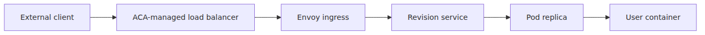
If you keep this order in your head, ingress incidents become easier to localize.

- No connection at all may be outside the pod entirely.
- Host, TLS, or header issues usually live before the service hop.
- Revision selection happens at the proxy layer.
- App bugs are the last part of the path, not the first.

---

## What Microsoft documents directly about ACA ingress

The ingress overview gives you the product-level contract.

With HTTP ingress, ACA provides:

- TLS termination
- HTTP/1.1 and HTTP/2
- WebSocket and gRPC support
- ports 80 and 443
- automatic HTTP-to-HTTPS redirect by default
- an FQDN
- traffic splitting between revisions
- session affinity

Every bullet in that list implies proxy behavior.
That is why Envoy is the right runtime anchor.

---

## The load balancer is the first managed edge, not the final router

**[Documented]** The user does not talk directly to the pod.
**[Documented]** The external request first reaches ACA's managed edge infrastructure.

This matters because the public endpoint is a platform endpoint.
Your container is one downstream destination behind it.

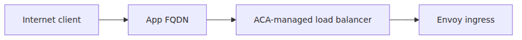
**[Documented]** ACA owns the public ingress edge.
**[Inferred from Envoy upstream behavior]** Envoy is the most defensible anchor for the HTTP-aware routing decisions after that edge.

That division is documented at the feature level by Microsoft.
The exact internal object names and hop-by-hop data-plane wiring are not.

---

## TLS ends at ingress, not at your container by default

Microsoft documents TLS termination at the ingress point for HTTP ingress.
That means the HTTPS connection from the client is terminated before the request is forwarded to the user container.

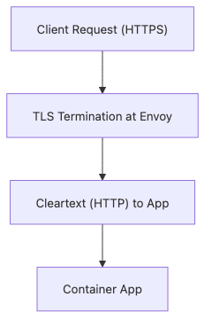
Operationally, this explains several things.

- The app often sees forwarded headers instead of the original TLS socket.
- Certificate handling belongs to the ingress surface.
- Protocol confusion can happen if the app ignores forwarded headers and assumes it owns the client-facing TLS boundary.

This is normal reverse-proxy behavior, and ACA documents the forwarded headers that help your app recover the original request context.

---

## Forwarded headers are part of the ingress contract

ACA ingress documents headers such as:

- `X-Forwarded-Proto`
- `X-Forwarded-For`
- `X-Forwarded-Client-Cert` in the appropriate certificate modes

These headers exist because the app is behind a proxy boundary.

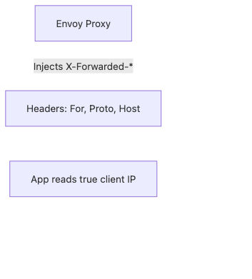
If your app builds absolute URLs, enforces scheme-aware redirects, or logs client IP, these headers are part of the real runtime path, not optional decoration.

---

## The routing step happens before the inferred service hop

After TLS termination, a proxy has to choose an upstream destination.
That choice can be simple or weighted.

**[Documented]** Microsoft documents revision traffic splitting as an ingress feature.
**[Inferred from Envoy upstream behavior]** If multiple revisions are active, the most defensible explanation is that Envoy applies weighted upstream selection before forwarding.

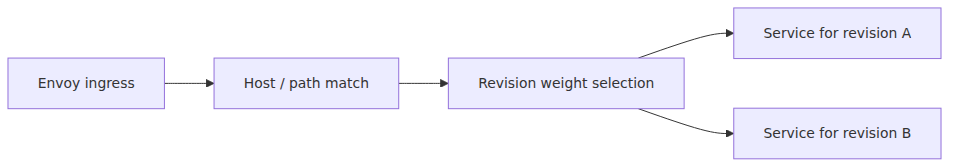
This is exactly why episode 3 framed traffic splitting as ingress routing data.
The selection must happen here, not later inside the app.

---

## Envoy weight means upstream cluster weight

Repeat the vocabulary carefully.

In Envoy, a cluster is an upstream service target.
It is not a Kubernetes cluster.

Pinned Envoy route API source defines weighted cluster configuration at the routing layer.
That is the right conceptual match for ACA revision traffic splitting, but still an inference rather than an ACA-published configuration dump.

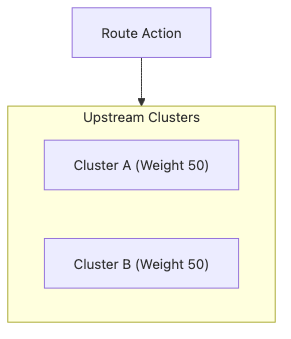
So when readers ask where ACA's 80/20 split "really lives," the safest answer is: in ingress routing state that, by the best-supported Envoy inference, selects among revision upstreams using weighted destinations.

---

## The service-style hop is easy to forget because ACA hides Kubernetes

From the user's point of view, traffic goes to "the revision."
**[Inferred from Kubernetes Service patterns]** The most defensible hidden data-plane model is still a service-style hop between ingress routing and pod replicas.

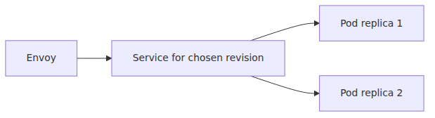
That hop matters because the upstream destination chosen by the proxy is unlikely to be one individual pod.
The most Kubernetes-consistent inference is a revision-scoped endpoint set that fans into ready replicas.

This is also where scaling and ingress finally meet.
At a product level, traffic can only succeed once ready replicas exist behind the chosen upstream.

---

## Readiness is part of the ingress path whether you think about it or not

Episode 3 discussed readiness as the gate before traffic moves to a new revision.
Episode 4 discussed scale activation and replica creation.
Here both ideas meet.

**[Documented]** ACA does not shift traffic to a new revision until it is ready.
**[Inferred from Envoy upstream behavior + Kubernetes Service patterns]** Even if ingress knows a revision exists, the request still needs healthy upstream endpoints behind the selected revision target to complete.

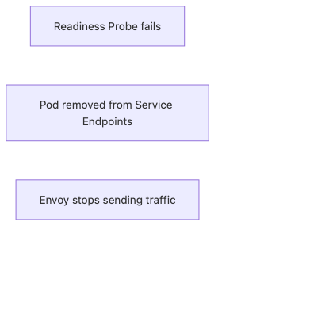
That is why ingress debugging is inseparable from revision state and replica readiness.
The request path is cross-cutting by design.

---

## The first request to a scale-to-zero revision is special

**[Documented]** ACA supports scale-to-zero.
That means the first request path may target a revision with no warm replicas yet.

Microsoft documents the wake-from-zero behavior at the scale-rule level.
The exact Envoy, queueing, and routing behavior during a private 0 -> 1 transition is Microsoft-owned and closed-source.

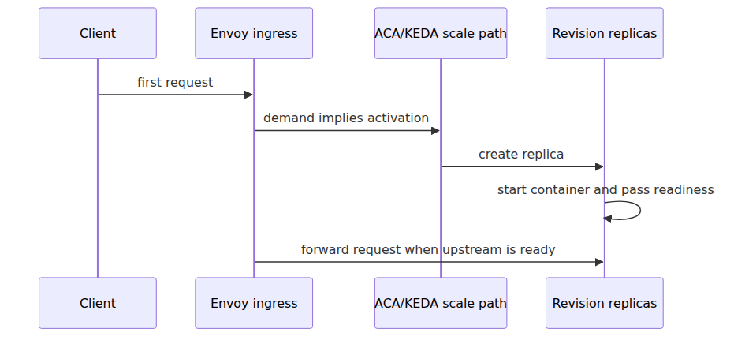
This is the point where ingress and autoscaling stop being separate topics.
The operator-safe statement is only that the first request may have to wait for the scale path to produce a ready upstream.

---

## Why the first request can feel slower even when the platform is healthy

If a revision is at zero, the first request is paying for several hidden steps.

- activation decision
- replica creation
- image start path if needed
- app startup
- probe success
- sidecar startup if Dapr is enabled

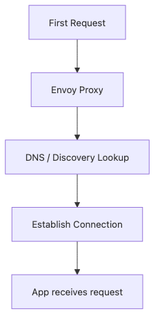
**[Documented]** Microsoft documents the scale-to-zero and revision-readiness behaviors that make this delay possible.
**[Not public]** The exact buffering, retry, or queueing behavior inside ACA's ingress plane during that moment is not documented.

---

## Dapr adds another runtime participant behind the ingress path

**[Documented]** If Dapr is enabled, the pod that finally receives the request may contain both your container and `daprd`.

**[Inferred from Kubernetes Service patterns]** The ingress path still terminates at a pod endpoint rather than inside the control plane.
**[Documented + upstream Dapr context]** What happens immediately after that may involve the sidecar when Dapr is enabled.

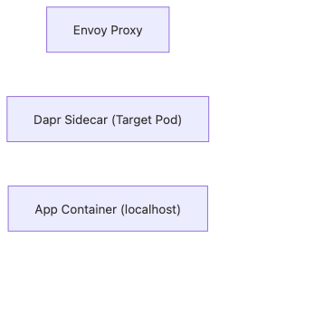
This is why one failing end-user request can span ingress routing, revision readiness, pod startup, and sidecar behavior in one chain.

---

## Session affinity lives at ingress too

ACA documents sticky sessions as an ingress feature.
That is another clue that ingress owns more than coarse routing.

If session affinity is enabled, **[Documented]** ACA keeps stickiness at ingress, while **[Inferred from Envoy upstream behavior]** the concrete mechanism is best understood as standard proxy-level affinity handling.
That happens before the request reaches the app.

The important point for this series is not every sticky-session detail.
It is that revision and replica selection are still proxy concerns.

---

## Internal ingress follows the same broad shape without the public edge

For internal-only apps, the internet-facing part disappears.
**[Documented]** The app still sits behind ACA ingress.
**[Inferred from Kubernetes Service patterns]** The downstream service-routing shape is likely still similar even though the public edge is gone.

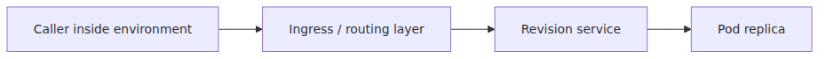
**[Documented]** The transport path changes at the edge.
**[Inferred from Envoy + Kubernetes patterns]** The proxy-routing and service-upstream logic is likely still recognizably similar.

---

## A practical ingress debugging ladder

When the request fails, walk the path in order.

1. Can the client resolve and reach the public FQDN?
2. Is ingress enabled with the expected external or internal posture?
3. Is TLS termination and scheme handling correct?
4. Is traffic being routed to the expected revision or label?
5. Does the chosen revision have ready replicas behind its inferred service/upstream target?
6. Does the user container respond correctly once the request arrives?

This ladder is just the request path turned into an operator checklist.

---

## The whole request path in one diagram

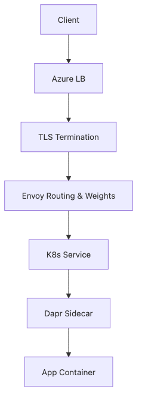
This is the final "all boxes connected" picture for the series.

**[Documented]** The environment contains the network boundary, revisions provide immutable deployment targets, and KEDA-backed scaling can create replicas.
**[Documented]** Dapr may be present beside the app.
**[Inferred from Envoy upstream behavior]** Envoy is the best runtime anchor for the routing layer.
**[Inferred from Kubernetes Service patterns]** A service-style hop is the best explanation for how ingress reaches ready replicas.

---

## Episode 6 wrap

The compressed model is this.

> In Azure Container Apps, the documented part of the first external HTTP request is the ACA-managed ingress surface: FQDN, TLS termination, forwarded headers, traffic splitting, and session affinity. The most defensible inference is that an Envoy-based routing layer then selects a revision upstream and reaches ready replicas through Kubernetes-style service patterns. The exact private 0 -> 1 routing path inside ACA is not public.

That is the ingress path that ties the whole series together.

---

## Where this fits in the series

This final part closed the loop on every earlier concept in the series. The environment supplied the network boundary, revisions supplied immutable traffic targets, KEDA supplied ready replicas, and Dapr could supply an additional sidecar runtime once the request reached the pod. If you want the product-level on-ramp before revisiting these internals, the ACA 101 series is the right companion, and the AKS and Azure Functions deep dives provide useful contrast in how much of the underlying platform each service exposes.

---

## Evidence Boundaries

This chapter is the most inference-sensitive part of the series, so every major claim is bucketed explicitly.

**Documented (Microsoft Learn / primary sources):**
- ACA ingress provides FQDNs, TLS termination, forwarded headers, revision traffic splitting, session affinity, and scale-to-zero support.
- Revision readiness gates traffic movement, and ACA documents scaling behavior at the product surface.
- Dapr can be present in the pod when enabled.

**Inferred from upstream behavior:**
- Envoy route matching, weighted upstream selection, and proxy-level affinity behavior are inferred from standard Envoy semantics.
- Service, endpoint, and ready-replica hops are inferred from standard Kubernetes Service patterns.

**Speculation (ACA-internal, not exposed):**
- The exact ingress object graph, queueing strategy, buffering behavior, and 0 -> 1 request handling inside ACA are not public and should not be stated as fact.

<!-- toc:begin -->
## In this series

- [ACA architecture — what Microsoft layered on a hidden Kubernetes](./01-aca-architecture.md)
- [Environment internals — the network, observability, and Dapr scope boundary](./02-environment-internals.md)
- [Revisions and traffic splitting — where Envoy weights come from](./03-revision-and-traffic-split.md)
- [KEDA inside ACA — what a scale rule actually creates](./04-keda-in-aca.md)
- [Dapr sidecar internals — the Go process that lives next to your container](./05-dapr-sidecar-internals.md)
- **The Envoy ingress path — how the first request reaches your container (current)**

<!-- toc:end -->

---

## References

### Primary sources
- [`Envoy` route components at `v1.30.0`](https://github.com/envoyproxy/envoy/blob/v1.30.0/api/envoy/config/route/v3/route_components.proto)
- [`Envoy` router implementation at `v1.30.0`](https://github.com/envoyproxy/envoy/blob/v1.30.0/source/common/router/config_impl.cc)

### Secondary sources
- [Ingress in Azure Container Apps](https://learn.microsoft.com/en-us/azure/container-apps/ingress-overview)
- [Traffic splitting in Azure Container Apps](https://learn.microsoft.com/en-us/azure/container-apps/traffic-splitting)
- [Update and deploy changes in Azure Container Apps](https://learn.microsoft.com/en-us/azure/container-apps/revisions)
- [Scaling in Azure Container Apps](https://learn.microsoft.com/en-us/azure/container-apps/scale-app)

### Related series
- [Azure Container Apps 101](../../azure-aca-101/en/)
- [Azure AKS Deep Dive](../../azure-aks-deep-dive/en/)
- [Azure Functions Deep Dive](../../azure-functions-deep-dive/en/)

Tags: Container Apps, KEDA, Dapr, Envoy
