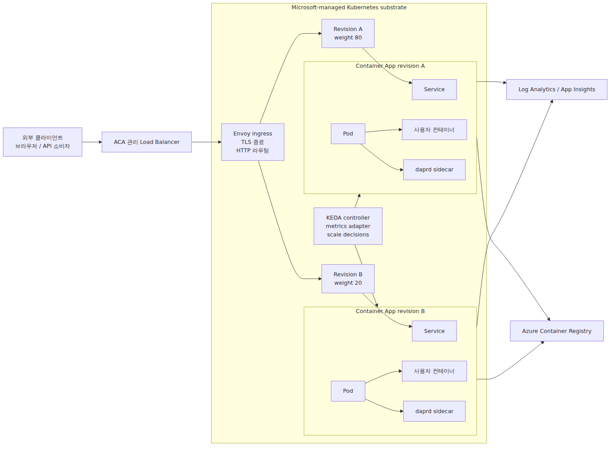
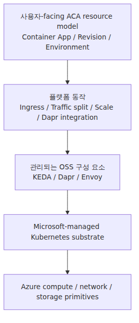
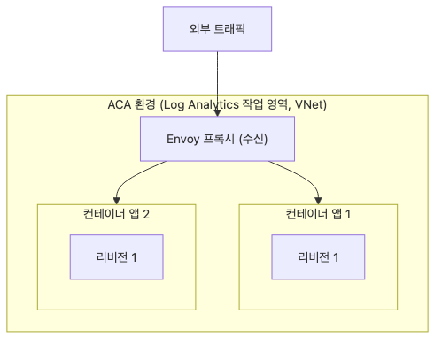
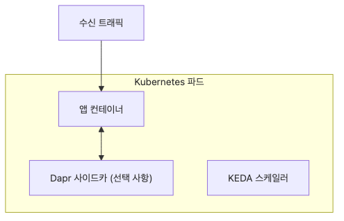
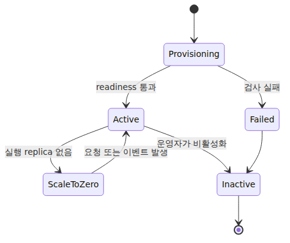
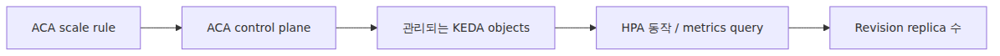
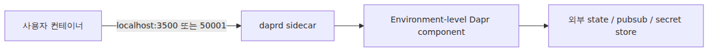
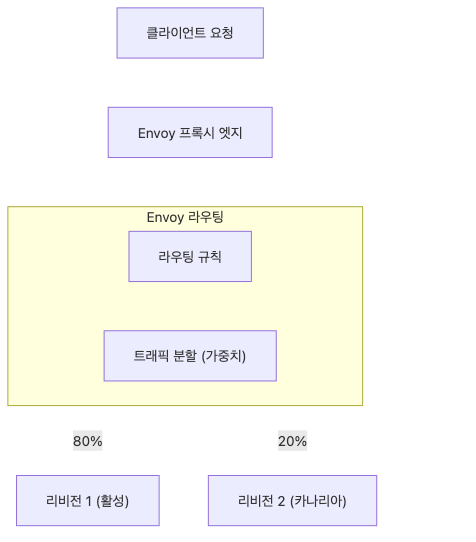
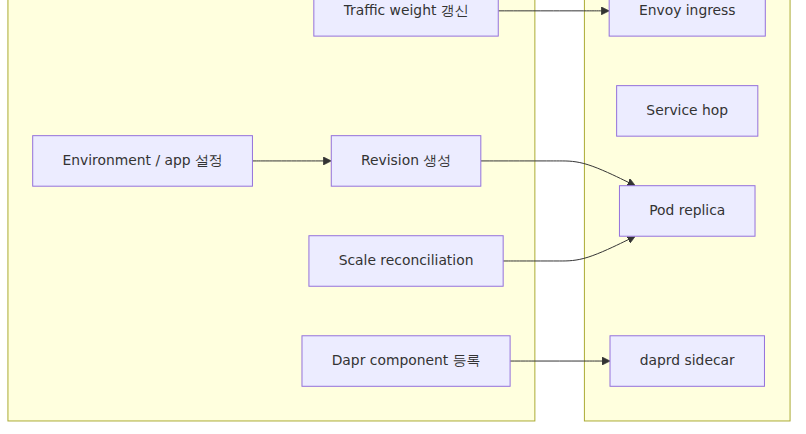

# ACA 아키텍처 — 사용자에게 보이지 않는 Kubernetes 위에 얹은 것

Azure Container Apps를 처음 보면 설명이 꽤 단순합니다. 컨테이너 이미지를 올리고, Ingress를 켜고, 필요하면 Dapr와 스케일 규칙을 붙이면 플랫폼 운영은 Microsoft가 맡는다는 이야기입니다. 제품 소개로는 충분하지만, 운영자가 알아야 할 내부 경계까지 보여 주지는 않습니다.

그래서 입문 직후에 흔한 오해가 생깁니다. ACA를 “AKS에서 Kubernetes를 숨긴 버전” 정도로 보거나, 반대로 “컨테이너만 올리면 되는 완전히 새로운 런타임”으로 이해하는 경우입니다. 둘 다 절반만 맞습니다. ACA는 Kubernetes를 지운 서비스가 아니라, Kubernetes 위에 관리형 제품 표면을 올린 서비스입니다.

이 글은 Azure Container Apps Deep Dive 시리즈의 첫 번째 글입니다. 여기서는 Azure Container Apps를 하나의 박스로 보지 않고, Environment·Revision·KEDA·Dapr·Envoy가 각각 어느 층에서 어떤 역할을 맡는지 전체 지도로 정리하겠습니다.

이 관점을 먼저 잡아 두면 뒤의 다섯 편이 기능 설명으로 흩어지지 않습니다. Environment는 왜 격리 경계인지, Revision은 왜 배포 이력이 아니라 런타임 단위인지, 트래픽 분할과 스케일링은 왜 서로 다른 제어 루프인지 같은 질문이 한 그림 안에서 연결되기 때문입니다.

이제 ACA를 “숨겨진 Kubernetes 위의 관리형 제품 표면”이라는 시각으로 읽어 보겠습니다.

## 이 글에서 다룰 문제

- ACA는 정확히 어떤 추상화 위에 어떤 추상화를 올린 서비스일까요?
- AKS와 비교할 때 Microsoft가 대신 떠안는 운영 책임과 사용자가 여전히 이해해야 할 책임은 무엇일까요?
- Environment는 단순한 상위 리소스가 아니라 왜 실제 격리 경계라고 봐야 할까요?
- Revision, KEDA, Dapr, Envoy는 각각 어느 층에서 런타임 동작을 설명할까요?
- Control plane 문제와 data plane 문제를 어떻게 구분해야 할까요?

## 왜 이 글이 중요한가

ACA를 제품 표면만 보고 쓰면 초기 경험은 편합니다. 하지만 실제 운영에서 부딪히는 문제는 대부분 추상화 아래층에서 발생합니다. 새 Revision은 떴는데 왜 트래픽을 못 받는지, 스케일 규칙은 있는데 왜 Replica가 0에 머무는지, Dapr를 켰는데 왜 localhost 호출만 성공하고 바깥 의존성은 실패하는지 같은 질문은 포털 화면만으로는 설명되지 않습니다.

특히 ACA는 AKS처럼 `kubectl`로 안쪽을 직접 열어 보지 못합니다. 그렇다고 내부를 모른 척할 수는 없습니다. 오히려 제품이 숨기는 층을 어떤 개념으로 추론해야 하는지 아는 편이 더 중요합니다. 그래야 로그, Revision 상태, Ingress 동작, Dapr 상태, 스케일 결과를 보고 어디 경계에서 문제가 생겼는지 빠르게 좁힐 수 있습니다.

이 글은 그 출발점입니다. 시리즈 전체에서 계속 등장할 명사들을 먼저 구조화해 두면, 이후의 KEDA·Dapr·Envoy·Revision 이야기가 각각 독립 기능이 아니라 하나의 런타임 모델의 다른 단면으로 읽히기 시작합니다.

## ACA 아키텍처를 이해하는 가장 좋은 방법: 숨겨진 Kubernetes 위의 제품 계층으로 보는 것입니다

ACA를 이해할 때 가장 유용한 문장은 이것입니다. **Azure Container Apps는 정확한 substrate가 공개되지 않은 Microsoft 관리 Kubernetes 위에, Environment·Revision·Ingress·Autoscaling·Dapr 같은 제품 기능을 올린 관리형 표면**입니다. 저는 이 문장이 시리즈 전체의 기준점이라고 생각합니다.

이 관점을 잡으면 여러 현상이 한 번에 정리됩니다. Environment는 네트워크와 관측, Dapr 스코프를 공유하는 격리 단위이고, Revision은 불변 배포 스냅샷이며, KEDA는 스케일 엔진이고, Envoy는 Ingress와 가중치 라우팅 층이며, Dapr는 실제 사이드카 런타임입니다. 즉 ACA의 기능들은 포털 메뉴 이름이 아니라 서로 다른 실행 계층의 표면입니다.

또한 이 모델은 과장과 추정을 분리하게 해 줍니다. Microsoft가 공개한 사실은 제품 동작으로 고정하고, KEDA·Dapr·Envoy에 관한 설명은 pinned upstream 동작을 근거로 제한적으로 추론해야 합니다. 이것이 ACA 심화 글을 정확하게 쓰는 가장 안전한 방법입니다.

> ACA는 Kubernetes를 없앤 서비스가 아닙니다. Kubernetes 위에서 사용자가 직접 다루지 않도록 감춘 영역과, 제품으로 노출한 제어 표면을 분리해 놓은 서비스입니다.

## 핵심 개념

### 전체 그림은 Environment 하나에서 시작합니다

ACA의 전체 구조를 한 번에 보면 시리즈가 훨씬 읽기 쉬워집니다. 사용자가 보는 요청 경로, 여러분이 설정하는 제품 표면, 그 아래의 숨은 substrate, 그리고 이미지와 텔레메트리가 빠져나가는 운영 경로를 같은 그림에 놓아야 합니다.



*요청 경로와 숨은 substrate 계층 구조*

이 그림에서 왼쪽은 사용자 요청 경로입니다. 가운데는 여러분이 Container Apps 리소스로 다루는 설정 표면입니다. 점선 경계 아래는 직접 제어하지 않는 Kubernetes 계층이고, 오른쪽은 이미지 레지스트리와 관측 계층처럼 요청 경로 밖의 운영 표면입니다.

### Kubernetes가 안 보인다고 없는 것은 아닙니다

ACA를 볼 때 가장 먼저 교정해야 할 오해는 “클러스터를 안 보여 주니 Kubernetes는 중요하지 않다”는 생각입니다. 중요한 것은 그대로 있지만, Microsoft가 운영 책임과 인터페이스를 대신 가져갔을 뿐입니다.

이 차이는 AKS와 비교하면 더 선명합니다. ACA에서는 클러스터 API endpoint를 직접 운영하지 않고, 노드에 직접 접근하지 않으며, 기저 control plane에 `kubectl`을 쓰지 않고, 임의의 클러스터 전역 add-on을 설치하지도 않습니다. 대신 여전히 Pod 같은 런타임 단위, Service 같은 내부 홉, Revision 불변성, KEDA 기반 스케일링, Dapr 사이드카, Envoy 기반 라우팅 같은 Kubernetes 인접 개념을 상대하게 됩니다.

### ACA는 층으로 나눠야 설명됩니다

ACA의 동작을 예측하려면 하나의 서비스로 보지 말고 층으로 분해해야 합니다. 선언 계층, 런타임 번역 계층, 실제 실행 계층으로 나누어 보면 예상 밖의 동작이 어느 경계에서 생겼는지 훨씬 빨리 감이 옵니다.



*선언 계층과 런타임 번역 계층*

- Environment 설정 하나는 그 안의 모든 앱에 영향을 줍니다.
- Revision 범위 설정 하나는 새 불변 스냅샷을 만듭니다.
- Scale rule은 KEDA/HPA류 동작으로 번역됩니다.
- Dapr 설정은 사이드카 프로세스와 localhost 포트로 나타납니다.
- Traffic split은 Envoy 가중치 라우팅으로 이해하는 편이 가장 방어 가능합니다.

### Environment는 장식이 아니라 격리 경계입니다

Environment는 상위 폴더 같은 리소스가 아닙니다. 같은 Environment 안의 앱은 같은 가상 네트워크 경계, 같은 DNS 맥락, 같은 Log Analytics 대상, 같은 Dapr component 범위를 공유합니다. 이 때문에 Environment 선택은 배포 편의가 아니라 아키텍처 결정입니다.



*Environment가 묶는 네트워크·로그·Dapr 경계*

서로 같은 네트워크 평면과 관측 평면을 공유하면 안 되는 워크로드라면 같은 Environment에 두면 안 됩니다. 반대로 내장 Dapr 호출과 공용 관측 계층을 함께 써야 한다면 Environment가 바로 그 묶음 단위입니다.

### Container App보다 Revision이 런타임에 더 가깝습니다

사용자는 “앱을 업데이트했다”고 느끼지만, 런타임은 그보다 더 세분화되어 있습니다. ACA는 앱 전역 설정과 Revision 템플릿성 설정을 분리하고, 이미지·컨테이너 템플릿·스케일 규칙처럼 Revision 범위 설정이 바뀌면 새 Revision을 만듭니다. 그리고 그 Revision은 불변입니다.



*App·Revision·Replica로 이어지는 런타임 구조*

이 구조를 받아들이면 배포와 롤백이 왜 그렇게 동작하는지 설명이 됩니다. 최신 Revision을 수정하는 것이 아니라, 새 불변 스냅샷을 만들고 트래픽과 스케일 정책을 그 스냅샷에 붙이는 방식이기 때문입니다.

### Revision은 운영의 중심축입니다

ACA에서 Revision은 단순한 배포 기록이 아닙니다. 실제로 주소를 갖고 살아 있는 런타임 단위입니다. 하나만 active로 유지할 수도 있고, 여러 Revision을 동시에 띄울 수도 있으며, Revision 사이에 트래픽을 분할하고, label로 직접 접근 경로를 줄 수도 있습니다.



*Revision 중심 운영 제어 구조*

여기서 중요한 미묘함은 트래픽 정책은 앱 표면에서 보이지만, 스케일은 Revision 단위로 일어난다는 점입니다. 이 분리를 이해해야 canary와 blue-green을 제대로 설명할 수 있습니다.

### KEDA는 보이지 않아도 스케일링의 기준점입니다

ACA의 스케일링은 선언형입니다. `minReplicas`, `maxReplicas`, HTTP·TCP·custom rule을 적으면 플랫폼이 나머지를 처리합니다. 하지만 그 엔진이 KEDA라는 사실이 중요합니다. 그래야 event-driven scale decision, scale-to-zero, per-revision min/max replica, external metric 기반 HPA류 판단을 한 모델 안에서 읽을 수 있습니다.



*ACA scale rule과 KEDA 번역 경로*

특히 custom rule은 KEDA scaler 개념과 거의 직접 대응합니다. HTTP scaling은 KEDA의 사고방식과 닮아 있지만, upstream `kedacore/http-add-on`을 ACA가 1:1로 그대로 쓴다고 단정해서는 안 됩니다.

### Dapr는 실제 사이드카 런타임입니다

ACA가 Dapr 비슷한 API를 흉내 내는 것이 아닙니다. 앱에 Dapr를 켜면 사용자 컨테이너 옆에 `daprd` 계열의 실제 사이드카 프로세스가 붙고, 앱은 localhost 포트로 그 런타임과 대화합니다. Component는 Environment 수준에서 정의되고, Dapr scope에 따라 각 앱에 로드됩니다.



*앱 컨테이너와 daprd 사이드카 결합 구조*

이 점이 중요한 이유는 Dapr 문제를 애플리케이션 코드 문제로만 보면 안 되기 때문입니다. 이제부터는 사이드카 부팅, component scope, sidecar 로그, 인증 재료 같은 별도 런타임도 함께 봐야 합니다.

### Envoy는 Ingress가 실제 라우팅으로 바뀌는 곳입니다

포털에서 보는 Ingress 설정은 간단하지만, 런타임 경로는 그렇지 않습니다. TLS 종료, HTTP/1.1·HTTP/2, gRPC, 안정적인 FQDN, session affinity, traffic split은 모두 reverse proxy가 맡는 일입니다. ACA에서 그 프록시 층을 설명하는 가장 좋은 기준점이 Envoy입니다.



*Ingress 설정과 Envoy 라우팅 연결*

특히 Envoy에서 cluster는 Kubernetes cluster가 아니라 upstream target이라는 점을 기억해야 합니다. 그래야 ACA의 Revision traffic split을 weighted upstream selection으로 이해할 수 있습니다.

### Control plane과 data plane을 분리해 봐야 문제를 좁힐 수 있습니다

ACA 디버깅은 결국 어느 경계에서 실패했는지 구분하는 일입니다. 새 Revision은 생겼는데 트래픽을 못 받는다면 보통 control plane 결정 쪽입니다. 트래픽은 들어오는데 앱 응답 전에 실패한다면 data plane 경로 문제일 가능성이 큽니다. scale rule은 있는데 replica가 0에 머문다면 KEDA metric과 activation 논리를 봐야 합니다.



*ACA control plane과 data plane 분리*

이 시리즈 전체는 사실 이 경계들을 하나씩 걷는 과정입니다. Architecture, Environment, Revision, KEDA, Dapr, Envoy는 모두 서로 다른 장애 지점을 설명하는 언어이기도 합니다.

### AKS와 비교할 때 잃는 것과 얻는 것을 같이 봐야 합니다

ACA와 AKS의 차이를 짧게 말하면 제어권입니다. AKS에서는 클러스터 표면을 더 많이 직접 선택하고 운영합니다. 반대로 ACA에서는 Microsoft가 더 많은 결정을 대신 가져가고, 그 대가로 사용자는 더 좁은 제품 표면과 더 단순한 배포 경험을 얻습니다.

이 차이는 단순한 편의성 비교가 아닙니다. 트러블슈팅의 진입점, 변경 승인 방식, 관측 포인트, 운영 문서의 구성까지 바꿉니다. AKS에서는 native Kubernetes object를 직접 열어 보는 흐름이 자연스럽지만, ACA에서는 product feature, revision 상태, ingress 동작, sidecar 로그, scale 결과를 통해 아래층 상태를 추론하는 흐름이 더 자연스럽습니다.

즉 ACA가 모호한 서비스라는 뜻이 아닙니다. **진실에 접근하는 창문이 다르다**는 뜻입니다. 이 차이를 받아들여야 “왜 kubectl이 안 되지?”라는 불만에서 멈추지 않고, 대신 어떤 제품 표면이 lower-layer state를 가장 잘 드러내는지 찾게 됩니다.

### 공개 사실과 제한적 추론을 분리하는 습관이 필요합니다

ACA 심화 글을 읽거나 쓸 때 가장 중요한 태도 중 하나는 증거 경계입니다. Microsoft Learn이 직접 말한 제품 동작과, KEDA·Dapr·Envoy upstream 동작을 바탕으로 한 제한적 추론을 같은 문장으로 섞으면 설명이 금방 과장됩니다.

실무적으로는 다음 기준이 유용합니다.

- Microsoft Learn에 있는 항목은 제품 계약으로 다룹니다.
- KEDA·Dapr·Envoy의 공개 소스는 하위 런타임 모델의 기준점으로 사용합니다.
- 정확한 내부 adapter, object 이름, private control plane topology는 추정하더라도 사실처럼 단정하지 않습니다.

이 원칙을 지키면 closed-source 제품을 다루면서도 정확성을 잃지 않을 수 있습니다. 이 시리즈가 계속 같은 버전의 upstream source를 인용하는 이유도 바로 여기 있습니다.

### 이 아키텍처 지도가 뒤의 다섯 편을 어떻게 묶는가

1편의 역할은 기능을 많이 설명하는 데 있지 않습니다. 오히려 뒤의 글들이 어디에 걸리는지 먼저 좌표를 찍는 데 있습니다. 2편의 Environment는 격리 경계를 다루고, 3편의 Revision은 immutable rollout target을, 4편의 KEDA는 replica control loop를, 5편의 Dapr는 sidecar runtime을, 6편의 Envoy는 request path를 담당합니다.

이렇게 보면 “ACA는 기능이 많다”는 인상보다 “ACA는 여러 제어 루프와 런타임 계층을 제품 표면으로 정리한 서비스”라는 인상이 남습니다. 저는 후자가 훨씬 운영에 도움이 된다고 생각합니다.

### 운영 질문을 이 지도 위에 올리면 답이 빨라집니다

실제 현업 질문을 이 아키텍처 지도 위에 올려 보면 구조가 더 또렷해집니다. “새 Revision이 생겼는데 왜 메인 URL에서 안 보이지?”라는 질문은 Revision과 Ingress 사이의 문제입니다. “Dapr API는 응답하는데 backing store는 왜 실패하지?”라는 질문은 sidecar와 component scope, 외부 경로 문제입니다. “scale rule은 있는데 왜 replica가 0이지?”라는 질문은 KEDA activation과 metric 입력 문제입니다.

즉 운영 질문을 서비스 이름 기준이 아니라 계층 기준으로 재분류해야 합니다. ACA 문제 해결 속도는 이 재분류를 얼마나 빨리 하느냐에 크게 좌우됩니다. 저는 이 감각이 생기면 포털 메뉴를 외우는 것보다 훨씬 빠르게 원인 후보를 줄일 수 있다고 봅니다.

또한 이 지도는 장애 분류뿐 아니라 변경 리뷰에도 유용합니다. 어떤 변경이 Environment 범위인지, 어떤 변경이 새 Revision을 만드는지, 어떤 변경이 트래픽 경로를 바꾸는지, 어떤 변경이 sidecar 동작에 영향을 주는지를 먼저 분류하면 배포 위험도를 훨씬 정확히 말할 수 있습니다.

### 운영자가 바로 확인할 수 있는 기본 정보

아래 명령은 Environment의 네트워크, Dapr, workload profile 정보를 한 번에 보는 기본 출발점입니다.

```bash
az containerapp env show \
  --name my-env --resource-group my-rg \
  --query "{name:name, vnet:vnetConfiguration.infrastructureSubnetId, dapr:daprAIInstrumentationKey, workload:workloadProfiles[].name}"

az containerapp env workload-profile list \
  --name my-env --resource-group my-rg \
  -o table
```

이 명령은 “내가 지금 어느 Environment 위에서 어떤 경계를 공유하고 있는가”를 빠르게 확인할 때 유용합니다. 특히 이후 글의 네트워크, Dapr, scale 관련 논의를 실제 환경과 연결하는 첫 점검으로 좋습니다.

## 흔히 헷갈리는 지점

- **ACA는 Kubernetes를 안 쓰는 서비스가 아닙니다.** Kubernetes를 관리형 제품 표면 뒤로 감춘 서비스입니다.
- **Environment는 상위 폴더가 아닙니다.** 네트워크, 관측, Dapr 범위를 함께 묶는 실제 격리 경계입니다.
- **Revision은 배포 로그가 아닙니다.** 트래픽과 스케일 정책이 붙는 불변 런타임 스냅샷입니다.
- **KEDA를 직접 못 본다고 스케일 엔진이 사라지는 것은 아닙니다.** 오히려 보이지 않기 때문에 KEDA 모델을 이해해야 합니다.
- **Envoy cluster를 Kubernetes cluster로 읽으면 안 됩니다.** 여기서는 upstream destination을 뜻합니다.

## 운영 체크리스트

- [ ] Environment 단위 책임 분담(Microsoft vs 우리 팀)을 ADR에 기록했습니다.
- [ ] 같은 Environment에 둘 앱들이 네트워크·로그·Dapr 경계를 공유해도 되는지 검토했습니다.
- [ ] Revision 범위 변경과 앱 범위 변경을 코드 리뷰 기준에 분리해 두었습니다.
- [ ] KEDA, Dapr, Envoy 관련 설명에서 공개 사실과 upstream 추론을 문서상으로 구분했습니다.
- [ ] Control plane 장애와 data plane 장애를 다른 점검 순서로 대응하도록 운영 문서를 정리했습니다.

## 정리

이 글의 핵심은 ACA를 하나의 관리형 컨테이너 서비스가 아니라, **숨겨진 Kubernetes 위에 여러 제어 표면을 올린 제품**으로 보는 것입니다. Environment는 격리 경계이고, Revision은 불변 런타임 단위이며, KEDA는 스케일 엔진이고, Dapr는 실제 사이드카 런타임이며, Envoy는 Ingress와 가중치 라우팅 계층입니다.

이 관점을 잡으면 뒤의 기능들이 더 이상 따로 놀지 않습니다. 트래픽 분할은 Revision과 Envoy 이야기이고, scale-to-zero는 Revision과 KEDA 이야기이며, Dapr component scope는 Environment와 sidecar 이야기입니다. 즉 각 기능은 하나의 런타임 구조 안에서 만납니다.

다음 글부터는 이 큰 그림의 박스를 하나씩 확대합니다. 먼저 Environment를 깊게 보면서 네트워크, 관측, Dapr 스코프가 왜 모두 같은 경계에서 묶이는지 살펴보겠습니다.

<!-- toc:begin -->
## 시리즈 목차

- **ACA 아키텍처 — 사용자에게 보이지 않는 Kubernetes 위에 얹은 것 (현재 글)**
- Environment 내부 — 네트워크·관측·Dapr 스코프의 경계 (예정)
- Revision과 트래픽 분할 — Envoy 가중치는 어디에서 오는가 (예정)
- ACA 안의 KEDA — Scale Rule이 만드는 것 (예정)
- Dapr 사이드카 내부 — 컨테이너 옆에 뜨는 Go 프로세스 (예정)
- Envoy Ingress 경로 — 첫 요청이 사용자 컨테이너에 닿기까지 (예정)

<!-- toc:end -->

## 참고 자료

### 공식 문서
- [Azure Container Apps environments](https://learn.microsoft.com/en-us/azure/container-apps/environment)
- [Update and deploy changes in Azure Container Apps](https://learn.microsoft.com/en-us/azure/container-apps/revisions)
- [Traffic splitting in Azure Container Apps](https://learn.microsoft.com/en-us/azure/container-apps/traffic-splitting)
- [Scaling in Azure Container Apps](https://learn.microsoft.com/en-us/azure/container-apps/scale-app)
- [Microservice APIs Powered by Dapr](https://learn.microsoft.com/en-us/azure/container-apps/dapr-overview)
- [Dapr Components in Azure Container Apps](https://learn.microsoft.com/en-us/azure/container-apps/dapr-components)
- [Ingress in Azure Container Apps](https://learn.microsoft.com/en-us/azure/container-apps/ingress-overview)

### 관련 시리즈
- [Azure Container Apps 101](../../azure-aca-101/ko/)
- [Azure AKS Deep Dive](../../azure-aks-deep-dive/ko/)
- [Azure Functions Deep Dive](../../azure-functions-deep-dive/ko/)

Tags: Container Apps, KEDA, Dapr, Envoy
