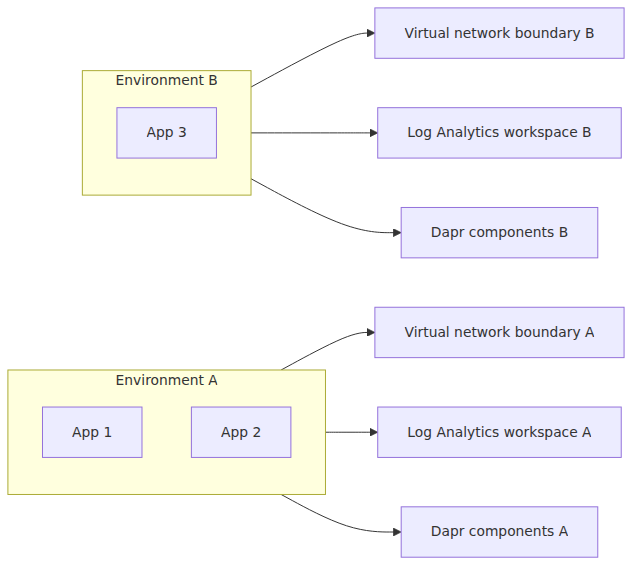
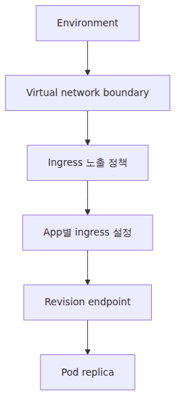
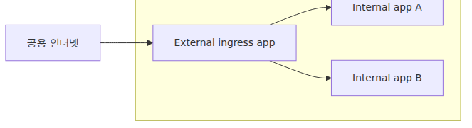
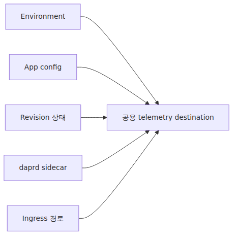
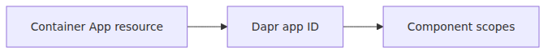
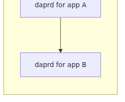
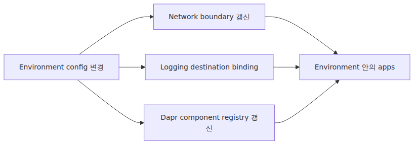

# Environment 내부 — 네트워크·관측·Dapr 스코프의 경계

> Azure Container Apps Deep Dive 시리즈 (2/6)

1화에서는 스택 전체 지도를 그렸습니다.
이번 2화는 겉으로 보면 행정 단위처럼 보이지만, 안으로 들어가면 아키텍처 경계인 리소스 하나만 봅니다.
바로 Container Apps Environment입니다.

Microsoft Learn 문서의 문장을 하나만 기억한다면 이 뜻을 기억하면 됩니다.
Environment는 하나 이상의 container app과 job을 둘러싼 secure boundary입니다.

이 문장 하나가 생각보다 많은 것을 설명합니다.

네트워크 범위가 어디서 시작되는지 알려 줍니다.
로그가 어디로 모이는지 알려 줍니다.
Dapr component가 어디서 공유되는지 알려 줍니다.
앱을 어떤 Environment에 넣는 일이 왜 네이밍 문제가 아니라 설계 문제인지 알려 줍니다.

---

## Environment는 플랫폼의 격리 단위입니다

Environment는 ACA가 단일 앱 호스트가 아니라 플랫폼처럼 보이기 시작하는 지점입니다.

같은 Environment 안의 앱들은 다음을 공유할 수 있습니다.

- Virtual network boundary
- Ingress 표면과 DNS suffix
- Log Analytics 대상
- Dapr component registry와 scope
- Environment 내부 서비스 도달성

Environment 밖의 앱은 이것들을 자동으로 공유하지 않습니다.

운영 관점의 결과는 분명합니다.
같은 blast radius와 관측 평면을 공유해야 한다면 하나의 Environment가 자연스럽습니다.
네트워크·로깅·Dapr 구성이 분리되어야 한다면 Environment부터 나누는 편이 맞습니다.

---

## 네트워크 범위는 Revision이 아니라 Environment에서 시작됩니다

Revision은 런타임 스냅샷입니다.
네트워크 섬은 아닙니다.

네트워크 경계는 Environment가 가집니다.
Microsoft 문서도 각 Environment가 플랫폼 제공 또는 사용자 제공 virtual network 위에 놓인다고 설명합니다.
그래서 internal reachability나 ingress posture는 app 결정이기 전에 environment 결정입니다.

층으로 나누면 이해가 쉽습니다.

App마다 ingress on/off를 고를 수 있습니다.
External인지 internal인지도 앱별로 고를 수 있습니다.
하지만 그 선택은 여전히 하나의 Environment 네트워크 경계 안에서 이뤄집니다.

이 차이를 놓치면, 내부적으로 절대 같은 메시에 두면 안 되는 워크로드를 같은 Environment에 넣는 실수를 하게 됩니다.

---

## External ingress와 internal ingress도 같은 Environment 표면 위에 있습니다

Ingress overview 문서는 app마다 external 또는 internal ingress를 설정할 수 있다고 분명히 적습니다.

이 설명은 app-local입니다.
그러나 environment-free는 아닙니다.

Microservice 구성을 그릴 때 흔한 패턴은 public-facing app 하나를 external ingress로 열고, 뒤쪽 앱들은 internal ingress만 두는 형태입니다.
이때도 전부 같은 Environment 네트워크 평면에 놓입니다.

이 구조는 편합니다.
플랫폼이 north-south와 east-west 패턴을 이미 배선해 놓기 때문입니다.
동시에 제약도 큽니다.
어떤 앱이 같은 Environment에 속하는지가 보안 경계에서 가장 중요해집니다.

---

## 독자가 자주 놓치는 DNS 맥락도 Environment가 가집니다

ACA는 각 앱에 FQDN을 줍니다.
그 FQDN은 Environment의 DNS suffix를 기반으로 만들어집니다.

처음엔 사소해 보입니다.
하지만 rollout과 다중 앱 통신이 들어오면 전혀 사소하지 않습니다.

Environment 수준 DNS suffix가 있다는 뜻은 다음과 같습니다.

- 같은 Environment의 app endpoint는 공통 naming context를 공유합니다.
- Revision label URL과 app FQDN도 그 맥락에서 파생됩니다.
- 앱을 다른 Environment로 옮기면 placement만 바뀌는 것이 아니라 호출 표면 자체가 바뀝니다.

그래서 Environment는 폴더가 아닙니다.
앱의 네트워크 정체성 일부입니다.

---

## 관측 계층은 Environment 경계에서 중앙집중화됩니다

Environment 문서는 같은 Environment 안의 앱이 같은 logging destination으로 로그를 쓰며, `appLogsConfiguration`이 environment-level property라고 설명합니다.
이 한 줄이 cross-app troubleshooting이 왜 한곳에 모여 보이는지를 설명합니다.

공유 관측 평면에는 보통 다음이 포함됩니다.

- 컨테이너 stdout / stderr
- Container Apps scaling event
- Dapr sidecar log
- 시스템 수준 event와 metric

한 workspace에서 여러 서비스를 함께 볼 수 있다는 점은 분명 편합니다.
동시에 거버넌스 결정이기도 합니다.
팀 분리, retention 분리, 접근 권한 분리, 비용 분리가 필요하다면 Environment 자체를 쪼개는 편이 더 자연스러울 수 있습니다.

---

## 로그 대상이 같다고 모든 신호가 Environment 수준인 것은 아닙니다

이 부분에서 또 다른 과장이 생깁니다.
Environment가 workspace를 공유한다고 배우고 나면, 모든 신호가 순수 environment-level이라고 생각해 버리는 경우가 있습니다.
그것도 정확하지 않습니다.

Environment는 로그가 어디로 가는지 결정합니다.
무엇이 찍히는지는 app, revision, sidecar, ingress 경로가 결정합니다.

즉 Environment는 collector boundary입니다.
실제 producer는 여전히 런타임 단위들입니다.

이 구분은 한 workspace 안에 여러 앱의 로그가 섞여 있을 때, 플랫폼 문제와 특정 Revision 문제를 가르는 데 도움이 됩니다.

---

## Dapr component는 app 리소스이기 전에 environment 리소스입니다

ACA의 Dapr 통합은 Environment 스코프를 가장 선명하게 보여 줍니다.

Microsoft 문서는 Container Apps의 Dapr component를 environment-level resource라고 설명합니다.
여러 앱이 공유할 수도 있고, 특정 app ID에만 scope를 줄 수도 있습니다.

즉 component를 볼 때마다 질문은 둘입니다.

1. 이 component는 어느 Environment에 존재하는가
2. 그 Environment 안의 어떤 Dapr-enabled app이 이 component를 로드할 수 있는가

공유 인프라를 어떻게 모델링할지 판단할 때 이 구조가 중요합니다.
같은 Environment의 여러 앱이 하나의 pub/sub이나 state store component를 재사용해야 한다면, Environment가 자연스러운 집입니다.
반대로 component 경계 자체가 팀 경계나 신뢰 경계와 함께 갈라져야 한다면 Environment도 같이 나뉘는 경우가 많습니다.

---

## Scope는 Container App 이름이 아니라 Dapr app ID입니다

이 부분은 운영에서 자주 발목을 잡습니다.

Dapr components 문서는 scope가 Container App 리소스 이름이 아니라 Dapr application ID에 대응한다고 분명히 적습니다.
Azure 리소스 이름과 Dapr identity는 연결되어 있지만 같은 개념은 아닙니다.

예상한 곳에서 component가 로드되지 않는다면, 가장 먼저 확인할 값 중 하나가 이 매핑입니다.

Environment는 component 정의를 담고 있습니다.
Dapr scope는 어느 sidecar가 그것을 소비할지 정합니다.

---

## Environment 스코프에서 Dapr는 per-app 커스터마이징을 넘어섭니다

여기에는 꽤 의도적인 제품 선택이 들어 있습니다.

Upstream Dapr on Kubernetes에서는 component, configuration resource, app ID, injector를 직접 생각합니다.
ACA에서도 sidecar는 upstream Dapr처럼 동작합니다.
다만 지원되는 관리 표면은 더 좁습니다.

그 좁아진 관리 표면이 바로 Environment 수준에서 드러납니다.

- Component는 Environment에 붙습니다.
- 제품이 지원하는 component 집합은 선별되어 있습니다.
- App은 Dapr를 켠 뒤, scope가 허용한 component만 로드합니다.

그래서 Environment는 작은 플랫폼처럼 느껴집니다.
공유 미들웨어가 정책으로 바뀌는 위치이기 때문입니다.

---

## App 간 Dapr 통신도 Environment 경계 안에서 가장 자연스럽습니다

Environment 문서는 여러 앱이 built-in Dapr service invocation API로 통신해야 한다면 같은 Environment를 쓰는 편이 자연스럽다고 설명합니다.

이 문장은 반대편 의미도 가집니다.
두 서비스가 built-in Dapr 통신 평면을 공유하면 안 된다면, 다른 Environment에 두는 편이 훨씬 명확한 분리입니다.

중요한 건 cross-environment 우회가 가능한가가 아닙니다.
제품이 어떤 trust / networking shape를 native로 간주하는가입니다.

---

## Environment 선택은 비용과 운영 모델 선택이기도 합니다

Environment 문서는 주로 보안과 관리 관점으로 쓰여 있지만, 운영 측면도 큽니다.

하나의 Environment를 쓰면 다음이 단순해질 수 있습니다.

- 공용 관측 계층
- 공용 Dapr component 관리
- 내부 서비스 통신
- 상위 배포 대상 수 감소

여러 Environment로 나누면 다음이 단순해질 수 있습니다.

- blast radius 제어
- production / non-production 분리
- telemetry ownership 분리
- network segmentation
- Dapr configuration isolation

기저 Kubernetes 계층은 어느 쪽이든 여전히 숨겨져 있습니다.
달라지는 것은 앱 주위에 어떤 제품 경계를 그을 것인가입니다.

---

## Environment 경계에서 끝나는 control loop들

Environment 스코프는 control loop로 그리면 더 잘 보입니다.

여기서 가운데에 없는 것이 중요합니다.
단일 Revision이 control loop의 중심이 아닙니다.
Environment가 여러 앱에 제약을 한꺼번에 배포합니다.

그래서 Environment 스코프는 강력하면서도 위험합니다.
공유 제어면이기 때문입니다.

---

## 설계자가 바로 써먹을 수 있는 경계 판별 질문

두 앱을 같은 Environment에 넣어도 되는지 고민될 때는 네 가지를 물어보면 됩니다.

1. 같은 네트워크 경계를 공유해도 되는가
2. 같은 Log Analytics 대상에 쌓여도 되는가
3. 같은 Dapr component catalog를 공유해도 되는가
4. built-in internal communication이 자연스럽게 열려도 되는가

네 질문에 모두 yes라면 하나의 Environment가 설득력 있습니다.
답이 갈리기 시작하면 그 마찰이 경계가 잘못됐다는 신호인 경우가 많습니다.

---

## 이번 화가 뒤의 화들을 어떻게 받쳐 주는가

뒤의 ACA 동작은 전부 이 경계를 상속합니다.

Revision도 이 경계 밖으로 나가지 않습니다.
KEDA는 이 경계 안의 replica를 스케일합니다.
Dapr sidecar는 이 경계에 붙은 component를 scope에 따라 로드합니다.
Ingress는 이 경계 안의 app endpoint로 들어갑니다.

그래서 런타임 세부 동작보다 먼저 Environment를 봐야 합니다.

---

## 2화 정리

가장 짧고 정확한 요약은 이렇습니다.

> Azure Container Apps에서 Environment는 네트워크, 로깅, Dapr 구성을 묶는 격리 단위입니다. Ingress나 Revision 같은 app-level 기능은 이 경계를 대체하지 않고, 그 안에서 동작합니다.

이 한 문장이 다음 네 화의 연결 고리입니다.

---

## 시리즈 안에서의 위치

이번 글은 뒤의 모든 런타임 동작이 기대고 있는 바깥 경계를 확대해서 본 2화입니다. 다음 3화에서는 이 경계 안의 불변 단위인 Revision과 Revision mode, traffic weight로 이동합니다. 그 뒤에는 같은 Environment 안에서 KEDA가 어떻게 숨은 오브젝트를 만들고, Dapr sidecar가 어떻게 붙고, Envoy 요청 경로가 어떻게 흐르는지를 순서대로 따라갑니다.

---

<!-- toc:begin -->
## 시리즈 목차

- [ACA 아키텍처 — 사용자에게 보이지 않는 Kubernetes 위에 얹은 것](./01-aca-architecture.md)
- **Environment 내부 — 네트워크·관측·Dapr 스코프의 경계 (현재 글)**
- Revision과 트래픽 분할 — Envoy 가중치는 어디에서 오는가 (예정)
- ACA 안의 KEDA — Scale Rule이 만드는 것 (예정)
- Dapr 사이드카 내부 — 컨테이너 옆에 뜨는 Go 프로세스 (예정)
- Envoy Ingress 경로 — 첫 요청이 사용자 컨테이너에 닿기까지 (예정)

<!-- toc:end -->

---

## 참고 자료

### 1차 출처
- [`dapr/dapr` tree at `v1.13.0`](https://github.com/dapr/dapr/tree/v1.13.0)
- [Dapr injector의 pod patch 로직](https://github.com/dapr/dapr/blob/v1.13.0/pkg/injector/service/pod_patch.go)
- [Dapr sidecar container 구성 코드](https://github.com/dapr/dapr/blob/v1.13.0/pkg/injector/patcher/sidecar_container.go)
- [Dapr runtime 기본 설정](https://github.com/dapr/dapr/blob/v1.13.0/pkg/runtime/config.go)

### 2차 출처
- [Azure Container Apps environments](https://learn.microsoft.com/en-us/azure/container-apps/environment)
- [Ingress in Azure Container Apps](https://learn.microsoft.com/en-us/azure/container-apps/ingress-overview)
- [Microservice APIs Powered by Dapr](https://learn.microsoft.com/en-us/azure/container-apps/dapr-overview)
- [Dapr Components in Azure Container Apps](https://learn.microsoft.com/en-us/azure/container-apps/dapr-components)

### 관련 시리즈
- [Azure Container Apps 101](../../azure-aca-101/ko/)
- [Azure AKS Deep Dive](../../azure-aks-deep-dive/ko/)
- [Azure Functions Deep Dive](../../azure-functions-deep-dive/ko/)

Tags: Container Apps, KEDA, Dapr, Envoy
