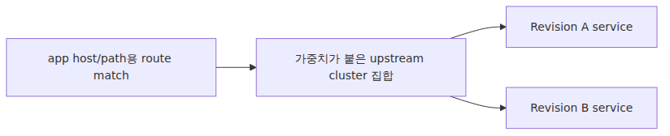

# Revision과 트래픽 분할 — Envoy 가중치는 어디에서 오는가

## Source Version

이 글의 외부 인용은 다음 upstream 기준으로 고정했습니다:
- Dapr: v1.13.x (https://github.com/dapr/dapr)
- KEDA: v2.14.x (https://github.com/kedacore/keda)
- Envoy: v1.30.x (https://github.com/envoyproxy/envoy)

ACA 내부 구현은 Microsoft가 공개하지 않으므로, 위 버전은 비교 기준으로만 사용합니다.

## Evidence Model

- **Microsoft가 문서로 직접 밝힌 범위**: Revision은 불변 배포 단위이며, 동시에 활성화될 수 있고, weighted traffic을 받을 수 있습니다.
- **업스트림 동작을 바탕으로 한 추론**: 이 weight는 Envoy류 weighted upstream 라우팅 규칙으로 구체화될 가능성이 높습니다.
- **이 글이 넘지 않는 선**: ACA가 revision 라우팅을 내부에서 표현하는 정확한 private config object.

> Azure Container Apps Deep Dive 시리즈 (3/6)

Azure Container Apps는 rollout을 실제보다 훨씬 부드럽게 보이게 만듭니다.

이미지를 바꿉니다.
ACA가 새 Revision을 만듭니다.
트래픽 비율을 옮깁니다.
서비스는 계속 응답합니다.

표면이 이렇게 단순한 이유는, 그 아래 단계가 감춰져 있기 때문입니다.
불변 Revision이 먼저 만들어져야 합니다.
그 Revision이 active 상태가 되어야 합니다.
Ingress는 어떤 Revision이 트래픽 후보인지 알아야 합니다.
그리고 마지막 요청 경로 어딘가에서 가중치가 실제로 적용돼야 합니다.

이번 화의 질문은 바로 그 마지막 단계입니다.
Portal이나 ARM 템플릿에서 80/20을 적었을 때, 그 숫자는 어디에서 진짜 의미를 갖는가입니다.

짧게 답하면, Envoy 라우팅 계층의 weighted upstream selection일 가능성이 가장 높습니다.
길게 답하려면 Revision 불변성부터 다시 잡아야 합니다.

---

## Revision은 불변 런타임 스냅샷입니다

Microsoft의 revisions 문서는 중요한 지점을 분명히 적습니다.
Revision은 container app의 immutable snapshot입니다.

이 문장 하나가 ACA 운영 모델의 중심입니다.

즉 트래픽을 옮기는 대상은 mutable deployment slot이 아닙니다.
특정 revision-scope template에서 생성된 별도 스냅샷입니다.


이 관점을 잡으면 따로 놀던 동작들이 하나로 이어집니다.

- 이미지를 바꾸면 새 Revision이 생깁니다.
- Scale rule을 바꿔도 새 Revision이 생깁니다.
- Traffic 설정 같은 app-scope 변경은 새 Revision을 만들지 않습니다.
- Rollback은 최신 Revision을 고치는 일이 아니라, 예전 불변 Revision으로 traffic을 다시 돌리는 일에 가깝습니다.

불변성을 이해하면 나머지 rollout 모델도 자연스럽습니다.

---

## Revision-scope 변경과 application-scope 변경

ACA는 변경을 두 부류로 나눕니다.

Revision-scope 변경은 새 Revision을 만듭니다.
Application-scope 변경은 새 Revision 없이 app 표면만 바꿉니다.

이 구분은 제품 전체에서 가장 유용한 경계 중 하나입니다.


Microsoft 문서는 `properties.template` 영역을 revision-scope로, `properties.configuration` 영역을 application-scope로 설명합니다.

Revision-scope 예시는 다음과 같습니다.

- 컨테이너 이미지 변경
- 컨테이너 구성 변경
- 스케일 규칙 변경
- revision suffix 변경

Application-scope 예시는 다음과 같습니다.

- ingress 구성
- traffic splitting rule
- revision mode
- label
- secret
- registry credential
- Dapr 설정

이 분리가 있기 때문에 트래픽 이동은 새 Revision 생성과 독립적으로 이뤄질 수 있습니다.

---

## Single revision mode와 multiple revision mode는 단순 UI 토글이 아닙니다

Revision mode는 ingress가 앱의 이력을 해석하는 방식을 바꿉니다.

Single revision mode에서는 플랫폼이 배포를 단순하게 유지합니다.
새 Revision이 준비되면 트래픽이 그쪽으로 옮겨지고, 이전 Revision은 자동으로 내려갑니다.

Multiple revision mode에서는 여러 active Revision이 동시에 살아 있을 수 있고, 동시에 트래픽을 받을 수 있습니다.
Canary와 blue-green이 자연스러워지는 모드가 바로 이것입니다.


심화 관점에서 중요한 점은 이것입니다.
Mode는 release 취향 정도의 옵션이 아닙니다.
Envoy가 upstream 후보로 취급할 Revision 집합을 바꾸는 설정입니다.

---

## Label과 weight는 서로 다른 라우팅 문제를 풉니다

ACA는 자주 혼동되는 두 가지 라우팅 개념을 제공합니다.

1. 메인 app URL에 대한 traffic weight
2. 특정 Revision에 붙는 안정적인 direct URL인 label

Weight는 요청을 여러 active Revision에 확률적으로 분배합니다.
Label은 별도 URL을 한 Revision에 고정합니다.


운영 의미도 분명히 다릅니다.

- Production URL에서 점진 노출을 하고 싶으면 weight
- 테스트나 staging용 deterministic direct access가 필요하면 label

Label은 weighted routing이 아닙니다.
이름 붙은 포인터입니다.

---

## 제품 표면에서 보이는 traffic 설정 모양

ACA는 traffic rule을 application-scope ingress 구성으로 노출합니다.
스키마는 의도적으로 작습니다.

트래픽 대상은 다음 중 하나가 될 수 있습니다.

- `latestRevision: true`
- 특정 revision 이름
- 특정 label

각 항목에는 weight가 붙습니다.
weight 총합은 100이어야 합니다.

```json
"configuration": {
  "ingress": {
    "external": true,
    "targetPort": 80,
    "traffic": [
      {
        "revisionName": "myapp--blue",
        "weight": 80
      },
      {
        "revisionName": "myapp--green",
        "weight": 20
      }
    ]
  }
}
```

이 구성은 제품 표면이기 때문에 단순합니다.
아래에서 이 퍼센티지를 실제로 집행하는 ingress proxy 내부는 보이지 않습니다.

그 숨은 단계에서 Envoy가 등장합니다.

---

## Revision weight에서 Envoy weight로

먼저 Envoy 용어를 고정해야 합니다.

Envoy에서 cluster는 upstream destination grouping입니다.
Kubernetes cluster를 뜻하지 않습니다.

이 점이 중요한 이유는, Revision traffic split이 weighted cluster selection으로 자연스럽게 표현되기 때문입니다.

Microsoft는 ACA traffic split rule이 ingress에서 집행된다고 문서화하고, upstream Envoy route schema는 route configuration API 안에 weighted cluster 개념을 정의합니다.
ACA traffic splitting을 설명할 때 기대야 할 고정점이 바로 이것입니다.


ACA 자체는 closed-source라서, 이 사이를 잇는 제품 어댑터 코드나 번역 파이프라인을 직접 볼 수는 없습니다.
따라서 아래 설명은 사실 단정이 아니라 최선의 추론입니다. Microsoft의 traffic-splitting 문서는 제품 동작을 설명하고, Envoy의 weighted-cluster 모델은 그 동작을 가장 일관되게 설명하는 upstream 메커니즘입니다.

---

## 왜 가중치는 앱 안이 아니라 ingress 계층에 있어야 하는가

여러 Revision이 동시에 active 상태라면, 요청이 사용자 컨테이너에 들어가기 전에 목적지를 골라야 합니다.
그 결정을 하는 곳이 ingress routing 계층입니다.

사용자 앱이 나중에 결정한다면, 요청은 이미 한 Revision까지 도달한 뒤입니다.
그럼 분할의 의미가 없습니다.


가중치는 Service 홉 이전에 존재해야 합니다.
그래서 6화에서는 client -> load balancer -> Envoy -> service -> pod 전체 경로를 따로 뜯어 봅니다.

이번 화에서는 한 가지만 잡으면 됩니다.
Traffic weight는 application runtime logic이 아니라 ingress routing data입니다.

---

## 무중단 배포는 Revision 생성만으로 성립하지 않습니다

Microsoft의 revisions 문서는 single revision mode에서, 새 Revision이 ready가 되기 전까지 traffic이 latest로 전환되지 않는다고 설명합니다.

여기서 ready는 "Revision 객체가 생겼다"보다 훨씬 강한 조건입니다.

- provisioning 성공
- 기대 replica 수까지 scale up
- startup probe, readiness probe 통과


즉 single revision mode의 무중단 배포란, control plane이 readiness 임계치를 확인한 뒤에만 ingress를 새 Revision으로 돌린다는 뜻입니다.

---

## Multiple revision mode에서는 rollout이 라우팅 수학이 됩니다

Multiple revision mode를 켜면 rollout은 더 이상 binary switch가 아닙니다.
운영자가 조절하는 routing table이 됩니다.

대표 패턴은 그대로 weight 변화로 표현됩니다.

- Blue-green: 100/0 -> 테스트 -> 0/100
- Canary: 95/5 -> 80/20 -> 50/50 -> 0/100
- A/B test: 두 Revision을 장시간 고정 비율로 유지


좋은 점은 Revision은 불변으로 고정된 채, 그 바깥의 노출만 바뀐다는 사실입니다.
통제된 rollout 시스템에서 가장 원하는 분리입니다.

---

## `latestRevision: true`는 편하지만, 스위치를 누가 쥐는지가 달라집니다

Traffic 설정은 특정 Revision 이름 대신 "latest ready revision에 100%를 보낸다"고 쓸 수 있습니다.

빠른 반복에는 편합니다.
동시에 제어권이 달라집니다.

`latestRevision: true`를 쓰면, app URL을 어떤 Revision에 붙일지 ACA가 latest ready 기준으로 계속 판단합니다.
명시적 revision 이름을 쓰면 그 결정을 다시 운영자가 가져옵니다.


이 차이는 개발 환경의 빠른 갱신과, 프로덕션의 엄격한 rollout 제어를 가르는 지점이 되곤 합니다.

---

## Active Revision과 traffic을 받는 Revision은 같은 개념이 아닙니다

Multiple revision mode에서는 active 상태이면서도 메인 app URL에서 production traffic을 받지 않는 Revision이 존재할 수 있습니다.

이 모델은 중요합니다.

Active라는 말은 실행 가능하다는 뜻입니다.
메인 URL이 그 Revision으로 요청을 보내는지는 traffic weight가 정합니다.
Label은 메인 URL weight가 0이어도 direct access를 열 수 있습니다.


그래서 production path는 건드리지 않고도 staging 검증이 가능합니다.

---

## Revision weight와 scale은 연결되지만 같은 시스템은 아닙니다

20% traffic이면 20% replica라고 생각하고 싶어집니다.
ACA는 그런 약속을 하지 않습니다.

Traffic weight는 ingress routing policy입니다.
Replica 수는 Revision 단위 scale policy입니다.

둘은 부하를 통해 영향을 주고받지만, 같은 control loop가 아닙니다.


그래서 5% canary도 replica가 여러 개 필요할 수 있고, 50/50 split도 두 Revision 성능이나 concurrency 특성이 다르면 replica 수가 완전히 같을 필요는 없습니다.

---

## Envoy의 weighted cluster 모델이 중요한 이유

Envoy의 route API와 router 구현이 중요한 이유는 하나입니다.
Weighted upstream selection을 프록시의 1급 기능으로 취급하기 때문입니다.

덕분에 ACA는 rollout 제어를 ingress에 둘 수 있고, Revision은 여전히 불변으로 유지할 수 있습니다.

우리가 직접 보지 못하는 플랫폼 전용 단계는, ACA가 Revision별 upstream을 어떻게 이름 짓고 관리하는가입니다.
하지만 프록시 개념 자체는 표준적입니다.


"가중치는 어디에서 오는가"라는 질문에 가장 정확한 대답은 이것입니다.
App-scope ACA ingress 구성이 가중치의 출발점이고, 그 값이 ingress routing 계층에서 Revision upstream에 적용된다고 보는 편이 가장 방어 가능합니다.

---

## Rollback이 빠른 이유도 Revision 불변성 덕분입니다

Canary가 잘못되면 이전 버전을 다시 빌드할 필요가 없습니다.
트래픽만 되돌리면 됩니다.

이 말이 성립하려면 두 설계 선택이 함께 유지되어야 합니다.

1. 이전 Revision이 여전히 주소를 가진다
2. Traffic policy가 Revision 생성과 분리되어 있다


이 rollback 속도는 ACA Revision 모델의 가장 실용적인 장점 중 하나입니다.

---

## Closed-source ACA가 감추는 것과 감추지 않는 것

App 설정을 Envoy 설정으로 번역하는 ACA 내부 control-plane 코드는 직접 볼 수 없습니다.
그 부분은 Microsoft의 소유입니다.

하지만 아무 근거 없이 추측할 필요도 없습니다.

기댈 수 있는 고정점은 세 가지입니다.

1. Microsoft Learn이 revision mode와 traffic rule을 정의합니다.
2. Microsoft Learn이 revision-scope와 application-scope 변경을 정의합니다.
3. Envoy의 pinned route API가 weighted-cluster 개념을 정의합니다.

이 세 가지면, 제품이 open-source인 척하지 않고도 충분히 정확한 설명이 가능합니다.

---

## 3화 정리

압축하면 다음 모델입니다.

> ACA의 Revision은 불변 런타임 스냅샷입니다. Traffic splitting은 application-scope ingress 결정이며, 어떤 active Revision이 app URL에서 노출될지를 정합니다. 퍼센티지는 Envoy routing 계층의 weight로 설명하는 편이 가장 설득력 있으며, Revision upstream을 weighted destination으로 취급하는 방식으로 이해할 수 있습니다.

이 모델을 잡으면 canary와 blue-green은 더 이상 portal의 마법 같은 기능이 아닙니다.

---

## 시리즈 안에서의 위치

이번 3화는 2화에서 본 Environment 경계와, 그 안에서 실제 rollout 단위가 되는 불변 Revision을 연결했습니다. 여기서 얻는 핵심은 rollout policy와 ingress routing을 분리해서 읽는 감각입니다. Revision은 안정적인 타깃을 만들고, traffic weight는 그 타깃들에 앱 URL의 요청을 얼마씩 보낼지 정합니다.

---

## Evidence Boundaries

이 장은 ACA 제품 사실과, 공개되지 않은 라우팅 구현을 분리해서 다룹니다.

**Documented (Microsoft Learn / 1차 출처):**
- Revision은 immutable snapshot입니다.
- ACA는 revision-scope 변경과 application-scope 변경을 구분합니다.
- Traffic splitting, label, revision mode, readiness gate는 문서화된 ingress / revisions 표면입니다.

**Inferred from upstream behavior:**
- Envoy weighted-cluster 동작은 Revision traffic percentage가 어디에 적용되는지 설명하는 가장 방어 가능한 모델입니다.
- 여러 active Revision이 ingress upstream 후보가 된다는 설명은, 문서화된 ACA 동작과 upstream Envoy 의미론을 합친 추론입니다.

**Speculation (ACA-internal, not exposed):**
- Private translation pipeline, 내부 오브젝트 이름, 실제 Envoy 구성 레이아웃은 공개되지 않았습니다.

<!-- toc:begin -->
## 시리즈 목차

- [ACA 아키텍처 — 사용자에게 보이지 않는 Kubernetes 위에 얹은 것](./01-aca-architecture.md)
- [Environment 내부 — 네트워크·관측·Dapr 스코프의 경계](./02-environment-internals.md)
- **Revision과 트래픽 분할 — Envoy 가중치는 어디에서 오는가 (현재 글)**
- ACA 안의 KEDA — Scale Rule이 만드는 것 (예정)
- Dapr 사이드카 내부 — 컨테이너 옆에 뜨는 Go 프로세스 (예정)
- Envoy Ingress 경로 — 첫 요청이 사용자 컨테이너에 닿기까지 (예정)

<!-- toc:end -->

---

## 참고 자료

### 1차 출처
- [`Envoy` route 구성 at `v1.30.0`](https://github.com/envoyproxy/envoy/blob/v1.30.0/api/envoy/config/route/v3/route_components.proto)
- [`Envoy` router 구현 at `v1.30.0`](https://github.com/envoyproxy/envoy/blob/v1.30.0/source/common/router/config_impl.cc)

### 2차 출처
- [Update and deploy changes in Azure Container Apps](https://learn.microsoft.com/en-us/azure/container-apps/revisions)
- [Traffic splitting in Azure Container Apps](https://learn.microsoft.com/en-us/azure/container-apps/traffic-splitting)
- [Ingress in Azure Container Apps](https://learn.microsoft.com/en-us/azure/container-apps/ingress-overview)

### 관련 시리즈
- [Azure Container Apps 101](../../azure-aca-101/ko/)
- [Azure AKS Deep Dive](../../azure-aks-deep-dive/ko/)
- [Azure Functions Deep Dive](../../azure-functions-deep-dive/ko/)

Tags: Container Apps, KEDA, Dapr, Envoy
