# Revision과 트래픽 분할 — Envoy 가중치는 어디에서 오는가

Azure Container Apps의 배포 경험은 생각보다 부드럽습니다. 이미지를 바꾸면 새 Revision이 생기고, 필요하면 일부 트래픽만 새 버전으로 보낼 수 있으며, 문제가 있으면 다시 비율을 되돌리면 됩니다. 포털에서는 단순해 보이지만, 그 뒤에는 불변 스냅샷 생성, 활성 Revision 판정, Ingress 라우팅 상태 갱신이 이어집니다.

이 표면이 깔끔한 이유는 제품이 하위 단계를 숨기기 때문입니다. 하지만 운영자는 그 단계를 이해해야 합니다. 그래야 어떤 변경이 새 Revision을 만드는지, 왜 트래픽 이동은 Revision 생성과 분리되어 있는지, 80/20 비율이 실제로 어디에서 적용되는지를 설명할 수 있습니다.

이 글은 Azure Container Apps Deep Dive 시리즈의 세 번째 글입니다. 여기서는 Revision의 불변성과 트래픽 분할이 어떻게 만나서 하나의 rollout 모델을 만드는지, 그리고 그 비율이 왜 Envoy 라우팅 계층에서 가장 자연스럽게 설명되는지를 정리하겠습니다.

이 관점을 잡으면 canary와 blue-green이 포털 마법이 아닙니다. 불변 Revision을 여러 개 살려 두고, Ingress가 어느 upstream에 얼마만큼 요청을 보낼지 조절하는 문제로 바뀝니다.

이제 Revision을 배포 이력이 아니라 런타임 스냅샷으로 읽어 보겠습니다.

## 이 글에서 다룰 문제

- 어떤 변경은 새 Revision을 만들고, 어떤 변경은 만들지 않을까요?
- single revision mode와 multiple revision mode는 운영상 무엇을 바꿀까요?
- label과 traffic weight는 각각 어떤 다른 라우팅 문제를 풀까요?
- ACA의 트래픽 비율은 왜 Envoy weighted upstream으로 이해하는 편이 가장 설득력 있을까요?
- rollback이 빠른 이유는 Revision 모델의 어떤 설계 덕분일까요?

## 왜 이 글이 중요한가

ACA를 운영하는 팀이 가장 자주 체감하는 기능 중 하나가 Revision입니다. 그런데 Revision을 단순한 배포 이력으로 이해하면 rollout이 자꾸 설명되지 않습니다. 새 버전이 왜 살아 있는데도 메인 URL에서 0%를 받을 수 있는지, 왜 label URL은 안정적인데 main URL은 비율을 따라 흔들리는지, 왜 rollback은 재배포가 아니라 traffic move로 끝나는지를 이해하기 어렵습니다.

또한 트래픽 분할은 단순한 출시 전략이 아니라 장애 완화 전략입니다. 비율 조정만으로도 canary를 멈추고 기존 Revision으로 즉시 되돌릴 수 있기 때문입니다. 이때 중요한 것은 Revision이 mutable한 슬롯이 아니라 immutable snapshot이라는 사실입니다. 그래야 “이전 상태”가 재구성 없이 그대로 남아 있습니다.

마지막으로 이 글은 Envoy 편의 준비 단계이기도 합니다. 트래픽 분할은 앱 코드가 아니라 Ingress 라우팅 데이터이므로, 어디서 weight가 실제가 되는지 이해해야 6편의 요청 경로 분석도 자연스럽게 이어집니다.

## Revision을 이해하는 가장 좋은 방법: 불변 런타임 스냅샷과 Ingress 라우팅 데이터로 나눠 보는 것입니다

ACA의 Revision 모델을 한 문장으로 압축하면 이렇습니다. **Revision은 불변 런타임 스냅샷이고, 트래픽 분할은 앱 범위의 Ingress 라우팅 정책**입니다. 즉 배포 단위와 노출 정책이 분리되어 있습니다.

이 분리가 중요합니다. 배포 시스템이 안정적이려면 실행 대상은 고정되어야 하고, 노출 정책은 그 주위를 움직일 수 있어야 하기 때문입니다. ACA는 새 Revision을 만들어 런타임 스냅샷을 고정하고, traffic rule로 어느 Revision이 메인 앱 URL에서 얼마만큼 요청을 받을지 제어합니다.

또한 이 구조는 Envoy를 기준점으로 볼 때 더 선명해집니다. Envoy의 weighted cluster 모델은 “서로 다른 upstream target에 확률적으로 요청을 분배한다”는 개념을 이미 갖고 있기 때문입니다. ACA가 비공개 구현을 공개하진 않지만, Revision traffic split을 이해하는 기준점으로는 이 모델이 가장 방어 가능합니다.

> ACA에서 배포와 노출은 같은 동작이 아닙니다. Revision은 실행 대상을 고정하고, Ingress는 그 대상들 사이에서 사용자 요청을 어떻게 분배할지 결정합니다.

## 핵심 개념

### Revision은 불변 런타임 스냅샷입니다

Microsoft 문서는 Revision을 container app의 immutable snapshot이라고 설명합니다. 이 한 문장이 ACA rollout의 핵심입니다. 트래픽을 옮기는 대상은 mutable slot이 아니라 특정 시점의 독립 스냅샷입니다.

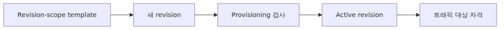

*Immutable revision snapshots as traffic targets*

이제 여러 제품 동작이 하나로 묶입니다.

- 이미지 변경은 새 Revision을 만듭니다.
- scale rule 변경도 새 Revision을 만듭니다.
- traffic 설정 변경은 새 Revision을 만들지 않습니다.
- rollback은 보통 최신 Revision을 다시 수정하는 일이 아니라, 기존 Revision으로 트래픽을 다시 돌리는 일입니다.

### Revision-scope와 application-scope를 구분해야 합니다

ACA는 변경을 두 부류로 나눕니다. Revision-scope 변경은 새 Revision을 만들고, application-scope 변경은 앱 표면에 영향을 주되 새 Revision을 만들지 않습니다. 이 경계는 제품 전체에서 가장 실용적인 구분 중 하나입니다.

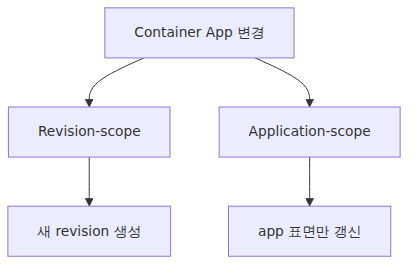

*Template-scope and configuration-scope changes*

대표적인 Revision-scope 예시는 이미지 업데이트, 컨테이너 설정 변경, scale rule 변경, revision suffix 변경입니다. 반대로 ingress 구성, traffic split, revision mode, labels, secrets, registry credentials, Dapr 설정은 application-scope입니다. 그래서 새 Revision을 만들지 않고도 트래픽 이동이 가능합니다.

### Revision mode는 단순 UI 토글이 아닙니다

single revision mode에서는 새 Revision이 준비되면 기존 Revision을 자동으로 정리하면서 단순한 rollout을 제공합니다. multiple revision mode에서는 여러 Revision이 동시에 살아 있고, 메인 앱 URL로 트래픽을 나눠 받을 수 있습니다.

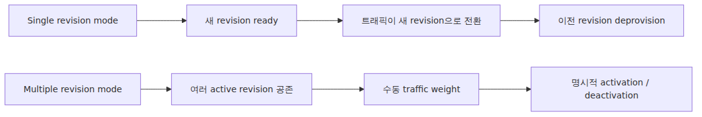

*Revision modes and upstream set differences*

운영적으로 중요한 포인트는 mode가 release preference 정도가 아니라, Ingress가 upstream 후보로 취급할 수 있는 Revision 집합을 바꾼다는 점입니다. canary와 blue-green이 자연스러워지는 것은 multiple revision mode 덕분입니다.

### Label과 weight는 서로 다른 문제를 풉니다

ACA는 두 가지 라우팅 수단을 제공합니다. 첫째는 메인 앱 URL에서의 traffic weight입니다. 둘째는 특정 Revision에 직접 붙는 stable label URL입니다. 이 둘은 비슷해 보여도 목적이 완전히 다릅니다.

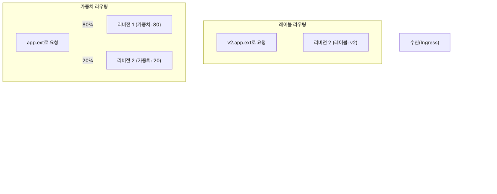

*Label direct paths and weight-based routing*

- weight는 production app URL에서 요청을 확률적으로 분산합니다.
- label은 특정 Revision으로 가는 direct URL을 안정적으로 고정합니다.

즉 label은 weighted routing이 아닙니다. stable named pointer입니다. staging 검증, 직접 smoke test, 운영자 확인 경로에서 특히 유용합니다.

### 제품 표면의 트래픽 설정은 작지만 의미가 큽니다

ACA는 traffic rule을 compact한 ingress 설정으로 노출합니다. `latestRevision: true`, 특정 revisionName, label을 대상으로 weight를 줄 수 있고, 합계는 100이어야 합니다.

```json
"configuration": {
  "ingress": {
    "external": true,
    "targetPort": 80,
    "traffic": [
      {
        "revisionName": "myapp--blue",
        "weight": 80
      },
      {
        "revisionName": "myapp--green",
        "weight": 20
      }
    ]
  }
}
```

이 JSON이 작은 이유는 제품 표면이기 때문입니다. 사용자는 의도만 적고, 그 비율을 실제 라우팅 상태로 바꾸는 하위 프록시 계층은 숨겨집니다. 바로 그 지점에서 Envoy를 떠올리는 편이 맞습니다.

### Revision weight는 Envoy weight로 읽는 것이 가장 자연스럽습니다

여기서 용어를 정확히 잡아야 합니다. Envoy에서 cluster는 Kubernetes cluster가 아니라 upstream destination grouping입니다. 이 점을 기억하면 ACA의 revision traffic split은 weighted cluster selection으로 설명하는 편이 가장 설득력 있습니다.

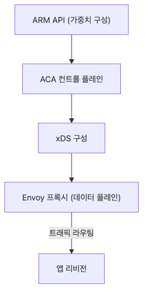

*Revision weights to Envoy routing weights*

Microsoft는 traffic split이 ingress 기능이라고 문서화합니다. Envoy upstream route schema는 weighted cluster를 1급 개념으로 제공합니다. ACA 내부 adapter 코드는 비공개이지만, “앱 범위의 traffic rule이 ingress 라우팅 가중치로 바뀐다”는 해석은 가장 방어 가능한 추론입니다.

### Weight는 앱 안이 아니라 ingress에서 실제가 됩니다

Revision이 여러 개 active라면, 요청이 사용자 컨테이너에 들어가기 전에 어느 Revision으로 갈지 누군가가 선택해야 합니다. 사용자 앱이 그 결정을 할 수는 없습니다. 이미 특정 Revision에 도착한 뒤라면 분산의 의미가 사라지기 때문입니다.

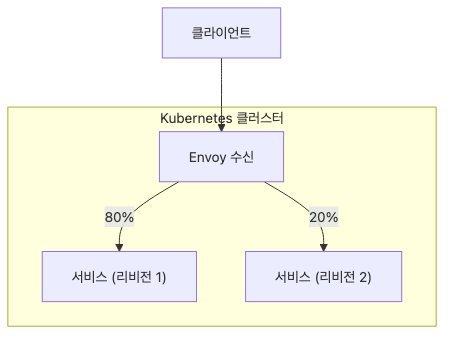

*Revision selection at the ingress layer*

따라서 weight는 service hop 이전, 즉 ingress routing 데이터로 존재해야 합니다. 이 점을 이해하면 traffic split이 애플리케이션 로직이 아니라 프록시 계층의 일이라는 사실이 분명해집니다.

### 무중단 배포는 Revision 생성만으로 되지 않습니다

single revision mode에서 ACA가 트래픽을 새 Revision으로 자동 이동하는 것은 “새 Revision object가 생겼다”와 같은 뜻이 아닙니다. 준비가 완료되어야 합니다. provisioning 성공, 기대 replica 수 확보, startup/readiness probe 통과가 함께 따라와야 합니다.

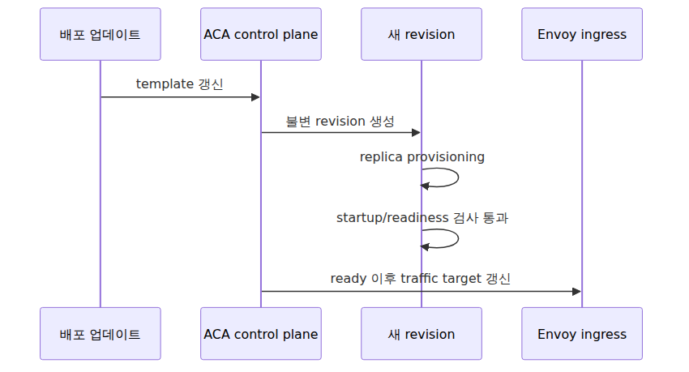

*Readiness-gated traffic cutover flow*

즉 ACA의 zero-downtime 문장은 더 정확히 말하면 “control plane이 readiness threshold를 확인한 뒤 ingress를 재지정한다”는 뜻입니다.

### multiple revision mode에서는 rollout이 곧 라우팅 수학입니다

multiple revision mode를 켜는 순간 rollout은 binary switch가 아닙니다. 라우팅 테이블을 운영하는 일이 됩니다. blue-green은 100/0에서 0/100으로, canary는 95/5에서 80/20, 50/50, 0/100으로 바꾸는 식입니다. A/B 테스트라면 여러 Revision을 고정 비율로 유지할 수도 있습니다.

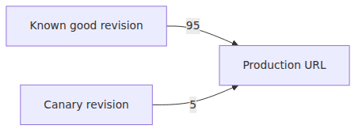

*Weighted rollout across multiple revisions*

우아한 점은 Revision 자체는 불변으로 남고, 노출만 그 주변에서 바뀐다는 것입니다. 이 분리가 controlled rollout 시스템의 핵심입니다.

### `latestRevision: true`는 편하지만 제어권을 바꿉니다

traffic 설정에서 명시적인 Revision 이름 대신 `latestRevision: true`를 쓰면 앱 URL을 최신 준비 완료 Revision에 자동으로 붙일 수 있습니다. 개발 속도에는 좋지만, “누가 스위치를 갖는가”가 달라집니다.

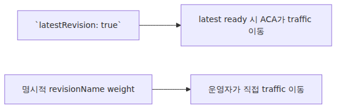

*latestRevision versus explicit revision control*

명시적인 Revision 이름을 적는 순간, 어떤 Revision을 메인 URL에 노출할지에 대한 제어를 다시 운영자가 가져옵니다. 보통 빠른 개발 환경과 엄격한 프로덕션 운영을 가르는 기준이 여기서 드러납니다.

### active revision과 traffic-receiving revision은 다를 수 있습니다

multiple revision mode에서는 어떤 Revision이 active이지만 메인 URL에서 0%를 받을 수 있습니다. 또 label을 통해 직접 접근은 가능할 수 있습니다. 이 구분은 staging-style 검증을 production path와 분리하는 데 매우 중요합니다.

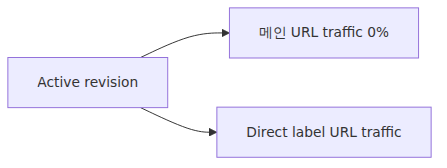

*Active and traffic-receiving revision split*

즉 active는 “실행 가능하다”는 뜻이고, traffic weight는 “메인 앱 URL이 실제로 요청을 보낸다”는 뜻입니다. 이 둘을 같은 개념으로 보면 rollout을 자꾸 잘못 읽게 됩니다.

### Traffic weight와 scale은 서로 영향을 주지만 같은 시스템은 아닙니다

20%의 트래픽이 20%의 replica를 뜻한다고 생각하기 쉽습니다. ACA는 그런 약속을 하지 않습니다. traffic weight는 ingress routing policy이고, replica count는 Revision별 scale policy입니다. 부하를 통해 서로 영향을 주지만, 같은 control loop가 아닙니다.

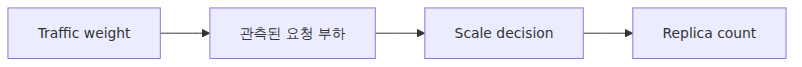

*Traffic weights and replica scale relationship*

그래서 5% canary도 두 개 이상의 replica가 필요할 수 있고, 50/50 split도 두 Revision의 성능 특성이 다르면 replica 수가 같아야 할 이유는 없습니다.

### Rollback이 빠른 이유는 이전 Revision이 그대로 남기 때문입니다

canary가 실패했을 때 이전 버전을 다시 빌드할 필요가 없습니다. old Revision이 주소 가능하고, traffic policy가 Revision 생성과 분리되어 있기 때문입니다. 결국 rollback은 재구축보다 traffic move에 가깝습니다.

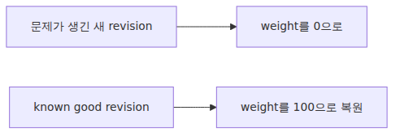

*Rollback path across immutable revisions*

이것이 ACA Revision 모델의 가장 강한 실무적 장점 중 하나입니다. immutable snapshot과 separable traffic policy가 함께 있을 때만 가능한 운영 감각입니다.

## 흔히 헷갈리는 지점

- **Revision은 deployment slot이 아닙니다.** mutable한 자리 대신 immutable snapshot입니다.
- **traffic split은 새 Revision 생성과 다른 동작입니다.** application-scope ingress 설정입니다.
- **label은 weighted traffic의 별칭이 아닙니다.** 특정 Revision에 고정된 direct URL입니다.
- **80/20 traffic이 80/20 replica를 보장하지는 않습니다.** scale은 별도 control loop입니다.
- **`latestRevision: true`는 단순 문법 설탕이 아닙니다.** 최신 준비 완료 Revision으로 앱 URL 제어권을 넘기는 선택입니다.

## 운영 체크리스트

- [ ] 새 Revision을 만드는 필드를 코드 리뷰 체크리스트에 따로 적어 두었습니다.
- [ ] traffic-split 변경이 테스트 환경에서 즉시 반영되는지 검증했습니다.
- [ ] 동시에 active한 Revision 수와 메모리 사용량 한계를 계산했습니다.
- [ ] canary 단계별 비율과 auto-promote/rollback 기준을 문서화했습니다.
- [ ] rollback 시 downstream 호환성(DB schema, queued message)을 함께 점검하도록 절차를 만들었습니다.

## 정리

ACA의 Revision 모델을 제대로 이해하려면 배포 단위와 노출 단위를 분리해서 봐야 합니다. Revision은 immutable runtime snapshot이고, traffic split은 application-scope ingress policy입니다. 이 둘이 분리되어 있기 때문에 rollout은 안전해지고, rollback은 빨라집니다.

또한 weighted traffic은 앱 코드 안이 아니라 ingress 계층에서 실제가 됩니다. ACA 구현 세부는 비공개지만, Envoy의 weighted upstream 모델은 이 동작을 설명하는 가장 강한 기준점입니다. 그래서 Revision과 traffic split은 결국 Envoy 편으로 자연스럽게 이어집니다.

다음 글에서는 이 Revision에 실제로 replica 수를 붙이는 스케일 엔진으로 들어갑니다. ACA의 scale rule이 어떻게 KEDA형 control loop로 읽히는지 살펴보겠습니다.

<!-- toc:begin -->
## 시리즈 목차

- [ACA 아키텍처 — 사용자에게 보이지 않는 Kubernetes 위에 얹은 것](./01-aca-architecture.md)
- [Environment 내부 — 네트워크·관측·Dapr 스코프의 경계](./02-environment-internals.md)
- **Revision과 트래픽 분할 — Envoy 가중치는 어디에서 오는가 (현재 글)**
- ACA 안의 KEDA — Scale Rule이 만드는 것 (예정)
- Dapr 사이드카 내부 — 컨테이너 옆에 뜨는 Go 프로세스 (예정)
- Envoy Ingress 경로 — 첫 요청이 사용자 컨테이너에 닿기까지 (예정)

<!-- toc:end -->

## 참고 자료

### 공식 문서
- [Update and deploy changes in Azure Container Apps](https://learn.microsoft.com/en-us/azure/container-apps/revisions)
- [Traffic splitting in Azure Container Apps](https://learn.microsoft.com/en-us/azure/container-apps/traffic-splitting)
- [Ingress in Azure Container Apps](https://learn.microsoft.com/en-us/azure/container-apps/ingress-overview)

### 관련 시리즈
- [Azure Container Apps 101](../../azure-aca-101/ko/)
- [Azure AKS Deep Dive](../../azure-aks-deep-dive/ko/)
- [Azure Functions Deep Dive](../../azure-functions-deep-dive/ko/)

Tags: Container Apps, KEDA, Dapr, Envoy
