# ACA 안의 KEDA — Scale Rule이 만드는 것

## Source Version

이 글의 외부 인용은 다음 upstream 기준으로 고정했습니다:
- Dapr: v1.13.x (https://github.com/dapr/dapr)
- KEDA: v2.14.x (https://github.com/kedacore/keda)
- Envoy: v1.30.x (https://github.com/envoyproxy/envoy)

ACA 내부 구현은 Microsoft가 공개하지 않으므로, 위 버전은 비교 기준으로만 사용합니다.

## Evidence Model

- **Microsoft가 문서로 직접 밝힌 범위**: ACA scaling이 KEDA 기반이며, 제품 표면에는 HTTP, TCP, custom scale rule이 노출된다는 점.
- **업스트림 동작을 바탕으로 한 추론**: 이 규칙들은 서비스 경계 뒤에서 KEDA/HPA류 control loop로 물질화될 가능성이 높습니다.
- **이 글이 넘지 않는 선**: ACA 내부의 정확한 managed KEDA 배치 형태와 private wiring.

> Azure Container Apps Deep Dive 시리즈 (4/6)

Azure Container Apps의 제품 표면에서 스케일링은 몇 개 필드로 끝납니다.

`minReplicas`를 적습니다.
`maxReplicas`를 적습니다.
HTTP, TCP, 또는 custom rule을 추가합니다.
나머지는 플랫폼이 처리합니다.

표면이 짧은 이유는 의도적입니다.
진짜 질문은, 이 규칙이 replica 수로 바뀌려면 플랫폼이 아래에서 무엇을 만들어야 하는가입니다.

답은 KEDA입니다.

Microsoft 문서도 Container Apps 스케일링이 KEDA 기반이라고 분명히 적습니다.
이 사실은 즉시 두 가지를 알려 줍니다.

1. 플랫폼은 완전히 별개의 스케일링 모델을 새로 만든 것이 아니라 event-driven autoscaling 계열을 사용합니다.
2. ACA scale rule은, 실제 Kubernetes object를 직접 보여주지 않더라도, KEDA의 `ScaledObject` 중심 control loop와 비슷한 모양으로 번역된다고 보는 편이 맞습니다.

이번 화는 그 숨은 번역 과정을 따라갑니다.

---

<!-- a-grade-intro:begin -->
## 핵심 질문

ACA의 KEDA가 일반 KEDA와 어떻게 다르고, 트리거를 설계할 때 무엇을 조심해야 할까요?

이 글은 그 질문에 답하기 위해 ACA 환경의 KEDA의 핵심 결정과 운영 함정을 살펴봅니다.

<!-- a-grade-intro:end -->

## 이 글에서 답할 질문

- ACA의 KEDA는 stock KEDA와 무엇이 같고 무엇이 제한되는가?
- scale-to-zero가 가능한 trigger와 불가능한 trigger의 경계는 어디인가?
- polling interval, cooldown, max replicas는 비용과 응답 지연을 어떻게 거래하는가?
- 여러 scaler가 동시에 매겨진 함수에서 우선순위는 어떻게 결정되는가?
- KEDA scaler 메트릭은 어디서 검증할 수 있고, 안 보일 때 무엇을 의심해야 하는가?

## 짧게 말하면: Scale rule은 scaler 자체가 아닙니다

ACA에서 여러분이 적는 scale rule은 제품 설정입니다.
런타임 scaler object 자체가 아닙니다.

플랫폼은 이 rule을 KEDA가 reconcile할 수 있는 형태로 바꿔야 합니다.

가장 맞는 그림은 이것입니다.

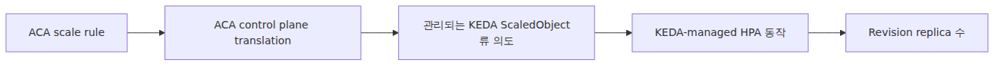

*ACA rule과 hidden scaler 오브젝트 관계*
숨은 오브젝트를 직접 보지는 못합니다.
그래도 알아야 하는 이유는, 여러분이 관찰하는 동작이 이 번역 단계의 downstream이기 때문입니다.

---

## 왜 KEDA가 정확한 고정점인가

Upstream KEDA는 구조가 매우 분명합니다.

- `ScaledObject`가 target과 trigger를 기술합니다.
- KEDA operator가 이를 reconcile합니다.
- KEDA가 HPA를 만들고 갱신합니다.
- metrics adapter가 HPA의 external metric 질의에 응답합니다.

Upstream KEDA source는 이 구조를 그대로 보여 줍니다.
`ScaledObject` 타입은 trigger metadata, cooldown, min/max replica, target reference를 담습니다.
Controller는 이를 reconcile하고 HPA spec을 만듭니다.

그래서 ACA 심화 시리즈에서 pinned KEDA source를 반드시 보라는 품질 게이트가 붙어 있는 것입니다.
ACA 자체는 closed-source여도, 숨은 autoscaling loop의 모양은 KEDA가 설명해 줍니다.

---

## ACA가 노출하는 것과 KEDA가 필요로 하는 것

나란히 놓으면 대응이 쉬워집니다.

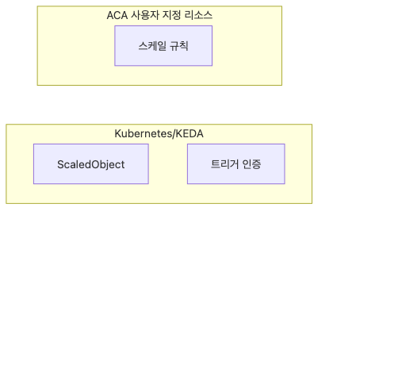

*ACA scale fields와 KEDA 입력 대응*
KEDA는 scale target, metric 또는 trigger 정의, 그리고 limit 정보를 원합니다.
ACA의 revision template는 이미 그 개념들을 갖고 있습니다.

그래서 ACA scale rule에서 숨은 KEDA 오브젝트로의 개념 점프는 작습니다.
제품이 실제 object를 private하게 감췄을 뿐입니다.

---

## 첫 번째 핵심 동작: 스케일링은 Revision 단위입니다

ACA의 traffic은 app-facing입니다.
스케일링은 revision-facing입니다.

그래서 scale rule을 바꾸면 revision-scope 변경이 되고, 새 Revision이 생성됩니다.
Microsoft의 revisions 문서도 이 사실을 분명히 적습니다.

즉 스케일 엔진은 mutable한 배포 정체성이 아니라, 불변 Revision 스냅샷에 붙습니다.

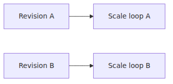

*Revision별 독립 스케일 제어 구조*
두 Revision이 동시에 active 상태라면, 같은 app-level ingress 표면을 공유하면서도 각자 별도의 scale behavior를 가질 수 있습니다.

그래서 rollout 수학과 scaling 수학을 같은 개념으로 합치면 안 됩니다.

---

## `ScaledObject`는 HPA를 대체하는 것이 아니라 HPA를 만들어 냅니다

이 부분은 KEDA에서 가장 흔한 오해입니다.
KEDA는 HPA를 마법처럼 대체하는 전혀 다른 시스템이 아닙니다.
HPA 동작을 관리하고 먹이는 계층입니다.

Upstream KEDA source를 보면 이 사실이 분명합니다.
Controller는 `ScaledObject`를 reconcile하고 HPA spec을 생성합니다.
HPA 생성 로직은 min/max replica, metric target, scale target reference를 채웁니다.

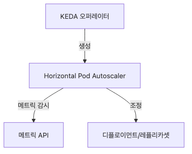

*ScaledObject와 HPA 제어 관계*
ACA에서도 이 큰 역할 분담은 그대로라고 보는 편이 맞습니다.
제품 표면이 KEDA에게 Revision에 대한 HPA류 결정을 만들 정보만 전달하는 구조입니다.

---

## `minReplicas`가 0일 수 있다는 점이 모든 것을 바꿉니다

ACA는 `minReplicas: 0`을 명시적으로 허용합니다.
이것이 scale-to-zero 이야기입니다.

여기서 event-driven 모델이 plain HPA 사고방식보다 중요해집니다.
전통적인 HPA만으로는 event signal에 의해 0에서 깨어나는 activation을 자연스럽게 설명하기 어렵습니다.
KEDA는 그 부분을 설명합니다.

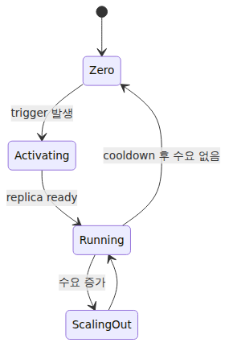

*minReplicas 0과 scale-to-zero 활성화 경로*
Microsoft의 scaling 문서도 마지막 replica에서 0으로 내려갈 때 cooldown이 특히 중요하다고 설명합니다.
이건 바로 KEDA식 event-driven lifecycle이 잘 드러나는 지점입니다.

---

## Custom rule이 replica가 되기까지의 control loop

Custom rule은 흐름이 가장 선명합니다.

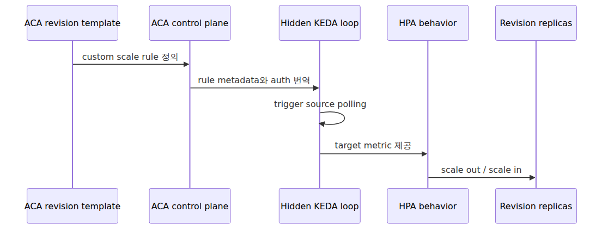

*Custom rule에서 replica까지 제어 루프*
실제 Kubernetes object를 직접 볼 수 없더라도, 이 흐름이 가장 맞는 추상화입니다.

---

## HTTP scaling은 built-in 기능이지만, 모양은 여전히 KEDA 계열입니다

ACA는 request concurrency 기반 built-in HTTP scaler를 제공합니다.
Microsoft 문서는 concurrent requests와 15초 측정 창 기준으로 이 규칙을 설명합니다.

여기서 조심할 구분이 있습니다.

ACA HTTP scaling이 upstream `kedacore/http-add-on`과 완전히 같은 구현이라고 말하면 안 됩니다.
그 주장은 소스가 보장하지 않습니다.

대신 이렇게 말하면 정확합니다.

- ACA는 HTTP scaling을 built-in product feature로 노출합니다.
- 그 스케일링 모델은 KEDA의 event-driven autoscaling 사고방식과 개념적으로 맞닿아 있습니다.
- Trigger 입력은 request concurrency입니다.

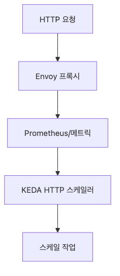

*HTTP concurrency와 KEDA형 스케일 모델*
이렇게 써야 정확성을 지키면서도 실제 동작을 설명할 수 있습니다.

---

## TCP scaling도 큰 모양은 같습니다

ACA는 TCP concurrency scaling도 제공합니다.
제품 표면은 HTTP와 거의 평행합니다.

- 동시 연결 수 임계치 정의
- 측정 창에서 수요 관측
- 임계치 초과 시 replica 증가

깊은 내부 설명도 동일합니다.
구체 구현은 플랫폼이 책임집니다.
그래도 전체 모양은 KEDA류 autoscaling loop로 보는 편이 맞습니다.

---

## Custom rule은 ACA 안에서 가장 KEDA 냄새가 진한 부분입니다

Microsoft scaling 가이드는 custom ACA rule이 KEDA scaler에서 어떻게 옮겨지는지 꽤 직접적으로 설명합니다.
KEDA scaler metadata와 authentication을 ACA rule field로 번역하는 과정까지 안내합니다.

이건 사실상 "여기는 KEDA 식으로 생각해도 된다"는 신호에 가깝습니다.

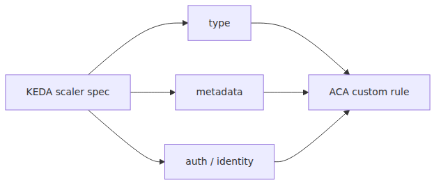

*Custom rule과 KEDA scaler 번역 구조*
즉 제품은 완전히 새로운 autoscaling 언어를 만든 것이 아니라, 선별된 KEDA 표면을 제품화해서 내놓은 셈입니다.

---

## Scale rule 인증도 번역 경계입니다

Upstream KEDA는 `TriggerAuthentication` 리소스나 identity 구성을 자주 사용합니다.
ACA는 그런 raw object를 직접 노출하지 않습니다.

대신 같은 의도를 제품 표면으로 바꿔 제공합니다.

- Scale rule auth field에 연결되는 secret
- 지원되는 Azure trigger용 managed identity 설정

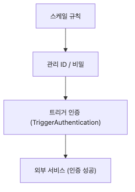

*Scale rule auth와 제품 번역 경계*
모양은 여전히 알아볼 수 있습니다.
리소스 모델만 제품화되었을 뿐입니다.

---

## 이름을 몰라도 metrics adapter는 중요합니다

Upstream KEDA에 metrics adapter가 있는 이유는 HPA가 metric 답변을 받아야 하기 때문입니다.
KEDA의 HPA 생성 코드는 external metric selector를 붙여, adapter가 올바른 scaled object의 metric 질의에 응답할 수 있게 만듭니다.

이 연결 고리는 숨겨져 있지만 중요합니다.

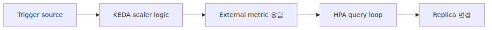

*HPA와 metrics adapter 연결 경로*
ACA에서는 adapter를 직접 건드리지 않습니다.
그래도 외부 이벤트나 concurrency 규칙이 replica 수를 바꾸는 순간마다, 그 효과를 간접적으로 보고 있는 셈입니다.

---

## KEDA 기본값은 ACA에서 나중에 눈에 띄는 동작을 설명합니다

Microsoft scaling 문서는 custom rule의 기본 polling interval과 cooldown 값도 짚습니다.
이 숫자들은 KEDA control loop의 감각과 잘 맞습니다.

운영 중 자주 보이는 현상도 여기서 설명됩니다.

- 스케일 변화가 밀리초 단위로 연속 발생하지는 않음
- 1에서 0으로 내려갈 때 cooldown 성격이 눈에 띔
- 0에서 깨어나는 activation과, 0이 아닌 구간의 steady-state scaling이 체감상 다름

이건 임의의 제품 quirks가 아닙니다.
Polling과 cooldown을 가진 event-driven autoscaling loop의 자연스러운 결과입니다.

---

## 여러 rule 중 하나만 활성화돼도 Revision은 깨어날 수 있습니다

ACA 문서도 여러 scale rule이 있으면 첫 번째 조건을 만족한 rule 하나만으로 scale이 시작될 수 있다고 설명합니다.

Activation logic은 이렇게 보는 편이 맞습니다.

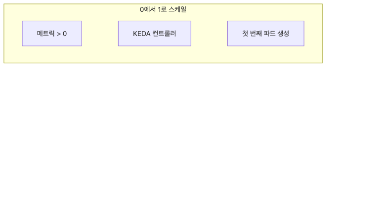

*여러 scale rule의 개별 활성화 경로*
즉 여러 rule이 하나의 거대한 평균 임계치로 합쳐지는 것이 아닙니다.
같은 scale target으로 들어가는 여러 activation path입니다.

---

## Scale rule이 revision template에 붙는 이유

왜 ACA는 scale rule을 revision-scope로 두었을까요.

스케일링이 metadata가 아니라 runtime behavior이기 때문입니다.

Canary Revision은 stable Revision과 다른 limit나 threshold를 원할 수 있습니다.
새 버전이 요청 처리 효율을 바꾸면 concurrency threshold도 달라질 수 있습니다.

Scale rule이 app-scope만 가졌다면, rollout 실험에서 가장 중요한 제어 노브 하나를 잃게 됩니다.

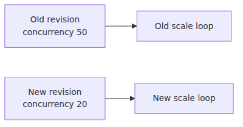

*Revision template에 붙는 scale rule 구조*
Revision-scope scaling이기 때문에 이런 분리가 가능합니다.

---

## 무엇을 주장하면 안 되는가

여기서 꼭 지워야 할 오해가 두 가지 있습니다.

첫째, ACA HTTP scaling이 upstream KEDA HTTP add-on과 같은 것이라고 단정하면 안 됩니다.
개념적 친척 관계는 맞습니다.
구현이 1:1이라는 주장은 소스가 보장하지 않습니다.

둘째, KEDA가 HPA를 대체한다고 말하면 안 됩니다.
Upstream KEDA source는 KEDA가 HPA 동작을 관리하고 먹인다는 점을 분명히 보여 줍니다.
ACA도 이 모양을 개념적으로 상속합니다.

이 두 교정만 해도 설명의 정확도가 크게 올라갑니다.

---

## autoscaling 전체 그림을 한 장으로

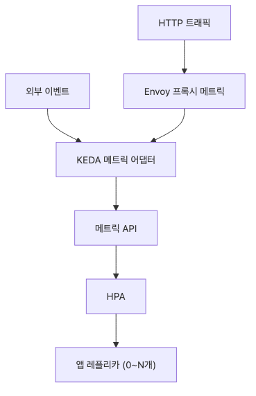

*ACA autoscaling 전체 제어 흐름*
이 그림만 기억해도 ACA autoscaling 내부는 충분히 올바른 해상도로 머릿속에 남습니다.

---

## 4화 정리

압축하면 다음과 같습니다.

> Azure Container Apps에서 scale rule은 플랫폼이 KEDA 기반 autoscaling 동작으로 번역하는 제품 설정입니다. 그 결과 KEDA는 한 Revision에 대해 HPA류 control loop를 만들고, trigger 상태·concurrency·external metric을 replica 수로 바꿉니다. `minReplicas`가 0이면 scale-to-zero도 그 루프 안에 포함됩니다.

Scale 블레이드 뒤에 숨어 있는 기계가 바로 이것입니다.

---

## 시리즈 안에서의 위치

3화가 Revision이 어떻게 traffic을 받는지 설명했다면, 이번 4화는 같은 Revision이 아래에서 replica를 어떻게 늘리고 줄이는지 설명한 글입니다. 여기서 얻는 핵심은 routing policy와 scaling policy를 같은 타깃 위의 다른 제어 루프로 분리해 보는 감각입니다.

---

## Evidence Boundaries

이 장은 Microsoft가 문서화한 KEDA 기반 스케일링 계약 위에, upstream KEDA로 숨은 control loop 모양을 설명합니다.

**Documented (Microsoft Learn / 1차 출처):**
- ACA 스케일링은 KEDA 기반입니다.
- Scale rule은 revision template에 붙고, `minReplicas`는 0이 될 수 있습니다.
- ACA는 built-in HTTP/TCP scaling과 custom rule 번역 개념을 문서화합니다.

**Inferred from upstream behavior:**
- 숨은 ACA scale rule은 upstream KEDA의 `ScaledObject`, HPA, metrics adapter, polling, cooldown 동작으로 이해하는 편이 맞습니다.
- Activation path와 per-revision autoscaling loop 설명은 ACA 내부 오브젝트가 아니라 upstream KEDA controller 설계에 기대고 있습니다.

**Speculation (ACA-internal, not exposed):**
- ACA가 각 scale rule마다 실제로 어떤 hidden Kubernetes object나 private controller를 만드는지는 공개되지 않았습니다.
- ACA HTTP scaling을 upstream KEDA HTTP add-on의 1:1 배포라고 단정하면 안 됩니다.

### scale 규칙 정의 (queue 기반)

```bash
az containerapp update -n my-app -g my-rg \
  --min-replicas 0 --max-replicas 30 \
  --scale-rule-name queue-rule \
  --scale-rule-type azure-queue \
  --scale-rule-metadata queueName=jobs queueLength=5 \
  --scale-rule-auth connection=queue-conn
```

## 시니어 엔지니어는 이렇게 생각합니다

- **ACA는 KEDA를 관리형으로 제공한다** — 직접 KEDA를 설치할 필요는 없지만 동작 원리는 알아야 합니다.
- **스케일 룰은 SLA 신호로 정한다** — 큐·HTTP·CPU 중 사용자 체감과 직결된 신호를 고릅니다.
- **폴링과 cooldown이 진동을 만든다** — 값을 보수적으로 잡고 점진적으로 조정합니다.
- **최소·최대 상한이 안전장치** — 비용·SLA 양쪽의 사고를 동시에 줄이는 단순한 장치입니다.
- **스케일 결정은 관측 가능해야 한다** — 왜 늘었는지·왜 줄었는지 추적할 수 없으면 튜닝이 불가능합니다.

## 운영 체크리스트

- [ ] scale-to-zero 허용 여부를 SLA 관점에서 결정했다
- [ ] polling interval과 cooldown을 워크로드 spike 형태에 맞게 설정했다
- [ ] max replicas가 다운스트림(DB connection, API quota)을 부수지 않는지 확인했다
- [ ] 복수 scaler를 쓸 때 우선순위와 합산 방식을 문서화했다
- [ ] KEDA 메트릭과 실제 replica 수의 정합성을 모니터링한다

<!-- toc:begin -->
## 시리즈 목차

- [ACA 아키텍처 — 사용자에게 보이지 않는 Kubernetes 위에 얹은 것](./01-aca-architecture.md)
- [Environment 내부 — 네트워크·관측·Dapr 스코프의 경계](./02-environment-internals.md)
- [Revision과 트래픽 분할 — Envoy 가중치는 어디에서 오는가](./03-revision-and-traffic-split.md)
- **ACA 안의 KEDA — Scale Rule이 만드는 것 (현재 글)**
- Dapr 사이드카 내부 — 컨테이너 옆에 뜨는 Go 프로세스 (예정)
- Envoy Ingress 경로 — 첫 요청이 사용자 컨테이너에 닿기까지 (예정)

<!-- toc:end -->

---

## 참고 자료

### 1차 출처
- [`kedacore/keda` tree at `v2.14.0`](https://github.com/kedacore/keda/tree/v2.14.0)
- [KEDA의 `ScaledObject` 타입](https://github.com/kedacore/keda/blob/v2.14.0/apis/keda/v1alpha1/scaledobject_types.go)
- [KEDA의 `ScaledObjectReconciler`](https://github.com/kedacore/keda/blob/v2.14.0/controllers/keda/scaledobject_controller.go)
- [KEDA의 HPA 생성 코드](https://github.com/kedacore/keda/blob/v2.14.0/controllers/keda/hpa.go)

### 2차 출처
- [Scaling in Azure Container Apps](https://learn.microsoft.com/en-us/azure/container-apps/scale-app)
- [Update and deploy changes in Azure Container Apps](https://learn.microsoft.com/en-us/azure/container-apps/revisions)

### 관련 시리즈
- [Azure Container Apps 101](../../azure-aca-101/ko/)
- [Azure AKS Deep Dive](../../azure-aks-deep-dive/ko/)
- [Azure Functions Deep Dive](../../azure-functions-deep-dive/ko/)

Tags: Container Apps, KEDA, Dapr, Envoy
