# Dapr 사이드카 내부 — 컨테이너 옆에 뜨는 Go 프로세스

Azure Container Apps에서 Dapr를 처음 켜면 기능이 아주 가볍게 보입니다. 앱 ID 몇 개를 적고, 포트를 지정하면 서비스가 갑자기 localhost 3500이나 50001로 Dapr API를 부르기 시작합니다. 겉으로는 체크박스 하나를 켠 것 같지만, 런타임에서는 훨씬 큰 변화가 일어납니다.

실제로는 upstream Dapr sidecar runtime인 `daprd` 계열 프로세스가 사용자 컨테이너 옆에 붙습니다. 그 프로세스는 자체 포트, 인자, health probe, component loading, 인증 재료를 갖고 움직입니다. 즉 Dapr enablement는 앱에 메타데이터를 하나 더 붙이는 일이 아니라, Pod의 런타임 형태 자체를 바꾸는 일입니다.

이 글은 Azure Container Apps Deep Dive 시리즈의 다섯 번째 글입니다. 여기서는 Dapr enablement가 어떻게 sidecar lifecycle, localhost API, component scope, sidecar 로그라는 운영 현실로 바뀌는지 정리하겠습니다.

이 관점을 잡으면 Dapr 장애를 “앱 코드가 틀렸다”로만 보지 않게 됩니다. 이제는 sidecar 부팅, component scope, environment dependency, sidecar-to-backing-service 경로도 같은 수준으로 봐야 하기 때문입니다.

이제 Dapr를 기능 목록이 아니라 컨테이너 옆에 붙는 실제 런타임으로 읽어 보겠습니다.

## 이 글에서 다룰 문제

- ACA에서 Dapr를 켠다는 것은 런타임에 정확히 무엇이 추가된다는 뜻일까요?
- sidecar injection은 어떤 upstream 모델로 이해하는 편이 가장 정확할까요?
- localhost 포트 3500, 50001은 왜 중요한 운영 계약일까요?
- Dapr component는 Environment와 app scope 사이에서 어떻게 연결될까요?
- sidecar 로그와 readiness를 왜 애플리케이션 로그만큼 중요하게 봐야 할까요?

## 왜 이 글이 중요한가

Dapr는 자주 “개발 편의 API”처럼 소개되지만, 운영 현실에서는 별도 런타임입니다. sidecar가 정상적으로 뜨지 않으면 앱 코드가 멀쩡해도 서비스 invocation, state access, pub/sub가 모두 실패할 수 있습니다. 즉 Dapr를 켠 순간부터는 애플리케이션 하나가 아니라 두 개의 협력 프로세스를 운영하게 됩니다.

또한 Dapr는 2편에서 본 Environment 경계를 다시 끌어옵니다. enablement는 앱 수준에서 켜지만, component availability와 sharing은 Environment 수준에서 결정되기 때문입니다. 그래서 app 설정만 보고는 설명되지 않는 장애가 생깁니다. 앱은 Dapr를 켰는데 필요한 component가 scope에 안 걸렸거나, Environment에 component 정의가 없으면 런타임 행동이 달라집니다.

마지막으로 Dapr를 실제 sidecar runtime으로 이해해야 incident timeline도 바로잡힙니다. localhost 호출 성공은 바깥 의존성 경로 성공과 같은 뜻이 아니고, sidecar readiness는 앱 readiness와 얽혀 있으며, sidecar 로그는 앱 로그와 별개의 증거입니다. 이 차이를 모르고 운영하면 진단이 계속 빗나갑니다.

## Dapr를 이해하는 가장 좋은 방법: 앱 옆에 붙는 실제 사이드카 프로세스로 보는 것입니다

ACA의 Dapr를 가장 정확하게 설명하는 문장은 이것입니다. **ACA Dapr는 Container Apps 제품 표면에 통합된 upstream Dapr runtime이며, 런타임에서는 사용자 컨테이너 옆에 실제 sidecar 프로세스가 붙습니다.** 저는 이 문장이 Dapr 편 전체를 설명한다고 생각합니다.

이 문장은 두 가지 나쁜 mental model을 동시에 제거합니다. 첫째, ACA가 control plane에서 Dapr 비슷한 API를 흉내 낸다는 오해입니다. 둘째, Dapr enablement가 앱 리소스에 메타데이터만 몇 개 추가하는 일이라는 오해입니다. 실제로는 Pod shape가 바뀌고, sidecar lifecycle이 추가됩니다.

또한 이 관점은 디버깅 방식도 바꿉니다. 이제는 앱 컨테이너가 sidecar에 어떻게 붙는지, sidecar가 component를 어디서 읽는지, sidecar 로그가 무엇을 말하는지, 인증 재료와 mTLS가 어디서 들어오는지를 함께 봐야 합니다. 즉 애플리케이션과 인접 런타임을 한 묶음으로 운영해야 합니다.

> ACA에서 Dapr를 켠다는 것은 앱에 API 이름을 붙이는 일이 아니라, 컨테이너 옆에 실제 `daprd` 계열 런타임을 하나 더 띄우는 일입니다.

## 핵심 개념

### 앱은 localhost로 말하고, sidecar는 바깥으로 말합니다

Dapr sidecar 패턴의 핵심 계약은 단순합니다. 앱은 localhost로 sidecar에 요청하고, sidecar는 그 요청을 component와 네트워크 경로를 따라 바깥으로 전달합니다. 이 분리가 Dapr가 주는 추상화의 핵심입니다.

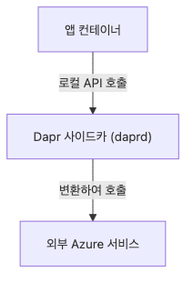

*Local app calls and outward sidecar calls*

앱은 service invocation, state save, pub/sub publish 같은 의도만 표현합니다. sidecar는 어떤 component를 써야 하는지, 어디로 보내야 하는지, 어떻게 인증하고 직렬화할지를 맡습니다. 그래서 앱은 단순해지고 Pod는 더 복잡해집니다.

### 출발점은 upstream pod mutation 모델입니다

Upstream Dapr on Kubernetes는 mutating admission webhook을 통해 sidecar를 주입합니다. injector는 admission review를 받고, pod annotation과 환경 상태를 바탕으로 sidecar config를 만들고, Dapr sidecar container를 추가하는 patch operation을 생성합니다.

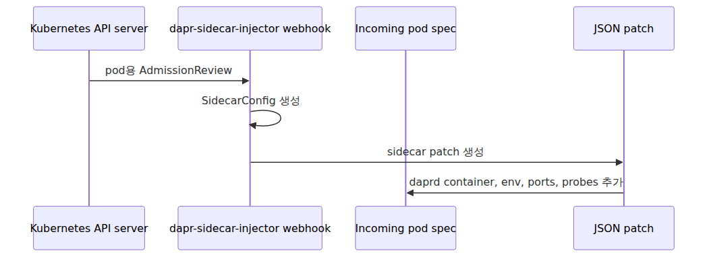

*Sidecar injection through pod mutation*

ACA는 raw Kubernetes admission mechanics를 노출하지 않습니다. 그래서 이 설명은 ACA 공개 구현이 아니라 upstream Dapr documented model입니다. 하지만 ACA가 만들어 내는 sidecar shape를 이해하는 가장 좋은 reference model이기도 합니다.

### injector의 일은 “컨테이너 하나 붙이기”보다 큽니다

Pinned upstream source를 보면 injector는 단순히 `daprd`를 append하지 않습니다. sidecar image, trust anchors, cert material, control plane address, mode, namespace, app ID, protocol, health setting, port, volume mount, env var까지 계산합니다.

즉 sidecar는 generic helper container가 아니라, 꽤 많은 구성을 가진 runtime process입니다. 이걸 이해해야 Dapr enablement가 운영 복잡도를 왜 늘리는지도 자연스럽게 받아들일 수 있습니다.

### sidecar container는 문자 그대로 `daprd`입니다

Upstream `sidecar_container.go`는 이 사실을 아주 직접적으로 보여 줍니다. 주입되는 컨테이너는 `/daprd` 실행 파일을 command로 쓰고, sidecar config에서 조립된 CLI arg를 받으며, explicit port와 probe를 가집니다.

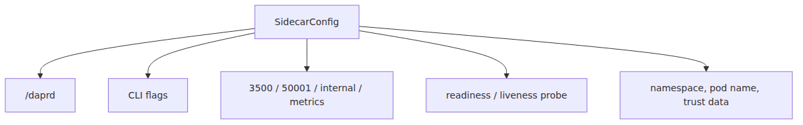

*Injected daprd process and container shape*

이 지점이 중요합니다. Dapr는 passive library가 아닙니다. 실행 중인 별도 프로세스입니다. ACA는 제품 표면에서 스위치를 제공할 뿐이고, 런타임은 실제 Go 프로그램을 하나 더 띄웁니다.

### Go 프로세스라는 말은 사소한 표현이 아닙니다

“사이드카”라는 표현만 들으면 막연한 보조 채널처럼 느껴질 수 있습니다. 하지만 `daprd`를 Go 프로세스라고 명시하면 운영자가 봐야 할 것이 분명해집니다. startup path, crash mode, own logs, health probe, network listener, configuration load path가 따로 존재한다는 뜻이기 때문입니다.

즉 Dapr가 느리거나 죽어 있으면, 이제는 사용자 앱만 디버깅하는 것이 아닙니다. 앱이 의존하는 인접 런타임을 함께 디버깅하는 상황입니다.

### bootstrap path는 실제 런타임 프로그램의 부팅 절차를 보여 줍니다

Pinned upstream 코드에서 `cmd/daprd/main.go`는 작고, 실제 부팅은 `app.Run()`과 runtime creation 경로를 따라갑니다. logging, security, runtime option 조립을 거쳐 최종적으로 Dapr runtime object를 만들고 실행합니다.

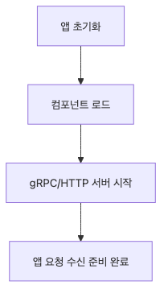

*Bootstrap path from main.go to runtime*

여기서 모든 bootstrap detail을 외울 필요는 없습니다. 중요한 것은 Dapr enablement가 complete runtime program을 띄운다는 사실입니다. 정상적인 프로세스 lifecycle과 구성 파이프라인이 있다는 뜻입니다.

### sidecar 포트는 구체적이고 운영적으로 중요합니다

Upstream runtime config default와 ACA Dapr 문서는 sidecar의 핵심 포트를 설명합니다. HTTP API는 3500, gRPC API는 50001입니다. Upstream Dapr는 public HTTP port 3501도 문서화하지만, ACA는 그 포트의 내부 wiring을 공개하지 않습니다.

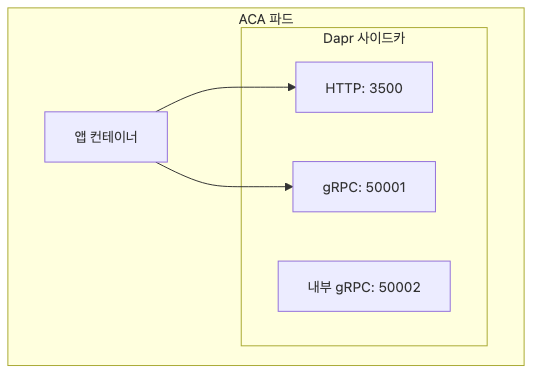

*Dapr HTTP and gRPC ports*

이 포트는 이론이 아니라 앱과 sidecar 사이의 local contract입니다. ACA 앱이 Dapr service invocation이나 state API를 쓸 때, 대개는 이 local listener 중 하나와 통신하고 있습니다.

### localhost가 중요한 이유

sidecar 패턴이 강한 이유는 앱이 최종 네트워크 경로를 몰라도 되기 때문입니다. 앱은 “service X를 호출하라”, “key Y를 저장하라”, “topic Z에 publish하라”는 의도만 표현합니다. sidecar가 어떤 component가 backing store인지, 어디로 라우팅해야 하는지, 어떻게 인증할지를 압니다.


*Localhost API boundary between app and sidecar*

그래서 앱은 더 이식 가능해지고, 반대로 Pod shape는 더 복잡해집니다. localhost 성공이 외부 의존성 성공을 보장하지 않는 이유도 여기 있습니다.

### component loading에서 Environment 경계가 다시 등장합니다

2편에서 본 것처럼 ACA의 Dapr component는 Environment-level resource입니다. 이 글에서는 그 사실이 왜 런타임적으로 중요한지 드러납니다. sidecar는 Dapr app ID와 scope를 기준으로 component 정의를 로드합니다.

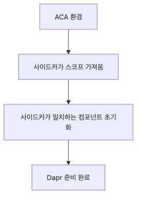

*Environment components and sidecar loading scope*

즉 Environment가 component registry boundary를 소유하고, sidecar가 최종적으로 어떤 scoped component를 활성화할지 결정합니다. app-level enablement와 environment-level dependency가 항상 함께 움직이는 이유가 바로 여기 있습니다.

### Dapr enablement는 app-level switch지만 environment dependency를 가집니다

사용자는 앱에서 Dapr를 켭니다. 하지만 런타임 성공 여부는 Environment에 있는 component와 구성 상태에 의존할 수 있습니다. 이 미묘한 분리가 운영에서 매우 중요합니다.

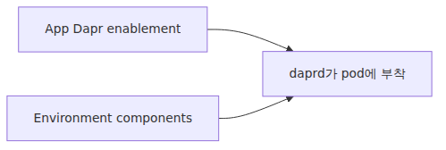

*App-level enablement with environment dependencies*

앱 설정은 맞아 보이는데 동작이 실패할 때, 누락된 조각은 종종 app scope가 아니라 environment scope에 있습니다. Dapr는 항상 두 범위를 가로지릅니다.

### injector flag는 ACA 사용자가 보는 현상과 직접 맞닿아 있습니다

Upstream sidecar builder에는 `--dapr-http-port`, `--dapr-grpc-port`, `--app-id`, `--app-port`, `--app-protocol`, `--control-plane-address`, `--sentry-address`, `--enable-mtls` 같은 flag가 등장합니다. ACA 사용자가 모두 직접 설정하는 것은 아니지만, 런타임은 결국 이런 정보를 필요로 합니다.

이 사실은 managed sidecar integration의 의미를 잘 보여 줍니다. 제품이 세부 plumbing을 감췄을 뿐, sidecar가 요구하는 실제 runtime input은 사라지지 않습니다.

### Dapr는 building-block API뿐 아니라 operational API도 가집니다

ACA 문서가 Dapr overview에서 building-block API와 operational API를 구분하는 이유도 여기 있습니다. sidecar는 state, pub/sub, invocation뿐 아니라 health, metadata 같은 운영 표면도 노출합니다.

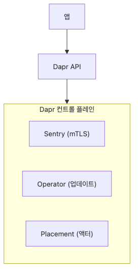

*Building-block and operational Dapr APIs*

즉 sidecar는 원격 호출 편의 래퍼가 아니라, Pod 안에서 주소 가능한 운영 endpoint이기도 합니다.

### app-to-sidecar와 sidecar-to-app은 다른 채널입니다

로컬 관계는 사실 두 방향입니다. 앱이 localhost로 sidecar를 호출하는 경로가 있고, sidecar가 service invocation delivery나 pub/sub handler 같은 패턴에서 앱으로 다시 들어오는 경로가 있습니다.

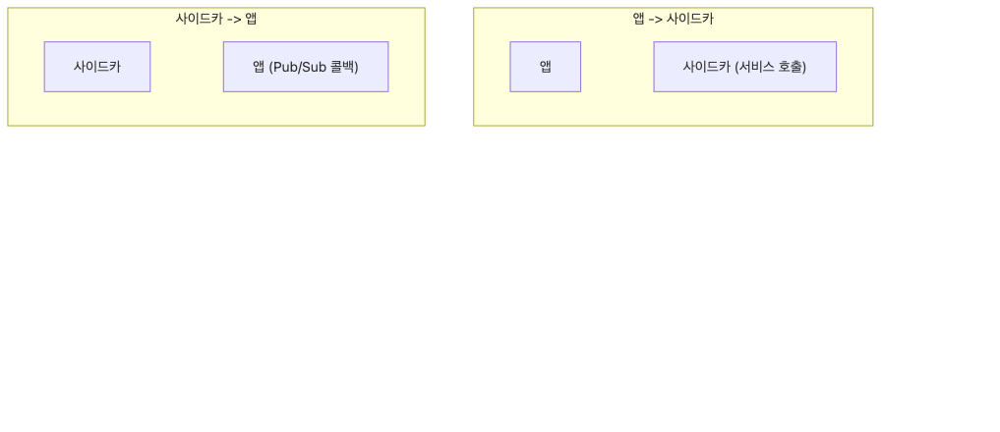

*App calls and sidecar callbacks as dual channels*

그래서 app port와 app protocol은 장식이 아닙니다. sidecar가 사용자 코드에 어떻게 접근할지 알려 주는 실제 계약입니다.

### sidecar 로그는 incident timeline의 1급 증거입니다

Environment 문서는 Dapr sidecar 로그가 shared logging destination에 포함된다고 설명합니다. 이것이 중요한 이유는 실패 원인을 sidecar가 더 잘 알고 있을 수 있기 때문입니다. component load failure, auth issue, service invocation resolution issue, backing service timeout, sidecar startup failure는 앱 로그보다 sidecar 로그에 더 선명하게 남습니다.

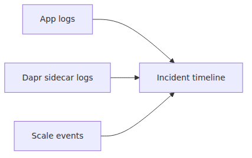

*Sidecar logs in the incident timeline*

따라서 sidecar 로그를 noisy adjunct data로 보면 안 됩니다. 앱 컨테이너 로그와 같은 급의 운영 증거로 다뤄야 합니다.

### mTLS와 trust material도 실제 런타임이라는 증거입니다

Upstream injector 코드에 trust anchors, certificate material, Sentry address, identity-related config가 포함된다는 사실은 중요합니다. 이것은 cosmetic metadata가 아니라, security-aware distributed runtime이 실제로 동작하는 데 필요한 구성입니다.

ACA는 trust, Sentry, mTLS wiring의 정확한 내부 값을 공개하지 않지만, broad runtime shape는 upstream Dapr와 닮아 있다고 보는 편이 가장 안전합니다. 관리 표면이 추상화될 뿐, 런타임 복잡도 자체는 남아 있습니다.

### sidecar lifecycle을 한눈에 보는 그림

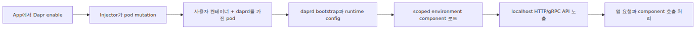

*Full lifecycle of the Dapr sidecar*

이 그림이 보여 주는 것은 단순합니다. ACA의 Dapr 체크박스 하나가 결국 두 번째 프로세스, 두 번째 로그 흐름, 두 번째 health surface, 그리고 Environment 수준 dependency를 만든다는 사실입니다.

### 운영자가 바로 써 볼 수 있는 명령

아래 예시는 앱에 Dapr를 켜고, Environment에 component를 연결하는 가장 기본적인 명령입니다.

```bash
az containerapp update -n my-app -g my-rg \
  --enable-dapr true \
  --dapr-app-id orders \
  --dapr-app-port 8080 \
  --dapr-app-protocol http

az containerapp env dapr-component set \
  -n my-env -g my-rg --dapr-component-name statestore \
  --yaml dapr/statestore.yaml
```

첫 번째 명령은 app-level enablement를, 두 번째 명령은 environment-level dependency를 만듭니다. Dapr가 왜 항상 두 범위를 가로지르는지 이 두 줄만 봐도 이해할 수 있습니다.

## 흔히 헷갈리는 지점

- **Dapr enablement는 메타데이터 추가가 아닙니다.** 실제 sidecar 프로세스가 붙습니다.
- **localhost 호출 성공은 외부 dependency 경로 성공과 다릅니다.** 앱이 sidecar까지 도달했음을 뜻할 뿐입니다.
- **component는 앱 리소스가 아니라 Environment 리소스입니다.** sidecar가 scope에 따라 로드합니다.
- **sidecar 로그는 부가 로그가 아닙니다.** incident 분석의 핵심 증거가 될 수 있습니다.
- **Dapr 문제를 앱 코드 문제로만 보면 안 됩니다.** sidecar bootstrap, component scope, auth, backing service 경로를 함께 봐야 합니다.

## 운영 체크리스트

- [ ] Dapr sidecar readiness가 앱 readiness에 어떻게 반영되는지 확인했습니다.
- [ ] service invocation용 retry와 timeout 정책을 명시적으로 설정했습니다.
- [ ] 어떤 앱이 어떤 environment-scoped component를 쓰는지 ownership matrix를 만들었습니다.
- [ ] Dapr trace를 Application Insights에 연결했습니다.
- [ ] Dapr 장애 시 fallback path(직접 호출, queue bypass)를 정의했습니다.

## 정리

ACA의 Dapr는 API 문법이 아니라 런타임 구조의 변화입니다. 앱에 Dapr를 켜는 순간, 사용자 컨테이너 옆에 실제 `daprd` 계열 sidecar가 붙고, localhost 포트와 component scope, sidecar 로그, health surface가 새로 생깁니다.

또한 이 sidecar는 app-level enablement와 environment-level dependency를 동시에 가집니다. 그래서 Dapr 장애는 앱 코드, sidecar bootstrap, Environment component scope, backing service 경로가 모두 얽힌 문제일 수 있습니다. 이 복합성을 인정해야 제대로 디버깅할 수 있습니다.

다음 글에서는 이 모든 런타임 위로 실제 요청이 어떻게 들어오는지 보겠습니다. FQDN, TLS termination, forwarded header, weighted routing이 Envoy 기반 ingress 경로에서 어떻게 이어지는지 정리하겠습니다.

<!-- toc:begin -->
## 시리즈 목차

- [ACA 아키텍처 — 사용자에게 보이지 않는 Kubernetes 위에 얹은 것](./01-aca-architecture.md)
- [Environment 내부 — 네트워크·관측·Dapr 스코프의 경계](./02-environment-internals.md)
- [Revision과 트래픽 분할 — Envoy 가중치는 어디에서 오는가](./03-revision-and-traffic-split.md)
- [ACA 안의 KEDA — Scale Rule이 만드는 것](./04-keda-in-aca.md)
- **Dapr 사이드카 내부 — 컨테이너 옆에 뜨는 Go 프로세스 (현재 글)**
- Envoy Ingress 경로 — 첫 요청이 사용자 컨테이너에 닿기까지 (예정)

<!-- toc:end -->

## 참고 자료

### 공식 문서
- [Microservice APIs Powered by Dapr](https://learn.microsoft.com/en-us/azure/container-apps/dapr-overview)
- [Dapr Components in Azure Container Apps](https://learn.microsoft.com/en-us/azure/container-apps/dapr-components)
- [Azure Container Apps environments](https://learn.microsoft.com/en-us/azure/container-apps/environment)

### 관련 시리즈
- [Azure Container Apps 101](../../azure-aca-101/ko/)
- [Azure AKS Deep Dive](../../azure-aks-deep-dive/ko/)
- [Azure Functions Deep Dive](../../azure-functions-deep-dive/ko/)

Tags: Container Apps, KEDA, Dapr, Envoy
