# Envoy Ingress 경로 — 첫 요청이 사용자 컨테이너에 닿기까지

## Source Version

이 글의 외부 인용은 다음 upstream 기준으로 고정했습니다:
- Dapr: v1.13.x (https://github.com/dapr/dapr)
- KEDA: v2.14.x (https://github.com/kedacore/keda)
- Envoy: v1.30.x (https://github.com/envoyproxy/envoy)

ACA 내부 구현은 Microsoft가 공개하지 않으므로, 위 버전은 비교 기준으로만 사용합니다.

## Evidence Model

- **Microsoft가 문서로 직접 밝힌 범위**: FQDN, TLS termination, traffic splitting, session affinity, ingress 쪽 readiness 동작.
- **업스트림 동작을 바탕으로 한 추론**: ingress 상태에서 ready replica까지 이어지는 경로는 Envoy류 라우팅과 Kubernetes형 service hop으로 읽는 것이 가장 타당합니다.
- **이 글이 넘지 않는 선**: 정확한 private 0 -> 1 요청 경로, buffering 동작, 비공개 ingress control plane 토폴로지.

> Azure Container Apps Deep Dive 시리즈 (6/6)

Azure Container Apps의 ingress 공개 설명은 짧습니다.

Ingress를 켭니다.
FQDN을 받습니다.
HTTPS 트래픽을 받습니다.
필요하면 Revision 사이에 traffic을 나눕니다.

서비스를 올리는 데는 이 설명으로도 충분합니다.
첫 요청의 경로를 설명하기에는 부족합니다.

이번 마지막 화는 ACA 운영자에게 필요한 해상도로 그 경로를 따라가되, 근거 경계를 먼저 표시합니다.

- **[Documented]** external client -> ACA 관리 ingress 표면(FQDN, TLS termination, traffic splitting, session affinity)
- **[Inferred from Envoy upstream behavior]** ingress proxy의 route matching과 weighted upstream selection
- **[Inferred from Kubernetes Service patterns]** ingress 라우팅 뒤에서 ready revision replica로 이어지는 service성 홉

---

## 이 글에서 답할 질문

- ACA의 ingress는 Envoy 한 겹인가, 그 위에 또 다른 프록시가 있는가?
- external/internal ingress는 같은 이름의 hostname에서 어떻게 갈라지는가?
- TLS 종단(termination)은 어디서 일어나고, 백엔드까지 mTLS는 어떻게 보장되는가?
- header rewriting, sticky session, websocket은 각각 어디서 풀리고 어디서 막히는가?
- ingress 단의 503/504는 무엇을 의미하고, 어떤 메트릭에서 가장 먼저 보이는가?

## 시작점은 앱이 아니라 전체 경로입니다

Ingress 디버깅에서 가장 흔한 실수는 사용자 컨테이너부터 보는 것입니다.
요청은 그 지점에 도달하기 전에 이미 여러 플랫폼 계층을 지납니다.

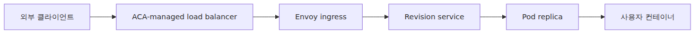
이 순서를 머릿속에 두면 ingress 사고를 훨씬 빨리 국소화할 수 있습니다.

- 아예 연결이 안 되면 Pod 바깥 문제일 수 있습니다.
- Host, TLS, header 문제는 대개 service 홉 이전입니다.
- Revision 선택은 proxy 계층에서 일어납니다.
- 앱 버그는 경로의 마지막 단계입니다.

---

## Microsoft 문서가 직접 말해 주는 ACA ingress 계약

Ingress overview 문서는 제품 수준 계약을 분명히 적습니다.

HTTP ingress는 다음을 제공합니다.

- TLS termination
- HTTP/1.1과 HTTP/2
- WebSocket과 gRPC
- 80, 443 포트
- 기본 HTTP -> HTTPS redirect
- FQDN
- Revision 간 traffic splitting
- Session affinity

이 목록의 각 항목은 proxy 동작을 암시합니다.
그래서 Envoy가 정확한 런타임 고정점이 됩니다.

---

## Load Balancer는 첫 번째 관리형 edge이지 최종 router가 아닙니다

**[Documented]** 사용자는 Pod와 직접 통신하지 않습니다.
**[Documented]** 외부 요청은 먼저 ACA의 관리형 edge 인프라에 닿습니다.

즉 공용 endpoint는 플랫폼 endpoint입니다.
여러분 컨테이너는 그 뒤에 있는 downstream destination 중 하나입니다.

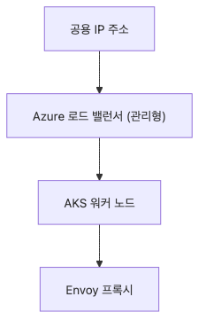
**[Documented]** ACA가 공용 ingress edge를 소유합니다.
**[Inferred from Envoy upstream behavior]** 그 뒤의 HTTP 인지형 라우팅은 Envoy를 고정점으로 설명하는 편이 가장 방어 가능합니다.

이 분리가 feature 수준에서 존재한다는 사실 자체는 Microsoft 문서가 보여 줍니다.
반면 hop-by-hop data plane 배선과 내부 오브젝트 이름은 공개하지 않습니다.

---

## 기본적으로 TLS는 컨테이너가 아니라 ingress에서 끝납니다

Microsoft 문서는 HTTP ingress에서 TLS termination이 ingress point에서 일어난다고 설명합니다.
즉 클라이언트와의 HTTPS 연결은 사용자 컨테이너로 들어가기 전에 종료됩니다.

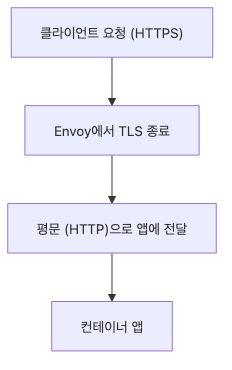
운영적으로는 이 사실이 여러 현상을 설명합니다.

- 앱은 원래 TLS 소켓 대신 forwarded header를 보게 됩니다.
- 인증서 처리는 ingress 표면의 책임입니다.
- 앱이 forwarded header를 무시하고 스스로 client-facing TLS 경계를 갖는다고 가정하면 protocol confusion이 생길 수 있습니다.

이건 일반적인 reverse proxy 동작이며, ACA는 원래 요청 맥락을 복원할 수 있도록 forwarded header를 문서화해 둡니다.

---

## Forwarded header는 ingress 계약의 일부입니다

ACA ingress 문서는 다음 같은 header를 설명합니다.

- `X-Forwarded-Proto`
- `X-Forwarded-For`
- 적절한 certificate mode에서의 `X-Forwarded-Client-Cert`

이 header가 존재하는 이유는 앱이 proxy 뒤에 있기 때문입니다.

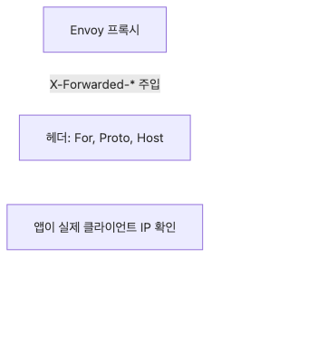
앱이 absolute URL을 만들거나, scheme에 따라 redirect를 하거나, client IP를 로그로 남긴다면, 이 header는 선택 기능이 아니라 실제 런타임 경로 일부입니다.

---

## 라우팅 단계는 추론된 service 홉 이전에 일어납니다

TLS termination 뒤에는 프록시가 upstream destination을 골라야 합니다.
이 선택은 단순할 수도 있고, weighted일 수도 있습니다.

**[Documented]** Microsoft는 revision traffic splitting을 ingress 기능으로 설명합니다.
**[Inferred from Envoy upstream behavior]** 여러 Revision이 active라면, Envoy가 weighted upstream selection을 적용한다고 보는 편이 가장 방어 가능합니다.

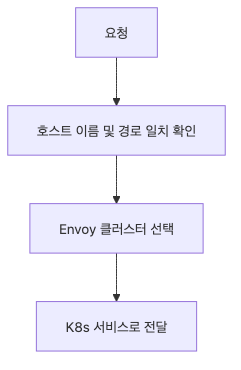
3화가 traffic splitting을 ingress routing data라고 본 이유가 바로 이것입니다.
선택은 여기서 일어나야 합니다.
앱 안쪽이 아닙니다.

---

## Envoy의 weight는 upstream cluster weight입니다

용어를 다시 정확히 고정합니다.

Envoy에서 cluster는 upstream service target입니다.
Kubernetes cluster가 아닙니다.

Pinned Envoy route API source는 routing 계층의 weighted cluster 구성을 정의합니다.
이것이 ACA Revision traffic splitting에 가장 잘 맞는 개념이지만, 어디까지나 ACA가 직접 공개한 설정 덤프가 아니라 추론입니다.

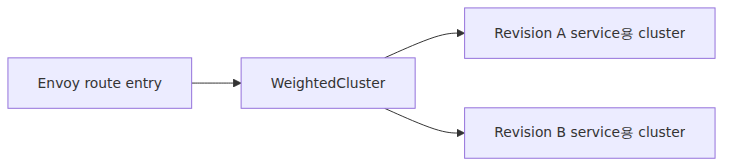
즉 ACA의 80/20 split이 "실제로 어디에 사는가"라는 질문에는, 최선의 Envoy 추론에 따르면 Revision upstream 사이를 고르는 ingress routing state라고 답하는 편이 가장 안전합니다.

---

## ACA가 Kubernetes를 숨기기 때문에 service성 홉을 잊기 쉽습니다

사용자 입장에서는 traffic이 그냥 "Revision으로 간다"고 보입니다.
**[Inferred from Kubernetes Service patterns]** 숨은 데이터 평면을 가장 방어 가능하게 설명하는 모델은, ingress 라우팅 뒤에 service성 홉이 하나 더 있다는 그림입니다.

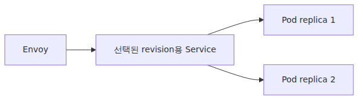
이 홉이 중요한 이유는, 프록시가 고르는 upstream destination이 보통 단일 Pod 하나는 아닐 가능성이 높기 때문입니다.
가장 Kubernetes스러운 설명은, 선택된 Revision의 endpoint 집합이 뒤에서 ready replica로 fan-out된다는 것입니다.

여기서 scaling과 ingress가 처음으로 실제로 만납니다.
제품 수준에서 말할 수 있는 사실은, 선택된 upstream 뒤에 ready replica가 있어야만 요청이 성공할 수 있다는 점입니다.

---

## Readiness는 ingress 경로의 일부입니다

3화는 새 Revision으로 traffic이 넘어가기 전 readiness가 필요하다고 설명했습니다.
4화는 scale activation과 replica 생성을 설명했습니다.
이번 화에서는 그 두 개념이 한 경로에서 만납니다.

**[Documented]** ACA는 새 Revision이 ready 되기 전에는 traffic을 넘기지 않습니다.
**[Inferred from Envoy upstream behavior + Kubernetes Service patterns]** ingress가 Revision 존재를 안다고 해도, 요청을 끝까지 보내려면 선택된 Revision target 뒤에 healthy upstream endpoint가 있어야 합니다.

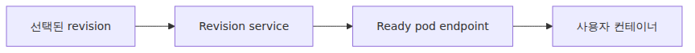
그래서 ingress 디버깅은 revision 상태와 replica readiness를 떼고 볼 수 없습니다.
요청 경로 자체가 원래 그렇게 설계되어 있습니다.

---

## Scale-to-zero Revision의 첫 요청은 특별합니다

**[Documented]** ACA는 scale-to-zero를 지원합니다.
즉 첫 요청이 아직 warm replica가 하나도 없는 Revision을 향할 수 있습니다.

Microsoft는 wake-from-zero 동작을 scale rule 수준에서 문서화합니다.
하지만 0 -> 1 전환 중 Envoy·queueing·routing이 정확히 어떻게 맞물리는지는 Microsoft 소유의 closed-source 영역입니다.

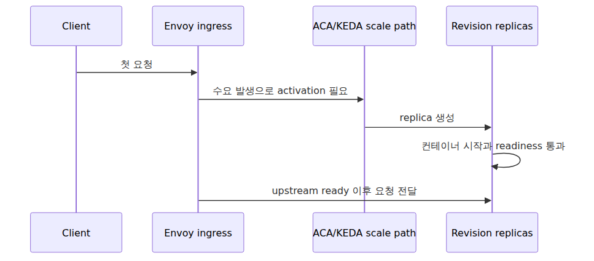
이 지점부터 ingress와 autoscaling은 더 이상 별도 주제가 아닙니다.
운영자가 안전하게 말할 수 있는 수준은, 첫 요청이 scale path가 ready upstream을 만들 때까지 기다릴 수 있다는 점까지입니다.

---

## 플랫폼이 건강해도 첫 요청이 느릴 수 있는 이유

Revision이 0에 있었다면, 첫 요청은 여러 숨은 단계를 함께 지불합니다.

- activation decision
- replica creation
- 필요 시 image start path
- app startup
- probe success
- Dapr가 켜져 있다면 sidecar startup

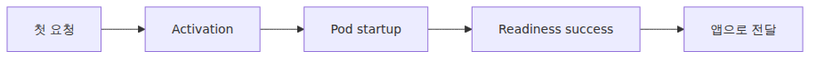
**[Documented]** Microsoft는 scale-to-zero와 revision readiness가 이런 지연을 만들 수 있는 제품 동작이라고 설명합니다.
**[Not public]** 그 순간 ingress plane 내부에서 어떤 buffering·retry·queueing이 일어나는지는 문서화돼 있지 않습니다.

---

## Dapr가 켜져 있으면 ingress 뒤의 런타임 참여자가 하나 더 늘어납니다

**[Documented]** Dapr가 enable된 Pod라면, 최종적으로 요청을 받는 Pod 안에는 사용자 컨테이너와 `daprd`가 함께 있을 수 있습니다.

**[Inferred from Kubernetes Service patterns]** Ingress 경로는 제어면 안이 아니라 Pod endpoint에서 끝난다고 보는 편이 가장 자연스럽습니다.
**[Documented + upstream Dapr context]** 그 직후 동작은 Dapr가 켜져 있다면 sidecar를 바로 포함할 수 있습니다.

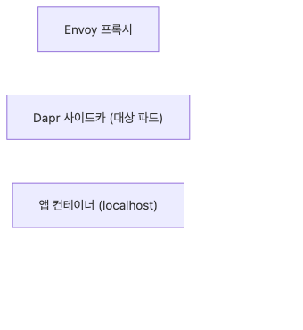
즉 최종 사용자 요청 하나가 ingress routing, revision readiness, pod startup, sidecar 동작까지 한 번에 걸칠 수 있습니다.

---

## Session affinity도 ingress 계층의 기능입니다

ACA 문서는 sticky session을 ingress 기능으로 설명합니다.
이 사실도 ingress가 단순 coarse routing 이상을 맡고 있다는 단서입니다.

Session affinity가 켜져 있으면 **[Documented]** ACA가 stickiness를 ingress에서 제공하고, **[Inferred from Envoy upstream behavior]** 그 구체 메커니즘은 표준 proxy-level affinity로 이해하는 편이 맞습니다.
이 결정 역시 앱에 도달하기 전에 일어납니다.

이번 시리즈에서 중요한 것은 sticky session 세부 구현 전부가 아닙니다.
Revision과 replica 선택이 여전히 proxy concern이라는 사실입니다.

---

## Internal ingress도 공용 edge만 없을 뿐 큰 모양은 같습니다

Internal-only app에서는 인터넷 쪽 edge가 사라집니다.
**[Documented]** 그래도 앱은 ACA ingress 뒤에 있습니다.
**[Inferred from Kubernetes Service patterns]** 그 아래 service-routing 모양은 공용 edge가 없을 뿐 크게 비슷할 가능성이 높습니다.

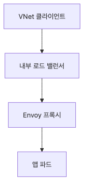
**[Documented]** Edge 쪽 transport는 달라집니다.
**[Inferred from Envoy + Kubernetes patterns]** 그러나 proxy-routing과 service-upstream 논리는 크게 다르지 않을 가능성이 높습니다.

---

## 실무용 ingress 디버깅 사다리

요청이 실패했을 때는 경로 순서대로 확인하는 편이 빠릅니다.

1. Public FQDN을 resolve하고 reach할 수 있는가
2. Ingress가 기대한 external / internal posture로 켜져 있는가
3. TLS termination과 scheme 처리가 올바른가
4. Traffic이 기대한 revision 또는 label로 가고 있는가
5. 선택된 Revision 뒤의 추론된 service/upstream target에 ready replica가 있는가
6. 요청이 도착했을 때 사용자 컨테이너가 제대로 응답하는가

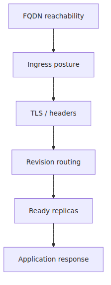
이 사다리는 결국 요청 경로를 운영자 체크리스트로 바꾼 것에 불과합니다.

---

## 전체 요청 경로를 한 장으로

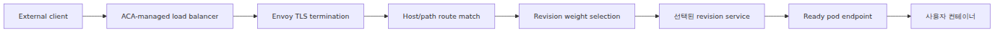
이 그림이 시리즈 전체를 다시 묶는 마지막 도식입니다.

**[Documented]** Environment는 네트워크 경계를 제공했고, Revision은 불변 deployment target을 제공했으며, KEDA 기반 스케일링은 replica를 만들 수 있습니다.
**[Documented]** Dapr는 필요하면 앱 옆에 sidecar를 둡니다.
**[Inferred from Envoy upstream behavior]** Envoy는 라우팅 계층을 설명하는 가장 적절한 런타임 고정점입니다.
**[Inferred from Kubernetes Service patterns]** Service성 홉은 ingress가 ready replica에 닿는 방식을 설명하는 최선의 모델입니다.

---

## 6화 정리

압축 모델은 다음과 같습니다.

> Azure Container Apps에서 첫 외부 HTTP 요청에 대해 Microsoft가 직접 문서화한 부분은 ACA 관리 ingress 표면입니다. FQDN, TLS termination, forwarded header, traffic splitting, session affinity가 여기에 속합니다. 그 뒤의 라우팅은 Envoy 기반으로 보는 편이 가장 설득력 있고, ready replica까지의 경로는 Kubernetes형 service 패턴으로 추론할 수 있습니다. 하지만 private 0 -> 1 요청 경로의 정확한 구현은 공개되지 않았습니다.

이 ingress 경로가 이번 시리즈 전체를 하나로 묶습니다.

---

## 시리즈 안에서의 위치

이번 마지막 화는 시리즈 앞의 모든 개념을 실제 요청 경로에서 다시 만나는 글입니다. Environment는 네트워크 경계를 제공했고, Revision은 불변 traffic target을 제공했으며, KEDA는 replica를 준비했고, Dapr는 요청이 Pod에 닿은 뒤 추가 런타임 계층이 될 수 있었습니다. 제품 표면부터 다시 가볍게 훑고 싶다면 ACA 101 시리즈가 좋은 동반자이고, 기저 플랫폼 노출 정도를 비교해 보고 싶다면 AKS와 Azure Functions 심화 시리즈를 함께 읽는 편이 유익합니다.

---

## Evidence Boundaries

이 장은 시리즈 전체에서 추론 민감도가 가장 높은 부분이라, 주요 주장을 명시적으로 나눕니다.

**Documented (Microsoft Learn / 1차 출처):**
- ACA ingress는 FQDN, TLS termination, forwarded header, revision traffic splitting, session affinity, scale-to-zero를 제공합니다.
- Revision readiness가 traffic 이동을 게이트하고, scaling 동작은 제품 표면에서 문서화돼 있습니다.
- Dapr가 켜져 있으면 Pod 안에 sidecar가 함께 있을 수 있습니다.

**Inferred from upstream behavior:**
- Envoy route matching, weighted upstream selection, proxy-level affinity는 표준 Envoy 의미론에 기대는 추론입니다.
- Service, endpoint, ready replica 홉은 표준 Kubernetes Service 패턴에 기대는 추론입니다.

**Speculation (ACA-internal, not exposed):**
- 정확한 ingress object graph, queueing 전략, buffering 동작, 0 -> 1 요청 처리 방식은 공개되지 않았고 사실처럼 단정하면 안 됩니다.

### ingress 설정과 hostname 확인

```bash
az containerapp ingress show -n my-app -g my-rg \
  --query "{external:external, target:targetPort, transport:transport, traffic:traffic}"

az containerapp ingress traffic show -n my-app -g my-rg -o table
az containerapp hostname list -n my-app -g my-rg -o table
```

## 운영 체크리스트

- [ ] external/internal ingress를 hostname 단위로 일관되게 사용한다
- [ ] TLS 인증서 갱신 자동화를 검증했다
- [ ] websocket과 long-lived connection의 timeout을 ingress와 앱 양쪽에서 일치시켰다
- [ ] ingress 5xx 비율 알림과 latency p95 알림을 분리해서 운영한다
- [ ] ingress 백엔드 health check 실패 시 traffic split 동작을 시뮬레이션했다

<!-- toc:begin -->
## 시리즈 목차

- [ACA 아키텍처 — 사용자에게 보이지 않는 Kubernetes 위에 얹은 것](./01-aca-architecture.md)
- [Environment 내부 — 네트워크·관측·Dapr 스코프의 경계](./02-environment-internals.md)
- [Revision과 트래픽 분할 — Envoy 가중치는 어디에서 오는가](./03-revision-and-traffic-split.md)
- [ACA 안의 KEDA — Scale Rule이 만드는 것](./04-keda-in-aca.md)
- [Dapr 사이드카 내부 — 컨테이너 옆에 뜨는 Go 프로세스](./05-dapr-sidecar-internals.md)
- **Envoy Ingress 경로 — 첫 요청이 사용자 컨테이너에 닿기까지 (현재 글)**

<!-- toc:end -->

---

## 참고 자료

### 1차 출처
- [`Envoy` route 구성 at `v1.30.0`](https://github.com/envoyproxy/envoy/blob/v1.30.0/api/envoy/config/route/v3/route_components.proto)
- [`Envoy` router 구현 at `v1.30.0`](https://github.com/envoyproxy/envoy/blob/v1.30.0/source/common/router/config_impl.cc)

### 2차 출처
- [Ingress in Azure Container Apps](https://learn.microsoft.com/en-us/azure/container-apps/ingress-overview)
- [Traffic splitting in Azure Container Apps](https://learn.microsoft.com/en-us/azure/container-apps/traffic-splitting)
- [Update and deploy changes in Azure Container Apps](https://learn.microsoft.com/en-us/azure/container-apps/revisions)
- [Scaling in Azure Container Apps](https://learn.microsoft.com/en-us/azure/container-apps/scale-app)

### 관련 시리즈
- [Azure Container Apps 101](../../azure-aca-101/ko/)
- [Azure AKS Deep Dive](../../azure-aks-deep-dive/ko/)
- [Azure Functions Deep Dive](../../azure-functions-deep-dive/ko/)

Tags: Container Apps, KEDA, Dapr, Envoy
