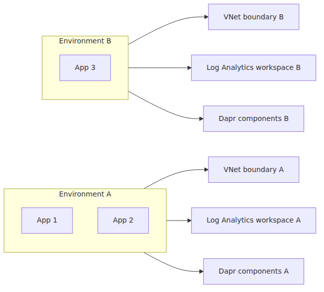
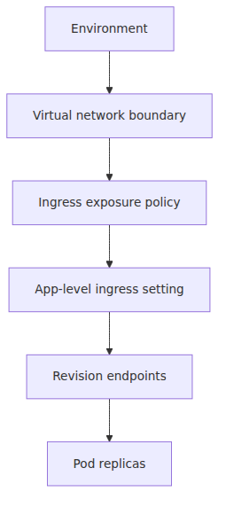
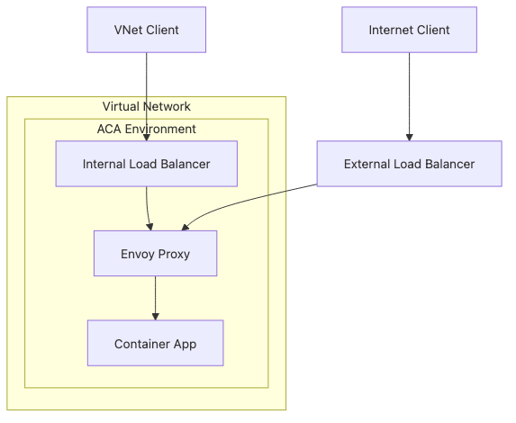
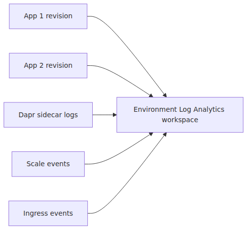
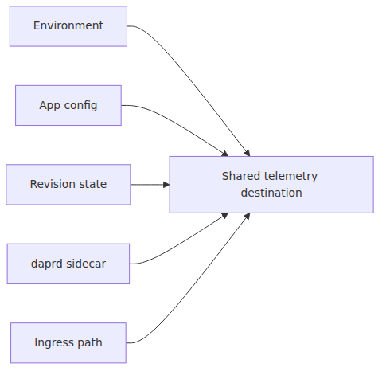
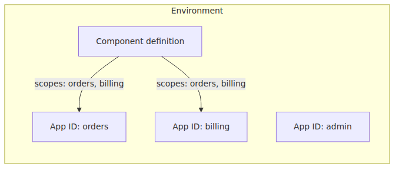
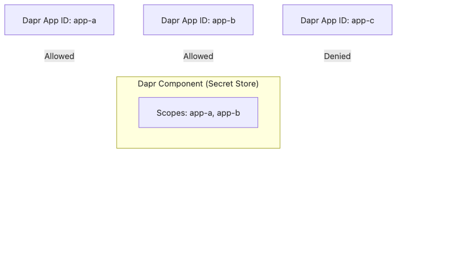
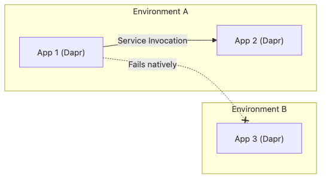
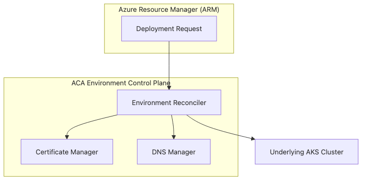

<!-- Medium import-ready. Tags go in Medium's tag field, not the body. -->
<!-- Tags: Container Apps, KEDA, Dapr, Envoy -->

# Environment internals — the network, observability, and Dapr scope boundary

## Source Version

External references in this post are pinned to these upstream baselines:
- Dapr: v1.13.x (https://github.com/dapr/dapr)
- KEDA: v2.14.x (https://github.com/kedacore/keda)
- Envoy: v1.30.x (https://github.com/envoyproxy/envoy)

ACA's internal implementation is not published by Microsoft, so these versions are used only as comparison anchors.

## Evidence Model

- **Documented by Microsoft**: environment scope for networking, logging, and shared Dapr components.
- **Inferred from upstream behavior**: how those documented boundaries most likely map onto runtime isolation and sidecar scoping.
- **Out of bounds**: the exact private cluster layout and non-public control-plane implementation inside an ACA environment.

> Azure Container Apps Deep Dive series (2/6)

Episode 1 drew the stack.
This episode narrows the focus to one resource that looks administrative from the outside and architectural from the inside: the Container Apps environment.

If you remember only one sentence from the Microsoft Learn documentation, make it this one in paraphrased form: the environment is the secure boundary around one or more container apps and jobs.

That sentence explains more than people first assume.

It tells you where network scope lives.
It tells you where logs converge.
It tells you where Dapr components are shared.
It tells you why app placement into environments is a design decision, not a naming decision.

---

## The environment is the platform's isolation unit

An environment is where ACA starts acting like a platform rather than a single app host.

Apps inside the same environment can share:

- The virtual network boundary.
- The ingress surface and DNS suffix.
- The Log Analytics destination.
- The Dapr component registry and scopes.
- Environment-local service reachability.

Apps outside the environment do not automatically share those things.

The operational consequence is straightforward.
If two apps belong to the same blast radius and observability plane, one environment can make sense.
If they require hard separation of network, logging, or Dapr configuration, split them.

---

## Network scope begins at the environment, not at the revision

Revisions are runtime snapshots.
They are not network islands.

The network boundary belongs to the environment.
Microsoft documents that each environment is backed by a virtual network, whether managed for you or supplied by you.
That is why internal service reachability and ingress posture are environment decisions first and app decisions second.

The clean way to think about it is a layered boundary.

You can turn ingress on or off per app.
You can choose external or internal ingress per app.
But those app decisions still live inside one environment-wide network perimeter.

That distinction matters when people try to use a single environment for workloads that should never sit on the same internal mesh.

---

## External versus internal ingress still shares one environment surface

The ingress overview page is explicit.
An app can expose external ingress to the internet and the environment, or internal ingress only to the environment.

That sounds app-local, and it is.
But it is not environment-free.

In a microservice setup, the common pattern is one public-facing app with external ingress, then one or more internal apps with internal ingress only.
All of them still live on the same environment network plane.

This is powerful because the product gives you a prewired north-south and east-west pattern.
It is also constraining because environment membership becomes the security boundary that matters most.

---

## The environment owns the DNS context readers keep tripping over

ACA gives each app an FQDN.
That FQDN is based on the environment's DNS suffix.

This sounds trivial until rollouts and multi-app communication enter the picture.

The environment-level DNS suffix means:

- App endpoints in the same environment share a common naming context.
- Revision labels and app FQDNs are projected through that context.
- Moving an app to another environment changes more than placement; it changes the naming surface readers and callers depend on.

This is why the environment is not a folder.
It is part of the app's network identity.

---

## Observability is centralized at the environment boundary

Microsoft's environment documentation states that apps in the same environment write logs to the same logging destination, and that `appLogsConfiguration` is an environment-level property.
That one detail explains why cross-app troubleshooting inside one environment feels cohesive.

The shared observability plane typically includes:

- Container stdout and stderr.
- Container Apps scaling events.
- Dapr sidecar logs when Dapr is enabled.
- System-level events and metrics exported into the workspace path.

That model is convenient because one workspace can answer questions across multiple services.
It is also a governance decision.
If a team or workload requires separate telemetry retention, access control, or cost accounting, an environment split may be the cleaner boundary.

---

## Shared logs do not mean all signals are identical

Readers sometimes overcorrect after learning the environment shares a workspace.
They start assuming every signal is purely environment-level.
That is not right either.

The environment decides where logs go.
The app, revision, sidecar, and ingress path decide what gets emitted.

So the environment is the collector boundary.
The runtime units are still the producers.

That distinction helps when a workspace contains noise from multiple apps and you need to separate platform behavior from one bad revision.

---

## Dapr components are environment resources first, app resources second

ACA's Dapr integration is the cleanest example of environment scoping.

Microsoft documents Dapr components in Container Apps as environment-level resources.
They can be shared by multiple apps or scoped to specific app IDs.

That means there are two separate questions every time you see a component.

1. In which environment does this component exist?
2. Which Dapr-enabled apps inside that environment are allowed to load it?

That is a strong clue about how to model shared infrastructure.
If several apps in one environment should reuse the same pub/sub or state store component, the environment is the natural home.
If the component boundary itself should split with team or trust boundary changes, the environment often has to split too.

---

## Scope means Dapr app ID, not container app name

This one bites people in production.

The Dapr components documentation is explicit that scopes correspond to Dapr application IDs, not the Container App resource name.
That is an important distinction because the app's Azure resource identity and its Dapr identity are related but not identical concepts.

If a component does not load where you expect, this mapping is one of the first things to verify.

The environment contains the component definition.
The Dapr scope decides which sidecars consume it.

---

## Environment scope is where Dapr stops being per-app customization

There is a subtle but important product choice here.

In raw upstream Dapr on Kubernetes, you think directly in terms of components, configuration resources, app IDs, and the injector.
In ACA, the sidecar still behaves like upstream Dapr, but the supported management surface is narrower.

That narrowing happens at the environment level.

- Components are attached to the environment.
- Supported components are curated by the product.
- Apps then opt in to Dapr and load what their scopes allow.

This is one reason the environment feels like a mini platform.
It is where shared middleware becomes policy.

---

## Cross-app Dapr communication only makes sense inside the environment boundary

The environment documentation points out a practical rule: if multiple apps need to communicate through built-in Dapr service invocation, placing them in the same environment is the natural fit.

That sentence has a converse.
If two services should not share the built-in Dapr communication plane, putting them in different environments gives you a clean separation.

This is less about whether cross-environment workarounds exist and more about what the product treats as its native trust and networking shape.

---

## Environment choice is also a cost and operations choice

The environment page is framed in security and management terms, but there is an operational side too.

Using one environment can simplify:

- Shared observability.
- Shared Dapr component management.
- Internal service communication.
- Fewer top-level deployment targets.

Using multiple environments can simplify:

- Blast-radius control.
- Production and non-production separation.
- Telemetry ownership.
- Network segmentation.
- Dapr configuration isolation.

The hidden Kubernetes layer stays hidden either way.
The difference is where you draw the product boundary around your apps.

---

## Control loops that terminate at the environment boundary

Environment scoping is easiest to see when drawn as control loops.

Notice what is not in that loop.
There is no single revision node in the center.
The environment distributes constraints to many apps at once.

That is the exact reason environment scoping is powerful and dangerous.
It is a shared control surface.

---

## A practical boundary test for architects

When unsure whether two apps belong in the same environment, ask four questions.

1. Should they share a network boundary?
2. Should they land in the same Log Analytics destination?
3. Should they load from the same Dapr component catalog?
4. Should built-in internal communication between them feel native?

If the answer is yes across the board, a shared environment is defensible.
If the answers diverge, that friction is usually trying to tell you the boundary is wrong.

---

## What this episode sets up for the rest of the series

Everything later in ACA inherits this boundary.

Revisions do not escape it.
KEDA scales replicas inside it.
Dapr sidecars load environment-scoped components from it.
Ingress reaches app endpoints that live inside it.

That is why the environment has to come before all the runtime details.

---

## Episode 2 wrap

The shortest accurate summary is this.

> In Azure Container Apps, the Environment is the isolation unit for networking, logging, and Dapr configuration. App-level features such as ingress and revisions live inside that boundary rather than replacing it.

That sentence is the connective tissue for the next four episodes.

---

## Where this fits in the series

This post zoomed into the outer boundary that all later ACA runtime behavior depends on. The practical value is that revisions, scaling, sidecars, and ingress can now be read as behaviors happening inside one shared environment boundary rather than as unrelated product features.

---

## Evidence Boundaries

This chapter is mostly about Microsoft-documented product boundaries, with a small amount of runtime inference.

**Documented (Microsoft Learn / primary sources):**
- The Container Apps environment is the secure boundary around one or more apps and jobs.
- Environment-level networking, ingress posture, DNS context, shared logging destination, and Dapr component scoping are part of the ACA product surface.
- Dapr components are environment-level resources, and scopes map to Dapr app IDs.

**Inferred from upstream behavior:**
- When the post refers to sidecars loading scoped components, it relies on upstream Dapr runtime behavior as the best explanation for ACA's documented component model.
- References to environment-local service reachability follow standard Kubernetes-style service-discovery patterns rather than ACA-published internal object diagrams.

**Speculation (ACA-internal, not exposed):**
- The exact hidden Kubernetes objects, mesh wiring, and control-plane implementation inside an environment are not public.

## In this series

- [ACA architecture — what Microsoft layered on a hidden Kubernetes](https://github.com/yeongseon/tech-writing/blob/f24a126/content/azure-aca-deep-dive/en/01-aca-architecture.md)
- **Environment internals — the network, observability, and Dapr scope boundary (current)**
- Revisions and traffic splitting — where Envoy weights come from (upcoming)
- KEDA inside ACA — what a scale rule actually creates (upcoming)
- Dapr sidecar internals — the Go process that lives next to your container (upcoming)
- The Envoy ingress path — how the first request reaches your container (upcoming)

---

## References

**Primary sources**
- [`dapr/dapr` tree at `v1.13.0`](https://github.com/dapr/dapr/tree/v1.13.0)
- [`Dapr injector` pod patch logic](https://github.com/dapr/dapr/blob/v1.13.0/pkg/injector/service/pod_patch.go)
- [`Dapr sidecar container` construction](https://github.com/dapr/dapr/blob/v1.13.0/pkg/injector/patcher/sidecar_container.go)
- [`Dapr runtime` config defaults](https://github.com/dapr/dapr/blob/v1.13.0/pkg/runtime/config.go)

**Secondary sources**
- [Azure Container Apps environments](https://learn.microsoft.com/en-us/azure/container-apps/environment)
- [Ingress in Azure Container Apps](https://learn.microsoft.com/en-us/azure/container-apps/ingress-overview)
- [Microservice APIs Powered by Dapr](https://learn.microsoft.com/en-us/azure/container-apps/dapr-overview)
- [Dapr Components in Azure Container Apps](https://learn.microsoft.com/en-us/azure/container-apps/dapr-components)

**Related series**
- [Azure Container Apps 101](https://github.com/yeongseon/tech-writing/blob/f24a126/content/azure-aca-101/en)
- [Azure AKS Deep Dive](https://github.com/yeongseon/tech-writing/blob/f24a126/content/azure-aks-deep-dive/en)
- [Azure Functions Deep Dive](https://github.com/yeongseon/tech-writing/blob/f24a126/content/azure-functions-deep-dive/en)
