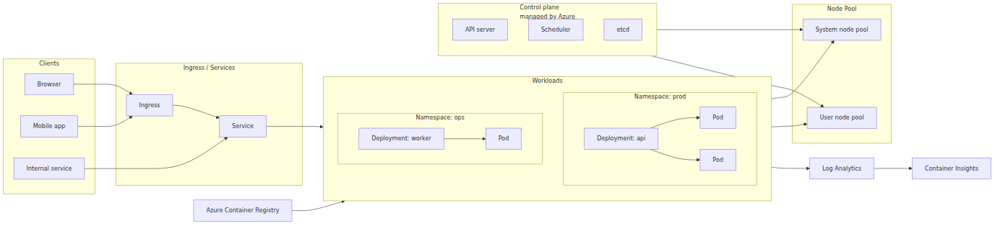
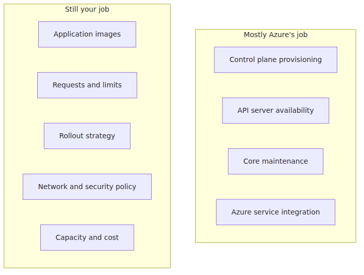

# What is Azure Kubernetes Service? — what managed Kubernetes actually gives you

> Azure Kubernetes Service 101 series (1/7)

Running a couple of containers isn't the hard part anymore. The hard part starts right after that: recovering failed pods, scaling both replicas and nodes under load, exposing services safely, and collecting enough telemetry to operate the whole thing without guessing. Kubernetes solves that category of problems, but self-managing Kubernetes comes with real cognitive and operational cost.

AKS is Azure's answer to that cost. This first post is about understanding AKS more precisely than “Kubernetes on Azure.” The useful question is not whether AKS uses Kubernetes. It does. The useful question is which responsibilities Azure takes over, and which ones stay with you.

---

## The big picture — one AKS cluster at a glance

This is the map for the whole series.
Each later post zooms into one part of the picture.

Part 2 zooms into the control plane and node pools, parts 3 and 4 cover Deployments, Pods, and Services, part 5 covers networking and Ingress, part 6 covers scaling, and part 7 covers monitoring and operations.

---

## A one-sentence definition

AKS is **managed Kubernetes where Azure runs the control plane and you primarily operate node pools and workloads**.

That sentence carries most of what matters.

- Azure provisions and runs the Kubernetes control plane.
- You create node pools and run workloads on them.
- Azure reduces the undifferentiated operational work around upgrades, health, and integration with Azure infrastructure.

AKS does not hide Kubernetes from you. `kubectl`, YAML manifests, Services, Ingress, HPA, and Namespaces are still the language of the platform. What changes is the **responsibility boundary**.

---

## What “managed” means in practice

“Managed” is only useful if it cashes out into concrete operational differences.

Managed Kubernetes does not mean “operations disappear.” It means the center of gravity shifts. You spend less time thinking about etcd topology and control plane bootstrap, and more time thinking about workload placement, scaling, traffic management, observability, and cost.

That distinction matters for two reasons.

First, it sets expectations correctly. AKS won't rescue a bad rollout strategy, a broken readiness probe, or a badly sized workload. Those are still application platform concerns, and they still affect reliability.

Second, it helps you read the bill correctly. AKS control plane management is free. In practice, you pay for the node VMs and the surrounding resources that make the cluster useful.

---

## Why teams choose AKS instead of self-managing Kubernetes

Self-managed Kubernetes still has valid use cases. But for a typical application team, AKS is usually the more practical default.

| Aspect | Self-managed Kubernetes | AKS |
|---|---|---|
| Control plane lifecycle | You own it | Azure owns it |
| Upgrade burden | Higher | Lower |
| Azure integration | Hand-assembled | Built-in paths |
| Time to first cluster | Slower | Faster |
| Fine-grained control | Higher | Some trade-offs |

The win is not “Kubernetes becomes simple.” The win is **you keep standard Kubernetes while offloading a large part of the platform mechanics to Azure**. That means upstream Kubernetes concepts, tooling, and docs still transfer.

If you want a higher abstraction and do not want to think about clusters directly at all, Azure Container Apps may be a better fit. If you mostly want to host a few HTTP apps and do not need Kubernetes semantics, Azure App Service may be a better fit.

---

## Where the money goes

This is one of the first practical questions every team asks.

> In AKS, the control plane is Microsoft-managed and not billed separately. You primarily pay for the node VMs and the surrounding infrastructure you attach to the cluster.

That headline is correct, but the real bill is broader than just VM count.

- Node pool VM cost
- OS and data disks
- Load balancers and public IPs
- Azure Container Registry storage
- Log Analytics, Container Insights, and Prometheus-related monitoring costs

So AKS is not really about a “cluster fee.” It is about **capacity and platform resource cost around the cluster**. That becomes very visible once you add autoscaling and monitoring.

---

## The two structural axes that matter most

To stay oriented through the rest of the series, you only need two big concepts.

### 1) Control plane

The control plane is the brain of the cluster.

- It stores desired state.
- It exposes the Kubernetes API.
- It decides where pods should run.

In AKS, Azure manages this layer.

### 2) Node pools

Node pools are the VM groups where your containers actually run.

- A **system node pool** hosts critical cluster components such as CoreDNS and metrics-server.
- A **user node pool** is where your application workloads should go.

Part 2 goes deeper here. For now, the useful mental model is simple: **the control plane decides, node pools execute**.

---

## When AKS is a strong fit

AKS tends to make the most sense when the team needs:

- a shared deployment platform for multiple services
- standard Kubernetes rollout and service-discovery primitives
- autoscaling and self-healing without building the control plane itself
- natural integration with Azure networking, Azure Monitor, and Azure Container Registry
- a common operating language between platform and application teams

It is less compelling when the workload is tiny, the team does not want Kubernetes concepts at all, and a smaller PaaS would solve the problem with much less operational surface.

---

## How AKS differs from other Azure compute choices

When you evaluate AKS, the shared fact that all of these services run code is less interesting than **how much of the platform they abstract away**.

- **Azure App Service** is much closer to managed web hosting, with more of the runtime and instance model hidden.
- **Azure Functions** is built around event-driven execution, so you do not work with Pods and Services directly.
- **Azure Container Apps** is container-centric, but still keeps the underlying cluster much farther out of view than AKS does.

AKS is the closest of the three to raw Kubernetes. That is the trade. You get the standard Kubernetes model and ecosystem, but you also inherit more of the Kubernetes conceptual surface. That is why this series starts with boundaries and structure rather than with a grab bag of features.

In practice, that comparison comes up often. The same FastAPI application is operated very differently on each platform: App Service centers the conversation on app instances and configuration, Functions centers it on triggers and execution, and AKS centers it on workload objects, traffic flow, and scaling policy. The code may be similar, but the operating model is not.

The earlier that clicks, the faster AKS starts making sense. Adopting Kubernetes is not just a deployment change; it is a change in the operational coordinate system you use to think about the application.

---

## Two misconceptions worth clearing early

### “AKS means almost no operations”

No. It means much less control-plane operations. Workload operations are still yours: node pool design, scaling policy, traffic exposure, logging, alerts, and upgrade planning.

### “AKS only makes sense for microservices”

Also no. A single FastAPI service is enough to learn the model. In fact, starting small is the fastest way to understand how Pods, Services, Ingress, and autoscaling really connect.

---

## Before moving on

If you take one sentence from this post, make it this one:

> AKS does not replace Kubernetes. It keeps Kubernetes and removes a meaningful part of the operational burden around running the control plane.

Once that clicks, the rest of the series becomes much more concrete. Pods and Deployments end up somewhere in node pools. Ingress organizes traffic in front of them. HPA and Cluster Autoscaler adjust different layers of capacity. Monitoring has to see all of it together.

---

This is part 1 of the Azure Kubernetes Service 101 series. This post set the responsibility boundary; part 2 turns that boundary into the concrete cluster shape of control plane and node pools. After that, the series moves through your first deployment, the workload primitives, networking, scaling, and day-2 operations.

---

<!-- blog-only:start -->
Next: [Cluster architecture — control plane and node pools](./02-cluster-architecture.md)
<!-- blog-only:end -->

<!-- toc:begin -->
## In this series

- **What is Azure Kubernetes Service? — what managed Kubernetes actually gives you (current)**
- Cluster architecture — control plane and node pools (upcoming)
- Your first cluster, your first deploy — Python/FastAPI (upcoming)
- Pod, Deployment, Service — the three ways you express a workload (upcoming)
- Networking and Ingress — the path in and out of the cluster (upcoming)
- Scaling — HPA, Cluster Autoscaler, KEDA (upcoming)
- Monitoring and ops — Container Insights, logs, alerts (upcoming)

<!-- toc:end -->

---

## References

### Official Docs
- [What is Azure Kubernetes Service (AKS)?](https://learn.microsoft.com/en-us/azure/aks/what-is-aks)
- [Deploy an Azure Kubernetes Service (AKS) Cluster Using Azure CLI](https://learn.microsoft.com/en-us/azure/aks/learn/quick-kubernetes-deploy-cli)
- [Use system node pools in Azure Kubernetes Service (AKS)](https://learn.microsoft.com/en-us/azure/aks/use-system-pools)
- [Kubernetes core concepts for Azure Kubernetes Service (AKS)](https://learn.microsoft.com/en-us/azure/aks/concepts-clusters-workloads)

### Related Series
- [Azure App Service 101](../../azure-app-service-101/en/) — useful when comparing managed Kubernetes with a higher-level web app platform
- [Azure Functions 101](../../azure-functions-101/en/) — useful when comparing serverless execution with container orchestration

Tags: Azure, AKS, Kubernetes, Cloud
