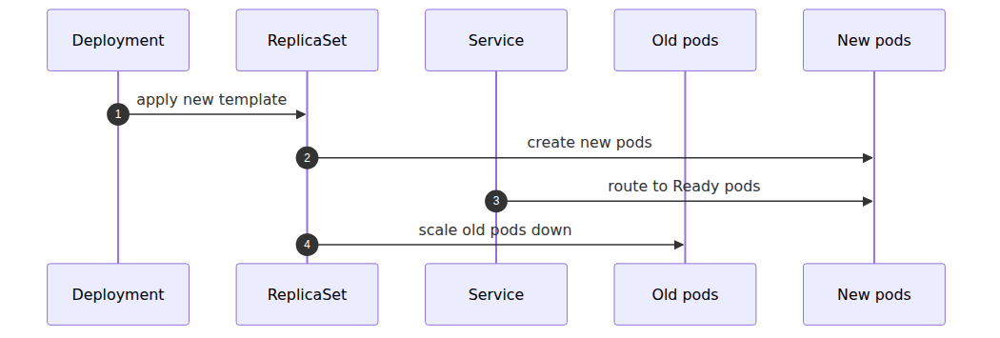

# Pod, Deployment, Service — the three ways you express a workload

> Azure Kubernetes Service 101 series (4/7)

The first time you read Kubernetes manifests, the objects can feel unnecessarily layered. Why not just run a container and be done with it? In practice, most application delivery on Kubernetes gets much easier once you understand three resources cleanly: Pod, Deployment, and Service. They are not redundant. They solve different problems.

This post breaks those three apart. If they stay fuzzy, Ingress and autoscaling stay fuzzy too.

This is the fourth post in the Azure Kubernetes Service 101 series. Here, we separate Pod, Deployment, and Service so the workload model behind the earlier FastAPI example becomes explicit.

---

## Questions this chapter answers

- How do Pod, ReplicaSet, and Deployment split responsibilities?
- How does a Service hide Pod IP churn and route traffic underneath?
- How do rolling and blue/green deploys express themselves in a Deployment?
- When a Pod dies, which controller restores it and in what order?
- Which options control packing pods onto one node versus spreading them?

## One picture first


*Relationship between Pod, Deployment, and Service*
That diagram carries most of the model.

- **Pod** is the minimum scheduling unit.
- **Deployment** declares how many pods should exist and how updates should happen.
- **Service** gives a stable virtual IP and DNS name to a changing set of pods.

Each one owns a different operational concern.

---

## Pod — the minimum scheduling unit

Kubernetes schedules pods, not raw containers.

- Pods share a network namespace.
- Pods can share volumes.
- Containers inside the same pod start and die as a unit.

For a small FastAPI application, a pod often contains only one app container. Even then, Kubernetes still treats the pod as the thing that gets placed on a node.

### Why pods are rarely managed directly

Pods can fail. Nodes can disappear. If you create pods directly, you are also signing up to recreate them directly. That is why production workflows usually put a higher-level controller in front of pods. Most often, that controller is a Deployment.

---

## Deployment — the declarative manager

A Deployment says, “keep this pod template running N times, and update it safely when the template changes.”

That gives you:

- self-healing through pod recreation
- declarative replica management
- rolling updates
- rollback-friendly revision history

Under the hood, a Deployment creates and manages a ReplicaSet, which in turn manages pods. You do not usually operate ReplicaSets directly, but it helps to know they are there.

---

## Service — stable identity in front of unstable pods

Pods are not permanent endpoints. They can be replaced, and their IPs can change. Building app-to-app traffic around pod IPs would be fragile almost immediately.

Service solves that by creating a stable access layer.

- stable virtual IP
- stable DNS name inside the cluster
- label-based selection of backend pods

The point is simple: other services should not need to know which pod instance is currently alive. They should send traffic to a stable service identity.

---

## Smallest useful example

```yaml
apiVersion: apps/v1
kind: Deployment
metadata:
  name: fastapi-hello
spec:
  replicas: 2
  selector:
    matchLabels:
      app: fastapi-hello
  template:
    metadata:
      labels:
        app: fastapi-hello
    spec:
      containers:
        - name: app
          image: <your-registry>/fastapi-hello:latest
          ports:
            - containerPort: 8000
---
apiVersion: v1
kind: Service
metadata:
  name: fastapi-hello
spec:
  selector:
    app: fastapi-hello
  ports:
    - port: 80
      targetPort: 8000
  type: ClusterIP
```

There is no explicit Pod resource in this manifest. The pod shape lives inside the Deployment's `template`.

---

## Why labels matter so much

Labels are the glue.

- the Deployment uses them to define which pods it owns
- the Service uses them to decide which pods receive traffic

So a label like `app: fastapi-hello` is not decoration. It is how deployment and routing line up.

When labels go wrong, the failures are usually one of two kinds.

1. the Deployment cannot manage the intended pods correctly
2. the Service routes to the wrong pods or to none at all

---

## The three Service types to know first

For a 101-level model, three are enough.

### ClusterIP

- internal-only access
- best for service-to-service communication
- default Service type

This is the most common starting point.

### NodePort

- exposes the Service on a port on every node
- useful for learning and a few constrained scenarios
- less common as a long-term production entry point

It helps explain the model, but it is rarely the cleanest final answer.

### LoadBalancer

- asks the cloud provider for an external load balancer
- in AKS, maps to an Azure load balancer-backed path
- useful for quickly publishing a single service

Once you need richer HTTP routing, you typically move to Ingress in front of ClusterIP services.

---

## ClusterIP vs NodePort vs LoadBalancer

| Type | Reachability | Main use | AKS feel |
|---|---|---|---|
| ClusterIP | inside the cluster | service-to-service traffic | default |
| NodePort | node IP + port | learning, special access patterns | operationally rougher |
| LoadBalancer | outside the cluster | simple external exposure | integrates with Azure LB |

That table also hints at why Ingress exists. LoadBalancer is enough for simple exposure, but not enough for clean HTTP routing across many services.

---

## Scaling pods and routing traffic are different jobs

This is one of the earliest conceptual mix-ups.

- Deployment changes pod count.
- Service distributes traffic across the matching pods.

Service does not create pods. Deployment does. Service attaches to the set of pods selected by labels.

That separation is why the model scales well. Lifecycle control and traffic identity stay decoupled.

---

## Deployment becomes clearer when you imagine an update

Suppose you roll out a new image version. The Deployment usually does not kill every old pod at once. It creates replacement pods gradually.



*Deployment and Service during rolling updates*
That is why readiness probes matter so much. The Service starts using new pods only when they are considered ready to receive traffic.

---

## When a pod has more than one container

For introductory workloads, one app container per pod is the cleanest default. Still, it helps to understand why a pod is a container group rather than just a single process wrapper.

Common multi-container pod cases include:

- logging sidecars
- proxy sidecars
- tightly coupled helper processes

What you generally do not want is to cram unrelated services into the same pod. Shared lifecycle is a strong coupling mechanism.

---

## How this shows up in AKS operations

AKS does not change the meaning of Pod, Deployment, or Service. So when a workload fails, a useful troubleshooting order is often:

1. Are the pods healthy?
2. Is the Deployment maintaining the expected replicas?
3. Is the Service selecting the intended pods?

An external access issue is not automatically an Ingress issue. Very often it starts lower down with a bad selector, a failed probe, or an image pull problem.

---

## Bridge to the next post

So far, Service has done a bit of double duty for us. It gave the workload a stable internal identity, and in simple cases it can also expose it externally.

But once you want:

- multiple services behind one public entry point
- path-based routing
- host-based routing
- cleaner TLS termination

you are ready for the next layer: Ingress and cluster networking.

---

This is part 4 of the Azure Kubernetes Service 101 series. Part 3 used Pod, Deployment, and Service in a real FastAPI deployment; this post separated their responsibilities so the model is explicit. Part 5 adds networking and Ingress in front of those Services and explains how traffic moves into and through the cluster.

---

## Operational checklist

- [ ] Set resource requests and limits on every container
- [ ] Pinned the rolling-update strategy with explicit maxSurge/maxUnavailable
- [ ] Confirmed the Service selector matches Pod labels exactly
- [ ] Guaranteed an availability floor with a PodDisruptionBudget
- [ ] Spread pods across nodes with topologySpreadConstraints or anti-affinity

<!-- toc:begin -->
## In this series

- [What is Azure Kubernetes Service? — what managed Kubernetes actually gives you](./01-what-is-aks.md)
- [Cluster architecture — control plane and node pools](./02-cluster-architecture.md)
- [Your first cluster, your first deploy — Python/FastAPI](./03-first-cluster-and-deploy.md)
- **Pod, Deployment, Service — the three ways you express a workload (current)**
- Networking and Ingress — the path in and out of the cluster (upcoming)
- Scaling — HPA, Cluster Autoscaler, KEDA (upcoming)
- Monitoring and ops — Container Insights, logs, alerts (upcoming)

<!-- toc:end -->

---

## References

### Official Docs
- [Kubernetes core concepts for Azure Kubernetes Service (AKS)](https://learn.microsoft.com/en-us/azure/aks/concepts-clusters-workloads)
- [Services, load balancing, and networking in Kubernetes](https://kubernetes.io/docs/concepts/services-networking/service/)
- [Deployments](https://kubernetes.io/docs/concepts/workloads/controllers/deployment/)

### Related Series
- [Azure App Service 101](../../azure-app-service-101/en/02-request-lifecycle.md) — useful when comparing Kubernetes service routing with a more opinionated PaaS request path
- [Azure Functions 101](../../azure-functions-101/en/02-triggers-and-bindings.md) — useful when comparing pod-centric workloads with event-triggered execution

Tags: Azure, AKS, Kubernetes, Cloud
