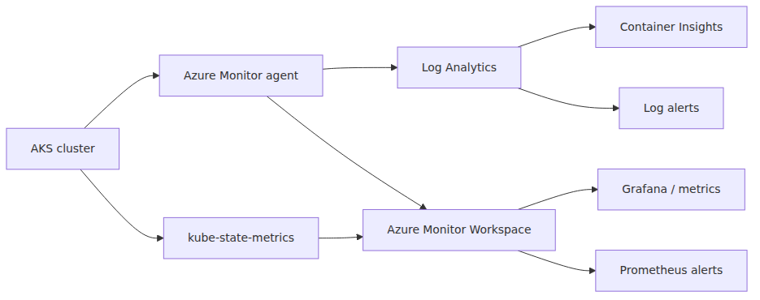
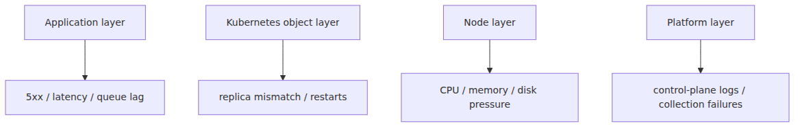

# Monitoring and ops — Container Insights, logs, alerts

> Azure Kubernetes Service 101 series (7/7)

AKS is not done once deployment works. That is when operations starts. Why are pods restarting? Which node pool is saturating first? Why did HPA not react the way you expected? Can you see the problem before users do? Those are observability questions before they are platform questions.

This final post is a 101-level operations map for AKS: what Container Insights gives you, where KQL fits, why kube-state-metrics matters, and where alerts should live.

---

## The operations view in one diagram


The useful split is between two telemetry paths.

- **log path**: Log Analytics, Container Insights, KQL
- **metrics path**: Prometheus-style metrics, kube-state-metrics, Grafana, metrics alerts

Day-2 operations usually needs both.

---

## What Container Insights gives you

Container Insights is the Azure Monitor experience for Kubernetes and AKS.

- node, pod, and container state views
- log collection
- built-in visualizations
- performance and inventory data

At the 101 level, it is the fastest way to answer the question, “what is the cluster doing right now?” You can always query the Kubernetes API directly, but real operations needs centralized collection and historical context.

---

## Why logs and metrics need to stay separate in your head

### Logs are best for

- exact error text
- startup and shutdown context
- reconstructing event sequences

### Metrics are best for

- trends over time
- saturation patterns
- replica drift
- node pressure

If pods are restarting, metrics and inventory views may tell you *that* it is happening. Logs and events usually tell you *why*.

---

## The Log Analytics path

Container Insights stores collected AKS log data in a Log Analytics workspace, where KQL becomes the main tool.

The tables you will reach for often include:

- `ContainerLogV2`
- `KubeEvents`
- `KubePodInventory`
- `KubeNodeInventory`

Those four cover a large amount of first-response troubleshooting.

---

## Useful KQL examples

### Recent Kubernetes events

```kusto
KubeEvents
| where not(isempty(Namespace))
| sort by TimeGenerated desc
| take 50
```

This is a great first query after a rollout or an unexpected failure.

### Logs for a specific pod

```kusto
ContainerLogV2
| where PodNamespace == "default"
| where PodName startswith "fastapi-hello"
| project TimeGenerated, PodName, ContainerName, LogMessage
| order by TimeGenerated desc
```

### Failed pods

```kusto
KubePodInventory
| where PodStatus == "Failed"
| project TimeGenerated, Namespace, Name, PodStatus, ContainerStatusReason
| order by TimeGenerated desc
```

Those three queries alone give you a strong 101-level starting kit.

---

## Why kube-state-metrics matters

kube-state-metrics exposes the state of Kubernetes objects as metrics.

- Deployment desired vs available replicas
- HPA current vs desired replicas
- pod phases
- node conditions

Resource-level telemetry such as CPU and memory tells you about runtime pressure. kube-state-metrics tells you about **Kubernetes object state**. That is the key difference.

In Azure Monitor managed Prometheus, kube-state-metrics is one of the default scrape targets.

---

## The kinds of operational questions it answers well

- Is a Deployment stuck below desired availability?
- Is HPA pinned near max replicas?
- Are pods accumulating in Pending?
- Is node capacity drifting toward pressure?

Those are more useful operations questions than a raw CPU graph on its own because they line up with the Kubernetes control model.

---

## Where alerts should live


Good alerting is layered. CPU over 80% by itself is rarely a complete operations strategy.

### Application layer

- latency increase
- error-rate increase
- queue depth growth

### Kubernetes object layer

- available replicas below desired
- restart spikes
- HPA pinned near maximum

### Node layer

- node pool saturation
- disk pressure
- NotReady nodes

---

## Azure Monitor alert types you will encounter

Azure Monitor gives you several useful alert paths for AKS.

- **Metric alerts**
- **Log search alerts**
- **Prometheus alerts**

Each has a natural place.

- fast threshold checks often fit metric alerts
- KQL-driven detection fits log alerts
- Prometheus-style metrics fit Prometheus alerts

Action groups then connect those alerts to email, webhooks, automation, and incident systems.

---

## A small but effective starter alert set

You do not need dozens of alerts to begin responsibly. A good first set often includes:

1. critical Deployment available replicas below target
2. unusual pod restart increase
3. node pool utilization pressure
4. HPA pinned near max replicas for too long
5. application error-rate or failure-rate increase

The highest-value early alert is often a replica-availability alert on your important Deployments. It tracks user-facing risk directly.

---

## Container Insights and kubectl are complements, not substitutes

### Container Insights / Azure Monitor is great for

- trends
- central collection
- history
- alerts and dashboards

### `kubectl` is great for

- immediate object state
- `describe` output
- exact rollout and event inspection

A common workflow is: notice a restart pattern in Container Insights, then jump into `kubectl describe pod` and targeted KQL queries to narrow the cause.

---

## Day-2 checks that stay useful

- Are system and user pools behaving as intended?
- Are LoadBalancer and Ingress paths healthy?
- Are Pending pods recurring?
- Is log collection volume higher than the value it provides?
- Do the collection presets and namespace filters still match your actual operations needs?

Observability is not “collect everything forever.” It is “collect enough to answer real incidents without losing control of cost.”

---

## Closing the series

The goal of this AKS 101 series was never to enumerate every Kubernetes feature. It was to build a working mental model for AKS as managed Kubernetes on Azure: the control plane boundary, node pools, workload primitives, networking, scaling, and finally observability.

At this point, you should be able to picture a small FastAPI service running on AKS end to end: where requests enter, which objects route them, where capacity expands, and where you would look when something breaks. Once that model is stable, deeper topics become additive instead of disorienting.

---

This is the final part of the Azure Kubernetes Service 101 series. The earlier posts built the cluster, workload, traffic, and scaling model; this one tied those pieces together from an operations perspective. From here, teams usually branch into deeper topics such as security, storage, GitOps, policy, or service mesh based on their own platform priorities.

---

<!-- toc:begin -->
## In this series

- [What is Azure Kubernetes Service? — what managed Kubernetes actually gives you](./01-what-is-aks.md)
- [Cluster architecture — control plane and node pools](./02-cluster-architecture.md)
- [Your first cluster, your first deploy — Python/FastAPI](./03-first-cluster-and-deploy.md)
- [Pod, Deployment, Service — the three ways you express a workload](./04-pod-deployment-service.md)
- [Networking and Ingress — the path in and out of the cluster](./05-networking-and-ingress.md)
- [Scaling — HPA, Cluster Autoscaler, KEDA](./06-scaling-hpa-ca-keda.md)
- **Monitoring and ops — Container Insights, logs, alerts (current)**

<!-- toc:end -->

---

## References

### Official Docs
- [Kubernetes monitoring in Azure Monitor](https://learn.microsoft.com/en-us/azure/azure-monitor/containers/kubernetes-monitoring-overview)
- [Enable monitoring for AKS clusters](https://learn.microsoft.com/en-us/azure/azure-monitor/containers/kubernetes-monitoring-enable)
- [Query container logs in Azure Monitor](https://learn.microsoft.com/en-us/azure/azure-monitor/containers/container-insights-log-query)
- [Default Prometheus metrics configuration in Azure Monitor](https://learn.microsoft.com/en-us/azure/azure-monitor/containers/prometheus-metrics-scrape-default)
- [Overview of Azure Monitor alerts](https://learn.microsoft.com/en-us/azure/azure-monitor/alerts/alerts-overview)

### Related Series
- [Azure Functions 101](../../azure-functions-101/en/07-monitoring-and-ops.md) — useful when comparing AKS operations with Application Insights-centric serverless operations
- [Azure App Service 101](../../azure-app-service-101/en/06-logging-monitoring.md) — useful when comparing AKS observability with a simpler web platform model

Tags: Azure, AKS, Kubernetes, Cloud
