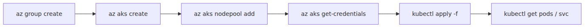
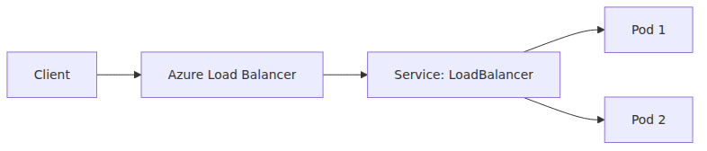

# 첫 클러스터 만들고 앱 배포하기 — Python/FastAPI

> Azure Kubernetes Service 101 시리즈 (3/7)

개념을 오래 붙들고 있으면 Kubernetes는 필요 이상으로 추상적으로 느껴집니다. 실제로는 작은 앱 하나를 올려 보면 훨씬 빨리 감이 옵니다. 리소스를 선언하고, 클러스터에 적용하고, Service를 통해 접근하는 흐름이 한 번 손에 들어오면 그 뒤의 네트워킹과 스케일링도 갑자기 현실적인 문제가 됩니다.

이번 글에서는 실습용 AKS 클러스터를 만들고, 아주 작은 FastAPI 앱을 컨테이너로 만든 뒤, Deployment와 Service로 배포합니다. 예시는 최대한 작게 두되, 운영 환경에서 왜 user node pool 분리가 중요한지도 같이 짚겠습니다.

---

## 오늘 할 일의 순서


여기서 `az` 명령은 Azure 쪽 리소스를 만들고, `kubectl`은 Kubernetes API에 원하는 상태를 선언합니다. 이 분리를 체감하는 것이 오늘 실습의 절반입니다.

---

## 0. 준비물

- Azure CLI
- `kubectl`
- Azure 구독
- 컨테이너 이미지를 올릴 레지스트리

실습에서는 AKS 예제 흐름을 설명하는 데 집중하므로, 이미지는 Azure Container Registry나 Docker Hub 어느 쪽을 써도 됩니다. Azure 환경에서 이어서 운영할 생각이라면 ACR이 자연스럽습니다.

---

## 1. 리소스 그룹 만들기

먼저 리소스 그룹을 만듭니다.

```bash
export RESOURCE_GROUP="rg-aks-101"
export LOCATION="koreacentral"
export CLUSTER_NAME="aks-101-cluster"
export USER_POOL="userpool1"

az group create --name $RESOURCE_GROUP --location $LOCATION
```

이 단계는 Kubernetes와 직접 관련은 없지만, AKS가 Azure 리소스라는 사실을 보여 줍니다. 클러스터도 결국 Azure Resource Manager 아래에서 관리됩니다.

---

## 2. 실습용 AKS 클러스터 만들기

가장 단순한 생성 명령은 아래처럼 가져갈 수 있습니다.

```bash
az aks create \
  --resource-group $RESOURCE_GROUP \
  --name $CLUSTER_NAME \
  --node-count 1 \
  --generate-ssh-keys
```

이 명령에서 먼저 볼 포인트는 네 가지입니다.

- `az aks create`는 AKS 클러스터를 만듭니다.
- 예제에서는 실습 비용을 줄이기 위해 `--node-count 1`을 명시했습니다.
- 최신 Learn 빠른 시작 기준으로 기본 생성 흐름은 system-assigned managed identity를 사용합니다.
- `--generate-ssh-keys`는 필요한 SSH 키가 없을 때 생성해 줍니다.

운영 환경에서는 기본값을 그대로 믿기보다 VM 크기, 네트워킹 방식, 업그레이드 정책, 모니터링 설정까지 같이 설계해야 합니다. 하지만 입문 실습에서는 **먼저 클러스터 하나를 만들고, Kubernetes 객체를 올리는 감각**이 더 중요합니다.

---

## 3. user node pool 추가하기

AKS 빠른 시작 문서도 애플리케이션은 user node pool에서 돌리도록 권장합니다. 실습이더라도 그 구조를 한 번은 밟아 보는 편이 좋습니다.

```bash
az aks nodepool add \
  --resource-group $RESOURCE_GROUP \
  --cluster-name $CLUSTER_NAME \
  --name $USER_POOL \
  --node-count 1 \
  --mode User
```

이제 클러스터에는 기본 system pool과 새 user pool이 같이 있게 됩니다.

확인은 이렇게 합니다.

```bash
az aks nodepool list \
  --resource-group $RESOURCE_GROUP \
  --cluster-name $CLUSTER_NAME \
  --query "[].{Name:name, Mode:mode, Count:count}"
```

여기서 `Mode`가 `System`, `User`로 나뉘는 것을 보면 2화에서 본 구조가 실제 리소스로 드러납니다.

---

## 4. kubectl이 클러스터를 보게 만들기

Azure 리소스를 만드는 일과 Kubernetes API를 조작하는 일은 별개입니다. 이제 kubeconfig를 받아 와야 합니다.

```bash
az aks get-credentials --resource-group $RESOURCE_GROUP --name $CLUSTER_NAME
```

그 다음 연결을 확인합니다.

```bash
kubectl get nodes
```

노드가 두 개 보이면 보통 다음 상황입니다.

- 기본 system node pool의 노드 1개
- user node pool의 노드 1개

이제부터는 대부분의 작업이 `kubectl` 영역으로 넘어갑니다.

---

## 5. FastAPI 앱 준비하기

앱 코드는 아주 작게 갑니다.

```python
from fastapi import FastAPI

app = FastAPI()

@app.get("/")
def read_root():
    return {"message": "hello from aks"}

@app.get("/healthz")
def healthz():
    return {"status": "ok"}
```

컨테이너를 위한 `Dockerfile`은 다음처럼 둘 수 있습니다.

```dockerfile
FROM python:3.12-slim

WORKDIR /app

COPY requirements.txt .
RUN pip install --no-cache-dir -r requirements.txt

COPY main.py .

CMD ["uvicorn", "main:app", "--host", "0.0.0.0", "--port", "8000"]
```

`requirements.txt`는 최소한으로 갑니다.

```text
fastapi==0.115.0
uvicorn[standard]==0.30.6
```

이미지를 빌드해서 레지스트리에 올린 뒤, 그 이미지를 Deployment에서 사용하면 됩니다.

---

## 6. Deployment와 Service 작성하기

이번 글에서는 가장 작은 두 객체만 씁니다.

```yaml
apiVersion: apps/v1
kind: Deployment
metadata:
  name: fastapi-hello
spec:
  replicas: 2
  selector:
    matchLabels:
      app: fastapi-hello
  template:
    metadata:
      labels:
        app: fastapi-hello
    spec:
      nodeSelector:
        kubernetes.azure.com/mode: user
      containers:
        - name: app
          image: <your-registry>/fastapi-hello:latest
          ports:
            - containerPort: 8000
          startupProbe:
            httpGet:
              path: /healthz
              port: 8000
            periodSeconds: 5
            failureThreshold: 12
          readinessProbe:
            httpGet:
              path: /healthz
              port: 8000
            initialDelaySeconds: 3
            periodSeconds: 5
          livenessProbe:
            httpGet:
              path: /healthz
              port: 8000
            initialDelaySeconds: 15
            periodSeconds: 10
            failureThreshold: 3
          resources:
            requests:
              cpu: 100m
              memory: 128Mi
            limits:
              cpu: 300m
              memory: 256Mi
---
apiVersion: v1
kind: Service
metadata:
  name: fastapi-hello
spec:
  selector:
    app: fastapi-hello
  ports:
    - port: 80
      targetPort: 8000
  type: LoadBalancer
```

여기서 오늘 기억할 라인은 네 줄입니다.

- `replicas: 2` — 같은 앱 Pod를 두 개 원한다는 선언
- `nodeSelector` — user node pool에 올리겠다는 의도 표현
- `startupProbe` — 앱이 처음 뜨는 동안 liveness probe가 성급하게 재시작시키지 않게 하는 안전장치
- `type: LoadBalancer` — Azure Load Balancer를 붙여 외부 진입점을 만들겠다는 선언

실습 예제라고 해서 probe를 모두 같은 값으로 두면 운영 감각이 흐려집니다. readiness probe는 “이제 트래픽을 받아도 되는가”를 빠르게 판단하고, liveness probe는 시작 지연이나 초기 의존성 연결 때문에 컨테이너를 불필요하게 죽이지 않도록 더 느슨하게 두는 편이 안전합니다.

---

## 7. 클러스터에 적용하기

매니페스트를 `fastapi-hello.yaml`로 저장했다면 적용은 한 줄입니다.

```bash
kubectl apply -f fastapi-hello.yaml
```

그 다음 상태를 확인합니다.

```bash
kubectl get deployments
kubectl get pods -o wide
kubectl get services
```

`-o wide`를 붙이면 어느 노드에 올라갔는지가 보입니다. 여기서 user node pool 노드에 앱 Pod가 올라간다면 의도한 배치가 맞게 된 것입니다.

---

## 8. 요청이 들어가고 응답이 나오는 길


이 그림은 5화의 Ingress 이야기 전 단계입니다. 지금은 Service가 외부 진입점까지 맡고 있습니다. 조금 더 복잡한 HTTP 라우팅이 필요해지면 여기 앞단에 Ingress를 추가하게 됩니다.

---

## 9. 외부 IP 확인과 테스트

LoadBalancer 타입 Service는 Azure 쪽 퍼블릭 엔드포인트를 만드는 데 시간이 조금 걸릴 수 있습니다.

```bash
kubectl get service fastapi-hello
```

`EXTERNAL-IP`가 잡히면 테스트합니다.

```bash
curl http://<external-ip>/
```

예상 응답은 대략 이렇습니다.

```json
{"message":"hello from aks"}
```

이 응답이 돌아오면 다음 세 가지가 한 번에 확인된 것입니다.

- 컨테이너가 정상 기동됨
- Deployment가 원하는 수의 Pod를 유지함
- Service가 외부 요청을 Pod로 연결함

---

## 10. 초반에 자주 막히는 지점

### 이미지 pull 실패

레지스트리 인증이나 이미지 이름 오타일 가능성이 큽니다.

```bash
kubectl describe pod <pod-name>
```

### Service 외부 IP가 오래 안 붙음

Azure Load Balancer 프로비저닝이 진행 중일 수 있습니다. 이벤트를 함께 보세요.

```bash
kubectl describe service fastapi-hello
```

### Pod는 뜨는데 Ready가 안 됨

`/healthz` 경로나 포트 번호가 맞는지 먼저 봅니다. readiness probe는 “프로세스가 떴는가”보다 “트래픽을 받아도 되는가”를 묻습니다.

---

## 11. 실습이 끝나면 무엇이 남아야 하나

이번 글의 목적은 YAML 문법 암기가 아닙니다. 아래 흐름을 몸으로 기억하는 데 있습니다.

1. `az aks create`로 Azure 쪽 클러스터를 만든다.
2. `az aks get-credentials`로 Kubernetes API에 붙는다.
3. `kubectl apply -f`로 원하는 상태를 선언한다.
4. Deployment와 Service가 그 상태를 실제 Pod와 엔드포인트로 만든다.

이 순서만 분명하면 뒤에서 Deployment 전략을 바꾸거나, Ingress를 붙이거나, HPA를 켜는 작업도 같은 언어로 이어집니다.

---

## 정리

오늘 만든 예시는 아주 작지만, AKS 운영의 주요 축이 이미 다 들어 있습니다.

- Azure CLI로 클러스터와 node pool 생성
- `kubectl`로 Kubernetes 객체 선언
- user node pool에 워크로드 배치
- Service로 외부 노출

오늘 쓴 객체 셋 중에서도 Pod·Deployment·Service는 이후 모든 예제의 기본 문법이 됩니다.

---

이 글은 Azure Kubernetes Service 101 시리즈의 3화입니다. 앞의 두 화에서 AKS와 클러스터 구조를 봤다면, 이번 화는 그 구조 위에 FastAPI 앱을 실제로 올리는 단계였습니다. 이제 남은 일은 오늘 매니페스트에 등장한 Pod, Deployment, Service를 각각 왜 따로 두는지 더 또렷하게 이해하는 것입니다.

---

<!-- toc:begin -->
## 시리즈 목차

- [Azure Kubernetes Service란? — 직접 운영하지 않아도 되는 Kubernetes](./01-what-is-aks.md)
- [클러스터 아키텍처 — Control Plane과 Node Pool](./02-cluster-architecture.md)
- **첫 클러스터 만들고 앱 배포하기 — Python/FastAPI (현재 글)**
- Pod·Deployment·Service — 워크로드를 표현하는 세 가지 방식 (예정)
- 네트워킹과 Ingress — 클러스터 안과 밖을 잇는 길 (예정)
- 스케일링 — HPA, Cluster Autoscaler, KEDA (예정)
- 모니터링과 운영 — Container Insights, 로그, 알람 (예정)

<!-- toc:end -->

---

## 참고 자료

### 공식 문서
- [Deploy an Azure Kubernetes Service (AKS) Cluster Using Azure CLI](https://learn.microsoft.com/en-us/azure/aks/learn/quick-kubernetes-deploy-cli)
- [Create node pools in Azure Kubernetes Service (AKS)](https://learn.microsoft.com/en-us/azure/aks/create-node-pools)
- [Use system node pools in Azure Kubernetes Service (AKS)](https://learn.microsoft.com/en-us/azure/aks/use-system-pools)
- [az aks create](https://learn.microsoft.com/en-us/cli/azure/aks#az-aks-create)
- [az aks get-credentials](https://learn.microsoft.com/en-us/cli/azure/aks#az-aks-get-credentials)

### 관련 시리즈
- [Azure App Service 101](../../azure-app-service-101/ko/04-first-deploy.md) — 같은 FastAPI 앱을 더 높은 수준의 PaaS에 올리는 흐름과 비교할 때
- [Azure Functions 101](../../azure-functions-101/ko/) — 코드 배포 단위가 컨테이너와 어떻게 다른지 비교할 때

Tags: Azure, AKS, Kubernetes, Cloud
