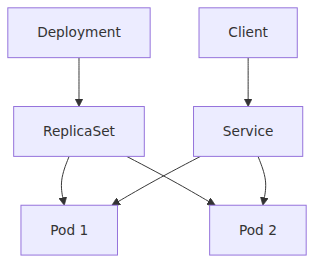
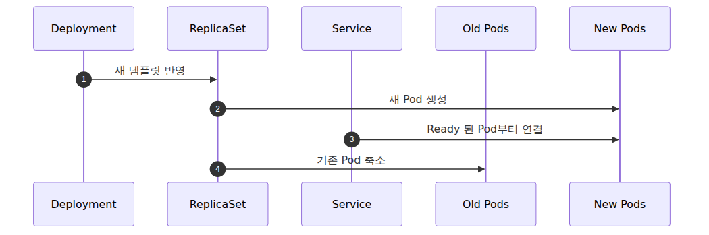

# Pod·Deployment·Service — 워크로드를 표현하는 세 가지 방식

> Azure Kubernetes Service 101 시리즈 (4/7)

처음 Kubernetes YAML을 보면 비슷해 보이는 객체가 많습니다. 그런데 대부분의 애플리케이션 배포는 Pod, Deployment, Service 세 가지를 정확히 이해하면 절반 이상 풀립니다. 이 셋은 겹치는 개념이 아니라, 서로 다른 문제를 맡는 레이어입니다.

이번 글에서는 “컨테이너 하나 띄우기”라는 요구가 왜 세 객체로 나뉘는지 설명합니다. AKS를 쓰더라도 이 개념은 그대로 Kubernetes 자체의 언어이기 때문에, 여기서 헷갈리면 뒤의 Ingress와 HPA도 같이 흐려집니다.

---

## 이 글에서 답할 질문

- Pod, ReplicaSet, Deployment의 책임 분담은 어떻게 다른가?
- Service가 Pod IP 변경을 어떻게 추상화하고, 내부적으로 어떻게 라우팅하는가?
- rolling update와 blue/green 배포는 Deployment에서 어떻게 표현하는가?
- Pod가 죽었을 때 어떤 컨트롤러가 어떤 순서로 복구하는가?
- 동일 노드 vs. 여러 노드에 Pod를 분산시키려면 어떤 옵션을 써야 하는가?

## 세 객체를 한 장으로 보면


이 그림이 거의 전부입니다.

- **Pod**는 컨테이너를 실행하는 최소 단위
- **Deployment**는 원하는 Pod 복제본 수와 업데이트 전략을 선언하는 단위
- **Service**는 바뀌는 Pod 집합 앞에 고정된 주소와 이름을 두는 단위

각자 맡는 문제가 다르기 때문에 셋이 동시에 필요합니다.

---

## Pod — 스케줄링의 최소 단위

Pod는 Kubernetes가 노드에 배치하는 최소 단위입니다. 컨테이너 하나만 들어 있을 수도 있고, 여러 컨테이너가 함께 들어 있을 수도 있습니다.

중요한 점은 “컨테이너”가 아니라 **Pod가 스케줄링 단위**라는 사실입니다.

- Pod는 같은 네트워크 네임스페이스를 공유합니다.
- 같은 볼륨을 마운트할 수 있습니다.
- 같이 뜨고 같이 사라집니다.

단일 FastAPI 앱 예제에서는 보통 Pod 안에 앱 컨테이너 하나만 둡니다. 그래도 Kubernetes는 여전히 그 앱을 컨테이너가 아니라 Pod로 취급합니다.

### Pod를 단독으로 잘 안 쓰는 이유

Pod는 깨질 수 있고, 노드는 내려갈 수 있고, 수동으로 다시 만들어야 하면 귀찮습니다. 그래서 운영에서는 Pod를 직접 만들기보다, 그 Pod를 관리하는 상위 객체를 둡니다. 그 상위 객체가 보통 Deployment입니다.

---

## Deployment — 원하는 상태를 선언하는 관리자

Deployment는 “이 앱 Pod를 몇 개 유지하고, 업데이트는 어떤 방식으로 할지”를 선언하는 객체입니다.

직접 Pod를 두 개 만들 수도 있지만, Deployment를 쓰면 다음이 달라집니다.

- Pod가 죽어도 다시 맞춰 줍니다.
- 복제본 수를 선언적으로 유지합니다.
- 롤링 업데이트를 지원합니다.
- 이전 버전으로 되돌릴 단서가 남습니다.

내부적으로는 Deployment가 ReplicaSet을 만들고, ReplicaSet이 Pod 개수를 맞춥니다. 실무에서는 ReplicaSet을 직접 자주 만지지는 않지만, 구조는 알아 두는 편이 좋습니다.

---

## Service — 변하는 Pod 앞에 고정 주소를 둠

Pod는 영구적인 존재가 아닙니다. 교체되면 IP가 바뀔 수 있습니다. 앱 간 통신을 Pod IP에 직접 걸면 운영이 금방 망가집니다.

Service는 이 문제를 푸는 기본 장치입니다.

- Pod 집합 앞에 고정된 가상 IP를 둡니다.
- 클러스터 내부 DNS 이름을 제공합니다.
- 라벨 셀렉터로 대상 Pod 집합을 고릅니다.

즉 Service는 “어떤 Pod들이 현재 살아 있는지”를 직접 알 필요 없이, **이 이름으로 보내면 된다**는 인터페이스를 만듭니다.

---

## 가장 작은 예시

```yaml
apiVersion: apps/v1
kind: Deployment
metadata:
  name: fastapi-hello
spec:
  replicas: 2
  selector:
    matchLabels:
      app: fastapi-hello
  template:
    metadata:
      labels:
        app: fastapi-hello
    spec:
      containers:
        - name: app
          image: <your-registry>/fastapi-hello:latest
          ports:
            - containerPort: 8000
---
apiVersion: v1
kind: Service
metadata:
  name: fastapi-hello
spec:
  selector:
    app: fastapi-hello
  ports:
    - port: 80
      targetPort: 8000
  type: ClusterIP
```

이 매니페스트에는 Pod 객체가 직접 보이지 않습니다. Deployment의 `template`이 바로 “이런 모양의 Pod를 만들라”는 뜻이기 때문입니다.

---

## 라벨이 왜 이렇게 중요한가

Deployment와 Service는 둘 다 라벨을 통해 연결됩니다.

- Deployment는 어떤 Pod가 자기 소유인지 라벨로 구분합니다.
- Service는 어떤 Pod로 트래픽을 보낼지 라벨로 고릅니다.

따라서 라벨 설계는 Kubernetes에서 작은 일이 아닙니다. `app: fastapi-hello` 한 줄이 단순 장식이 아니라 배포와 라우팅의 연결점입니다.

라벨이 꼬이면 흔히 두 종류 문제가 납니다.

1. Deployment가 의도한 Pod를 제대로 관리하지 못함
2. Service가 엉뚱한 Pod로 붙거나 아무 Pod도 못 찾음

---

## Service 타입 세 가지

입문 단계에서는 세 가지를 먼저 익히면 충분합니다.

### ClusterIP

기본값입니다.

- 클러스터 내부에서만 접근 가능
- 서비스 간 통신에 적합
- 외부 공개는 별도 Ingress나 LoadBalancer 필요

가장 자주 쓰는 타입입니다. 대부분의 내부 API와 백엔드 서비스는 여기서 시작합니다.

### NodePort

- 각 노드의 특정 포트를 열어 서비스에 연결
- 학습용이나 특정 제약 환경에서는 보이지만, 운영 주력으로 쓰는 경우는 많지 않음

NodePort는 구조를 이해하는 데는 좋지만, 외부 공개의 최종 형태로 쓰기엔 다소 거칠습니다.

### LoadBalancer

- 클라우드 로드 밸런서를 연결
- AKS에서는 Azure Load Balancer 리소스와 이어짐
- 빠르게 외부 진입점을 만들기 좋음

단일 서비스 하나를 바로 공개할 때는 편합니다. 다만 경로 기반 라우팅이나 여러 도메인을 한 진입점에서 처리하려면 5화의 Ingress로 넘어가게 됩니다.

---

## ClusterIP, NodePort, LoadBalancer 비교

| 타입 | 접근 범위 | 주 용도 | AKS에서의 느낌 |
|---|---|---|---|
| ClusterIP | 클러스터 내부 | 서비스 간 통신 | 기본값 |
| NodePort | 노드 IP + 포트 | 학습, 특수 접근 | 직접 운영 부담 있음 |
| LoadBalancer | 클러스터 외부 | 단일 외부 공개 | Azure LB와 연결 |

이 표를 보면 Ingress가 왜 등장하는지도 읽힙니다. LoadBalancer만으로도 외부 공개는 되지만, HTTP 라우팅 제어가 부족합니다.

---

## Pod 수를 늘리는 것과 Service는 별개다

초반에 자주 섞이는 개념입니다.

- Deployment의 `replicas`를 늘리는 일은 Pod 수를 바꾸는 일
- Service는 현재 살아 있는 Pod 집합으로 요청을 나누는 일

즉 Service는 Pod를 만들지 않습니다. Deployment가 Pod를 만들고, Service는 그중 라벨이 맞는 Pod들에게 붙습니다.

이 분리가 좋은 이유는 역할이 단순하기 때문입니다. 앱 수명주기와 네트워크 진입점을 한 객체에 몰아넣지 않습니다.

---

## 롤링 업데이트를 떠올리면 Deployment의 역할이 더 잘 보인다

새 버전 이미지를 배포한다고 해 보겠습니다. Deployment는 보통 기존 Pod를 한 번에 다 지우지 않고, 일부씩 새 버전으로 교체합니다.


이 과정에서 Service는 Ready 상태가 된 새 Pod로 자연스럽게 붙습니다. 그래서 readiness probe가 중요합니다. “살아 있다”와 “트래픽 받아도 된다”를 구분하지 않으면, Service가 너무 일찍 새 Pod로 붙어 버릴 수 있습니다.

---

## Pod 안에 컨테이너를 여러 개 넣는 경우

입문에서는 앱 컨테이너 하나만 쓰는 편이 낫습니다. 그래도 Pod가 왜 “컨테이너”가 아니라 “컨테이너 묶음” 단위인지 정도는 알아 둘 필요가 있습니다.

대표적인 패턴은 다음과 같습니다.

- 로그 수집 사이드카
- 프록시 사이드카
- 앱과 매우 강하게 결합된 보조 프로세스

다만 아무 관련 없는 두 서비스를 한 Pod에 같이 넣는 것은 보통 좋지 않습니다. 같이 스케줄되고 같이 죽는다는 뜻이기 때문입니다.

---

## AKS에서 이 셋을 볼 때의 실무 감각

AKS는 Kubernetes를 관리형으로 제공하지만, Pod·Deployment·Service의 의미는 바꾸지 않습니다. 따라서 장애를 볼 때도 순서를 이렇게 잡으면 좋습니다.

1. Pod가 정상인가
2. Deployment가 원하는 복제본 수를 유지하는가
3. Service가 올바른 라벨의 Pod를 잡고 있는가

외부 요청이 실패해도 무조건 Ingress부터 보는 것은 아닙니다. 의외로 Service selector 오타, readiness probe 실패, 이미지 pull 문제 같은 더 아래층에서 막히는 경우가 많습니다.

---

## 다음 화를 위한 연결

오늘은 Service를 외부 공개 장치처럼 잠깐 썼지만, 실제 HTTP 라우팅은 곧 더 복잡해집니다.

- 여러 서비스가 하나의 도메인을 공유하면?
- `/api`는 API로, `/`는 웹 프런트로 보내야 하면?
- TLS 종료를 어디서 할까?

이 질문이 바로 5화의 네트워킹과 Ingress입니다.

---

이 글은 Azure Kubernetes Service 101 시리즈의 4화입니다. 3화에서 FastAPI 앱을 클러스터에 올리면서 Pod·Deployment·Service를 처음 사용했다면, 이번 화는 그 세 객체가 각각 무슨 문제를 푸는지 분리해서 설명한 글입니다. 다음 5화에서는 이 Service 앞단에 Ingress와 AKS 네트워킹을 올려, 클러스터 안팎을 잇는 길을 정리합니다.

---

## 운영 체크리스트

- [ ] 리소스 요청(requests)과 한도(limits)를 모든 컨테이너에 지정했다
- [ ] rolling update 전략과 maxSurge/maxUnavailable을 명시했다
- [ ] Service의 selector가 Pod 라벨과 정확히 일치하는지 확인했다
- [ ] PodDisruptionBudget으로 가용성 하한을 보장했다
- [ ] topologySpreadConstraints나 anti-affinity로 노드 분산 정책을 적용했다

<!-- toc:begin -->
## 시리즈 목차

- [Azure Kubernetes Service란? — 직접 운영하지 않아도 되는 Kubernetes](./01-what-is-aks.md)
- [클러스터 아키텍처 — Control Plane과 Node Pool](./02-cluster-architecture.md)
- [첫 클러스터 만들고 앱 배포하기 — Python/FastAPI](./03-first-cluster-and-deploy.md)
- **Pod·Deployment·Service — 워크로드를 표현하는 세 가지 방식 (현재 글)**
- 네트워킹과 Ingress — 클러스터 안과 밖을 잇는 길 (예정)
- 스케일링 — HPA, Cluster Autoscaler, KEDA (예정)
- 모니터링과 운영 — Container Insights, 로그, 알람 (예정)

<!-- toc:end -->

---

## 참고 자료

### 공식 문서
- [Kubernetes core concepts for Azure Kubernetes Service (AKS)](https://learn.microsoft.com/en-us/azure/aks/concepts-clusters-workloads)
- [Services, load balancing, and networking in Kubernetes](https://kubernetes.io/docs/concepts/services-networking/service/)
- [Deployments](https://kubernetes.io/docs/concepts/workloads/controllers/deployment/)

### 관련 시리즈
- [Azure App Service 101](../../azure-app-service-101/ko/02-request-lifecycle.md) — 요청이 앱 인스턴스로 들어가는 흐름과 비교할 때
- [Azure Functions 101](../../azure-functions-101/ko/02-triggers-and-bindings.md) — 함수 단위 실행 모델과 비교할 때

Tags: Azure, AKS, Kubernetes, Cloud
