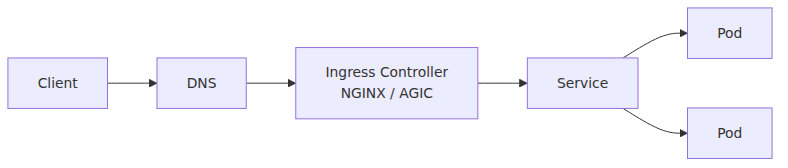
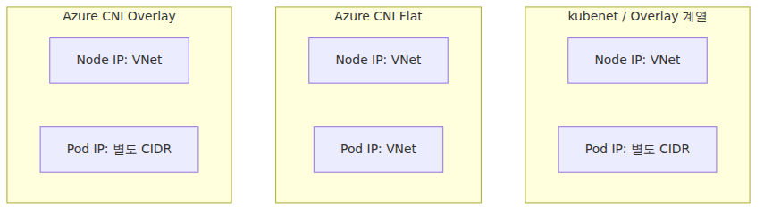
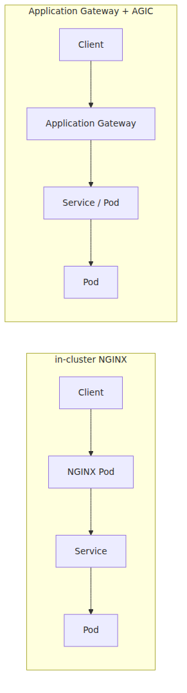

# 네트워킹과 Ingress — 클러스터 안과 밖을 잇는 길

AKS를 쓰다 막히는 지점은 대개 네트워크입니다. Pod끼리는 통신이 되는데 외부에서 붙지 않거나, Service는 있는데 도메인 라우팅이 되지 않거나, 서브넷이 충분해 보였는데 노드 수와 클러스터 수가 늘어나자 갑자기 IP 계획이 빡빡해집니다. 처음에는 전부 비슷한 문제처럼 보이지만, 사실은 서로 다른 층의 문제입니다.

이 주제를 정리하려면 먼저 두 가지를 분리해야 합니다. 하나는 Pod가 어떤 주소 체계를 쓰는지, 다른 하나는 외부 HTTP 요청이 어떤 경로로 클러스터 안 Service까지 들어오는지입니다. IP 할당 모델과 트래픽 진입 계층을 섞어 보면 Ingress와 CNI 이야기가 모두 흐려집니다.

이 글은 Azure AKS 101 시리즈의 5번째 글입니다.

여기서는 **Pod IP 설계와 외부 HTTP 라우팅을 분리해서** AKS 네트워킹을 정리하겠습니다. Azure CNI Overlay가 왜 새 클러스터의 자연스러운 기본 선택지인지, 그리고 Service와 Ingress가 왜 L4와 L7이라는 서로 다른 층에 놓이는지 차례로 보겠습니다.

## 이 글에서 다룰 문제

- Pod IP 할당 방식과 외부 HTTP 라우팅을 왜 별개의 문제로 봐야 할까요?
- kubenet, Azure CNI, Azure CNI Overlay는 각각 어떤 운영 trade-off를 가질까요?
- 새 AKS 클러스터에서 Azure CNI Overlay를 먼저 검토하는 이유는 무엇일까요?
- Service만으로 해결되지 않는 것을 Ingress controller가 정확히 무엇으로 채워 줄까요?
- NGINX, AGIC, Application Routing add-on은 어떤 상황에서 다른 감각을 줄까요?

## 왜 이 글이 중요한가

네트워크는 AKS에서 가장 늦게까지 모호하게 남는 층입니다. 배포는 성공했고 Pod도 Running인데 외부 요청이 실패하면, 사람들은 곧바로 “네트워크가 문제다”라고 말합니다. 하지만 여기에는 Pod IP 할당, Service 타입, LoadBalancer 프로비저닝, Ingress controller, TLS 종료, DNS 구성처럼 전혀 다른 원인이 섞여 있습니다.

또한 네트워크 선택은 뒤늦게 바꾸기 싫은 축입니다. CNI 모델과 IPAM 설계는 노드 수, 클러스터 수, peering, 온프레미스 연결, 보안 정책까지 영향을 줍니다. 처음에는 사소해 보여도, 나중에는 플랫폼 전체의 제약이 되기 쉽습니다.

마지막으로 이 글은 6화 스케일링과도 직접 연결됩니다. 요청이 어디로 들어오는지, Pod가 어떤 IP 모델 위에서 실행되는지 이해해야 스케일아웃 시 병목이 어디서 생기는지도 읽을 수 있습니다. 네트워킹은 독립 주제가 아니라 운영 전반의 바닥 구조입니다.

## AKS 네트워킹을 이해하는 가장 좋은 방법: IP 할당 모델과 트래픽 진입 계층을 분리해서 보는 것입니다

AKS 네트워킹을 한 번에 이해하려 하면 오히려 더 헷갈립니다. 저는 먼저 아래 두 질문을 따로 둡니다. 첫째, Pod는 어떤 주소 공간을 사용하고 그 주소가 VNet과 어떤 관계를 가지는가. 둘째, 외부에서 들어온 HTTP 요청은 어떤 L7 계층을 거쳐 어떤 Service로 전달되는가. 이 둘이 섞여 보이면 kubenet과 Ingress가 같은 종류의 문제처럼 느껴집니다.

이 분리가 중요한 이유는 운영 제어점이 다르기 때문입니다. CNI 모델은 클러스터 생성 시점의 네트워크 설계에 가깝고, Ingress는 서비스 공개와 라우팅 정책 설계에 가깝습니다. 둘 다 네트워크지만, 바꾸는 타이밍과 책임 주체와 장애 양상이 다릅니다.

따라서 이 글에서는 먼저 요청 경로를 그리고, 그다음 Pod IP 모델을 비교하고, 마지막에 Ingress controller 선택과 TLS 종료 위치를 다루겠습니다. **아래층의 주소 체계와 위층의 HTTP 라우팅을 분리해 보는 것**이 핵심입니다.

> AKS 네트워킹은 “Pod가 어디서 주소를 받는가”와 “외부 요청이 어떤 HTTP 진입 계층을 거쳐 들어오는가”를 분리해서 봐야 가장 잘 정리됩니다.

## 핵심 개념

### 외부 요청 경로부터 먼저 보는 편이 좋습니다

클러스터 밖에서 안쪽으로 들어오는 요청 관점에서는 아래 그림이 가장 중요합니다.



*Ingress 앞단의 외부 요청 흐름*

이 그림이 보여 주는 핵심은 단순합니다. Service는 클러스터 내부의 안정적인 진입점이고, Ingress는 그 앞단의 HTTP 라우터입니다. 즉 외부 요청은 보통 L7 계층을 거쳐 L4 서비스 추상화로 내려가고, 그 뒤에 Pod 집합이 있습니다.

반면 Pod IP와 서브넷 설계는 이 경로의 더 아래층입니다. 관련은 있지만 같은 문제는 아닙니다. 이 구분만 분명해도 네트워킹을 훨씬 덜 막연하게 볼 수 있습니다.

### 클러스터를 만들기 전에 먼저 정해야 하는 네트워크 질문이 있습니다

AKS 네트워킹은 나중 옵션처럼 보여도 실제로는 초기 설계에 가깝습니다. 보통 다음 질문이 먼저 따라옵니다.

- Pod IP를 어떤 방식으로 할당할 것인가
- Pod가 VNet 주소 체계 안에서 직접 보여야 하는가
- 외부 시스템이 Pod IP를 직접 알아야 하는가
- 노드 수와 클러스터 수가 어느 정도까지 커질 것인가

현재 AKS 문서 흐름 기준으로, 새 클러스터라면 **Azure CNI Overlay**를 가장 먼저 검토하는 것이 자연스럽습니다. 이유는 Azure 통합을 유지하면서도 IP 소비 부담을 크게 줄이기 때문입니다.

### kubenet, Azure CNI, Azure CNI Overlay는 운영 trade-off가 다릅니다

#### 1) kubenet

kubenet은 오래된 경량 선택지였습니다.

- 노드는 VNet 서브넷 IP를 사용합니다.
- Pod는 별도 논리 주소 공간을 씁니다.
- 라우팅과 NAT가 개입합니다.
- IP를 아끼는 데 유리했습니다.

하지만 신규 장기 선택지로 보기에는 적합하지 않습니다. AKS 문서 기준으로 kubenet 지원 종료 시점이 이미 제시되어 있기 때문입니다. 즉 kubenet은 forward-looking default라기보다 legacy 또는 migration 주제에 더 가깝습니다.

#### 2) Azure CNI

flat Azure CNI 모델에서는 Pod가 VNet 쪽 주소 공간에서 IP를 받습니다.

- 외부 네트워크와의 직접 연결성이 강합니다.
- 대신 IP 계획 압박이 커집니다.
- 큰 연속 서브넷을 미리 확보해야 하는 부담이 생길 수 있습니다.

Pod를 네트워크에서 직접 일급 주소로 다뤄야 하는 요구가 강하면 flat 모델이 의미가 있을 수 있습니다. 다만 IPAM 부담은 분명히 커집니다.

#### 3) Azure CNI Overlay

Azure CNI Overlay는 현재 새 AKS 클러스터에서 가장 넓게 추천되는 선택지입니다.

- Pod IP는 VNet과 분리된 논리 CIDR을 씁니다.
- VNet IP를 훨씬 아끼기 쉽습니다.
- flat IP 계획보다 운영이 단순한 경우가 많습니다.
- 확장성 측면에서도 유리합니다.

짧게 말하면 Azure CNI Overlay는 **Azure 통합을 유지하면서 Pod IP 소비 압박을 크게 줄이는 모델**입니다. 그래서 대부분의 greenfield 클러스터에서는 이 모델을 먼저 보는 편이 좋습니다.

### 세 모델을 한 그림으로 비교하면 차이가 더 선명합니다



*세 가지 AKS 네트워크 모델 비교*

겉으로 보면 kubenet과 Overlay가 비슷해 보일 수 있습니다. 둘 다 노드 IP와 Pod IP가 분리되어 보이기 때문입니다. 하지만 운영 감각은 다릅니다. 현재 실무 질문은 “overlay냐 아니냐”보다 **Azure에서 앞으로 무엇을 장기 지원하고 권장하느냐**에 훨씬 가깝고, 그 대답이 지금은 Azure CNI Overlay입니다.

### 새 클러스터에서는 대체로 이렇게 생각하면 됩니다

대부분의 새 AKS 클러스터에서는 아래 순서가 무난합니다.

- 특별한 이유가 없다면 **Azure CNI Overlay**부터 검토합니다.
- Pod IP를 외부 네트워크에서 직접 봐야 하는 강한 요구가 있으면 flat Azure CNI를 검토합니다.
- kubenet은 신규 기본값이 아니라 기존 자산의 migration 관점으로 봅니다.

이 결정은 플랫폼팀과 네트워크팀이 함께 하는 편이 좋습니다. IPAM은 나중에 되돌리기 싫은 설계 축이기 때문입니다.

### Service는 L4이고 Ingress는 L7입니다

이 구분은 느슨하게 넘기기보다 엄격하게 기억하는 편이 좋습니다.

#### Service

- 안정적인 가상 IP와 DNS 이름을 제공합니다.
- Pod 집합에 트래픽을 분산합니다.
- `LoadBalancer` 타입이면 외부 노출 경로를 만들 수 있습니다.

#### Ingress

- HTTP/HTTPS를 이해하는 라우팅 계층입니다.
- 호스트 기반, 경로 기반 규칙을 표현합니다.
- TLS 종료를 맡을 수 있습니다.
- 여러 backend Service를 하나의 진입점 뒤에 둘 수 있습니다.

단일 서비스 하나를 빠르게 공개할 때는 `LoadBalancer` Service만으로도 충분할 수 있습니다. 하지만 서비스가 둘만 되어도 보통 Ingress 계층이 필요해집니다. 이유는 공개 자체보다 **HTTP 라우팅과 인증서 운영을 정리할 계층**이 필요해지기 때문입니다.

### Ingress controller가 필요한 이유는 선언과 데이터 경로가 다르기 때문입니다

Kubernetes Ingress 리소스는 “이런 규칙을 원한다”는 선언일 뿐입니다. 실제로 그 규칙을 읽고 프록시나 게이트웨이를 구성하는 컨트롤러가 있어야 데이터 경로가 생깁니다.

AKS에서 자주 비교되는 선택지는 세 가지입니다.

#### NGINX Ingress Controller

- 가장 익숙한 패턴입니다.
- 커뮤니티 문서와 예제가 풍부합니다.
- Ingress 학습용으로 이해하기 쉽습니다.

#### Application Gateway Ingress Controller (AGIC)

- Azure Application Gateway를 L7 진입점으로 사용합니다.
- Azure 네트워크와 보안 통합 스토리가 강합니다.
- WAF와 기존 Azure edge 표준이 중요한 조직에서 매력적일 수 있습니다.

#### Application Routing add-on

- AKS가 제공하는 관리형 NGINX 경로입니다.
- Azure DNS와 Key Vault 통합이 좋습니다.
- self-manage 부담을 줄이고 빠르게 시작하고 싶을 때 유리합니다.

입문 수준에서는 “NGINX는 가장 흔한 in-cluster 경로, AGIC는 Application Gateway 기반 경로, Application Routing add-on은 AKS가 관리해 주는 경로” 정도로 구분해도 충분합니다.

### 2026년 기준으로는 Gateway API 방향도 함께 봐야 합니다

한 가지 더 붙이면, 업스트림 `kubernetes/ingress-nginx`는 더 이상 장기 신규 투자 대상으로 보기 어렵습니다. 그렇다고 AKS의 Application Routing add-on이 바로 무의미해졌다는 뜻은 아닙니다. 관리형 NGINX 경로는 여전히 많은 새 클러스터에 유효한 선택지입니다.

다만 장기 방향은 `gateway.networking.k8s.io` 기반의 **Gateway API**입니다. AKS도 application routing의 Gateway API 구현을 지원하므로, 2026년 이후 신규 설계라면 Ingress만 볼 것이 아니라 Gateway API도 함께 평가하는 편이 더 미래지향적입니다.

### 간단한 Ingress 예시를 보면 역할이 더 명확합니다

```yaml
apiVersion: networking.k8s.io/v1
kind: Ingress
metadata:
  name: fastapi-hello
spec:
  ingressClassName: webapprouting.kubernetes.azure.com
  rules:
    - host: api.example.com
      http:
        paths:
          - path: /
            pathType: Prefix
            backend:
              service:
                name: fastapi-hello
                port:
                  number: 80
```

이 예시는 `api.example.com/` 요청을 `fastapi-hello` Service로 보냅니다. 핵심은 Ingress가 Pod와 직접 대화하지 않는다는 점입니다. Ingress는 일반적으로 **Service를 대상으로 삼아** HTTP 계층의 라우팅을 구성합니다.

### NGINX와 AGIC는 “어디에 프록시를 두는가”의 감각이 다릅니다



*NGINX와 AGIC의 배치 위치 차이*

NGINX는 클러스터 안에서 동작하는 프록시라는 감각이 강합니다. 반면 AGIC는 Azure 네이티브 L7 게이트웨이를 클러스터 앞단에 두는 감각이 강합니다. 어느 쪽이 절대적으로 낫다는 뜻은 아닙니다. 기존 Azure 네트워크 자산, WAF 요구, edge 트래픽 소유 주체에 따라 선택이 달라집니다.

### TLS 종료는 트래픽 진입 계층의 책임입니다

보통 TLS 종료 위치는 둘 중 하나입니다.

- Ingress controller에서 종료
- Application Gateway 같은 외부 게이트웨이에서 종료

입문 단계에서는 “TLS도 Ingress 계층의 일” 정도로 먼저 기억해도 충분합니다. Service는 L4 연결 추상화이지, 인증서 운영의 중심은 아닙니다. 인증서 발급·갱신 흐름도 이 관점으로 보면 더 정리하기 쉽습니다.

### FastAPI 예시는 보통 이렇게 진화합니다

3화의 FastAPI Service가 `LoadBalancer`였다면, 더 현실적인 구조에서는 다음처럼 바뀌는 경우가 많습니다.

1. Service를 `ClusterIP`로 바꿉니다.
2. 앞단에 Ingress를 둡니다.
3. 여러 Service를 host 또는 path로 분기합니다.

이 구조가 되면 공개 지점을 줄이고, TLS와 DNS 관리도 더 일관되게 가져갈 수 있습니다. 즉 Service 하나를 곧바로 공개하는 모델에서, **Ingress를 통해 외부 표면을 정리하는 모델**로 이동하는 셈입니다.

## 흔히 헷갈리는 지점

- Pod IP 할당 문제와 외부 HTTP 라우팅 문제를 같은 네트워크 문제로만 뭉뚱그려 보기 쉽습니다.
- kubenet을 여전히 신규 기본값처럼 생각하기 쉽지만, 현재 권장 방향은 아닙니다.
- Service가 있으니 Ingress는 선택 장식이라고 생각하기 쉽지만, 여러 서비스와 TLS 운영이 시작되면 필요성이 급격히 커집니다.
- Ingress 리소스만 만들면 동작한다고 오해하기 쉽지만, 실제 데이터 경로는 Ingress controller가 구성합니다.
- LoadBalancer Service를 계속 늘리면 된다고 생각하기 쉽지만, 공개 표면과 운영 복잡도가 빠르게 커집니다.

## 운영 체크리스트

- [ ] Pod IP 모델과 외부 HTTP 라우팅 계층을 별개의 설계 항목으로 구분했는가
- [ ] 새 클러스터에서 Azure CNI Overlay를 기본 검토안으로 두고 특별한 예외만 분리했는가
- [ ] ingress controller 또는 gateway 선택 이유를 Azure 네트워크 표준과 함께 문서화했는가
- [ ] TLS 종료 위치와 인증서 발급·갱신 경로를 명확히 정의했는가
- [ ] `LoadBalancer` Service를 남발하지 않고 공개 표면을 Ingress 또는 Gateway 계층에서 통합하고 있는가

## 정리

이 글의 핵심은 AKS 네트워킹을 한 덩어리로 보지 않는 것입니다. 아래층에서는 Pod가 어떤 IP 모델을 쓰는지가 중요하고, 위층에서는 외부 HTTP 요청이 어떤 Ingress 또는 Gateway 계층을 거쳐 Service로 들어오는지가 중요합니다. 이 둘을 분리해 보면 CNI와 Ingress가 훨씬 덜 혼란스럽습니다.

또한 새 클러스터에서는 Azure CNI Overlay를 먼저 보는 흐름이 자연스럽습니다. Azure 통합을 유지하면서 VNet IP 소비 압박을 크게 줄여 주기 때문입니다. 외부 공개 쪽에서는 Service가 L4, Ingress가 L7이라는 구분이 핵심이며, controller 선택은 네트워크 자산과 운영 주체에 따라 달라집니다.

이제 다음 6화에서는 이 경로로 들어오는 부하가 늘어날 때 무슨 일이 벌어지는지 보게 됩니다. Pod 수를 늘리는 HPA, 노드 수를 늘리는 Cluster Autoscaler, 이벤트 기반 워크로드를 다루는 KEDA를 오늘 본 네트워크 구조 위에 얹어서 읽으면 훨씬 자연스럽습니다.

<!-- toc:begin -->
## 시리즈 목차

- [Azure Kubernetes Service란? — 직접 운영하지 않아도 되는 Kubernetes](./01-what-is-aks.md)
- [클러스터 아키텍처 — Control Plane과 Node Pool](./02-cluster-architecture.md)
- [첫 클러스터 만들고 앱 배포하기 — Python/FastAPI](./03-first-cluster-and-deploy.md)
- [Pod·Deployment·Service — 워크로드를 표현하는 세 가지 방식](./04-pod-deployment-service.md)
- **네트워킹과 Ingress — 클러스터 안과 밖을 잇는 길 (현재 글)**
- 스케일링 — HPA, Cluster Autoscaler, KEDA (예정)
- 모니터링과 운영 — Container Insights, 로그, 알람 (예정)

<!-- toc:end -->

## 참고 자료

### 공식 문서

- [Concepts - CNI Networking in AKS](https://learn.microsoft.com/en-us/azure/aks/concepts-network-cni-overview)
- [Configure kubenet networking in AKS](https://learn.microsoft.com/en-us/azure/aks/configure-kubenet)
- [Concepts - Ingress Networking in AKS](https://learn.microsoft.com/en-us/azure/aks/concepts-network-ingress)
- [AKS managed NGINX ingress with the application routing add-on](https://learn.microsoft.com/en-us/azure/aks/app-routing)
- [What is Application Gateway Ingress Controller?](https://learn.microsoft.com/en-us/azure/application-gateway/ingress-controller-overview)

### 관련 시리즈

- [Azure App Service 101](../../azure-app-service-101/ko/02-request-lifecycle.md) — 외부 요청이 애플리케이션 인스턴스로 들어가는 경로를 비교할 때
- [Azure Functions 101](../../azure-functions-101/ko/01-what-is-azure-functions.md) — HTTP 엔드포인트 노출이 플랫폼에 더 많이 추상화된 모델과 비교할 때

Tags: Azure, AKS, Kubernetes, Cloud
