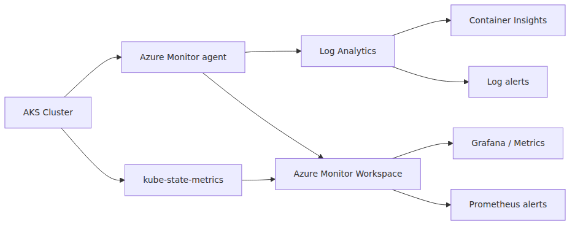
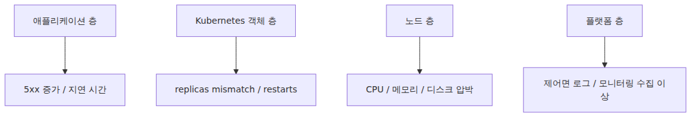

# 모니터링과 운영 — Container Insights, 로그, 알람

> Azure Kubernetes Service 101 시리즈 (7/7)

AKS는 배포가 끝났다고 운영이 끝나지 않습니다. 오히려 그때부터가 시작입니다. Pod가 재시작하는 이유, 특정 node pool만 포화되는 패턴, HPA가 왜 예상대로 안 움직였는지, 장애 조짐을 사용자보다 먼저 볼 수 있는지는 결국 관측 체계에 달려 있습니다.

이번 글은 AKS 운영의 기본 도구 상자를 정리합니다. Container Insights로 무엇을 보고, Log Analytics에서 어떤 KQL을 던지며, kube-state-metrics가 왜 유용하고, 알람은 어떤 층에 걸어야 하는지 101 수준에서 정리하겠습니다.

---

<!-- a-grade-intro:begin -->
## 핵심 질문

AKS 운영 가시성을 어떻게 구축해야 사고에 빠르게 대응할 수 있을까요?

이 글은 그 질문에 답하기 위해 AKS 모니터링과 운영의 핵심 결정과 운영 함정을 살펴봅니다.

<!-- a-grade-intro:end -->

## 운영 시야를 한 장으로 보면



*로그와 메트릭 기반 운영 관측 구조*
이 그림에서 기억할 것은 두 축입니다.

- **로그 축**: Log Analytics, Container Insights, KQL
- **메트릭 축**: Prometheus 계열 메트릭, kube-state-metrics, Grafana, 메트릭 알람

운영은 둘 중 하나만으로 잘 되지 않습니다. 로그는 사건의 문맥을 주고, 메트릭은 추세와 경향을 줍니다.

---

## Container Insights는 무엇을 주나

Container Insights는 Azure Monitor의 AKS 관측 경험입니다.

- 노드, Pod, 컨테이너 상태
- 로그 수집
- 기본 시각화
- 성능, 인벤토리, 이벤트 데이터

AKS 입문 단계에서는 가장 빨리 “클러스터가 지금 어떤 상태인가”를 보는 창구입니다. Kubernetes API만 직접 두드려도 많은 정보를 얻을 수 있지만, 운영자가 계속 사람 눈으로 `kubectl get`만 하고 있을 수는 없습니다.

---

## 로그와 메트릭을 왜 분리해서 봐야 하나

### 로그

- 특정 에러 메시지 확인
- 재시작 직전 상황 파악
- 이벤트 타임라인 확인

### 메트릭

- CPU, 메모리 추세
- replica 변화
- HPA 목표 대비 현재값
- 노드 포화 추세

예를 들어 Pod가 자주 재시작된다는 사실은 메트릭이나 인벤토리에서 보일 수 있지만, **왜** 재시작됐는지는 보통 로그나 이벤트를 같이 봐야 알 수 있습니다.

---

## Log Analytics에서 자주 쓰는 흐름

Container Insights 로그는 Log Analytics Workspace로 들어가고, 여기서 KQL로 조회합니다.

대표적으로 자주 보는 테이블은 다음과 같습니다.

- `ContainerLogV2`
- `KubeEvents`
- `KubePodInventory`
- `KubeNodeInventory`

입문 단계에서 이 네 개만 익혀도 상당히 많은 상황을 볼 수 있습니다.

---

## 바로 써먹는 KQL 예시

### 최근 Kubernetes 이벤트 보기

```kusto
KubeEvents
| where not(isempty(Namespace))
| sort by TimeGenerated desc
| take 50
```

배포 직후 이상 동작을 볼 때 가장 먼저 던지기 좋은 쿼리입니다.

### 특정 Pod 로그 보기

```kusto
ContainerLogV2
| where PodNamespace == "default"
| where PodName startswith "fastapi-hello"
| project TimeGenerated, PodName, ContainerName, LogMessage
| order by TimeGenerated desc
```

### 실패한 Pod 찾기

```kusto
KubePodInventory
| where PodStatus == "Failed"
| project TimeGenerated, Namespace, Name, PodStatus, ContainerStatusReason
| order by TimeGenerated desc
```

이 세 개만 알아도 “무슨 일이 있었나”를 빠르게 좁힐 수 있습니다.

---

## kube-state-metrics는 왜 중요한가

kube-state-metrics는 이름 그대로 Kubernetes 오브젝트의 상태를 메트릭으로 드러냅니다.

- Deployment desired/available replicas
- HPA current/desired replicas
- Pod 상태
- Node 상태

애플리케이션 CPU 사용량은 cAdvisor나 kubelet 계열이 잘 보여 주지만, “Deployment가 원하는 복제본과 실제 준비된 복제본이 얼마나 차이 나는가” 같은 **오브젝트 상태 질문**은 kube-state-metrics가 특히 잘 보여 줍니다.

Azure Monitor managed Prometheus의 기본 스크레이프 대상에도 kube-state-metrics가 포함됩니다.

---

## 운영자가 자주 보는 질문을 메트릭으로 바꾸면

- HPA가 목표 replica까지 갔는가
- NodePool이 최대치에 가까운가
- 특정 Deployment의 available replicas가 desired보다 계속 적은가
- Pending Pod가 늘고 있는가

이 질문들은 단순 CPU 그래프보다 훨씬 운영적입니다. AKS 운영은 결국 Kubernetes 오브젝트 상태를 읽는 일이기 때문입니다.

---

## 알람은 어느 층에 걸어야 하나



*운영 알람을 나누는 계층 구조*
좋은 알람은 여러 층에 나뉘어 있습니다. CPU 80% 알람 하나만으로는 운영이 잘 되지 않습니다.

### 애플리케이션 층

- 응답 시간 증가
- 에러율 증가
- 큐 적체

### Kubernetes 객체 층

- Deployment available replicas 부족
- Pod 재시작 급증
- HPA max replica 고착

### 노드 층

- node pool 포화
- 디스크 압박
- NotReady 노드 발생

---

## Azure Monitor 알람 종류

Azure Monitor는 메트릭과 로그 기반 모두 알람을 걸 수 있습니다.

- **Metric alerts**
- **Log search alerts**
- **Prometheus alerts**

AKS에서는 셋을 함께 볼 수 있습니다.

- 빠른 임계값 감지는 metric alerts
- KQL 조건식은 log alerts
- Prometheus 계열 메트릭엔 Prometheus alerts

운영 체계가 커지면 action group을 통해 이메일, 웹훅, 자동화까지 연결합니다.

---

## 101 수준에서 먼저 걸 만한 알람

아주 많은 알람으로 시작할 필요는 없습니다. 아래 정도면 좋은 출발점입니다.

1. 중요한 Deployment의 available replicas 부족
2. Pod restart 급증
3. 특정 node pool 사용률 과다
4. HPA가 max replica 근처에서 오래 머무름
5. 애플리케이션 5xx 또는 실패율 증가

입문 단계에서는 “중요 서비스의 준비된 복제본이 모자라다”는 알람이 특히 효율이 좋습니다. 사용자 영향과 가장 직접적으로 연결되기 때문입니다.

---

## Container Insights와 kubectl의 역할 분담

운영 중에는 둘 다 씁니다.

### Container Insights / Azure Monitor

- 추세 파악
- 중앙 수집
- 장기 조회
- 알람 연결

### kubectl

- 즉시 상태 확인
- 특정 리소스 describe
- 이벤트와 배치 결과 즉시 확인

예를 들어 Container Insights에서 restart 급증을 보고, 실제 원인은 `kubectl describe pod`와 KQL 로그 조회로 좁히는 흐름이 자연스럽습니다.

---

## day-2 운영에서 보는 체크리스트

- system node pool과 user node pool이 의도대로 동작하는가
- LoadBalancer와 Ingress 상태가 안정적인가
- Pending Pod가 반복되는가
- 로그 수집량이 너무 커서 비용이 커지고 있지는 않은가
- namespace 필터링이나 collection preset이 실제 운영 목표와 맞는가

모니터링은 많이 모을수록 좋다가 아니라, **문제를 빨리 찾을 수 있을 만큼 모으되 비용을 통제하는 쪽**이 더 중요합니다.

---

## 이 시리즈를 마치며

AKS 101의 목표는 “Kubernetes의 모든 기능”을 나열하는 데 있지 않았습니다. AKS를 Azure의 관리형 Kubernetes로 읽고, Control Plane과 Node Pool을 구분하고, Pod·Deployment·Service·Ingress로 워크로드를 구성하고, HPA·Cluster Autoscaler·KEDA와 모니터링 도구까지 하나의 흐름으로 연결하는 데 있었습니다.

이제 작은 FastAPI 서비스 하나를 AKS에 올렸을 때, 그 요청이 어디로 들어가고, 어떤 객체를 거치고, 어디서 스케일하고, 어디서 문제를 찾는지까지 한 장의 그림으로 떠올릴 수 있어야 합니다. 그 감각이 잡히면 그다음부터는 세부 기능을 하나씩 늘려 가는 문제입니다.

---

이 글은 Azure Kubernetes Service 101 시리즈의 마지막 7화입니다. 이번 화에서는 앞선 여섯 화에서 다룬 클러스터, 워크로드, 네트워크, 스케일링을 실제 운영 시야에서 묶었습니다. 이후에는 각 팀의 요구에 따라 보안, 스토리지, GitOps, 서비스 메시 같은 주제로 더 깊게 들어가면 됩니다.

---

## 시니어 엔지니어는 이렇게 생각합니다

- **Container Insights는 출발점이지 끝이 아니다** — 필요에 따라 Prometheus·Grafana로 확장합니다.
- **로그는 구조화·메트릭은 표준화** — 쿼리 효율과 비용을 동시에 결정합니다.
- **알림은 SLO 기반으로 줄인다** — 임계값 알람은 가짜 알람을 만들기 쉽습니다.
- **배포·구성 변경 이벤트를 메트릭과 결합** — 회귀 원인을 빠르게 좁히는 핵심 단서입니다.
- **on-call 문서를 메트릭과 함께 만든다** — 대시보드만으로는 사고 대응이 되지 않습니다.

## 운영 체크리스트

- [ ] Container Insights와 Managed Prometheus 중 어떤 조합을 쓸지 결정했다
- [ ] Log Analytics 워크스페이스 보존 기간과 비용을 추정했다
- [ ] 주요 알람(노드 NotReady, Pod CrashLoop, OOM)을 정의했다
- [ ] 감사 로그(audit log)와 API server 로그 활성화 정책을 정했다
- [ ] 런북(runbook) 형태로 자주 발생하는 장애 대응을 문서화했다

<!-- toc:begin -->
## 시리즈 목차

- [Azure Kubernetes Service란? — 직접 운영하지 않아도 되는 Kubernetes](./01-what-is-aks.md)
- [클러스터 아키텍처 — Control Plane과 Node Pool](./02-cluster-architecture.md)
- [첫 클러스터 만들고 앱 배포하기 — Python/FastAPI](./03-first-cluster-and-deploy.md)
- [Pod·Deployment·Service — 워크로드를 표현하는 세 가지 방식](./04-pod-deployment-service.md)
- [네트워킹과 Ingress — 클러스터 안과 밖을 잇는 길](./05-networking-and-ingress.md)
- [스케일링 — HPA, Cluster Autoscaler, KEDA](./06-scaling-hpa-ca-keda.md)
- **모니터링과 운영 — Container Insights, 로그, 알람 (현재 글)**

<!-- toc:end -->

---

## 참고 자료

### 공식 문서
- [Kubernetes monitoring in Azure Monitor](https://learn.microsoft.com/en-us/azure/azure-monitor/containers/kubernetes-monitoring-overview)
- [Enable monitoring for AKS clusters](https://learn.microsoft.com/en-us/azure/azure-monitor/containers/kubernetes-monitoring-enable)
- [Query container logs in Azure Monitor](https://learn.microsoft.com/en-us/azure/azure-monitor/containers/container-insights-log-query)
- [Default Prometheus metrics configuration in Azure Monitor](https://learn.microsoft.com/en-us/azure/azure-monitor/containers/prometheus-metrics-scrape-default)
- [Overview of Azure Monitor alerts](https://learn.microsoft.com/en-us/azure/azure-monitor/alerts/alerts-overview)

### 관련 시리즈
- [Azure Functions 101](../../azure-functions-101/ko/07-monitoring-and-ops.md) — Application Insights 중심 운영과 비교할 때
- [Azure App Service 101](../../azure-app-service-101/ko/06-logging-monitoring.md) — 더 단순한 PaaS 운영 모델과 비교할 때

Tags: Azure, AKS, Kubernetes, Cloud
