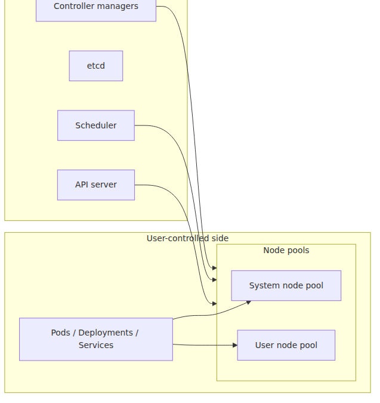
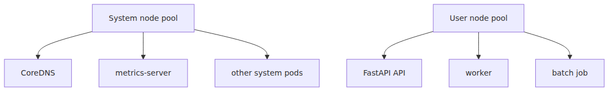

# Cluster architecture — control plane and node pools

> Azure Kubernetes Service 101 series (2/7)

The first structural split to get right in AKS is the split between the cluster's brain and the place where containers actually run. If you blur those together, cost, upgrades, failure handling, and scaling all become harder to reason about. AKS draws that boundary pretty clearly for you.

This post is about reading that boundary. We'll look at what the control plane does, why system and user node pools exist, and where Spot capacity fits into the picture.

---

## Cut the cluster in half

The left side is the Azure-managed layer. The right side is the layer you shape more directly. That single picture explains a lot: why the control plane is not billed separately, why node count is your decision, and why pod scaling and node scaling are different conversations.

---

## What the control plane actually does

The control plane is the cluster's decision-making layer.

- **API server**: the entry point for every declaration and query.
- **etcd**: the persistence layer for cluster state.
- **Scheduler**: decides where new pods should run.
- **Controller loops**: keep deployments, endpoints, and other resources converging toward desired state.

In AKS, Azure runs this layer for you. You still use the API constantly, but you are not typically building, placing, and maintaining API server nodes yourself.

That is the concrete meaning of managed Kubernetes. It does not remove Kubernetes. It removes a large chunk of the mechanics around operating Kubernetes.

---

## What a node pool is

A node pool is a group of VMs with the same configuration.

- same VM size
- same OS SKU
- same scaling envelope
- same pool mode

Every pod eventually lands on a node in one of these pools. That makes node pools the place where abstract Kubernetes intent turns into real capacity decisions.

Most practical questions become node-pool questions pretty quickly.

- Which VM size should this workload use?
- Should system components be isolated from application pods?
- Should we use Spot capacity?
- What should the autoscaler bounds be?

Pods are the logical unit. Node pools are the capacity and cost unit.

---

## System node pool vs user node pool

This is the first node-pool distinction to learn in AKS.

**System node pool**

System pools are where critical cluster components are expected to run.

- CoreDNS
- metrics-server
- cluster add-ons

AKS recommends keeping system components there and running your application on user pools instead. In a tiny learning cluster with only one pool, app pods may run on the system pool. In production, separation is the better default.

**User node pool**

User pools are for your workload.

- web APIs
- background workers
- batch jobs
- scheduled jobs

That separation reduces the odds that a badly behaved application workload interferes with core cluster services.

---

## Why the split matters

The benefit is not philosophical. It is operational.

1. System pods and app pods do not compete for the same space by default.
2. User capacity can scale independently.
3. Spot capacity can be attached where it makes sense.
4. Mixed pool strategies become easier, including Windows user pools alongside Linux system pools.

The shortest useful summary is this:

> The system pool keeps the cluster alive. The user pool runs the business workload.

---

## How many node pools should you have?

Do not over-segment too early. A common starting point is simple.

**Small, sane starting shape**

- one system pool
- one user pool

That is enough for most introductory clusters.

**When clusters get larger**

You may split user pools by workload shape.

- latency-sensitive API pool
- batch or worker pool
- Spot-only pool
- GPU or memory-optimized pool

Node pools are usually better organized around **workload characteristics** than around team boundaries.

---

## Regular pools vs Spot pools

Once cost enters the conversation, Spot capacity shows up quickly.

**Regular node pools**

Use regular pools when stability is the primary concern.

- baseline capacity
- critical APIs
- workloads where interruption is expensive

**Spot node pools**

Spot pools use discounted Azure capacity that can be evicted.

- lower cost
- lower stability
- best for interruption-tolerant workloads

Good examples include queue consumers, batch processing, and retry-friendly background work. A business-critical API with no non-Spot fallback is usually the wrong place for Spot.

---

## How scheduling relates to node pools

Kubernetes does not schedule “to a node pool” directly. It schedules to nodes. In AKS, the node pool identity is expressed through labels, taints, and pool configuration.

The useful hierarchy is:

- node pool: management unit
- node: actual scheduling target
- pod: placed through selectors, taints, affinity, and resource requirements

That is why pool design and placement policy are tightly connected. A tainted system pool plus explicit selectors on user workloads is not ceremony. It is how you encode intent. In practice, many teams use the AKS-recommended `CriticalAddonsOnly=true:NoSchedule` taint on the system pool so ordinary application pods stay on user pools unless you opt in explicitly.

---

## Upgrades make the boundary even clearer

When teams say “we upgraded the cluster,” that can mean a few different things.

- control plane version upgrade
- node pool Kubernetes version upgrade
- node image upgrade

Those are related, but not identical. The control plane can move first, with node pools following. So “the cluster version changed” is often an incomplete operational statement. You also want to know **which pools have caught up**.

---

## Constraints worth remembering early

AKS documentation repeats a few practical rules often enough that they are worth anchoring now.

- A cluster must always have at least one system node pool.
- System node pools must be Linux.
- User node pools can be Linux or Windows.
- Spot capacity belongs on user pools.
- For production, system pools should be sized with fault tolerance in mind.

For a beginner-friendly mental model, this is enough: the initial pool is a system pool, and your applications should graduate into user pools.

---

## The five fastest architecture questions

When someone hands you an AKS cluster, these questions reveal a lot quickly.

1. Are system and user pools separated?
2. How many user pools exist, and what is each one for?
3. Is Spot being used anywhere?
4. What are the autoscaler bounds per pool?
5. Are workloads actually landing on the intended pools?

Those questions are more useful than a generic architecture diagram because they connect directly to cost and failure behavior.

---

This is part 2 of the Azure Kubernetes Service 101 series. Part 1 defined the managed-Kubernetes boundary; this post turned that boundary into a concrete cluster shape. The next step is to turn that shape into a running cluster and a small FastAPI deployment.

---

## In this series

- [What is Azure Kubernetes Service? — what managed Kubernetes actually gives you](https://github.com/yeongseon/tech-writing/blob/f24a126/content/azure-aks-101/en/01-what-is-aks.md)
- **Cluster architecture — control plane and node pools (current)**
- Your first cluster, your first deploy — Python/FastAPI (upcoming)
- Pod, Deployment, Service — the three ways you express a workload (upcoming)
- Networking and Ingress — the path in and out of the cluster (upcoming)
- Scaling — HPA, Cluster Autoscaler, KEDA (upcoming)
- Monitoring and ops — Container Insights, logs, alerts (upcoming)

---

## References

**Official Docs**
- [What is Azure Kubernetes Service (AKS)?](https://learn.microsoft.com/en-us/azure/aks/what-is-aks)
- [Use system node pools in Azure Kubernetes Service (AKS)](https://learn.microsoft.com/en-us/azure/aks/use-system-pools)
- [Create node pools in Azure Kubernetes Service (AKS)](https://learn.microsoft.com/en-us/azure/aks/create-node-pools)
- [Deploy an Azure Kubernetes Service (AKS) Cluster Using Azure CLI](https://learn.microsoft.com/en-us/azure/aks/learn/quick-kubernetes-deploy-cli)

**Related Series**
- [Azure App Service 101](https://github.com/yeongseon/tech-writing/blob/f24a126/content/azure-app-service-101/en) — useful when contrasting AKS with a platform that has no node concept at all
- [Azure Functions 101](https://github.com/yeongseon/tech-writing/blob/f24a126/content/azure-functions-101/en) — useful when comparing orchestration with event-driven execution

Tags: Azure, AKS, Kubernetes, Cloud
