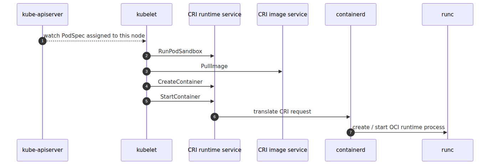

# kubelet and containerd — how a container actually starts on a node

## Source Version

This post uses the following upstream versions as external reference points:
- Kubernetes: v1.30.x (https://github.com/kubernetes/kubernetes)
- containerd: v1.7.x (https://github.com/containerd/containerd)
- KEDA: v2.13.x (https://github.com/kedacore/keda)

AKS control plane is managed by Microsoft, so the upstream code here is a behavioral comparison baseline, not a statement about the exact binaries running in the service.

> Azure Kubernetes Service Deep Dive series (2/6)

Part 1 framed the control plane as the layer that records desired state and placement.
This part covers the next step.
Who actually runs the workload.
The answer is the node-local pair of kubelet and the container runtime.
On AKS Linux nodes, that runtime is containerd.
Docker is not the main character here.

The path is straightforward.
Kubelet sees a PodSpec through the API server,
calls the CRI over a Unix socket,
containerd creates the sandbox and containers,
and `runc` finally spawns the real process.

---

## Questions this chapter answers

- On exactly what interval does the kubelet poll what, and how do you tune that interval?
- Once containerd replaced dockershim, why did docker commands vanish, and how did debugging shift?
- Are image pulls cached per node, and who authenticates the pull?
- How do PodSpec.resources.requests and limits meet the kubelet's eviction decision?
- What are the three most common causes of an unhealthy kubelet, and which metrics expose them?

## The execution path in one picture



*Execution path from API server to runc*
---

## kubelet, CRI, and runtime

Kubelet is the node agent.
It watches the API server for Pods assigned to its node,
prepares the Pod environment,
and calls the CRI instead of implementing a runtime itself.
The CRI keeps Kubernetes decoupled from one specific engine implementation.
In AKS Linux,
that runtime endpoint is containerd.

The upstream API exposes both runtime and image operations.
`RunPodSandbox`,
`PullImage`,
`CreateContainer`,
and `StartContainer` are the most important names in the startup path.

---

## kubelet talks to a Unix socket


*Local CRI path from kubelet to containerd*
This is a local call chain.
The control plane does not execute here.
The node does.

---

## Why sandbox comes first

`createPodSandbox()` in `kuberuntime_sandbox.go` builds `PodSandboxConfig` and calls `RunPodSandbox` before any individual container is created.
That Pod-level shell carries shared network and namespace context.
The Pod IP concept belongs much more naturally to this layer than to a single container.

---

## Image pull, create, start

`startContainer()` in `kuberuntime_container.go` is explicit about the order.
Pull the image.
Generate config.
Create the container.
Start the container.
That order is what lets you separate scheduling problems from image pull problems and runtime start problems.

---

## Where `runc` enters

Kubelet never calls `runc` directly.
containerd drops from the CRI layer into the OCI runtime layer,
and that is where `runc` appears.
The effective chain is kubelet -> CRI -> containerd -> `runc` -> process.

---

## Startup path as control flow


*Kubelet control flow for Pod startup*
---

## The point of this episode

> In AKS, node-side container startup is orchestrated by kubelet. Kubelet watches the API server for Pods assigned to its node, calls the CRI over a Unix socket, runs `RunPodSandbox` first, then requests `PullImage`, `CreateContainer`, and `StartContainer` in order. The actual process is created below containerd by the OCI runtime, typically `runc`.

---

## Where this fits in the series

This is part 2 of the Azure Kubernetes Service Deep Dive series.
Part 1 fixed the managed control-plane boundary; this part follows the exact opposite end of the system, the node-local execution path. Part 3 moves naturally from `RunPodSandbox` into networking and explains where the Pod IP is actually allocated.

---

## Call Path Summary

- kubelet → CRI gRPC
- CRI runtime endpoint → containerd
- containerd → `containerd-shim`
- `containerd-shim` → `runc`
- `runc` → container process

### Diagnose kubelet/containerd state via a node debug container

```bash
kubectl debug node/aks-nodepool1-12345 -it \
  --image=mcr.microsoft.com/cbl-mariner/busybox:2.0 -- chroot /host

# inside the node
systemctl status kubelet
journalctl -u kubelet --since '15 min ago' | tail -50
crictl ps -a | head
crictl images | grep my-app
```

## Operational checklist

- [ ] Enabled alerts on node-level disk and memory pressure
- [ ] Tuned kubelet image GC and disk quota to match the node SKU
- [ ] Decided on private-registry auth (managed identity vs imagePullSecret)
- [ ] Reviewed the impact of changing the containerd snapshotter
- [ ] Tightened kubectl-debug permissions and ephemeral-container policy

<!-- toc:begin -->
## In this series

- [Control plane anatomy — what AKS hides from you](./01-control-plane-anatomy.md)
- **kubelet and containerd — how a container actually starts on a node (current)**
- CNI and Azure CNI Overlay — where Pod IPs come from (upcoming)
- Scheduler and Pod placement — who decides which node (upcoming)
- HPA and Cluster Autoscaler internals — two control loops (upcoming)
- KEDA internals — how a ScaledObject builds an HPA (upcoming)

<!-- toc:end -->

---

## References

### Primary sources
- [CRI API — `api.proto` @ `v1.30.0`](https://github.com/kubernetes/kubernetes/blob/v1.30.0/staging/src/k8s.io/cri-api/pkg/apis/runtime/v1/api.proto)
- [`kuberuntime_manager.go` @ `v1.30.0`](https://github.com/kubernetes/kubernetes/blob/v1.30.0/pkg/kubelet/kuberuntime/kuberuntime_manager.go)
- [`kuberuntime_sandbox.go` @ `v1.30.0`](https://github.com/kubernetes/kubernetes/blob/v1.30.0/pkg/kubelet/kuberuntime/kuberuntime_sandbox.go)
- [`kuberuntime_container.go` @ `v1.30.0`](https://github.com/kubernetes/kubernetes/blob/v1.30.0/pkg/kubelet/kuberuntime/kuberuntime_container.go)

### Secondary sources
- [AKS core concepts](https://learn.microsoft.com/en-us/azure/aks/core-aks-concepts)
- [Kubernetes node components](https://kubernetes.io/docs/concepts/overview/components/#node-components)

### Related Series
- [Azure AKS 101](../../azure-aks-101/en/)
- [Azure Functions Deep Dive part 3 — one bidirectional RPC stream](../../azure-functions-deep-dive/en/03-grpc-event-stream.md)

Tags: AKS, Kubernetes, Distributed Systems, Containers
