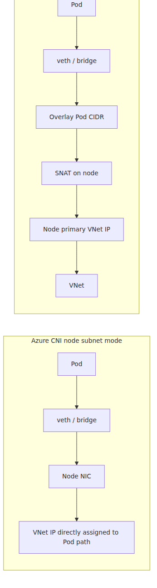
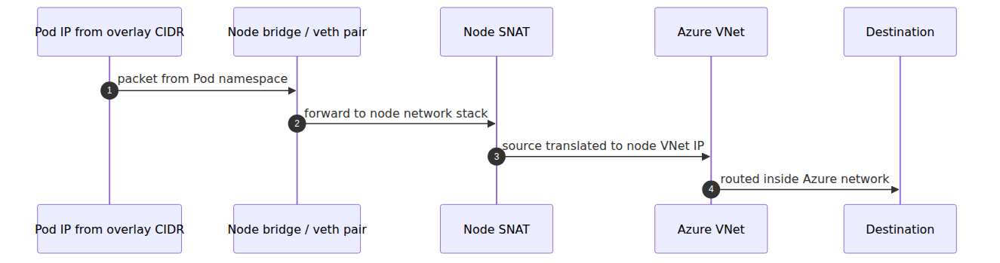

# CNI and Azure CNI Overlay — where Pod IPs come from

## Source Version

This post uses the following upstream versions as external reference points:
- Kubernetes: v1.30.x (https://github.com/kubernetes/kubernetes)
- containerd: v1.7.x (https://github.com/containerd/containerd)
- KEDA: v2.13.x (https://github.com/kedacore/keda)

AKS control plane is managed by Microsoft, so the upstream code here is a behavioral comparison baseline, not a statement about the exact binaries running in the service.

> Azure Kubernetes Service Deep Dive series (3/6)

Pod IPs come from different address models depending on the networking mode.
In current AKS you should separate three cases instead of calling everything simply "Azure CNI."
Azure CNI Pod Subnet is the current flat-networking path for new clusters,
Azure CNI Node Subnet is the older flat model,
and Azure CNI Overlay keeps Pod IPs on a separate overlay CIDR while the VNet mostly sees node IPs.

---

## Put the three models side by side

---

## What CNI does

CNI is the contract that attaches networking to the Pod sandbox.
It creates interfaces,
assigns IPs,
and installs routes and rules.
That means part 2's `RunPodSandbox` path and part 3's Pod IP story are tightly connected.

---

## Azure CNI Pod Subnet, Node Subnet, and Overlay

For 2026 AKS operations, the practical comparison is this:

- **Azure CNI Pod Subnet**: Pods receive VNet-routable IPs from a dedicated pod subnet while nodes stay on a separate node subnet. This is the cleaner flat-network design because node and pod address planning scale independently.
- **Azure CNI Node Subnet (legacy)**: Pods and nodes both consume addresses from the node subnet. The routing model is simple, but this is the version that creates IP exhaustion pressure fastest.
- **Azure CNI Overlay**: Pods receive IPs from an overlay CIDR such as the default `10.244.0.0/16`, nodes stay on the regular VNet subnet, and traffic leaving the cluster is SNATed through the node IP.

Pod Subnet and Node Subnet both preserve direct pod reachability from connected networks because Pod IPs still live in VNet space. Overlay conserves VNet IPs best, but direct inter-cluster pod-to-pod routing through native pod IPs is not the model there.

---

## Where kubenet stands now

AKS documentation now carries a kubenet retirement timeline.
That means kubenet is no longer a safe long-term default for new designs.
The official networking direction in AKS is moving toward Azure CNI Overlay.

---

## The point of this episode

> AKS networking now needs a three-way distinction. Azure CNI Pod Subnet is the current flat-networking design, where pods use a dedicated pod subnet separate from the node subnet. Azure CNI Node Subnet is the older flat model, where pods and nodes burn the same subnet together. Azure CNI Overlay puts pods on a separate overlay CIDR and preserves VNet IP space best, at the cost of giving up direct native pod-IP routing between clusters.

---

## Where this fits in the series

This is part 3 of the Azure Kubernetes Service Deep Dive series.
Part 2 followed the node-local execution path; this part explains how CNI attaches Pod networking beside that path. The key diagnostic gain is that node execution and Pod addressing no longer blur into the same failure domain.

---

## Call Path Summary

- kubelet `RunPodSandbox` → CNI plugin invocation
- CNI plugin → interface creation, IPAM allocation, routes/rules programming
- Pod sandbox becomes network-ready with Pod IP attached
- Pod traffic exits either through VNet-routable pod subnets or through overlay-to-node SNAT depending on the mode

<!-- toc:begin -->
## In this series

- [Control plane anatomy — what AKS hides from you](./01-control-plane-anatomy.md)
- [kubelet and containerd — how a container actually starts on a node](./02-kubelet-and-containerd.md)
- **CNI and Azure CNI Overlay — where Pod IPs come from (current)**
- Scheduler and Pod placement — who decides which node (upcoming)
- HPA and Cluster Autoscaler internals — two control loops (upcoming)
- KEDA internals — how a ScaledObject builds an HPA (upcoming)

<!-- toc:end -->

---

## References

### Primary sources
- [CRI network status fields — `api.proto` @ `v1.30.0`](https://github.com/kubernetes/kubernetes/blob/v1.30.0/staging/src/k8s.io/cri-api/pkg/apis/runtime/v1/api.proto)
- [`kuberuntime_sandbox.go` @ `v1.30.0`](https://github.com/kubernetes/kubernetes/blob/v1.30.0/pkg/kubelet/kuberuntime/kuberuntime_sandbox.go)

### Secondary sources
- [Azure CNI Pod Subnet](https://learn.microsoft.com/en-us/azure/aks/concepts-network-azure-cni-pod-subnet)
- [Azure CNI Overlay](https://learn.microsoft.com/en-us/azure/aks/azure-cni-overlay)
- [Concepts - CNI Networking in AKS](https://learn.microsoft.com/en-us/azure/aks/concepts-network-cni-overview)
- [Configure kubenet networking in AKS](https://learn.microsoft.com/en-us/azure/aks/configure-kubenet)
- [Update Azure CNI IPAM mode and data plane technology](https://learn.microsoft.com/en-us/azure/aks/update-azure-cni)

### Related Series
- [Azure AKS 101](../../azure-aks-101/en/)
- [Azure Functions Deep Dive part 1 — start with the big picture](../../azure-functions-deep-dive/en/01-host-bootstrap.md)

Tags: AKS, Kubernetes, Distributed Systems, Containers
