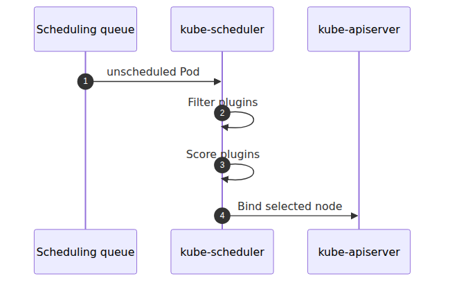

# Scheduler and Pod placement — who decides which node

## Source Version

This post uses the following upstream versions as external reference points:
- Kubernetes: v1.30.x (https://github.com/kubernetes/kubernetes)
- containerd: v1.7.x (https://github.com/containerd/containerd)
- KEDA: v2.13.x (https://github.com/kedacore/keda)

AKS control plane is managed by Microsoft, so the upstream code here is a behavioral comparison baseline, not a statement about the exact binaries running in the service.

> Azure Kubernetes Service Deep Dive series (4/6)

Scheduling is not a free-CPU calculator.
Affinity,
taints,
ports,
volumes,
and topology constraints all participate.
The upstream scheduler code makes the structure clear.
It filters impossible nodes,
scores feasible ones,
and records a Binding.

---

## The three steps

---

## Filter and Score

`ScheduleOne()` separates the scheduling cycle from the binding cycle.
Filter removes nodes where the Pod cannot run.
Score ranks the nodes that remain.
The default plugin set includes `NodeResourcesFit`, `NodeAffinity`, `PodTopologySpread`, and `InterPodAffinity`.

---

## What Binding means

The binding cycle writes the selected node back through the API server.
Only then can kubelet pick up the Pod and start the execution path from part 2.
The scheduler's output is therefore not a running Pod.
It is a `Pod -> Node` decision.

---

## The point of this episode

> kube-scheduler does not execute Pods. It first removes impossible nodes through Filter plugins, then ranks the feasible candidates through Score plugins, and finally records the decision as a Binding in the API server. The key diagnostic split for a Pending Pod is whether it has no feasible nodes at all because Filter rejected every candidate, or whether feasible nodes existed but binding still failed later because of preemption, reservation conflicts, or another rare post-score issue.

---

## Where this fits in the series

This is part 4 of the Azure Kubernetes Service Deep Dive series.
Parts 2 and 3 covered node execution and networking; this part explains the earlier placement decision. The diagnostic value is that Pending Pods can now be split cleanly into placement failures, binding-time failures, and node-side execution delays.

---

## Call Path Summary

- Pod without `nodeName` → scheduler queue
- Filter plugins remove impossible nodes
- Score plugins rank feasible nodes
- scheduler writes Binding through the API server
- kubelet on the chosen node starts the node-local execution path

<!-- toc:begin -->
## In this series

- [Control plane anatomy — what AKS hides from you](./01-control-plane-anatomy.md)
- [kubelet and containerd — how a container actually starts on a node](./02-kubelet-and-containerd.md)
- [CNI and Azure CNI Overlay — where Pod IPs come from](./03-cni-and-azure-cni-overlay.md)
- **Scheduler and Pod placement — who decides which node (current)**
- HPA and Cluster Autoscaler internals — two control loops (upcoming)
- KEDA internals — how a ScaledObject builds an HPA (upcoming)

<!-- toc:end -->

---

## References

### Primary sources
- [`schedule_one.go` @ `v1.30.0`](https://github.com/kubernetes/kubernetes/blob/v1.30.0/pkg/scheduler/schedule_one.go)
- [`default_plugins.go` @ `v1.30.0`](https://github.com/kubernetes/kubernetes/blob/v1.30.0/pkg/scheduler/apis/config/v1/default_plugins.go)

### Secondary sources
- [Kubernetes scheduler](https://kubernetes.io/docs/concepts/scheduling-eviction/kube-scheduler/)
- [Assigning Pods to Nodes](https://kubernetes.io/docs/concepts/scheduling-eviction/assign-pod-node/)

### Related Series
- [Azure AKS 101](../../azure-aks-101/en/)
- [Azure Functions Deep Dive part 4 — dispatcher and invocation](../../azure-functions-deep-dive/en/04-dispatcher-and-invocation.md)

Tags: AKS, Kubernetes, Distributed Systems, Containers
