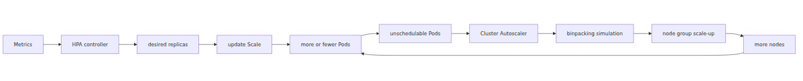

# HPA and Cluster Autoscaler internals — two control loops

“Autoscaling is slow” usually hides two different control loops under one complaint. One loop changes replica count, the other changes node count, and they react on different inputs and different timelines.

This is the fifth post in the Azure Kubernetes Service Deep Dive series. Here, I separate HPA from Cluster Autoscaler and show where their race window comes from in real AKS behavior.

## Source Version

This post uses the following upstream versions as external reference points:
- Kubernetes: v1.30.x (https://github.com/kubernetes/kubernetes)
- containerd: v1.7.x (https://github.com/containerd/containerd)
- KEDA: v2.13.x (https://github.com/kedacore/keda)

AKS control plane is managed by Microsoft, so the upstream code here is a behavioral comparison baseline, not a statement about the exact binaries running in the service.

> Azure Kubernetes Service Deep Dive series (5/6)

HPA changes replica count.
Cluster Autoscaler changes node count.
They live under the same autoscaling umbrella,
but they do not replace each other.
In AKS, both loops belong to the managed control-plane story even though they act on different resources.
HPA runs inside `kube-controller-manager` and computes desired replicas from metrics.
Cluster Autoscaler is operated by Microsoft as part of the AKS managed control plane. You configure it with the cluster autoscaler profile, for example via `az aks update --cluster-autoscaler-profile`, but you do not deploy or manage CA pods yourself.

---

## Questions this chapter answers

- From what metric sources does HPA read on what cadence, and how does it decide?
- What signals tell the Cluster Autoscaler that new nodes are required?
- When HPA and CA move at the same time, how does the race appear and how do you tame it?
- Why must scale-up be fast and scale-down slow, and where do you set the ratio?
- Which workload shapes make it safe to combine VPA and HPA?

## Put both loops in one diagram



*Two loops for Pod and node scaling*
---

## The HPA side

The HPA control loop default sync period is 15 seconds through `--horizontal-pod-autoscaler-sync-period`.
A representative model is `desiredReplicas = ceil(currentReplicas * (currentMetric / targetMetric))`.
The real code layers in tolerance,
missing metrics handling,
and stabilization windows.

Operationally, HPA is the faster loop. It can decide to raise replica count well before the cluster has spare node capacity. That is why HPA-driven scale-up often appears first as new Pending Pods rather than instantly as more Ready Pods.


*HPA loop adjusting replica count from metrics*
---

## The CA side

CA watches unschedulable Pods,
builds template nodes for each node pool,
and runs a binpacking estimator.
It asks whether extra nodes from a specific pool would make the Pods schedulable before changing the node count.

In AKS, the default `scan-interval` is 10 seconds. The node provisioning wait budget is controlled by `max-node-provision-time`, which defaults to 15 minutes. Scale-down behavior is intentionally conservative: `scale-down-unneeded-time` defaults to 10 minutes, and `scale-down-delay-after-add` also defaults to 10 minutes. That means HPA can ask for more Pods, scheduler can mark them Pending, and CA can still be in the "adding nodes" phase for a while before the new node becomes Ready enough for binding.


*CA loop adding nodes for unschedulable Pods*
---

## The point of this episode

> HPA is a ratio controller in the managed control plane that polls metrics every 15 seconds by default and adjusts replica count. Cluster Autoscaler is also AKS-managed in the control plane: it scans every 10 seconds by default, watches unschedulable Pods, simulates whether extra nodes from each node pool would make them schedulable, and then asks AKS to add or remove nodes. HPA scales Pods. CA scales nodes. The race window between them is real, so freshly scaled Pods can stay Pending until the new node is actually Ready.

---

## Where this fits in the series

This is part 5 of the Azure Kubernetes Service Deep Dive series.
Part 4 explained scheduling decisions; this part explains the two control loops that react to those decisions. The key value here is keeping replica decisions, node decisions, and later scale-to-zero behavior in separate mental buckets.

---

## Call Path Summary

- metrics pipeline → HPA controller in `kube-controller-manager`
- HPA controller → `Deployment.spec.replicas` update
- scheduler tries to place new Pods
- unschedulable Pods remain Pending
- Cluster Autoscaler detects them and asks AKS to add a node
- new node becomes Ready and scheduler binds the Pending Pods

### Inspect HPA and CA state

```bash
kubectl get hpa -A
kubectl describe hpa my-app -n my-ns | tail -30

kubectl -n kube-system logs -l component=cluster-autoscaler --tail=80
kubectl get nodes -L agentpool,kubernetes.azure.com/scalesetpriority
```

## Operational checklist

- [ ] Recorded ADR for each workload's HPA metric and threshold rationale
- [ ] Tuned CA scale-down delay and unneeded time against cost vs latency
- [ ] Load-tested the HPA-CA race scenario
- [ ] Specified graceful drain policy for spot node pools
- [ ] Classified workloads into VPA-eligible vs VPA-forbidden

<!-- toc:begin -->
## In this series

- [Control plane anatomy — what AKS hides from you](./01-control-plane-anatomy.md)
- [kubelet and containerd — how a container actually starts on a node](./02-kubelet-and-containerd.md)
- [CNI and Azure CNI Overlay — where Pod IPs come from](./03-cni-and-azure-cni-overlay.md)
- [Scheduler and Pod placement — who decides which node](./04-scheduler-and-pod-placement.md)
- **HPA and Cluster Autoscaler internals — two control loops (current)**
- KEDA internals — how a ScaledObject builds an HPA (upcoming)

<!-- toc:end -->

---

## References

### Primary sources
- [`horizontal.go` @ `v1.30.0`](https://github.com/kubernetes/kubernetes/blob/v1.30.0/pkg/controller/podautoscaler/horizontal.go)
- [`replica_calculator.go` @ `v1.30.0`](https://github.com/kubernetes/kubernetes/blob/v1.30.0/pkg/controller/podautoscaler/replica_calculator.go)
- [`hpacontroller.go` @ `v1.30.0`](https://github.com/kubernetes/kubernetes/blob/v1.30.0/cmd/kube-controller-manager/app/options/hpacontroller.go)
- [`static_autoscaler.go` @ `cluster-autoscaler-1.30.0`](https://github.com/kubernetes/autoscaler/blob/cluster-autoscaler-1.30.0/cluster-autoscaler/core/static_autoscaler.go)
- [`orchestrator.go` @ `cluster-autoscaler-1.30.0`](https://github.com/kubernetes/autoscaler/blob/cluster-autoscaler-1.30.0/cluster-autoscaler/core/scaleup/orchestrator/orchestrator.go)
- [`binpacking_estimator.go` @ `cluster-autoscaler-1.30.0`](https://github.com/kubernetes/autoscaler/blob/cluster-autoscaler-1.30.0/cluster-autoscaler/estimator/binpacking_estimator.go)

### Secondary sources
- [Use the cluster autoscaler in AKS](https://learn.microsoft.com/en-us/azure/aks/cluster-autoscaler)
- [Horizontal Pod Autoscaling](https://kubernetes.io/docs/tasks/run-application/horizontal-pod-autoscale/)

### Related Series
- [Azure AKS 101](../../azure-aks-101/en/)
- [Azure Functions Deep Dive part 5 — scaling internals](../../azure-functions-deep-dive/en/05-scaling-internals.md)

Tags: AKS, Kubernetes, Distributed Systems, Containers
