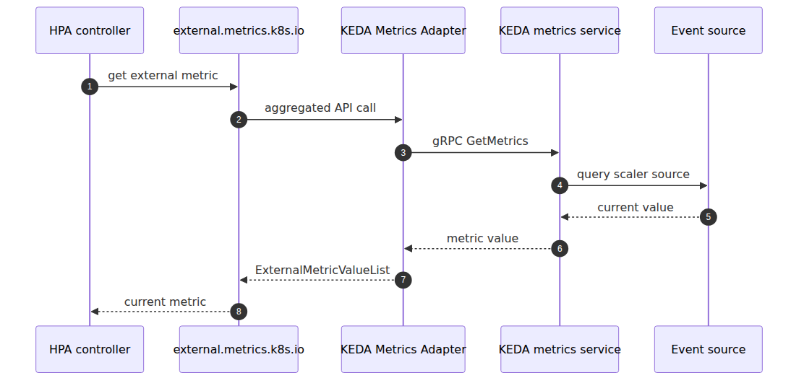

# KEDA internals — how a ScaledObject builds an HPA

## Source Version

This post uses the following upstream versions as external reference points:
- Kubernetes: v1.30.x (https://github.com/kubernetes/kubernetes)
- containerd: v1.7.x (https://github.com/containerd/containerd)
- KEDA: v2.14.0 (https://github.com/kedacore/keda/tree/v2.14.0)

AKS control plane is managed by Microsoft, so the upstream code here is a behavioral comparison baseline, not a statement about the exact binaries running in the service.

> Azure Kubernetes Service Deep Dive series (6/6)

KEDA does not replace HPA.
It watches ScaledObjects,
creates HPAs,
feeds the external metrics path,
and directly handles the scale-to-zero boundary by writing replica counts itself.
KEDA installs two main components: the **operator**, which watches `ScaledObject` and `ScaledJob` CRDs, creates the HPA, and reconciles activation and deactivation; and the **metrics adapter**, which implements the Kubernetes external-metrics API so HPA can pull scaler values. A **scaler** is the Go interface each event source implements for activity detection and metric production.

---

## The KEDA structure

---

## ScaledObjectReconciler and the generated HPA

`scaledobject_controller.go` checks that the target exposes `/scale`,
ensures the right label exists,
and creates or updates the HPA.
A ScaledObject is the declaration.
The concrete autoscaling artifact inside Kubernetes remains an HPA.

At the scaler layer, upstream `pkg/scalers/scaler.go` defines the interface each event source implements. In current KEDA that means the scaler answers three questions in practice: is this source active, what metric specs should HPA use, and what metric values should the adapter return.

---

## The external metrics path

`api_service.yaml` registers `v1beta1.external.metrics.k8s.io`.
`provider.go` shows the adapter reading the `scaledobject.keda.sh/name` selector and querying the metrics service over gRPC.

---

## The scale-to-zero boundary

`scale_scaledobjects.go` has separate `scaleToZeroOrIdle()` and `scaleFromZeroOrIdle()` paths.
That exists because HPA does not naturally control the below-`minReplicas` boundary.
KEDA directly updates `/scale` for the 0↔1 region,
while the generated HPA controls the 1↔N region.

---

## The point of this episode

> KEDA does not replace HPA. The operator watches ScaledObjects and ScaledJobs, creates HPAs, and reconciles activation state. The metrics adapter provides `external.metrics.k8s.io`, and each scaler implements the Go-side metric and activity interface for an event source such as Service Bus or Kafka. HPA uses those metrics for autoscaling above one replica, while the scale-to-zero boundary is handled directly by KEDA.

---

## Where this fits in the series

This is the final part of the Azure Kubernetes Service Deep Dive series.
Because part 5 separated HPA from Cluster Autoscaler first, this episode can place KEDA more precisely: above HPA, not instead of it.

---

## Call Path Summary

- `ScaledObject` / `ScaledJob` → KEDA operator reconcile
- operator → generated HPA
- HPA → external metrics query
- KEDA metrics adapter → scaler implementation
- scaler returns activity + metric values
- KEDA directly manages the `0 ↔ 1` boundary through `/scale`

<!-- toc:begin -->
## In this series

- [Control plane anatomy — what AKS hides from you](./01-control-plane-anatomy.md)
- [kubelet and containerd — how a container actually starts on a node](./02-kubelet-and-containerd.md)
- [CNI and Azure CNI Overlay — where Pod IPs come from](./03-cni-and-azure-cni-overlay.md)
- [Scheduler and Pod placement — who decides which node](./04-scheduler-and-pod-placement.md)
- [HPA and Cluster Autoscaler internals — two control loops](./05-hpa-and-cluster-autoscaler-internals.md)
- **KEDA internals — how a ScaledObject builds an HPA (current)**

<!-- toc:end -->

---

## References

### Primary sources
- [`scaledobject_controller.go` @ `v2.14.0`](https://github.com/kedacore/keda/blob/v2.14.0/controllers/keda/scaledobject_controller.go)
- [`scaler.go` @ `v2.14.0`](https://github.com/kedacore/keda/blob/v2.14.0/pkg/scalers/scaler.go)
- [`provider.go` @ `v2.14.0`](https://github.com/kedacore/keda/blob/v2.14.0/pkg/provider/provider.go)
- [`scale_scaledobjects.go` @ `v2.14.0`](https://github.com/kedacore/keda/blob/v2.14.0/pkg/scaling/executor/scale_scaledobjects.go)
- [`api_service.yaml` @ `v2.14.0`](https://github.com/kedacore/keda/blob/v2.14.0/config/metrics-server/api_service.yaml)

### Secondary sources
- [KEDA scaling deployments and custom resources](https://keda.sh/docs/2.14/concepts/scaling-deployments/)
- [Horizontal Pod Autoscaling](https://kubernetes.io/docs/tasks/run-application/horizontal-pod-autoscale/)

### Related Series
- [Azure AKS 101](../../azure-aks-101/en/)
- [Azure Functions Deep Dive part 5 — reading control loops](../../azure-functions-deep-dive/en/05-scaling-internals.md)

Tags: AKS, Kubernetes, Distributed Systems, Containers
