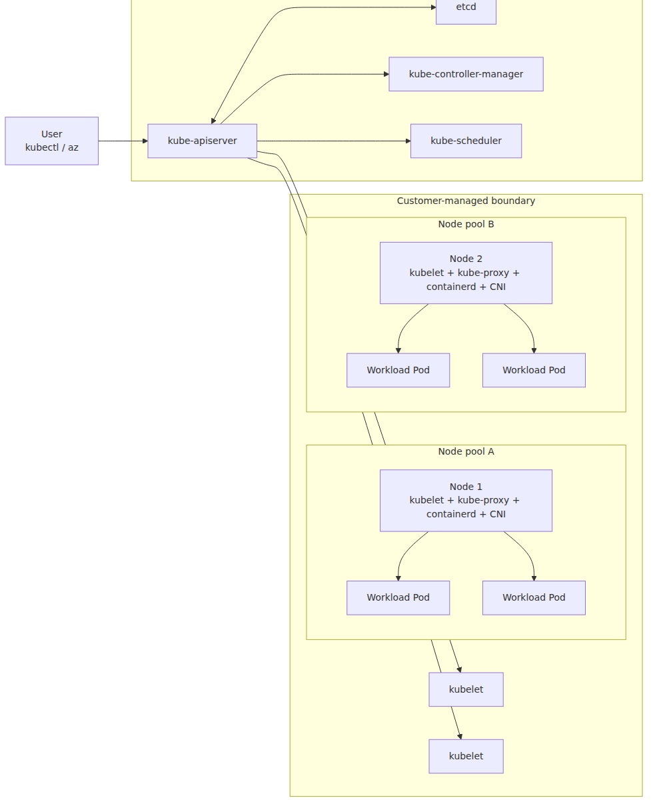
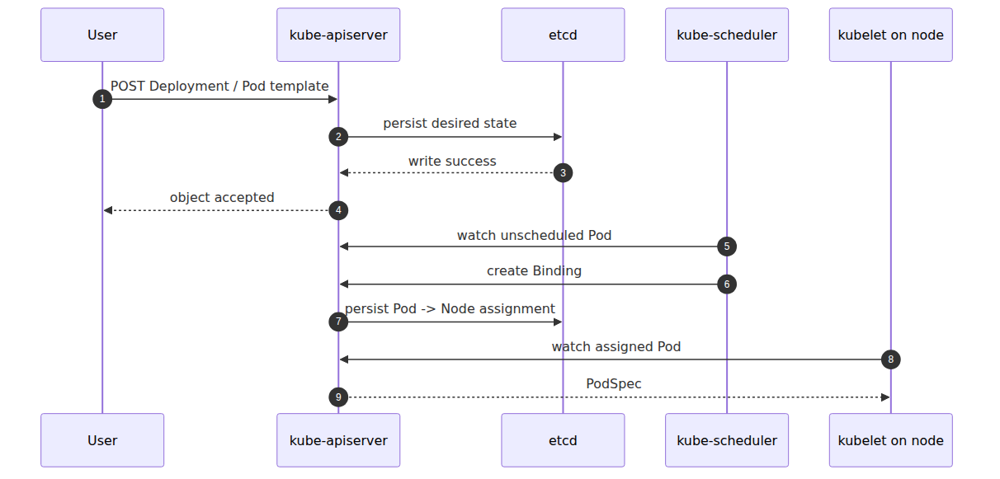
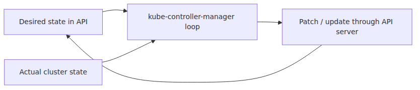

# Control Plane 해부 — AKS가 사용자에게서 가린 것

AKS를 관리형 Kubernetes라고 부르는 순간 설명은 편해지지만, 운영 판단에 필요한 경계는 오히려 흐려집니다. 장애가 control plane 문제인지 node 문제인지, Microsoft가 대신 맡는 부분이 어디까지인지 구분하지 못하면 같은 증상도 계속 다른 이름으로 부르게 됩니다.

이 글은 Azure Kubernetes Service Deep Dive 시리즈의 첫 번째 글입니다. 여기서는 AKS의 control plane과 data plane 경계를 먼저 고정하고, 사용자가 실제로 마주하는 관리형 표면이 무엇인지 정리합니다.

## Source Version

이 글의 외부 인용은 다음 upstream 버전을 기준으로 합니다.
- Kubernetes: v1.30.x (https://github.com/kubernetes/kubernetes)
- containerd: v1.7.x (https://github.com/containerd/containerd)
- KEDA: v2.13.x (https://github.com/kedacore/keda)

AKS의 control plane은 Microsoft가 관리하므로, 여기서 보는 upstream 코드는 실제 서비스 내부 바이너리 단정이 아니라 동작 모델 비교 기준입니다.

> Azure Kubernetes Service Deep Dive 시리즈 (1/6)

AKS 101 시리즈에서는 AKS를 "관리형 Kubernetes"라고 설명합니다.
그 문장은 맞습니다.
하지만 운영자가 실제로 겪는 문제는 그 한 문장보다 훨씬 구체적입니다.
어디까지가 Microsoft가 관리하는 경계인지,
어디부터가 내 책임인지,
그리고 왜 `kubectl get pods` 한 줄이 보이지 않는 여러 컴포넌트를 통과하는지 알아야 합니다.

이 심화 시리즈는 그 가려진 층을 코드와 아키텍처로 다시 펼쳐 보는 작업입니다.
이번 1화는 지도부터 그립니다.
AKS에서 control plane이 정확히 무엇이고,
data plane은 어디서 시작되며,
사용자는 왜 API server 엔드포인트만 보게 되는지부터 정리합니다.

---

## 전체 그림 — AKS 클러스터의 control vs data plane

이 그림이 시리즈 전체의 기준점입니다.
이후 화들은 아래 박스 하나씩을 확대해서 보는 구조입니다.
먼저 경계를 눈에 익혀 두면 뒤의 kubelet, CNI, scheduler, autoscaler 이야기가 한 줄로 이어집니다.



*관리형 control plane과 노드 data plane 경계*
이 그림에서 `kube-apiserver`, `etcd`, `kube-controller-manager`, `kube-scheduler`는 이번 1화의 주인공이고,
노드의 `kubelet + containerd`는 2화,
`CNI`는 3화,
`scheduler`는 4화,
노드 수와 replica 수를 움직이는 autoscaling 루프는 5화,
그 위에서 외부 이벤트를 HPA로 연결하는 KEDA는 6화에서 각각 확대합니다.

---

## AKS에서 control plane은 왜 안 보이는가

업스트림 Kubernetes를 직접 올리면 control plane 노드도 내가 만집니다.
`kube-apiserver` 프로세스 플래그도,
`etcd` 백업도,
인증서 회전도,
장애 복구 전략도 내 일입니다.

AKS는 여기서 가장 무거운 부분을 Microsoft-managed 영역으로 밀어 넣습니다.
사용자는 일반적으로 control plane VM에 SSH하지 않습니다.
심지어 control plane 리소스 그룹도 직접 보지 못합니다.
보이는 것은 관리형 API endpoint와 거기에 연결된 내 node pool입니다.

이 설계가 주는 장점은 분명합니다.
control plane 패치,
고가용성 구성,
핵심 컴포넌트 수명주기 관리를 서비스가 대신합니다.
대신 제약도 생깁니다.
문제가 생겼을 때 운영자는 "프로세스에 로그인해서 직접 본다"가 아니라,
API 서버 증상,
리소스 상태,
Azure 진단 로그,
AKS가 노출한 설정 표면으로만 추론해야 합니다.

---

## SLA 문장에서 읽어야 할 것

AKS 문서를 보면 Standard와 Premium tier에서 Uptime SLA가 기본 포함이며,
가용성 영역을 사용하는 경우 Kubernetes API server 가용성이 99.95%라고 적혀 있습니다.
이 숫자가 뜻하는 것은 control plane 전체를 내가 관리하지 않아도 된다는 편의만이 아닙니다.

이 SLA의 표면은 API server입니다.
즉 사용자가 실제로 만나는 control plane의 접점은 API server라는 뜻입니다.
`etcd`가 내부에서 어떻게 구성됐는지,
scheduler와 controller-manager가 몇 개 인스턴스로 떠 있는지,
어떤 노드 위에서 돌아가는지는 대개 서비스 내부 구현입니다.
운영자 입장에서는 API 요청 성공 여부와 지연 시간이 control plane 품질의 체감값이 됩니다.

그래서 AKS 장애를 볼 때 첫 질문은 늘 같습니다.
API server가 죽었는가,
느린가,
아니면 살아 있는데 그 뒤의 scheduler 혹은 controller 루프가 지연되는가.
이 구분이 되면 원인 후보가 크게 좁혀집니다.

---

## 보이는 control plane과 보이지 않는 control plane

같은 control plane이라도 사용자에게 보이는 면과 숨겨진 면이 다릅니다.

보이는 면은 다음과 같습니다.

- Kubernetes API endpoint
- RBAC, admission, object status 같은 API 결과
- `kubectl`, `az aks command invoke`, 진단 로그로 관찰 가능한 증상
- 버전 업그레이드, addon, autoscaler profile처럼 AKS가 노출한 설정 표면

보이지 않는 면은 다음과 같습니다.

- 실제 control plane VM 혹은 호스트
- `etcd` 배치와 백업 내부 구현
- scheduler와 controller-manager 프로세스 배치
- 서비스 내부 패치, 교체, 장애 조치 절차

이 차이 때문에 AKS 운영은 "인프라를 고친다"보다 "증상을 통해 관리형 시스템을 이해한다"에 가깝습니다.
이 시리즈가 코드 레벨을 다루는 이유도 여기에 있습니다.
내가 직접 control plane 바이너리를 띄우지 않더라도,
업스트림 코드가 어떻게 동작하는지 알아야 AKS가 어떤 증상을 내는지 읽을 수 있기 때문입니다.

---

## 요청 한 번이 지나가는 길

사용자 입장에서 AKS는 종종 `kubectl apply -f deployment.yaml` 한 줄로 보입니다.
하지만 control plane 안에서는 다음 순서가 벌어집니다.



*API 요청이 노드 실행으로 이어지는 경로*
이 흐름에서 가장 중요한 점은 두 개입니다.
첫째, API server는 실행기가 아니라 조정자입니다.
둘째, 실제 컨테이너를 띄우는 마지막 단계는 control plane이 아니라 노드의 kubelet과 container runtime입니다.

즉 AKS의 control plane은 "원하는 상태를 받아 적고, 배치 결정을 기록하고, 컨트롤 루프를 돌리는 층"입니다.
실행은 data plane이 합니다.
이 선이 흐려지면 스케일링 문제와 배치 문제를 잘못 진단하게 됩니다.

---

## `kube-apiserver` — AKS에서 유일하게 항상 보이는 컴포넌트

AKS 사용자가 control plane과 대화하는 방식은 거의 전부 API server를 통합니다.
`kubectl`도,
Terraform도,
GitOps controller도,
클러스터 내부 operator도 결국 API server에 객체를 읽고 씁니다.

업스트림 관점에서 API server는 단순한 REST 프런트가 아닙니다.
인증,
인가,
admission,
객체 검증,
storage 직전 변환,
watch fan-out까지 한곳에 모입니다.
AKS에서도 이 본질은 같습니다.
다만 그 프로세스 운영을 사용자가 맡지 않을 뿐입니다.

운영적으로 기억할 점은 다음과 같습니다.

- API server 지연은 거의 모든 control plane 문제처럼 보입니다.
- API server가 정상이면 상당수 문제는 scheduler, controller, node 측으로 내려갑니다.
- API server만 볼 수 있다는 사실은 동시에 장점이자 한계입니다.

---

## `etcd` — 상태 저장소지만, 운영자는 거의 직접 못 본다

`etcd`는 Kubernetes의 진짜 상태 저장소입니다.
Deployment, Pod, Node, Secret, Lease까지 결국 여기에 기록됩니다.
업스트림 Kubernetes에서 `etcd` 장애는 곧 control plane 전체 불안정으로 이어집니다.

AKS에서도 원리는 같습니다.
다만 운영자가 직접 `etcdctl`로 상태를 보거나 compaction을 조절하는 방식은 일반적이지 않습니다.
그래서 AKS 환경에서 `etcd` 문제를 읽을 때는 직접적인 내부 로그보다 간접 증상을 봅니다.

예를 들면 이런 것들입니다.

- API write latency 급증
- watch 지연으로 인한 controller 반응 저하
- 리더 선출 관련 Lease 갱신 이상
- 특정 시점부터 모든 control plane 작업이 느려지는 현상

심화 글에서 중요하게 볼 포인트는,
`etcd`를 직접 운용하지 않더라도 "Kubernetes는 결국 상태 저장소를 읽고 쓰는 시스템"이라는 감각입니다.
이 감각이 있어야 scheduler, HPA, Cluster Autoscaler도 모두 같은 패턴으로 읽힙니다.

---

## `kube-controller-manager` — 상태 차이를 메우는 루프 모음

controller-manager는 하나의 기능이 아니라 많은 컨트롤 루프 묶음입니다.
ReplicaSet controller,
Node controller,
ServiceAccount token 관련 루프,
그리고 HPA controller도 넓게 보면 이 계열에 속합니다.

이 컴포넌트의 본질은 간단합니다.
"현재 상태"와 "원하는 상태" 사이의 차이를 계속 계산하고,
차이가 있으면 API server에 다시 씁니다.



*desired state 수렴을 맡는 컨트롤 루프 구조*
운영자가 이 루프를 이해해야 하는 이유는,
Kubernetes의 많은 동작이 즉시 실행이 아니라 "언젠가 수렴"이기 때문입니다.
리소스를 만들었다고 바로 끝나는 것이 아니라,
어떤 controller가 그 변화를 관측하고,
필요한 후속 객체를 만들고,
상태 필드를 다시 써야 실제 효과가 납니다.

AKS에서 이 controller-manager를 직접 조정하지는 않지만,
컨트롤 루프 지연이라는 현상은 충분히 체감합니다.
HPA가 느리게 반응하거나,
노드 NotReady 후 복구가 늦거나,
서비스 엔드포인트 반영이 지연될 때가 그렇습니다.

---

## `kube-scheduler` — 실행하지 않고, 결정만 남긴다

scheduler는 Pod를 직접 띄우지 않습니다.
그 일은 kubelet이 합니다.
scheduler의 역할은 "아직 노드가 정해지지 않은 Pod를 어느 노드에 둘지 결정하는 것"입니다.

업스트림 코드 기준으로 scheduler는 대체로 Filter와 Score 두 단계로 생각하면 됩니다.
먼저 실행 불가능한 노드를 걸러내고,
그다음 남은 후보 노드에 점수를 매겨 하나를 고릅니다.
그리고 그 결과를 Binding 형태로 API server에 기록합니다.

이 구조는 4화에서 자세히 보겠지만,
1화에서 미리 잡아둘 핵심은 이것입니다.

- scheduler는 stateless한 결정기가 아니라 cache와 plugin 체계를 가진 control loop다.
- scheduler의 출력은 컨테이너 실행이 아니라 Binding write다.
- 따라서 "스케줄링 실패"는 대개 컨테이너 런타임 문제가 아니라 제약 조건 문제다.

---

## AKS가 control plane 위에 얹는 서비스 계층

AKS는 단순히 업스트림 컴포넌트를 호스팅하는 데서 끝나지 않습니다.
버전 관리,
업그레이드 오케스트레이션,
진단 표면,
보안 패치,
노드 이미지와 addon 수명주기 같은 서비스 계층이 위에 더해집니다.

사용자는 그 내부 구현을 전부 보지 못합니다.
대신 다음 같은 형태로만 접합니다.

- 지원되는 Kubernetes 버전 집합
- 업그레이드 경로와 maintenance window
- control plane 로그/메트릭 노출 방식
- managed addon 동작 제약
- AKS가 허용한 네트워킹 및 스토리지 옵션

그래서 AKS Deep Dive는 업스트림 코드만 읽고 끝나면 부족합니다.
업스트림이 "원리"를 설명한다면,
AKS 문서는 "어디까지가 서비스 계약인지"를 설명합니다.
두 층을 같이 봐야 현업 판단이 됩니다.

---

## control plane 장애와 data plane 장애를 구분하는 기준

운영에서 가장 많이 헷갈리는 구분이 이 부분입니다.
Pod가 안 뜬다고 해서 곧바로 control plane 장애는 아닙니다.
반대로 API 응답이 느린데 노드 CPU만 보고 있어도 답이 안 나옵니다.

대략 이렇게 나누면 실수가 줄어듭니다.

control plane 쪽 의심 신호:

- `kubectl` 읽기/쓰기 자체가 느리거나 실패한다.
- 여러 namespace, 여러 워크로드에서 동시에 증상이 난다.
- Pod가 Pending인데 이벤트 생성이나 Binding 반영도 지연된다.
- HPA, CA, Deployment rollout 같은 컨트롤 루프가 전반적으로 느리다.

data plane 쪽 의심 신호:

- API server는 정상인데 특정 노드에서만 컨테이너가 안 뜬다.
- 이미지 pull, CNI, mount, kubelet 상태 이상이 특정 pool에 국한된다.
- Service 라우팅 문제인데 객체 상태는 정상이다.

이 경계선이 바로 이번 시리즈 전체의 주제입니다.
control plane은 1, 4, 5, 6화에서,
data plane은 2, 3화에서 주로 확대합니다.

---

## 이번 화에서 남겨야 할 운영 감각

AKS를 쓴다고 control plane을 몰라도 되는 것은 아닙니다.
직접 패치하지 않을 뿐,
문제를 읽고 우선순위를 정하는 데는 여전히 필요합니다.

이번 화의 요점을 짧게 압축하면 이렇습니다.

- AKS의 control plane은 Microsoft-managed다.
- 사용자가 실질적으로 마주하는 control plane 접점은 API server다.
- `etcd`, scheduler, controller-manager는 그 뒤에서 desired state를 저장하고 수렴시키는 루프를 돌린다.
- 실제 컨테이너 실행은 노드의 kubelet과 runtime이 맡는다.
- 따라서 control plane 문제와 data plane 문제를 구분해야 진단 속도가 빨라진다.

---

## 이번 화가 남기는 실행 경계

control plane이 Binding까지 기록해도,
실제 프로세스를 띄우는 단계는 아직 노드 쪽에 남아 있습니다.

즉 AKS 진단에서는 API server·scheduler·controller-manager가 맡는 일과,
노드 위 kubelet·CRI·runtime이 맡는 일을 반드시 갈라서 읽어야 합니다.

---

## 시리즈 안에서의 위치

이 글은 Azure Kubernetes Service Deep Dive 시리즈 1화입니다.
AKS 101이 control plane과 node pool의 역할 분담을 입문자 관점에서 설명했다면, 이번 시리즈는 같은 구조를 업스트림 코드와 관리형 서비스 경계까지 내려가서 다시 읽습니다. Azure Functions Deep Dive 1화가 Host와 Worker의 경계를 먼저 그렸던 것처럼, 이번 1화도 AKS의 control plane과 data plane 경계를 먼저 고정합니다.

---

## Call Path Summary

- `kubectl` / 클라이언트 → `kube-apiserver`
- `kube-apiserver` → `etcd` read/write
- `kube-controller-manager`의 컨트롤 루프가 desired state와 actual state를 수렴
- `kube-scheduler`가 `Pod → Node` binding 기록
- 선택된 노드에서 kubelet과 runtime이 실제 실행 수행

### control plane 상태와 진단 설정 확인

```bash
az aks show -n my-cluster -g my-rg \
  --query "{kubernetes:kubernetesVersion, sku:sku, apiServer:apiServerAccessProfile, autoUpgrade:autoUpgradeProfile}"

az monitor diagnostic-settings list \
  --resource $(az aks show -n my-cluster -g my-rg --query id -o tsv) -o table
```

## 운영 체크리스트

- [ ] control plane SLA(99.9 vs 99.95)와 비용을 비교해 결정 근거를 남겼다
- [ ] API server throttling 메트릭을 기본 대시보드에 추가했다
- [ ] control plane 장애 시 데이터 플레인 격리 동작을 RUNBOOK에 명시했다
- [ ] audit log 보존 기간과 분석 쿼리를 보안팀과 합의했다
- [ ] API server private endpoint 사용 여부와 우회 경로를 결정했다

<!-- toc:begin -->
## 시리즈 목차

- **Control Plane 해부 — AKS가 사용자에게서 가린 것 (현재 글)**
- kubelet과 containerd — 노드 위에서 컨테이너가 뜨기까지 (예정)
- CNI와 Azure CNI Overlay — Pod IP가 어디서 오는가 (예정)
- Scheduler와 Pod 배치 — 어느 노드로 갈지 누가 정하는가 (예정)
- HPA와 Cluster Autoscaler 내부 — 두 컨트롤 루프 (예정)
- KEDA 내부 — ScaledObject가 HPA를 만드는 방식 (예정)

<!-- toc:end -->

---

## 참고 자료

### 1차 출처
- [`kube-scheduler` 메인 스케줄링 루프 — `schedule_one.go` @ `v1.30.0`](https://github.com/kubernetes/kubernetes/blob/v1.30.0/pkg/scheduler/schedule_one.go)
- [기본 scheduler plugin 집합 — `default_plugins.go` @ `v1.30.0`](https://github.com/kubernetes/kubernetes/blob/v1.30.0/pkg/scheduler/apis/config/v1/default_plugins.go)
- [CRI API 정의 — `api.proto` @ `v1.30.0`](https://github.com/kubernetes/kubernetes/blob/v1.30.0/staging/src/k8s.io/cri-api/pkg/apis/runtime/v1/api.proto)

### 2차 출처
- [AKS core concepts](https://learn.microsoft.com/en-us/azure/aks/core-aks-concepts)
- [AKS pricing tiers and Uptime SLA](https://learn.microsoft.com/en-us/azure/aks/free-standard-pricing-tiers)
- [Kubernetes components overview](https://kubernetes.io/docs/concepts/overview/components/)

### 관련 시리즈
- [Azure AKS 101](../../azure-aks-101/ko/)
- [Azure Functions Deep Dive 1화 — 호스트 부팅과 큰 그림](../../azure-functions-deep-dive/ko/01-host-bootstrap.md)

Tags: AKS, Kubernetes, Distributed Systems, Containers
