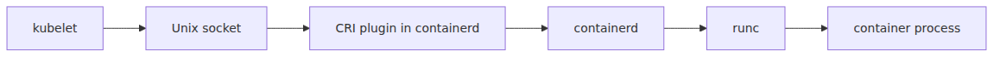
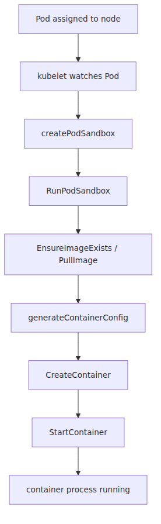

# kubelet과 containerd — 노드 위에서 컨테이너가 뜨기까지

`kubectl apply` 뒤에 Pod가 Running이 되면 실행 전체가 한 번에 끝난 일처럼 보입니다.
하지만 scheduler가 노드를 고른 뒤에도 node-local 경로에서는 kubelet, CRI, containerd, `runc`가 각자 다른 계층의 책임을 순서대로 이어받습니다.
이 실행 사슬을 분해해서 보지 않으면 이미지 pull 실패, sandbox 준비 실패, 실제 프로세스 기동 실패가 모두 비슷한 “컨테이너가 안 뜬다”는 말로 뭉개집니다.

AKS에서 이 주제가 더 중요한 이유는 Docker가 더 이상 중심이 아니기 때문입니다.
예전 감각으로는 `docker ps`나 dockershim 시절의 디버깅 습관을 떠올리기 쉽지만, 지금 AKS Linux 노드의 기본 runtime 경로는 kubelet에서 CRI를 거쳐 containerd로 내려갑니다.
즉 노드 실행 문제를 보려면 Kubernetes가 runtime에 무엇을 요청하는지부터 다시 읽어야 합니다.

이 글은 Azure AKS Deep Dive 시리즈의 두 번째 글입니다.

이번 글의 목적은 node-local 실행 경로를 가능한 한 단순한 호출 체인으로 고정하는 것입니다.
kubelet이 무엇을 결정하고, CRI가 어떤 계약을 제공하고, containerd와 `runc`가 어디서 실제 프로세스를 만드는지 분리해 두면 이후 CNI, scheduler, autoscaling 문제도 훨씬 정확하게 나눠 볼 수 있습니다.
이제 control plane 바깥에서 실제 실행이 시작되는 지점을 따라가 보겠습니다.

## 이 글에서 다룰 문제

- kubelet은 정확히 무엇을 감시하고 어떤 시점에 CRI를 호출할까요?
- dockershim이 사라진 뒤 AKS 노드 디버깅 방식은 왜 달라졌을까요?
- `RunPodSandbox`, `PullImage`, `CreateContainer`, `StartContainer`는 왜 이 순서로 호출될까요?
- 이미지 pull 인증과 캐시는 누가 담당하고, 왜 node 단위로 보이는 경우가 많을까요?
- kubelet이나 containerd가 unhealthy할 때 가장 먼저 볼 수 있는 신호는 무엇일까요?

## 왜 이 글이 중요한가

노드 실행 경로를 모르면 Pending 이후의 모든 문제를 비슷한 범주로 오해하게 됩니다.
예를 들어 scheduler는 이미 Binding을 기록했는데 이미지 pull 단계에서 실패한 상황과, sandbox 생성은 끝났지만 애플리케이션 프로세스가 바로 죽는 상황은 전혀 다른 대응이 필요합니다.
그런데 실행 사슬을 모르면 둘 다 “Pod가 안 뜬다”는 한 문장으로만 남습니다.

또한 AKS 운영에서는 control plane 문제와 node-local 문제를 나눠 보는 능력이 필수입니다.
API server가 건강하고 Binding도 끝났다면, 이후 경로는 kubelet과 runtime 쪽으로 내려와야 합니다.
이때 kubelet이 직접 `runc`를 부르는지, CRI가 어떤 경계인지, sandbox가 왜 먼저 생기는지 알고 있으면 증상 분류 속도가 훨씬 빨라집니다.

마지막으로 이 글은 CNI와도 직접 연결됩니다.
Pod IP는 단일 컨테이너보다 Pod sandbox 수준에서 더 자연스럽게 설명됩니다.
따라서 `RunPodSandbox`가 먼저라는 사실을 이해해야 다음 글의 네트워킹 설명도 억지 없이 이어집니다.

## kubelet과 containerd를 이해하는 가장 좋은 방법: kubelet은 조정하고 runtime은 실행한다고 보는 것입니다

이 경로를 읽을 때 가장 유용한 문장은 이것입니다.
**kubelet은 무엇을 실행할지 조정하고, runtime 계층은 그 요청을 실제 프로세스로 바꿉니다.**
즉 kubelet은 node agent이고, containerd는 kubelet의 의도를 받아 런타임 작업으로 내려보내는 엔진입니다.

이 구분이 중요한 이유는 kubelet이 직접 컨테이너 엔진을 구현하지 않기 때문입니다.
Kubernetes는 CRI라는 경계를 두어 runtime 구현을 분리했고, AKS Linux 노드에서는 그 runtime endpoint가 containerd입니다.
따라서 kubelet의 문제와 runtime의 문제를 분리해서 볼 수 있습니다.

실무적으로는 이 문장 하나만 기억해도 많은 혼동이 줄어듭니다.
API server에서 배정된 Pod를 kubelet이 보고, CRI를 통해 runtime에 요청하며, containerd가 sandbox와 container를 만들고, 최종 프로세스는 OCI runtime 계층에서 생성됩니다.

> AKS 노드에서 컨테이너 시작은 “kubelet이 직접 실행한다”가 아니라 “kubelet이 CRI 계약을 통해 runtime 계층에 실행을 위임한다”로 이해하는 편이 정확합니다.

## 핵심 개념

### 실행 경로 전체를 한 장으로 먼저 봐야 합니다

아래 그림은 이번 글 전체의 요약입니다.
control plane이 아니라 node-local 경로라는 점이 핵심입니다.
Pod가 어느 노드에서 실행될지 결정된 뒤에는 kubelet이 로컬 runtime 체인을 따라 실제 시작을 진행합니다.


*API server에서 runc까지 이어지는 실행 경로*

이 그림의 앞 절반은 kubelet 책임입니다.
뒤 절반은 runtime 계층 책임입니다.
두 역할을 분리해서 읽으면 scheduling 문제와 runtime 문제를 한꺼번에 섞지 않게 됩니다.

### kubelet은 노드의 desired state 수렴 담당자입니다

kubelet은 노드의 에이전트입니다.
API server를 watch해 자기 노드에 배정된 Pod를 보고, 볼륨과 secret, config를 준비하고, CRI를 호출해 sandbox와 container를 띄웁니다.
즉 kubelet은 “이 노드에서 무엇이 실행되어야 하는가”를 실제 상태로 만드는 주체입니다.

중요한 점은 kubelet이 컨테이너 엔진 자체는 구현하지 않는다는 사실입니다.
그 덕분에 Kubernetes는 특정 runtime 구현에 묶이지 않고, kubelet은 실행 의도와 상태 관리에 더 집중할 수 있습니다.

### CRI는 kubelet과 runtime 사이의 계약입니다

CRI는 Kubernetes가 특정 엔진 구현에 종속되지 않도록 만든 추상 인터페이스입니다.
업스트림 `api.proto`를 보면 runtime service와 image service가 분리되어 있고, startup 경로에서 특히 중요한 이름은 `RunPodSandbox`, `PullImage`, `CreateContainer`, `StartContainer`입니다.
이 메서드 이름만 봐도 Pod 수준 준비와 컨테이너 수준 실행이 구분된다는 사실이 드러납니다.

즉 kubelet은 “Pod를 이 상태로 만들라”는 의도를 말하고, runtime은 그 의도를 실제 실행 단계로 번역합니다.
AKS에서는 이 번역자가 containerd입니다.

### kubelet은 containerd와 로컬 Unix socket으로 대화합니다

AKS Linux 노드에서 kubelet과 containerd는 같은 노드 안에 있습니다.
따라서 이 경로는 원격 네트워크 호출이라기보다 로컬 Unix socket RPC로 이해하는 편이 맞습니다.
control plane이 여기서 직접 실행하지 않는다는 점도 함께 기억해야 합니다.



*kubelet과 containerd를 잇는 로컬 CRI 호출 경로*

운영에서 이 그림이 중요한 이유는 실패 영역이 로컬 노드로 좁혀지기 때문입니다.
API server는 건강한데 컨테이너 시작이 안 된다면, 이 소켓 경로 아래에서 kubelet 상태, containerd 상태, 이미지 pull, sandbox 생성 과정을 먼저 보게 됩니다.

### sandbox가 먼저 생기는 이유는 Pod가 공유 문맥을 가지기 때문입니다

`createPodSandbox()`는 `PodSandboxConfig`를 만든 뒤 `RunPodSandbox`를 호출합니다.
즉 컨테이너보다 sandbox가 먼저입니다.
이 sandbox는 Pod 수준의 네트워크와 namespace 문맥을 담는 바깥 상자이므로, Pod IP나 네트워크 준비를 단일 컨테이너보다 Pod 수준에서 읽는 편이 자연스럽습니다.

이 순서를 이해하면 다음 글의 CNI 설명도 쉬워집니다.
Pod 네트워킹은 컨테이너가 뜬 뒤 우연히 붙는 부가 기능이 아니라, sandbox 준비 단계부터 깊게 연결된 기본 경로이기 때문입니다.

### 이미지 pull, 생성, 시작은 서로 다른 실패 구간을 만듭니다

`startContainer()` 경로는 순서를 명확하게 보여 줍니다.
먼저 이미지를 당기고, config를 만들고, 컨테이너를 생성하고, 마지막에 시작합니다.
이 순서를 알아야 이미지 pull 실패, container create 실패, start 실패를 서로 다른 문제로 분리할 수 있습니다.

예를 들어 프라이빗 레지스트리 인증 문제는 `PullImage` 단계에서 보이고, 잘못된 entrypoint나 권한 문제는 `StartContainer` 단계에서 더 자주 드러납니다.
둘 다 결과는 CrashLoop나 ImagePullBackOff처럼 보일 수 있지만, 실제 진단 경로는 다릅니다.

### `runc`는 kubelet이 아니라 runtime 계층 아래에서 등장합니다

kubelet은 `runc`를 직접 호출하지 않습니다.
containerd가 CRI 계층 아래로 내려가 OCI runtime 계층을 사용하면서 `runc`가 등장합니다.
실제 체인은 kubelet → CRI → containerd → `containerd-shim` → `runc` → 프로세스입니다.

이 구분은 디버깅에서도 중요합니다.
Kubernetes가 직접 관리하는 추상 경계와, Linux 프로세스를 실제로 만드는 마지막 계층을 분리해서 봐야 하기 때문입니다.

### 컨테이너 시작 제어 흐름을 따라가면 문제가 더 잘 분해됩니다

아래 그림은 kubelet이 Pod startup을 어떤 제어 흐름으로 다루는지 보여 줍니다.
요청이 순차적으로 어떻게 내려가는지 한 번 눈에 익히면, 이벤트 로그와 상태 전이를 읽을 때 어디쯤에서 멈췄는지 감이 빨리 옵니다.



*Kubelet control flow for Pod startup*

운영에서는 이 경로가 하나의 검증 순서가 됩니다.
노드가 살아 있는가, kubelet이 healthy한가, 이미지가 내려왔는가, sandbox가 준비됐는가, 컨테이너가 생성됐는가, 프로세스가 실제로 시작됐는가를 순서대로 보면 됩니다.

### 노드 디버깅은 Docker가 아니라 kubelet과 CRI 관점으로 해야 합니다

AKS Linux 노드에서 가장 실용적인 디버깅 방식은 node debug container로 들어가 kubelet 상태와 `crictl` 출력을 보는 것입니다.
이 방식은 dockershim 이후의 runtime 경계에 더 잘 맞습니다.
즉 “컨테이너 엔진 하나를 직접 본다”보다 “kubelet과 CRI가 runtime과 어떤 상태를 주고받는가”에 더 가깝습니다.

```bash
kubectl debug node/aks-nodepool1-12345 -it \
  --image=mcr.microsoft.com/cbl-mariner/busybox:2.0 -- chroot /host

# inside the node
systemctl status kubelet
journalctl -u kubelet --since '15 min ago' | tail -50
crictl ps -a | head
crictl images | grep my-app
```

## 흔히 헷갈리는 지점

- **kubelet이 곧 container runtime은 아닙니다.** kubelet은 node agent이고, runtime 실행은 CRI 뒤의 containerd 계층이 맡습니다.
- **Docker가 안 보인다고 runtime이 사라진 것이 아닙니다.** AKS Linux 기본 경로의 중심은 containerd입니다.
- **컨테이너보다 sandbox가 먼저입니다.** Pod 수준 네트워크와 공유 namespace 문맥이 먼저 준비됩니다.
- **이미지 pull 실패와 프로세스 시작 실패는 같은 문제가 아닙니다.** 둘은 실행 체인에서 완전히 다른 단계입니다.
- **control plane이 healthy하다고 노드 실행도 healthy한 것은 아닙니다.** Binding 이후의 실패는 kubelet과 runtime 쪽에서 따로 볼 수 있습니다.

## 운영 체크리스트

- [ ] 노드 수준 disk pressure와 memory pressure 알림을 설정했습니다.
- [ ] node SKU에 맞춰 이미지 GC와 디스크 사용량 정책을 검토했습니다.
- [ ] 프라이빗 레지스트리 인증 방식을 managed identity와 imagePullSecret 중 무엇으로 할지 결정했습니다.
- [ ] `kubectl debug` 권한과 ephemeral container 사용 정책을 운영 기준에 맞게 제한했습니다.
- [ ] kubelet, containerd, `crictl` 기반 node 디버깅 절차를 런북에 문서화했습니다.

## 정리

AKS 노드에서 컨테이너 시작은 단일 동작이 아닙니다.
kubelet이 API server에서 자기 노드용 Pod를 보고, CRI를 통해 runtime에 요청하고, containerd가 sandbox와 container를 만들고, 마지막에 OCI runtime 계층이 실제 프로세스를 만듭니다.
이 호출 사슬을 분리해서 보는 것이 node-local 문제를 읽는 가장 좋은 출발점입니다.

특히 기억해야 할 것은 kubelet이 직접 `runc`를 부르지 않는다는 사실과, `RunPodSandbox`가 컨테이너 생성보다 앞선다는 사실입니다.
이 두 문장만 제대로 잡아도 이미지 pull, Pod 네트워크, 프로세스 시작, 런타임 장애를 훨씬 정확하게 분해할 수 있습니다.

다음 글에서는 이 실행 경로 옆에 붙는 CNI 관점으로 넘어갑니다.
Pod sandbox에 네트워크가 어떻게 연결되고, Azure CNI Pod Subnet, Node Subnet, Overlay가 왜 운영적으로 다른 선택지인지 이어서 보겠습니다.

<!-- toc:begin -->
## 시리즈 목차

- [Control Plane 해부 — AKS가 사용자에게서 가린 것](./01-control-plane-anatomy.md)
- **kubelet과 containerd — 노드 위에서 컨테이너가 뜨기까지 (현재 글)**
- CNI와 Azure CNI Overlay — Pod IP가 어디서 오는가 (예정)
- Scheduler와 Pod 배치 — 어느 노드로 갈지 누가 정하는가 (예정)
- HPA와 Cluster Autoscaler 내부 — 두 컨트롤 루프 (예정)
- KEDA 내부 — ScaledObject가 HPA를 만드는 방식 (예정)

<!-- toc:end -->

## 참고 자료

### 공식 문서
- [AKS core concepts](https://learn.microsoft.com/en-us/azure/aks/core-aks-concepts)
- [Kubernetes node components](https://kubernetes.io/docs/concepts/overview/components/#node-components)

### 업스트림 코드
- [CRI API — `api.proto` @ `v1.30.0`](https://github.com/kubernetes/kubernetes/blob/v1.30.0/staging/src/k8s.io/cri-api/pkg/apis/runtime/v1/api.proto)
- [`kuberuntime_manager.go` @ `v1.30.0`](https://github.com/kubernetes/kubernetes/blob/v1.30.0/pkg/kubelet/kuberuntime/kuberuntime_manager.go)
- [`kuberuntime_sandbox.go` @ `v1.30.0`](https://github.com/kubernetes/kubernetes/blob/v1.30.0/pkg/kubelet/kuberuntime/kuberuntime_sandbox.go)
- [`kuberuntime_container.go` @ `v1.30.0`](https://github.com/kubernetes/kubernetes/blob/v1.30.0/pkg/kubelet/kuberuntime/kuberuntime_container.go)

### 관련 시리즈
- [Azure AKS 101](../../azure-aks-101/ko/)
- [Azure Functions Deep Dive 3화 — 양방향 gRPC 스트림](../../azure-functions-deep-dive/ko/03-grpc-event-stream.md)

Tags: AKS, Kubernetes, Distributed Systems, Containers
