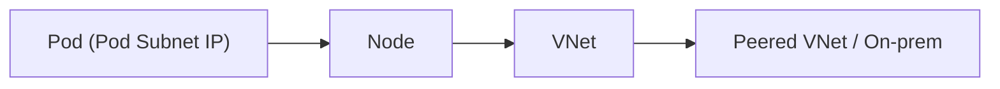
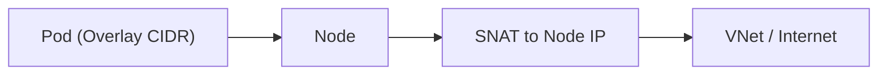

# Azure Kubernetes Service Deep Dive (3/6): CNI와 Azure CNI Overlay — Pod IP가 어디서 오는가

AKS 네트워킹은 여전히 “Azure CNI냐 아니냐” 정도로만 말하면 중요한 차이가 거의 다 사라집니다.
실제 운영 질문은 훨씬 더 구체적입니다.
Pod가 어느 주소 공간에서 IP를 받는지, VNet의 희소한 IP를 무엇이 소비하는지, 그리고 클러스터 밖으로 나가는 트래픽이 어떤 경로로 SNAT되는지를 먼저 갈라서 봐야 합니다.

특히 2026년 기준 AKS에서는 Azure CNI Pod Subnet, Azure CNI Node Subnet, Azure CNI Overlay를 서로 다른 모델로 봐야 합니다.
이 셋을 모두 “Azure CNI”라고만 부르면 IP 고갈, 라우팅, 외부 연결성, NetworkPolicy의 동작 위치를 설명할 때 자꾸 같은 단어로 다른 구조를 가리키게 됩니다.

이 글은 Azure AKS Deep Dive 시리즈의 세 번째 글입니다.

이번 글의 목적은 Pod IP의 출처를 명확하게 만드는 것입니다.
2화에서 `RunPodSandbox`가 먼저라는 사실을 봤다면, 이제 그 sandbox에 붙는 네트워크가 실제로 어디서 오고 어떻게 cluster 외부 경로와 연결되는지 볼 차례입니다.
이제 세 가지 AKS 네트워크 모델을 한 화면에서 비교해 보겠습니다.


*Azure Kubernetes Service Deep Dive 3장 흐름 개요*
> CNI와 Azure CNI Overlay — Pod IP가 어디서 오는가의 핵심은 기능 이름이 아니라, 어떤 경계에서 무엇을 검증하고 어떤 신호를 남길지 정하는 데 있습니다.

## 먼저 던지는 질문

- kubenet, Azure CNI Pod Subnet, Azure CNI Node Subnet, Azure CNI Overlay는 IP 소비와 라우팅 면에서 무엇이 다를까요?
- Pod IP가 실제 VNet 공간을 직접 소비할 때 어떤 운영 한계가 가장 먼저 드러날까요?
- Overlay 모드에서는 Pod에서 외부로 나가는 트래픽이 어떤 SNAT 경로를 거칠까요?

## 왜 이 글이 중요한가

AKS 네트워킹은 클러스터 생성 단계에서만 한 번 결정하고 끝나는 주제가 아닙니다.
Pod 수 증가, 새 node pool 추가, 외부 시스템 연동, peering, firewall, NetworkPolicy 도입 같은 모든 운영 이벤트가 네트워크 모델의 제약과 다시 만납니다.
초기에 주소 계획을 잘못 잡으면 나중에는 워크로드를 옮기지 않고는 해결하기 어려운 경우도 많습니다.

또한 Pod IP가 어디서 나오는지 모르면 트래픽 경로를 계속 잘못 상상하게 됩니다.
예를 들어 Overlay를 쓰는데도 외부 시스템에서 native Pod IP 직접 라우팅을 기대하거나, Node Subnet 모델인데 노드와 Pod가 같은 주소 공간을 태운다는 부담을 과소평가하면, 보안 정책과 용량 계획이 동시에 어긋납니다.

마지막으로 이 글은 CNI를 runtime의 부가 기능이 아니라 Pod startup의 필수 단계로 다시 연결해 줍니다.
Pod가 실행되는 순간 네트워크가 붙는 구조를 이해해야 이후 scheduler, autoscaling, 서비스 연결성 문제도 더 정확하게 나눠 볼 수 있습니다.

## 핵심 관점

이 주제에서 가장 유용한 문장은 이것입니다.
**AKS 네트워크 모델의 차이는 결국 Pod IP가 어디서 할당되는가와, 그 IP가 클러스터 밖에서 어떤 방식으로 보이는가의 차이입니다.**
즉 이름보다 주소 출처와 외부 경로를 먼저 보면 혼동이 크게 줄어듭니다.

이 관점이 중요한 이유는 동일한 “Pod 통신”이라는 말 안에 완전히 다른 설계가 숨어 있기 때문입니다.
Pod Subnet과 Node Subnet은 둘 다 flat 네트워킹이지만 주소 소비 방식이 다르고, Overlay는 VNet IP를 아끼는 대신 Pod IP가 외부에 보이는 방식이 달라집니다.
따라서 어떤 모델이 더 좋으냐보다 어떤 제약을 받아들일 것이냐가 더 중요합니다.

실무에서는 이 구분이 IP 고갈, outbound SNAT, NetworkPolicy 위치, 피어링 연결성, 방화벽 룰 설계까지 이어집니다.
결국 네트워크 모드는 클러스터의 “보이지 않는 기본값”이 아니라, 이후 모든 운영 선택에 계속 영향을 주는 구조적 결정입니다.

> AKS 네트워크 모드를 읽을 때는 제품 이름보다 “Pod IP가 VNet에서 오느냐, 별도 overlay CIDR에서 오느냐”와 “클러스터 밖으로 나갈 때 어떤 주소로 보이느냐”를 먼저 봐야 합니다.

## 핵심 개념

### 세 모델을 먼저 나란히 놓고 봐야 합니다

아래 그림은 이번 글의 기준점입니다.
Pod Subnet, Node Subnet, Overlay를 한 장에서 비교하면 주소 출처와 외부 경로 차이가 바로 보입니다.
이 단계에서 지도를 먼저 잡아 두면 세부 용어가 훨씬 덜 헷갈립니다.

이 그림을 읽는 핵심은 간단합니다.
Pod Subnet과 Node Subnet은 Pod IP가 VNet 공간에 있고, Overlay는 Pod IP가 별도 overlay CIDR에 있습니다.
이 한 줄이 이후 운영 차이를 대부분 설명합니다.

### CNI는 Pod sandbox에 네트워크를 붙이는 계약입니다

CNI는 컨테이너가 뜬 뒤 나중에 붙는 보조 설정이 아닙니다.
2화에서 본 `RunPodSandbox` 경로와 깊게 연결되어 있으며, 인터페이스 생성, IP 할당, 라우팅과 규칙 설치가 이 단계에서 일어납니다.
즉 Pod IP 이야기는 runtime 이야기와 분리된 별도 토픽이 아니라 sandbox 준비 단계의 일부입니다.

이 관점을 놓치면 Pod startup 문제를 실행 문제와 네트워크 문제로 너무 늦게 나누게 됩니다.
실제로는 sandbox 준비와 Pod 네트워크 연결이 아주 가까운 단계에서 이어집니다.

### Azure CNI Pod Subnet은 현재 flat 네트워킹의 기준점입니다

Azure CNI Pod Subnet에서는 Pod가 전용 pod subnet에서 VNet-routable IP를 받고, 노드는 별도 node subnet에 남습니다.
즉 node 주소 계획과 pod 주소 계획을 분리할 수 있습니다.
flat 네트워킹의 장점을 유지하면서도 주소 설계를 더 깔끔하게 분리할 수 있다는 점이 핵심입니다.

운영에서는 이 분리가 큰 장점으로 돌아옵니다.
노드 증설과 Pod 증가가 같은 subnet 여유를 동시에 갉아먹지 않기 때문입니다.
따라서 flat 모델이 필요하지만 Node Subnet의 빠른 IP 고갈이 부담될 때 더 자연스러운 선택지가 됩니다.

### Azure CNI Node Subnet은 단순하지만 IP 고갈 압박이 큽니다

Azure CNI Node Subnet은 Pod와 노드가 같은 node subnet에서 주소를 같이 씁니다.
설명하기는 가장 단순하지만, 운영에서는 이 단순함이 빠르게 제약으로 돌아옵니다.
Pod 수가 늘고 node pool이 커질수록 같은 subnet을 공유하므로 IP 고갈 압박이 가장 먼저 드러나기 쉽습니다.

이 모델을 여전히 이해해야 하는 이유도 있습니다.
기존 클러스터나 문서, 운영 경험 중 상당수가 이 경로를 전제로 하기 때문입니다.
다만 새 설계에서는 legacy 성격을 더 강하게 의식하는 편이 좋습니다.

### Azure CNI Overlay는 Pod IP를 overlay CIDR로 분리합니다

Azure CNI Overlay에서는 Pod가 기본 `10.244.0.0/16` 같은 별도 overlay CIDR에서 IP를 받습니다.
노드는 기존 VNet subnet에 남고, 클러스터 밖으로 나가는 트래픽은 node IP 기준으로 SNAT됩니다.
즉 VNet IP를 가장 아끼는 대신, Pod IP가 클러스터 외부에서 native 라우팅 대상으로 직접 보이는 모델은 아닙니다.


*세 AKS 네트워크 모델의 IP 경로 차이*

Overlay를 볼 때 자주 생기는 오해는 “Pod에도 IP가 있으니 외부에서도 그 IP를 그대로 볼 수 있겠지”라는 기대입니다.
하지만 운영 모델은 VNet space 보존과 node-based egress 경로에 더 가깝습니다.
그래서 외부 시스템, 방화벽, 피어링 쪽 검토 포인트도 함께 달라집니다.

### flat 네트워킹과 overlay는 direct reachability의 가정이 다릅니다

Pod Subnet과 Node Subnet은 Pod IP가 VNet 공간에 있기 때문에 연결된 네트워크에서 Pod를 더 직접적인 방식으로 이해할 수 있습니다.
Overlay는 그런 모델이 아닙니다.
따라서 inter-cluster Pod-to-Pod 직접 라우팅이나 외부 장비에서 native Pod IP를 기준으로 정책을 짜려는 기대는 처음부터 다시 점검해야 합니다.

이 차이는 단순한 구현 취향이 아니라 운영 계약의 차이입니다.
외부에서 무엇을 보게 되는지, outbound가 어떤 주소로 나가는지, 문제를 어느 지점에서 추적할지를 바꿉니다.

### kubenet은 장기 기본값으로 보기 어렵습니다

AKS 문서는 kubenet retirement timeline을 명시하고 있습니다.
즉 kubenet은 “예전에도 많이 썼으니 앞으로도 무난하겠지”라고 보기 어려운 상태입니다.
현재 AKS 네트워킹 방향을 설명할 때는 Azure CNI 계열, 특히 Overlay 방향을 기준으로 생각하는 편이 더 현실적입니다.

새 설계에서 중요한 것은 과거의 익숙함보다 장기 운영 가능성입니다.
특히 주소 공간 계획과 향후 확장 경로를 생각하면 더 그렇습니다.

### CNI 모드와 Pod CIDR은 실제 클러스터에서 바로 확인할 수 있습니다

문서만으로 추측하기보다 현재 클러스터의 network profile을 확인하는 습관이 중요합니다.
특히 `networkPluginMode`, `podCidr`, `serviceCidr`를 함께 보면 어떤 주소 모델을 쓰는지 빠르게 확인할 수 있습니다.
노드와 Pod의 wide 출력도 같은 맥락에서 큰 도움이 됩니다.

```bash
az aks show -n my-cluster -g my-rg \
  --query "{network:networkProfile.networkPlugin, mode:networkProfile.networkPluginMode, pod:networkProfile.podCidr, service:networkProfile.serviceCidr}"

kubectl get nodes -o wide
kubectl get pods -A -o wide | head -20
```

### subnet IP 고갈은 조용히 시작되지만 운영 충격은 큽니다

flat 모델에서는 subnet 여유가 줄어드는 순간 영향이 서서히 시작될 수 있습니다.
새 Pod가 더 이상 예상대로 IP를 받지 못하거나, node 확장이 필요한데 가용 주소가 부족한 상황이 대표적입니다.
그래서 주소 계획은 “현재 충분해 보인다”가 아니라 “예상 Pod 수와 node 수 증가를 감당하는가”로 계산해야 합니다.

Overlay를 쓰더라도 문제가 완전히 사라지는 것은 아닙니다.
대신 무엇이 희소 자원인지가 바뀝니다.
VNet IP보다 egress 경로, SNAT 포트, 외부 시스템 호환성을 더 주의 깊게 보게 됩니다.

## 흔히 헷갈리는 지점

## 네트워크 모델별 운영 다이어그램을 고정하기

주소 모델을 문장으로만 기억하면 운영 중에 빠르게 섞입니다.
그래서 팀 문서에는 Pod Subnet과 Overlay를 각각 다이어그램으로 고정해 두는 편이 좋습니다.





첫 번째에서는 Pod IP가 VNet-routable 자산으로 보이고, 두 번째에서는 egress 시 node IP 관점으로 보입니다.
정책과 관측 지점을 분리하는 기준도 이 차이에서 시작합니다.

## AKS 생성 시 네트워크 파라미터를 선언으로 남기기

클러스터 생성 명령은 나중에 운영 판단의 근거가 됩니다.
아래처럼 network plugin과 mode, CIDR을 명시해 두면 “왜 이 설계를 선택했는가”를 회고할 수 있습니다.

```bash
az aks create \
  --resource-group my-rg \
  --name my-cluster \
  --network-plugin azure \
  --network-plugin-mode overlay \
  --pod-cidr 10.244.0.0/16 \
  --service-cidr 10.0.0.0/16 \
  --dns-service-ip 10.0.0.10 \
  --node-count 3
```

이후 운영 점검은 아래처럼 이어집니다.

```bash
az aks show -n my-cluster -g my-rg \
  --query "networkProfile.{plugin:networkPlugin,mode:networkPluginMode,podCidr:podCidr,serviceCidr:serviceCidr}" -o yaml
```

예시 출력:

```text
mode: overlay
plugin: azure
podCidr: 10.244.0.0/16
serviceCidr: 10.0.0.0/16
```

문서의 예상값과 실제값이 다르면, 이후 트러블슈팅은 대부분 잘못된 전제에서 시작됩니다.

## egress/SNAT 병목을 모니터링으로 조기에 감지하기

Overlay를 쓰면 VNet IP 절약은 쉬워지지만 egress 경로는 더 중요해집니다.
특히 burst 트래픽에서 SNAT 포트가 병목이면 연결 실패가 간헐적으로 보입니다.
그래서 네트워크팀과 플랫폼팀은 아래 지표를 함께 봐야 합니다.

- NAT Gateway SNAT Port Utilization
- 노드별 outbound connection 실패율
- 애플리케이션 레벨 connect timeout 증가율

Prometheus 환경이라면 node-exporter와 애플리케이션 메트릭을 같이 대시보드에 얹어 “네트워크 실패가 앱 오류로 번역되는 시점”을 보이게 하는 편이 좋습니다.
Grafana 패널 이름을 `SNAT 사용률`, `Outbound 실패율`, `5xx 증가율`처럼 직접 연결해 두면 on-call 대응 속도가 빨라집니다.

## NetworkPolicy와 CNI 데이터 플레인을 함께 검증하기

네트워크 모델을 바꿀 때 가장 자주 놓치는 영역이 policy 기대치입니다.
아래처럼 default deny 정책을 작은 namespace부터 적용하고, 실제 통신 경로를 검증해야 합니다.

```yaml
apiVersion: networking.k8s.io/v1
kind: NetworkPolicy
metadata:
  name: default-deny
  namespace: sandbox
spec:
  podSelector: {}
  policyTypes:
    - Ingress
    - Egress
```

검증 명령:

```bash
kubectl -n sandbox run netcheck --image=busybox:1.36 --restart=Never -it -- sh
# inside pod
wget -qO- http://my-service.sandbox.svc.cluster.local:8080
nslookup kubernetes.default.svc
```

테스트 결과를 “허용돼야 하는 통신/차단돼야 하는 통신” 표로 남겨 두면, 이후 node pool 추가나 CNI 모드 변경 때 회귀 검증 기준이 됩니다.

## Pod IP 가시성과 외부 시스템 통합 체크포인트

온프레미스 방화벽, SIEM, APM이 Pod IP를 어떤 방식으로 인식하는지 확인해야 합니다.
flat 모델에서는 Pod IP 단위 정책이 자연스러울 수 있지만 Overlay에서는 node IP 관점 로그가 중심이 되는 경우가 많습니다.
이 차이를 운영 초기에 합의하지 않으면 “보안팀 로그와 플랫폼팀 로그가 서로 다른 대상을 말하는” 상황이 생깁니다.

실무에서는 아래 체크포인트를 권장합니다.

- 외부 방화벽 정책 기준이 Pod IP인지 Node IP인지 문서화
- 감사 로그에서 workload 식별 키를 IP 외에 namespace/pod label로 병행
- incident 보고서에 `network mode` 필드를 의무화

이 세 가지를 고정하면 네트워크 모드 차이가 운영 커뮤니케이션 리스크로 번지는 일을 크게 줄일 수 있습니다.

- **Azure CNI는 하나의 단일 모델이 아닙니다.** Pod Subnet, Node Subnet, Overlay는 주소 소비와 외부 경로가 다릅니다.
- **Overlay라고 해서 Pod 네트워킹이 덜 Kubernetes스럽다는 뜻은 아닙니다.** 다만 Pod IP가 VNet 공간에 직접 놓이지 않을 뿐입니다.
- **Pod IP가 있다고 해서 외부에서 그 IP를 native하게 직접 라우팅하는 모델은 아닐 수 있습니다.** Overlay가 대표적입니다.
- **CNI는 Pod startup과 분리된 나중 단계가 아닙니다.** `RunPodSandbox`와 깊게 연결된 기본 경로입니다.
- **네트워크 모드 선택은 성능 옵션이 아니라 주소 계획과 운영 경계의 선택입니다.** subnet 고갈, SNAT, 외부 시스템 호환성까지 함께 바뀝니다.

## 운영 체크리스트

## troubleshooting 시나리오: Pod 간 통신은 되는데 외부 API만 간헐 실패하는 경우

이 시나리오는 Overlay 환경에서 자주 나타납니다.
클러스터 내부 통신은 정상인데 외부 API 연결만 간헐적으로 timeout이 나는 패턴입니다.
대개 egress 경로 병목, NAT 포트 소진, 방화벽 세션 제한이 원인 후보입니다.

점검 순서:

1) 같은 namespace 내부 서비스 호출 성공 여부 확인
2) 외부 API로의 동시 연결 수와 실패율 확인
3) NAT Gateway 또는 방화벽 세션 지표 확인
4) 노드별 편차가 있는지 확인

명령 예시:

```bash
kubectl -n prod exec deploy/checkout-api -- wget -qO- http://inventory.prod.svc.cluster.local:8080/health
kubectl -n prod exec deploy/checkout-api -- sh -c 'for i in $(seq 1 20); do wget -T 2 -qO- https://api.example.com/health || echo fail; done'
kubectl get pods -n prod -o wide
```

내부 호출은 모두 성공하고 외부 호출만 일부 실패한다면, 애플리케이션 코드보다 egress 경계 점검이 우선입니다.

## 주소 계획을 수치로 남기는 방법

네트워크 설계 문서에 설명만 적으면 실제 운영에서 쓸모가 떨어집니다.
아래처럼 수치화된 표를 남겨야 이후 확장 판단이 쉬워집니다.

| 항목 | 값 | 비고 |
| --- | --- | --- |
| 예상 최대 노드 수 | 40 | 12개월 계획 |
| 노드당 최대 Pod 수 | 30 | workload mix 반영 |
| 예상 최대 Pod 수 | 1,200 | 버퍼 20% 포함 |
| 서비스 CIDR | 10.0.0.0/16 | 변경 비용 큼 |
| Overlay Pod CIDR | 10.244.0.0/16 | 모드 고정 |

이 표를 ADR에 포함하면 클러스터 확장 시 “왜 CIDR 변경이 어려운지”를 다시 설명하지 않아도 됩니다.

## 보안 팀과의 공통 언어: IP 기반 식별 한계 보완

Overlay 모드에서는 Node IP 관측이 중심이 되는 경우가 많아, IP만으로 workload를 식별하기 어렵습니다.
그래서 보안 로그에는 최소한 아래 메타데이터를 함께 남기는 편이 좋습니다.

- `k8s.namespace`
- `k8s.pod.name`
- `k8s.pod.labels.app`

이 메타데이터를 SIEM에 함께 적재하면 incident 시점에 “어떤 서비스가 어떤 outbound를 만들었는지”를 훨씬 정확히 추적할 수 있습니다.

- [ ] 예상 Pod 수와 node 수를 기준으로 subnet 크기와 service CIDR 여유를 계산했습니다.
- [ ] Overlay 사용 여부를 외부 시스템, 피어링, 방화벽 정책과 함께 검증했습니다.
- [ ] default-deny NetworkPolicy 도입 여부와 단계적 롤아웃 계획을 정했습니다.
- [ ] SNAT 포트 고갈 가능성을 모니터링하고 NAT Gateway 필요성을 검토했습니다.
- [ ] 현재 클러스터의 CNI 모드와 주소 모델을 운영 문서에 명시했습니다.

## 정리

AKS 네트워킹을 정확히 이해하려면 먼저 Pod IP의 출처를 분리해서 봐야 합니다.
Azure CNI Pod Subnet은 Pod 전용 subnet을 쓰는 flat 모델이고, Azure CNI Node Subnet은 Pod와 노드가 같은 subnet을 공유하는 legacy flat 모델이며, Azure CNI Overlay는 Pod IP를 별도 overlay CIDR로 분리해 VNet IP를 가장 잘 보존합니다.

이 차이는 단순한 제품 이름 차이가 아닙니다.
주소 공간 계획, 외부 연결성, SNAT 경로, NetworkPolicy 배치, 장애 시 추적 지점을 모두 바꿉니다.
따라서 네트워크 모드는 클러스터 생성 시 한 번 고르는 옵션이 아니라 이후 운영 방식을 계속 결정하는 구조적 선택입니다.

다음 글에서는 Pod가 어느 노드에 가는지를 결정하는 scheduler로 이동합니다.
이번 글에서 Pod가 네트워크를 어떻게 얻는지 분리해 두었으니, 다음에는 placement 자체가 어떤 규칙으로 결정되는지 더 선명하게 볼 수 있습니다.

## 처음 질문으로 돌아가기

- **kubenet, Azure CNI Pod Subnet, Azure CNI Node Subnet, Azure CNI Overlay는 IP 소비와 라우팅 면에서 무엇이 다를까요?**
  - 본문에서는 kubenet을 장기 기본값으로 보기 어렵다고 짚고, 실제 운영 비교 축을 Azure CNI Pod Subnet, Node Subnet, Overlay에 두었습니다. Pod Subnet은 Pod가 전용 pod subnet에서 VNet-routable IP를 받고, Node Subnet은 Pod와 노드가 같은 subnet 주소를 함께 쓰며, Overlay는 Pod가 별도 overlay CIDR에서 IP를 받고 외부로 나갈 때 node IP 기준으로 보입니다. 결국 차이는 이름보다 Pod IP가 VNet 공간을 직접 쓰는지, 아니면 overlay CIDR에 머무는지에서 갈립니다.
- **Pod IP가 실제 VNet 공간을 직접 소비할 때 어떤 운영 한계가 가장 먼저 드러날까요?**
  - flat 모델에서는 subnet 여유가 가장 먼저 희소 자원이 됩니다. 특히 Azure CNI Node Subnet처럼 Pod와 노드가 같은 subnet을 공유하면 Pod 증가와 node 증설이 같은 주소 풀을 동시에 갉아먹기 때문에 IP 고갈 압박이 빨리 드러납니다. 그래서 본문에서도 “현재 충분해 보이는가”가 아니라 예상 최대 Pod 수와 node 수 증가를 감당하는지로 주소 계획을 잡아야 한다고 강조했습니다.
- **Overlay 모드에서는 Pod에서 외부로 나가는 트래픽이 어떤 SNAT 경로를 거칠까요?**
  - Overlay에서는 Pod가 overlay CIDR IP를 쓰더라도 클러스터 밖으로 나갈 때는 그 주소가 그대로 보이지 않습니다. 본문 다이어그램처럼 Pod 트래픽은 node를 거치며 node IP 기준으로 SNAT되어 VNet이나 Internet 방향으로 나갑니다. 그래서 Overlay 운영에서는 VNet IP 절약 대신 NAT Gateway SNAT 포트 사용률과 outbound 실패율을 더 중요한 관측 지점으로 봐야 합니다.

<!-- toc:begin -->
## 시리즈 목차

- [Azure Kubernetes Service Deep Dive (1/6): Control Plane 해부 — AKS가 사용자에게서 가린 것](./01-control-plane-anatomy.md)
- [Azure Kubernetes Service Deep Dive (2/6): kubelet과 containerd — 노드 위에서 컨테이너가 뜨기까지](./02-kubelet-and-containerd.md)
- **Azure Kubernetes Service Deep Dive (3/6): CNI와 Azure CNI Overlay — Pod IP가 어디서 오는가 (현재 글)**
- Azure Kubernetes Service Deep Dive (4/6): Scheduler와 Pod 배치 — 어느 노드로 갈지 누가 정하는가 (예정)
- Azure Kubernetes Service Deep Dive (5/6): HPA와 Cluster Autoscaler 내부 — 두 컨트롤 루프 (예정)
- Azure Kubernetes Service Deep Dive (6/6): KEDA 내부 — ScaledObject가 HPA를 만드는 방식 (예정)

<!-- toc:end -->

## 참고 자료

### 공식 문서
- [Azure CNI Pod Subnet](https://learn.microsoft.com/en-us/azure/aks/concepts-network-azure-cni-pod-subnet)
- [Azure CNI Overlay](https://learn.microsoft.com/en-us/azure/aks/azure-cni-overlay)
- [Concepts - CNI Networking in AKS](https://learn.microsoft.com/en-us/azure/aks/concepts-network-cni-overview)
- [Configure kubenet networking in AKS](https://learn.microsoft.com/en-us/azure/aks/configure-kubenet)
- [Update Azure CNI IPAM mode and data plane technology](https://learn.microsoft.com/en-us/azure/aks/update-azure-cni)

### 업스트림 코드
- [CRI network status fields — `api.proto` @ `v1.30.0`](https://github.com/kubernetes/kubernetes/blob/v1.30.0/staging/src/k8s.io/cri-api/pkg/apis/runtime/v1/api.proto)
- [`kuberuntime_sandbox.go` @ `v1.30.0`](https://github.com/kubernetes/kubernetes/blob/v1.30.0/pkg/kubelet/kuberuntime/kuberuntime_sandbox.go)

### 관련 시리즈
- [Azure AKS 101](../../azure-aks-101/ko/)
- [Azure Functions Deep Dive 1화 — 전체 구조부터 잡기](../../azure-functions-deep-dive/ko/01-host-bootstrap.md)

- [이 글의 예제 코드 (book-examples)](https://github.com/yeongseon-books/book-examples/tree/main/azure-aks-deep-dive/ko/03-cni-and-azure-cni-overlay)

Tags: AKS, Kubernetes, Distributed Systems, Containers
