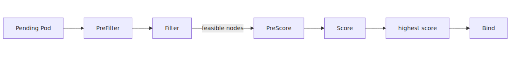

# Scheduler와 Pod 배치 — 어느 노드로 갈지 누가 정하는가

## Source Version

이 글의 외부 인용은 다음 upstream 버전을 기준으로 합니다.
- Kubernetes: v1.30.x (https://github.com/kubernetes/kubernetes)
- containerd: v1.7.x (https://github.com/containerd/containerd)
- KEDA: v2.13.x (https://github.com/kedacore/keda)

AKS의 control plane은 Microsoft가 관리하므로, 여기서 보는 upstream 코드는 실제 서비스 내부 바이너리 단정이 아니라 동작 모델 비교 기준입니다.

> Azure Kubernetes Service Deep Dive 시리즈 (4/6)

스케줄링은 단순한 잔여 CPU 계산이 아닙니다.
node affinity,
taint,
port,
volume,
topology spread까지 모두 얽힙니다.
업스트림 scheduler 코드는 이 판단을 정직하게 드러냅니다.
Filter로 안 되는 노드를 지우고,
Score로 남은 노드에 점수를 매기고,
Binding을 기록합니다.

---

## 이 글에서 답할 질문

- kube-scheduler는 한 Pod에 대해 어떤 단계로 노드를 줄여 나가는가?
- nodeSelector, affinity, taints/tolerations, topologySpreadConstraints는 각각 어떤 의도로 만들어졌는가?
- PriorityClass와 preemption은 SLO를 지키는데, 그 부작용은 누가 받는가?
- Pod이 ‘스케줄되지 않음’ 상태일 때, 디버깅의 첫 세 단계는 무엇인가?
- stateful 워크로드와 stateless 워크로드의 placement 정책은 어떻게 달라야 하는가?

## 스케줄링의 세 단계


---

## Filter와 Score

`ScheduleOne()`은 scheduling cycle과 binding cycle을 나눕니다.
Filter는 불가능한 노드를 지우고,
Score는 가능한 노드 중 더 나은 후보를 고릅니다.
기본 plugin 집합에는 `NodeResourcesFit`, `NodeAffinity`, `PodTopologySpread`, `InterPodAffinity` 같은 이름이 보입니다.


---

## Binding이 뜻하는 것

binding cycle은 선택한 노드를 API server에 기록하는 단계입니다.
이 write가 성공해야 kubelet이 후속 실행을 시작합니다.
즉 scheduler의 출력은 실행 중인 Pod가 아니라 `Pod -> Node` 결정입니다.

---

## 이번 화의 요점

> kube-scheduler는 Pod를 직접 실행하지 않습니다. 먼저 Filter plugin으로 불가능한 노드를 제거하고, Score plugin으로 남은 후보를 순위화한 뒤, 마지막에 Binding을 API server에 기록합니다. Pending Pod를 읽을 때 핵심은 Filter 단계에서 feasible node가 아예 없었는지, 아니면 feasible node는 있었지만 preemption, reservation conflict, bind 실패 같은 드문 후속 이유로 배치가 끝나지 않았는지 구분하는 것입니다.

---

## 시리즈 안에서의 위치

이 글은 Azure Kubernetes Service Deep Dive 시리즈 4화입니다.
2화와 3화가 노드 실행과 네트워크를 다뤘다면 이번 화는 그보다 앞단의 placement 결정을 설명합니다. 이 구분이 있어야 Pending Pod를 placement 실패, binding 시점 실패, 노드 실행 지연으로 나눠 읽을 수 있습니다.

---

## Call Path Summary

- `nodeName`이 없는 Pod → scheduler queue
- Filter plugin이 불가능한 노드 제거
- Score plugin이 feasible node 순위화
- scheduler가 API server에 Binding 기록
- 선택된 노드의 kubelet이 후속 실행 경로 시작

### Pending Pod의 placement 실패 원인 진단

```bash
kubectl get pods -A --field-selector status.phase=Pending
kubectl describe pod my-pod -n my-ns | tail -30
kubectl get events --sort-by=.lastTimestamp -n my-ns | tail -20
kubectl get nodes -L topology.kubernetes.io/zone,agentpool
```

## 운영 체크리스트

- [ ] 주요 워크로드의 affinity/anti-affinity와 zone spread를 명시했다
- [ ] PriorityClass 사용 정책과 preemption이 가능한 워크로드를 분류했다
- [ ] node taint와 toleration의 owner를 명시했다
- [ ] Pending Pod 알림과 자동 진단 스크립트를 준비했다
- [ ] stateful 워크로드의 PVC zone-affinity와 노드 zone을 일치시켰다

<!-- toc:begin -->
## 시리즈 목차

- [Control Plane 해부 — AKS가 사용자에게서 가린 것](./01-control-plane-anatomy.md)
- [kubelet과 containerd — 노드 위에서 컨테이너가 뜨기까지](./02-kubelet-and-containerd.md)
- [CNI와 Azure CNI Overlay — Pod IP가 어디서 오는가](./03-cni-and-azure-cni-overlay.md)
- **Scheduler와 Pod 배치 — 어느 노드로 갈지 누가 정하는가 (현재 글)**
- HPA와 Cluster Autoscaler 내부 — 두 컨트롤 루프 (예정)
- KEDA 내부 — ScaledObject가 HPA를 만드는 방식 (예정)

<!-- toc:end -->

---

## 참고 자료

### 1차 출처
- [`schedule_one.go` @ `v1.30.0`](https://github.com/kubernetes/kubernetes/blob/v1.30.0/pkg/scheduler/schedule_one.go)
- [`default_plugins.go` @ `v1.30.0`](https://github.com/kubernetes/kubernetes/blob/v1.30.0/pkg/scheduler/apis/config/v1/default_plugins.go)

### 2차 출처
- [Kubernetes scheduler](https://kubernetes.io/docs/concepts/scheduling-eviction/kube-scheduler/)
- [Assigning Pods to Nodes](https://kubernetes.io/docs/concepts/scheduling-eviction/assign-pod-node/)

### 관련 시리즈
- [Azure AKS 101](../../azure-aks-101/ko/)
- [Azure Functions Deep Dive 4화 — dispatcher와 invocation](../../azure-functions-deep-dive/ko/04-dispatcher-and-invocation.md)

Tags: AKS, Kubernetes, Distributed Systems, Containers
