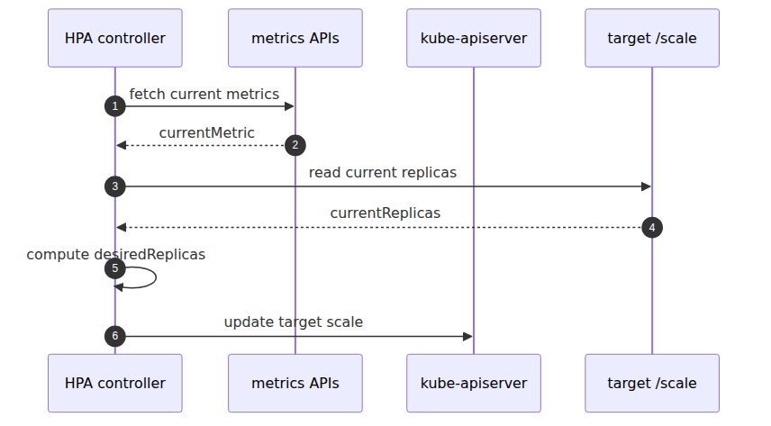
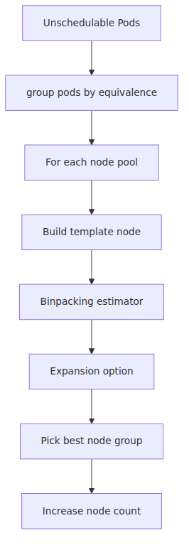

# HPA와 Cluster Autoscaler 내부 — 두 컨트롤 루프

트래픽이 늘었는데 Pod가 늦게 붙는 상황을 한 문장으로 설명하려 하면 대개 "autoscaling이 느리다"로 뭉개집니다. 하지만 replica 수를 바꾸는 루프와 node 수를 바꾸는 루프는 서로 다른 입력과 시간축으로 움직이기 때문에, 둘을 분리해서 봐야 정상 지연과 이상 징후를 구분할 수 있습니다.

이 글은 Azure Kubernetes Service Deep Dive 시리즈의 5번째 글입니다. 여기서는 HPA와 Cluster Autoscaler가 어떤 순서로 반응하고, 두 control loop 사이에 어떤 race window가 생기는지 정리합니다.

## Source Version

이 글의 외부 인용은 다음 upstream 버전을 기준으로 합니다.
- Kubernetes: v1.30.x (https://github.com/kubernetes/kubernetes)
- containerd: v1.7.x (https://github.com/containerd/containerd)
- KEDA: v2.13.x (https://github.com/kedacore/keda)

AKS의 control plane은 Microsoft가 관리하므로, 여기서 보는 upstream 코드는 실제 서비스 내부 바이너리 단정이 아니라 동작 모델 비교 기준입니다.

> Azure Kubernetes Service Deep Dive 시리즈 (5/6)

HPA는 replica 수를 바꾸고,
Cluster Autoscaler는 node 수를 바꿉니다.
둘은 같은 autoscaling 아래에 있지만 서로를 대체하지 않습니다.
AKS에서는 둘 다 사용자가 직접 Pod를 배포해 운영하는 대상이 아니라 관리형 control plane 이야기의 일부입니다.
HPA는 `kube-controller-manager` 안에서 메트릭을 읽고 desired replica를 계산합니다.
Cluster Autoscaler는 AKS 관리형 control plane의 일부로 Microsoft가 운영합니다. 사용자는 `az aks update --cluster-autoscaler-profile` 같은 표면으로 설정만 바꾸고, CA Pod를 직접 배포하거나 관리하지 않습니다.

---

## 두 루프를 한 그림으로 보기


*Pod 확장과 노드 확장이 만나는 두 루프*
---

## HPA의 핵심

HPA control loop의 기본 sync period는 `--horizontal-pod-autoscaler-sync-period` 기준 15초입니다.
대표적인 계산 모델은 `desiredReplicas = ceil(currentReplicas * (currentMetric / targetMetric))`입니다.
실제 코드는 tolerance,
missing metrics,
stabilization window를 더 고려합니다.

운영에서는 HPA가 더 빠른 루프입니다. replica를 먼저 늘리기로 결정해도, 노드 여유가 없으면 새 Pod는 바로 Ready가 아니라 Pending으로 먼저 보일 수 있습니다.



*메트릭으로 replica 수를 조정하는 HPA 루프*
---

## CA의 핵심

CA는 unschedulable Pod를 보고,
각 node pool의 template node를 기준으로 binpacking estimator를 돌립니다.
새 노드가 생기면 scheduler가 이 Pod를 배치할 수 있을지 먼저 시뮬레이션한 뒤,
가장 적절한 pool을 선택해 node 수를 늘립니다.

AKS 기본값도 같이 기억해 두면 좋습니다. `scan-interval` 기본값은 10초이고, 새 노드 provisioning 대기 한계는 `max-node-provision-time` 기본 15분입니다. scale-down은 일부러 보수적으로 잡혀 있어서 `scale-down-unneeded-time` 기본 10분, `scale-down-delay-after-add` 기본 10분입니다. 그래서 HPA가 Pod를 먼저 늘리고, CA가 노드를 추가하는 동안 새 Pod가 잠깐 Pending으로 머무는 창이 실제 운영에서 자주 보입니다.



*미배치 Pod를 보고 노드를 늘리는 CA 루프*
---

## 이번 화의 요점

> HPA는 관리형 control plane 안에서 기본 15초 주기로 메트릭을 읽고 replica 수를 조정하는 ratio controller입니다. Cluster Autoscaler도 AKS 관리형 control plane에서 동작하며, 기본 10초 주기로 unschedulable Pod를 보고 각 node pool에 대해 "새 노드가 생기면 스케줄 가능한가"를 시뮬레이션한 뒤 node 수를 조정합니다. HPA는 pod를 늘리고, CA는 node를 늘립니다. 둘 사이 race window가 있어서 새 Pod가 노드가 Ready 될 때까지 Pending으로 남는 것은 정상적인 현상일 수 있습니다.

---

## 시리즈 안에서의 위치

이 글은 Azure Kubernetes Service Deep Dive 시리즈 5화입니다.
4화가 scheduler의 배치 결정을 다뤘다면 이번 화는 그 결과를 보고 반응하는 두 control loop를 설명합니다. 여기서 얻어야 할 감각은 replica 결정, node 결정, scale-to-zero 경계를 서로 다른 버킷으로 나눠 보는 것입니다.

---

## Call Path Summary

- metrics pipeline → `kube-controller-manager` 안의 HPA controller
- HPA controller → `Deployment.spec.replicas` update
- scheduler가 새 Pod 배치 시도
- unschedulable Pod가 Pending으로 남음
- Cluster Autoscaler가 이를 감지하고 AKS에 node 추가 요청
- 새 node가 Ready 되면 scheduler가 Pending Pod binding

### HPA / CA 상태 점검

```bash
kubectl get hpa -A
kubectl describe hpa my-app -n my-ns | tail -30

kubectl -n kube-system logs -l component=cluster-autoscaler --tail=80
kubectl get nodes -L agentpool,kubernetes.azure.com/scalesetpriority
```

## 운영 체크리스트

- [ ] 각 워크로드의 HPA 메트릭과 임계치 근거를 ADR로 남겼다
- [ ] CA의 scale-down delay와 unneeded time을 비용/지연 관점에서 튜닝했다
- [ ] HPA-CA race 시나리오에 대한 부하 테스트를 수행했다
- [ ] spot 노드풀 사용 시 graceful drain 정책을 명시했다
- [ ] VPA 적용 워크로드와 적용 금지 워크로드를 분류했다

<!-- toc:begin -->
## 시리즈 목차

- [Control Plane 해부 — AKS가 사용자에게서 가린 것](./01-control-plane-anatomy.md)
- [kubelet과 containerd — 노드 위에서 컨테이너가 뜨기까지](./02-kubelet-and-containerd.md)
- [CNI와 Azure CNI Overlay — Pod IP가 어디서 오는가](./03-cni-and-azure-cni-overlay.md)
- [Scheduler와 Pod 배치 — 어느 노드로 갈지 누가 정하는가](./04-scheduler-and-pod-placement.md)
- **HPA와 Cluster Autoscaler 내부 — 두 컨트롤 루프 (현재 글)**
- KEDA 내부 — ScaledObject가 HPA를 만드는 방식 (예정)

<!-- toc:end -->

---

## 참고 자료

### 1차 출처
- [`horizontal.go` @ `v1.30.0`](https://github.com/kubernetes/kubernetes/blob/v1.30.0/pkg/controller/podautoscaler/horizontal.go)
- [`replica_calculator.go` @ `v1.30.0`](https://github.com/kubernetes/kubernetes/blob/v1.30.0/pkg/controller/podautoscaler/replica_calculator.go)
- [`hpacontroller.go` @ `v1.30.0`](https://github.com/kubernetes/kubernetes/blob/v1.30.0/cmd/kube-controller-manager/app/options/hpacontroller.go)
- [`static_autoscaler.go` @ `cluster-autoscaler-1.30.0`](https://github.com/kubernetes/autoscaler/blob/cluster-autoscaler-1.30.0/cluster-autoscaler/core/static_autoscaler.go)
- [`orchestrator.go` @ `cluster-autoscaler-1.30.0`](https://github.com/kubernetes/autoscaler/blob/cluster-autoscaler-1.30.0/cluster-autoscaler/core/scaleup/orchestrator/orchestrator.go)
- [`binpacking_estimator.go` @ `cluster-autoscaler-1.30.0`](https://github.com/kubernetes/autoscaler/blob/cluster-autoscaler-1.30.0/cluster-autoscaler/estimator/binpacking_estimator.go)

### 2차 출처
- [Use the cluster autoscaler in AKS](https://learn.microsoft.com/en-us/azure/aks/cluster-autoscaler)
- [Horizontal Pod Autoscaling](https://kubernetes.io/docs/tasks/run-application/horizontal-pod-autoscale/)

### 관련 시리즈
- [Azure AKS 101](../../azure-aks-101/ko/)
- [Azure Functions Deep Dive 5화 — scaling internals](../../azure-functions-deep-dive/ko/05-scaling-internals.md)

Tags: AKS, Kubernetes, Distributed Systems, Containers
